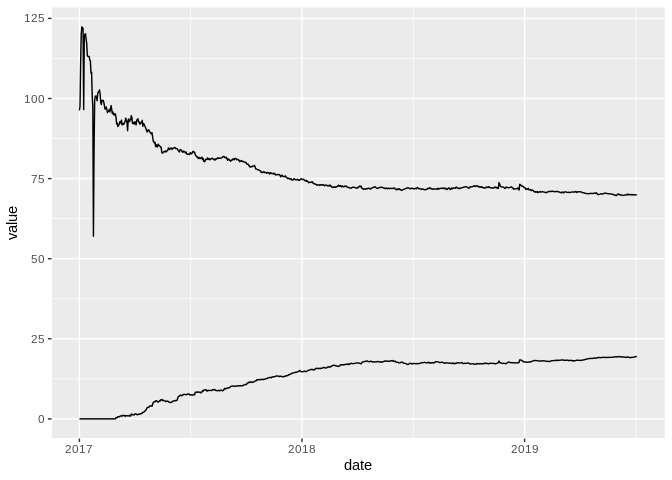

R Notebook
================

``` r
library(tidyverse)
```

    ## Registered S3 methods overwritten by 'ggplot2':
    ##   method         from 
    ##   [.quosures     rlang
    ##   c.quosures     rlang
    ##   print.quosures rlang

    ## ── Attaching packages ──────────────────────────────────────────────────────────────────────────────────────────── tidyverse 1.2.1 ──

    ## ✔ ggplot2 3.1.1     ✔ purrr   0.3.2
    ## ✔ tibble  2.1.3     ✔ dplyr   0.8.1
    ## ✔ tidyr   0.8.3     ✔ stringr 1.4.0
    ## ✔ readr   1.3.1     ✔ forcats 0.4.0

    ## ── Conflicts ─────────────────────────────────────────────────────────────────────────────────────────────── tidyverse_conflicts() ──
    ## ✖ dplyr::filter() masks stats::filter()
    ## ✖ dplyr::lag()    masks stats::lag()

``` r
library(lubridate)
```

    ## 
    ## Attaching package: 'lubridate'

    ## The following object is masked from 'package:base':
    ## 
    ##     date

``` r
library(plotly)
```

    ## 
    ## Attaching package: 'plotly'

    ## The following object is masked from 'package:ggplot2':
    ## 
    ##     last_plot

    ## The following object is masked from 'package:stats':
    ## 
    ##     filter

    ## The following object is masked from 'package:graphics':
    ## 
    ##     layout

``` r
source('service/dbservice.R')
source('service/geoservice.R')
```

``` r
df.history <- load.luftdaten.record.history.per.sensor()
df.history$date <- as_datetime(df.history$timestamp_gmt/1000)

df.history <- df.history %>% filter(date!=as.Date('2018-03-30'))

df.history.ratio <- df.history %>% spread(sensor_type_name,records,fill = 0) %>% mutate(ratio_bme280 = bme280/sds011*100, ratio_dht22 = dht22/sds011*100) %>%select(date,ratio_bme280,ratio_dht22) %>% gather(key,value,-date)

ggplot(df.history.ratio %>% filter(date>=as.Date('2017-01-01')),aes(date,value,fill=key))+ geom_line()
```



plot per sensor
===============

``` r
p <-ggplot(df.history,aes(date,records))+ geom_line(aes(colour=sensor_type_name))
ggplotly(p)
```

    ## PhantomJS not found. You can install it with webshot::install_phantomjs(). If it is installed, please make sure the phantomjs executable can be found via the PATH variable.

<!--html_preserve-->

<script type="application/json" data-for="htmlwidget-d9262a47c4a92c338839">{"x":{"data":[{"x":[1488412800,1488499200,1488585600,1488672000,1488758400,1488844800,1488931200,1489017600,1489104000,1489190400,1489276800,1489363200,1489449600,1489536000,1489622400,1489708800,1489795200,1489881600,1489968000,1490054400,1490140800,1490227200,1490313600,1490400000,1490486400,1490572800,1490659200,1490745600,1490832000,1490918400,1491004800,1491091200,1491177600,1491264000,1491350400,1491436800,1491523200,1491609600,1491696000,1491782400,1491868800,1491955200,1492041600,1492128000,1492214400,1492300800,1492387200,1492473600,1492560000,1492646400,1492732800,1492819200,1492905600,1492992000,1493078400,1493164800,1493251200,1493337600,1493424000,1493510400,1493596800,1493683200,1493769600,1493856000,1493942400,1494028800,1494115200,1494201600,1494288000,1494374400,1494460800,1494547200,1494633600,1494720000,1494806400,1494892800,1494979200,1495065600,1495152000,1495238400,1495324800,1495411200,1495497600,1495584000,1495670400,1495756800,1495843200,1495929600,1496016000,1496102400,1496188800,1496275200,1496361600,1496448000,1496534400,1496620800,1496707200,1496793600,1496880000,1496966400,1497052800,1497139200,1497225600,1497312000,1497398400,1497484800,1497571200,1497657600,1497744000,1497830400,1497916800,1498003200,1498089600,1498176000,1498262400,1498348800,1498435200,1498521600,1498608000,1498694400,1498780800,1498867200,1498953600,1499040000,1499126400,1499212800,1499299200,1499385600,1499472000,1499558400,1499644800,1499731200,1499817600,1499904000,1499990400,1500076800,1500163200,1500249600,1500336000,1500422400,1500508800,1500595200,1500681600,1500768000,1500854400,1500940800,1501027200,1501113600,1501200000,1501286400,1501372800,1501459200,1501545600,1501632000,1501718400,1501804800,1501891200,1501977600,1502064000,1502150400,1502236800,1502323200,1502409600,1502496000,1502582400,1502668800,1502755200,1502841600,1502928000,1503014400,1503100800,1503187200,1503273600,1503360000,1503446400,1503532800,1503619200,1503705600,1503792000,1503878400,1503964800,1504051200,1504137600,1504224000,1504310400,1504396800,1504483200,1504569600,1504656000,1504742400,1504828800,1504915200,1505001600,1505088000,1505174400,1505260800,1505347200,1505433600,1505520000,1505606400,1505692800,1505779200,1505865600,1505952000,1506038400,1506124800,1506211200,1506297600,1506384000,1506470400,1506556800,1506643200,1506729600,1506816000,1506902400,1506988800,1507075200,1507161600,1507248000,1507334400,1507420800,1507507200,1507593600,1507680000,1507766400,1507852800,1507939200,1508025600,1508112000,1508198400,1508284800,1508371200,1508457600,1508544000,1508630400,1508716800,1508803200,1508889600,1508976000,1509062400,1509148800,1509235200,1509321600,1509408000,1509494400,1509580800,1509667200,1509753600,1509840000,1509926400,1510012800,1510099200,1510185600,1510272000,1510358400,1510444800,1510531200,1510617600,1510704000,1510790400,1510876800,1510963200,1511049600,1511136000,1511222400,1511308800,1511395200,1511481600,1511568000,1511654400,1511740800,1511827200,1511913600,1512000000,1512086400,1512172800,1512259200,1512345600,1512432000,1512518400,1512604800,1512691200,1512777600,1512864000,1512950400,1513036800,1513123200,1513209600,1513296000,1513382400,1513468800,1513555200,1513641600,1513728000,1513814400,1513900800,1513987200,1514073600,1514160000,1514246400,1514332800,1514419200,1514505600,1514592000,1514678400,1514764800,1514851200,1514937600,1515024000,1515110400,1515196800,1515283200,1515369600,1515456000,1515542400,1515628800,1515715200,1515801600,1515888000,1515974400,1516060800,1516147200,1516233600,1516320000,1516406400,1516492800,1516579200,1516665600,1516752000,1516838400,1516924800,1517011200,1517097600,1517184000,1517270400,1517356800,1517443200,1517529600,1517616000,1517702400,1517788800,1517875200,1517961600,1518048000,1518134400,1518220800,1518307200,1518393600,1518480000,1518566400,1518652800,1518739200,1518825600,1518912000,1518998400,1519084800,1519171200,1519257600,1519344000,1519430400,1519516800,1519603200,1519689600,1519776000,1519862400,1519948800,1520035200,1520121600,1520208000,1520294400,1520380800,1520467200,1520553600,1520640000,1520726400,1520812800,1520899200,1520985600,1521072000,1521158400,1521244800,1521331200,1521417600,1521504000,1521590400,1521676800,1521763200,1521849600,1521936000,1522022400,1522108800,1522195200,1522281600,1522540800,1522627200,1522713600,1522800000,1522886400,1522972800,1523059200,1523145600,1523232000,1523318400,1523404800,1523491200,1523577600,1523664000,1523750400,1523836800,1523923200,1524009600,1524096000,1524182400,1524268800,1524355200,1524441600,1524528000,1524614400,1524700800,1524787200,1524873600,1524960000,1525046400,1525132800,1525219200,1525305600,1525392000,1525478400,1525564800,1525651200,1525737600,1525824000,1525910400,1525996800,1526083200,1526169600,1526256000,1526342400,1526428800,1526515200,1526601600,1526688000,1526774400,1526860800,1526947200,1527033600,1527120000,1527206400,1527292800,1527379200,1527465600,1527552000,1527638400,1527724800,1527811200,1527897600,1527984000,1528070400,1528156800,1528243200,1528329600,1528416000,1528502400,1528588800,1528675200,1528761600,1528848000,1528934400,1529020800,1529107200,1529193600,1529366400,1529452800,1529539200,1529625600,1529712000,1529798400,1529884800,1529971200,1530057600,1530144000,1530230400,1530316800,1530403200,1530489600,1530576000,1530835200,1530921600,1531008000,1531094400,1531180800,1531267200,1531353600,1531440000,1531526400,1531612800,1531699200,1531785600,1531872000,1531958400,1532044800,1532131200,1532217600,1532304000,1532390400,1532476800,1532563200,1532649600,1532736000,1532822400,1532908800,1532995200,1533081600,1533168000,1533254400,1533340800,1533427200,1533513600,1533600000,1533686400,1533772800,1533859200,1533945600,1534032000,1534118400,1534204800,1534291200,1534377600,1534464000,1534550400,1534636800,1534723200,1534809600,1534896000,1534982400,1535068800,1535155200,1535241600,1535328000,1535414400,1535500800,1535587200,1535673600,1535760000,1535846400,1535932800,1536019200,1536105600,1536192000,1536278400,1536364800,1536451200,1536537600,1536624000,1536710400,1536883200,1536969600,1537056000,1537142400,1537228800,1537401600,1537574400,1537747200,1537920000,1538006400,1538265600,1538352000,1538438400,1538524800,1538611200,1538697600,1538784000,1538870400,1538956800,1539043200,1539129600,1539216000,1539302400,1539388800,1539475200,1539561600,1539648000,1539734400,1539820800,1539907200,1539993600,1540080000,1540166400,1540252800,1540339200,1540425600,1540512000,1540598400,1540684800,1540771200,1540857600,1540944000,1541030400,1541116800,1541203200,1541376000,1541548800,1541635200,1541808000,1541894400,1541980800,1542067200,1542153600,1542240000,1542326400,1542412800,1542499200,1542585600,1542672000,1542844800,1542931200,1543017600,1543104000,1543190400,1543276800,1543363200,1543536000,1543708800,1543795200,1544054400,1544227200,1544313600,1544400000,1544486400,1544572800,1544659200,1544745600,1544832000,1545264000,1545350400,1545436800,1545523200,1545609600,1545696000,1545955200,1546041600,1546128000,1546214400,1546300800,1546387200,1546473600,1546560000,1546646400,1546732800,1546819200,1546905600,1546992000,1547078400,1547164800,1547251200,1547337600,1547424000,1547510400,1547596800,1547683200,1547769600,1547856000,1547942400,1548115200,1548201600,1548460800,1548547200,1548633600,1548720000,1548806400,1548892800,1548979200,1549065600,1549152000,1549238400,1549324800,1549411200,1549497600,1549584000,1549756800,1549843200,1550016000,1550102400,1550188800,1550534400,1550793600,1550880000,1550966400,1551052800,1551484800,1551571200,1551657600,1551744000,1551830400,1551916800,1552003200,1552089600,1552176000,1552262400,1552435200,1552521600,1552608000,1552694400,1552780800,1552867200,1552953600,1553040000,1553126400,1553212800,1553299200,1553385600,1553472000,1553558400,1553644800,1553731200,1553817600,1554336000,1554508800,1554681600,1554940800,1555113600,1555459200,1555545600,1555977600,1556064000,1556150400,1556236800,1556323200,1556409600,1556496000,1556668800,1556841600,1556928000,1557100800,1557360000,1557532800,1557705600,1557878400,1558828800,1559001600,1559174400,1559260800,1559347200,1559433600,1559520000,1559606400,1559692800,1559779200,1559865600,1559952000,1560038400,1560124800,1560211200,1560297600,1560384000,1560470400,1560556800,1560643200,1560729600,1560816000,1560902400,1560988800,1561075200,1561161600,1561248000,1561420800,1561507200,1561593600,1561680000,1561766400,1562025600,1562198400],"y":[1,1,1,2,2,2,2,3,3,3,3,4,4,4,4,3,4,4,4,4,4,4,5,4,4,7,7,6,6,6,6,8,8,8,7,7,7,8,8,8,9,9,10,10,12,12,13,14,16,17,20,23,24,25,25,28,29,29,29,29,35,40,42,43,43,47,48,47,47,46,48,51,51,56,55,57,58,55,56,56,56,56,55,57,57,58,56,55,56,55,56,56,59,60,62,62,63,63,65,65,67,74,82,84,86,89,90,89,91,96,96,100,102,101,101,101,103,105,105,107,108,104,104,106,108,107,107,109,112,109,122,124,124,126,125,127,127,128,130,127,128,132,138,137,145,147,148,146,150,143,143,149,148,148,149,150,149,148,156,156,159,158,161,155,156,157,157,157,161,159,158,164,164,165,163,163,165,170,179,177,180,181,186,186,187,191,192,196,203,204,204,204,207,209,206,209,209,212,214,212,216,217,215,219,219,216,219,219,221,222,228,232,230,233,233,247,247,254,260,258,262,267,265,263,266,266,271,274,280,284,283,293,295,293,299,300,299,301,306,304,304,309,304,308,308,312,315,319,322,330,329,331,337,332,336,336,347,345,346,350,351,353,360,361,362,362,362,358,358,366,366,366,365,363,363,365,373,376,376,382,385,389,388,395,399,400,406,407,412,415,416,421,421,424,424,431,428,428,426,432,439,450,450,449,450,452,458,458,460,465,466,470,472,477,482,490,493,496,504,506,509,509,507,512,506,506,516,524,532,533,534,538,540,545,551,545,557,556,555,561,574,580,580,581,582,591,597,610,612,608,614,614,615,621,635,640,645,648,649,649,650,648,653,651,652,650,661,666,685,687,692,692,699,696,703,713,716,724,723,736,739,735,733,751,751,759,761,756,760,767,774,776,780,771,783,788,797,797,791,790,793,820,829,836,844,844,850,860,859,857,865,860,855,856,855,860,863,853,852,848,853,866,860,867,870,869,881,882,889,888,885,889,883,893,886,892,906,913,915,926,930,923,929,925,932,930,930,929,932,940,943,944,950,937,929,934,942,929,928,926,931,924,916,914,921,928,939,941,943,929,926,926,921,922,920,911,918,927,941,946,946,945,938,942,949,956,939,942,944,935,939,944,949,954,957,969,978,977,974,976,981,983,978,976,973,979,976,983,981,969,978,970,981,978,984,976,975,982,995,999,1002,999,999,1000,1001,995,989,994,999,995,1005,1005,1002,992,995,999,993,1003,1010,1006,1005,1001,1000,1006,1003,999,1008,1014,999,1002,994,1002,1012,1015,1023,1024,1022,1025,1024,1027,1035,1004,1012,1012,1014,1026,1028,1024,1018,1019,1026,1029,1034,1032,1033,1027,1029,1032,1027,1031,1049,1048,1053,1048,1047,1059,1052,1060,1058,1056,1056,1070,1065,1070,1077,1073,1070,1072,1068,1058,1079,1091,1091,1089,1095,1096,1088,1086,1098,1103,1109,1116,1120,1102,1101,1104,1103,1108,1109,1112,1119,1119,1121,1131,1128,1124,1123,1126,1124,1129,1128,1130,1135,1144,1147,1141,1151,1148,1137,1154,1147,1149,1156,1165,1165,1171,1166,1169,1168,1168,1180,1174,1179,1176,1184,1198,1206,1209,1216,1221,1224,1214,1217,1211,1215,1213,1217,1230,1230,1225,1233,1234,1234,1239,1241,1247,1248,1254,1262,1277,1272,1302,1312,1319,1355,1380,1369,1396,1403,1426,1430,1443,1443,1441,1443,1438,1438,1455,1447,1454,1442,1449,1454,1453,1460,1462,1465,1428,1445,1442,1448,1451,1457,1467,1473,1475,1497,1517,1525,1551,1559,1571,1578,1606,1622,1622,1623,1624,1618,1630,1655,1666,1678,1681,1698,1702,1709,1711,1743,1756,1764,1762,1759,1772,1784,1786,1786,1776,1779,1767,1778,1784,1773,1774,1771,1767,1770,1771,1787,1783,1793,1797,1788,1782,1778,1796,1801,1799,1809,1807,1838,1831],"text":["sensor_type_name: bme280<br />date: 2017-03-02<br />records:    1","sensor_type_name: bme280<br />date: 2017-03-03<br />records:    1","sensor_type_name: bme280<br />date: 2017-03-04<br />records:    1","sensor_type_name: bme280<br />date: 2017-03-05<br />records:    2","sensor_type_name: bme280<br />date: 2017-03-06<br />records:    2","sensor_type_name: bme280<br />date: 2017-03-07<br />records:    2","sensor_type_name: bme280<br />date: 2017-03-08<br />records:    2","sensor_type_name: bme280<br />date: 2017-03-09<br />records:    3","sensor_type_name: bme280<br />date: 2017-03-10<br />records:    3","sensor_type_name: bme280<br />date: 2017-03-11<br />records:    3","sensor_type_name: bme280<br />date: 2017-03-12<br />records:    3","sensor_type_name: bme280<br />date: 2017-03-13<br />records:    4","sensor_type_name: bme280<br />date: 2017-03-14<br />records:    4","sensor_type_name: bme280<br />date: 2017-03-15<br />records:    4","sensor_type_name: bme280<br />date: 2017-03-16<br />records:    4","sensor_type_name: bme280<br />date: 2017-03-17<br />records:    3","sensor_type_name: bme280<br />date: 2017-03-18<br />records:    4","sensor_type_name: bme280<br />date: 2017-03-19<br />records:    4","sensor_type_name: bme280<br />date: 2017-03-20<br />records:    4","sensor_type_name: bme280<br />date: 2017-03-21<br />records:    4","sensor_type_name: bme280<br />date: 2017-03-22<br />records:    4","sensor_type_name: bme280<br />date: 2017-03-23<br />records:    4","sensor_type_name: bme280<br />date: 2017-03-24<br />records:    5","sensor_type_name: bme280<br />date: 2017-03-25<br />records:    4","sensor_type_name: bme280<br />date: 2017-03-26<br />records:    4","sensor_type_name: bme280<br />date: 2017-03-27<br />records:    7","sensor_type_name: bme280<br />date: 2017-03-28<br />records:    7","sensor_type_name: bme280<br />date: 2017-03-29<br />records:    6","sensor_type_name: bme280<br />date: 2017-03-30<br />records:    6","sensor_type_name: bme280<br />date: 2017-03-31<br />records:    6","sensor_type_name: bme280<br />date: 2017-04-01<br />records:    6","sensor_type_name: bme280<br />date: 2017-04-02<br />records:    8","sensor_type_name: bme280<br />date: 2017-04-03<br />records:    8","sensor_type_name: bme280<br />date: 2017-04-04<br />records:    8","sensor_type_name: bme280<br />date: 2017-04-05<br />records:    7","sensor_type_name: bme280<br />date: 2017-04-06<br />records:    7","sensor_type_name: bme280<br />date: 2017-04-07<br />records:    7","sensor_type_name: bme280<br />date: 2017-04-08<br />records:    8","sensor_type_name: bme280<br />date: 2017-04-09<br />records:    8","sensor_type_name: bme280<br />date: 2017-04-10<br />records:    8","sensor_type_name: bme280<br />date: 2017-04-11<br />records:    9","sensor_type_name: bme280<br />date: 2017-04-12<br />records:    9","sensor_type_name: bme280<br />date: 2017-04-13<br />records:   10","sensor_type_name: bme280<br />date: 2017-04-14<br />records:   10","sensor_type_name: bme280<br />date: 2017-04-15<br />records:   12","sensor_type_name: bme280<br />date: 2017-04-16<br />records:   12","sensor_type_name: bme280<br />date: 2017-04-17<br />records:   13","sensor_type_name: bme280<br />date: 2017-04-18<br />records:   14","sensor_type_name: bme280<br />date: 2017-04-19<br />records:   16","sensor_type_name: bme280<br />date: 2017-04-20<br />records:   17","sensor_type_name: bme280<br />date: 2017-04-21<br />records:   20","sensor_type_name: bme280<br />date: 2017-04-22<br />records:   23","sensor_type_name: bme280<br />date: 2017-04-23<br />records:   24","sensor_type_name: bme280<br />date: 2017-04-24<br />records:   25","sensor_type_name: bme280<br />date: 2017-04-25<br />records:   25","sensor_type_name: bme280<br />date: 2017-04-26<br />records:   28","sensor_type_name: bme280<br />date: 2017-04-27<br />records:   29","sensor_type_name: bme280<br />date: 2017-04-28<br />records:   29","sensor_type_name: bme280<br />date: 2017-04-29<br />records:   29","sensor_type_name: bme280<br />date: 2017-04-30<br />records:   29","sensor_type_name: bme280<br />date: 2017-05-01<br />records:   35","sensor_type_name: bme280<br />date: 2017-05-02<br />records:   40","sensor_type_name: bme280<br />date: 2017-05-03<br />records:   42","sensor_type_name: bme280<br />date: 2017-05-04<br />records:   43","sensor_type_name: bme280<br />date: 2017-05-05<br />records:   43","sensor_type_name: bme280<br />date: 2017-05-06<br />records:   47","sensor_type_name: bme280<br />date: 2017-05-07<br />records:   48","sensor_type_name: bme280<br />date: 2017-05-08<br />records:   47","sensor_type_name: bme280<br />date: 2017-05-09<br />records:   47","sensor_type_name: bme280<br />date: 2017-05-10<br />records:   46","sensor_type_name: bme280<br />date: 2017-05-11<br />records:   48","sensor_type_name: bme280<br />date: 2017-05-12<br />records:   51","sensor_type_name: bme280<br />date: 2017-05-13<br />records:   51","sensor_type_name: bme280<br />date: 2017-05-14<br />records:   56","sensor_type_name: bme280<br />date: 2017-05-15<br />records:   55","sensor_type_name: bme280<br />date: 2017-05-16<br />records:   57","sensor_type_name: bme280<br />date: 2017-05-17<br />records:   58","sensor_type_name: bme280<br />date: 2017-05-18<br />records:   55","sensor_type_name: bme280<br />date: 2017-05-19<br />records:   56","sensor_type_name: bme280<br />date: 2017-05-20<br />records:   56","sensor_type_name: bme280<br />date: 2017-05-21<br />records:   56","sensor_type_name: bme280<br />date: 2017-05-22<br />records:   56","sensor_type_name: bme280<br />date: 2017-05-23<br />records:   55","sensor_type_name: bme280<br />date: 2017-05-24<br />records:   57","sensor_type_name: bme280<br />date: 2017-05-25<br />records:   57","sensor_type_name: bme280<br />date: 2017-05-26<br />records:   58","sensor_type_name: bme280<br />date: 2017-05-27<br />records:   56","sensor_type_name: bme280<br />date: 2017-05-28<br />records:   55","sensor_type_name: bme280<br />date: 2017-05-29<br />records:   56","sensor_type_name: bme280<br />date: 2017-05-30<br />records:   55","sensor_type_name: bme280<br />date: 2017-05-31<br />records:   56","sensor_type_name: bme280<br />date: 2017-06-01<br />records:   56","sensor_type_name: bme280<br />date: 2017-06-02<br />records:   59","sensor_type_name: bme280<br />date: 2017-06-03<br />records:   60","sensor_type_name: bme280<br />date: 2017-06-04<br />records:   62","sensor_type_name: bme280<br />date: 2017-06-05<br />records:   62","sensor_type_name: bme280<br />date: 2017-06-06<br />records:   63","sensor_type_name: bme280<br />date: 2017-06-07<br />records:   63","sensor_type_name: bme280<br />date: 2017-06-08<br />records:   65","sensor_type_name: bme280<br />date: 2017-06-09<br />records:   65","sensor_type_name: bme280<br />date: 2017-06-10<br />records:   67","sensor_type_name: bme280<br />date: 2017-06-11<br />records:   74","sensor_type_name: bme280<br />date: 2017-06-12<br />records:   82","sensor_type_name: bme280<br />date: 2017-06-13<br />records:   84","sensor_type_name: bme280<br />date: 2017-06-14<br />records:   86","sensor_type_name: bme280<br />date: 2017-06-15<br />records:   89","sensor_type_name: bme280<br />date: 2017-06-16<br />records:   90","sensor_type_name: bme280<br />date: 2017-06-17<br />records:   89","sensor_type_name: bme280<br />date: 2017-06-18<br />records:   91","sensor_type_name: bme280<br />date: 2017-06-19<br />records:   96","sensor_type_name: bme280<br />date: 2017-06-20<br />records:   96","sensor_type_name: bme280<br />date: 2017-06-21<br />records:  100","sensor_type_name: bme280<br />date: 2017-06-22<br />records:  102","sensor_type_name: bme280<br />date: 2017-06-23<br />records:  101","sensor_type_name: bme280<br />date: 2017-06-24<br />records:  101","sensor_type_name: bme280<br />date: 2017-06-25<br />records:  101","sensor_type_name: bme280<br />date: 2017-06-26<br />records:  103","sensor_type_name: bme280<br />date: 2017-06-27<br />records:  105","sensor_type_name: bme280<br />date: 2017-06-28<br />records:  105","sensor_type_name: bme280<br />date: 2017-06-29<br />records:  107","sensor_type_name: bme280<br />date: 2017-06-30<br />records:  108","sensor_type_name: bme280<br />date: 2017-07-01<br />records:  104","sensor_type_name: bme280<br />date: 2017-07-02<br />records:  104","sensor_type_name: bme280<br />date: 2017-07-03<br />records:  106","sensor_type_name: bme280<br />date: 2017-07-04<br />records:  108","sensor_type_name: bme280<br />date: 2017-07-05<br />records:  107","sensor_type_name: bme280<br />date: 2017-07-06<br />records:  107","sensor_type_name: bme280<br />date: 2017-07-07<br />records:  109","sensor_type_name: bme280<br />date: 2017-07-08<br />records:  112","sensor_type_name: bme280<br />date: 2017-07-09<br />records:  109","sensor_type_name: bme280<br />date: 2017-07-10<br />records:  122","sensor_type_name: bme280<br />date: 2017-07-11<br />records:  124","sensor_type_name: bme280<br />date: 2017-07-12<br />records:  124","sensor_type_name: bme280<br />date: 2017-07-13<br />records:  126","sensor_type_name: bme280<br />date: 2017-07-14<br />records:  125","sensor_type_name: bme280<br />date: 2017-07-15<br />records:  127","sensor_type_name: bme280<br />date: 2017-07-16<br />records:  127","sensor_type_name: bme280<br />date: 2017-07-17<br />records:  128","sensor_type_name: bme280<br />date: 2017-07-18<br />records:  130","sensor_type_name: bme280<br />date: 2017-07-19<br />records:  127","sensor_type_name: bme280<br />date: 2017-07-20<br />records:  128","sensor_type_name: bme280<br />date: 2017-07-21<br />records:  132","sensor_type_name: bme280<br />date: 2017-07-22<br />records:  138","sensor_type_name: bme280<br />date: 2017-07-23<br />records:  137","sensor_type_name: bme280<br />date: 2017-07-24<br />records:  145","sensor_type_name: bme280<br />date: 2017-07-25<br />records:  147","sensor_type_name: bme280<br />date: 2017-07-26<br />records:  148","sensor_type_name: bme280<br />date: 2017-07-27<br />records:  146","sensor_type_name: bme280<br />date: 2017-07-28<br />records:  150","sensor_type_name: bme280<br />date: 2017-07-29<br />records:  143","sensor_type_name: bme280<br />date: 2017-07-30<br />records:  143","sensor_type_name: bme280<br />date: 2017-07-31<br />records:  149","sensor_type_name: bme280<br />date: 2017-08-01<br />records:  148","sensor_type_name: bme280<br />date: 2017-08-02<br />records:  148","sensor_type_name: bme280<br />date: 2017-08-03<br />records:  149","sensor_type_name: bme280<br />date: 2017-08-04<br />records:  150","sensor_type_name: bme280<br />date: 2017-08-05<br />records:  149","sensor_type_name: bme280<br />date: 2017-08-06<br />records:  148","sensor_type_name: bme280<br />date: 2017-08-07<br />records:  156","sensor_type_name: bme280<br />date: 2017-08-08<br />records:  156","sensor_type_name: bme280<br />date: 2017-08-09<br />records:  159","sensor_type_name: bme280<br />date: 2017-08-10<br />records:  158","sensor_type_name: bme280<br />date: 2017-08-11<br />records:  161","sensor_type_name: bme280<br />date: 2017-08-12<br />records:  155","sensor_type_name: bme280<br />date: 2017-08-13<br />records:  156","sensor_type_name: bme280<br />date: 2017-08-14<br />records:  157","sensor_type_name: bme280<br />date: 2017-08-15<br />records:  157","sensor_type_name: bme280<br />date: 2017-08-16<br />records:  157","sensor_type_name: bme280<br />date: 2017-08-17<br />records:  161","sensor_type_name: bme280<br />date: 2017-08-18<br />records:  159","sensor_type_name: bme280<br />date: 2017-08-19<br />records:  158","sensor_type_name: bme280<br />date: 2017-08-20<br />records:  164","sensor_type_name: bme280<br />date: 2017-08-21<br />records:  164","sensor_type_name: bme280<br />date: 2017-08-22<br />records:  165","sensor_type_name: bme280<br />date: 2017-08-23<br />records:  163","sensor_type_name: bme280<br />date: 2017-08-24<br />records:  163","sensor_type_name: bme280<br />date: 2017-08-25<br />records:  165","sensor_type_name: bme280<br />date: 2017-08-26<br />records:  170","sensor_type_name: bme280<br />date: 2017-08-27<br />records:  179","sensor_type_name: bme280<br />date: 2017-08-28<br />records:  177","sensor_type_name: bme280<br />date: 2017-08-29<br />records:  180","sensor_type_name: bme280<br />date: 2017-08-30<br />records:  181","sensor_type_name: bme280<br />date: 2017-08-31<br />records:  186","sensor_type_name: bme280<br />date: 2017-09-01<br />records:  186","sensor_type_name: bme280<br />date: 2017-09-02<br />records:  187","sensor_type_name: bme280<br />date: 2017-09-03<br />records:  191","sensor_type_name: bme280<br />date: 2017-09-04<br />records:  192","sensor_type_name: bme280<br />date: 2017-09-05<br />records:  196","sensor_type_name: bme280<br />date: 2017-09-06<br />records:  203","sensor_type_name: bme280<br />date: 2017-09-07<br />records:  204","sensor_type_name: bme280<br />date: 2017-09-08<br />records:  204","sensor_type_name: bme280<br />date: 2017-09-09<br />records:  204","sensor_type_name: bme280<br />date: 2017-09-10<br />records:  207","sensor_type_name: bme280<br />date: 2017-09-11<br />records:  209","sensor_type_name: bme280<br />date: 2017-09-12<br />records:  206","sensor_type_name: bme280<br />date: 2017-09-13<br />records:  209","sensor_type_name: bme280<br />date: 2017-09-14<br />records:  209","sensor_type_name: bme280<br />date: 2017-09-15<br />records:  212","sensor_type_name: bme280<br />date: 2017-09-16<br />records:  214","sensor_type_name: bme280<br />date: 2017-09-17<br />records:  212","sensor_type_name: bme280<br />date: 2017-09-18<br />records:  216","sensor_type_name: bme280<br />date: 2017-09-19<br />records:  217","sensor_type_name: bme280<br />date: 2017-09-20<br />records:  215","sensor_type_name: bme280<br />date: 2017-09-21<br />records:  219","sensor_type_name: bme280<br />date: 2017-09-22<br />records:  219","sensor_type_name: bme280<br />date: 2017-09-23<br />records:  216","sensor_type_name: bme280<br />date: 2017-09-24<br />records:  219","sensor_type_name: bme280<br />date: 2017-09-25<br />records:  219","sensor_type_name: bme280<br />date: 2017-09-26<br />records:  221","sensor_type_name: bme280<br />date: 2017-09-27<br />records:  222","sensor_type_name: bme280<br />date: 2017-09-28<br />records:  228","sensor_type_name: bme280<br />date: 2017-09-29<br />records:  232","sensor_type_name: bme280<br />date: 2017-09-30<br />records:  230","sensor_type_name: bme280<br />date: 2017-10-01<br />records:  233","sensor_type_name: bme280<br />date: 2017-10-02<br />records:  233","sensor_type_name: bme280<br />date: 2017-10-03<br />records:  247","sensor_type_name: bme280<br />date: 2017-10-04<br />records:  247","sensor_type_name: bme280<br />date: 2017-10-05<br />records:  254","sensor_type_name: bme280<br />date: 2017-10-06<br />records:  260","sensor_type_name: bme280<br />date: 2017-10-07<br />records:  258","sensor_type_name: bme280<br />date: 2017-10-08<br />records:  262","sensor_type_name: bme280<br />date: 2017-10-09<br />records:  267","sensor_type_name: bme280<br />date: 2017-10-10<br />records:  265","sensor_type_name: bme280<br />date: 2017-10-11<br />records:  263","sensor_type_name: bme280<br />date: 2017-10-12<br />records:  266","sensor_type_name: bme280<br />date: 2017-10-13<br />records:  266","sensor_type_name: bme280<br />date: 2017-10-14<br />records:  271","sensor_type_name: bme280<br />date: 2017-10-15<br />records:  274","sensor_type_name: bme280<br />date: 2017-10-16<br />records:  280","sensor_type_name: bme280<br />date: 2017-10-17<br />records:  284","sensor_type_name: bme280<br />date: 2017-10-18<br />records:  283","sensor_type_name: bme280<br />date: 2017-10-19<br />records:  293","sensor_type_name: bme280<br />date: 2017-10-20<br />records:  295","sensor_type_name: bme280<br />date: 2017-10-21<br />records:  293","sensor_type_name: bme280<br />date: 2017-10-22<br />records:  299","sensor_type_name: bme280<br />date: 2017-10-23<br />records:  300","sensor_type_name: bme280<br />date: 2017-10-24<br />records:  299","sensor_type_name: bme280<br />date: 2017-10-25<br />records:  301","sensor_type_name: bme280<br />date: 2017-10-26<br />records:  306","sensor_type_name: bme280<br />date: 2017-10-27<br />records:  304","sensor_type_name: bme280<br />date: 2017-10-28<br />records:  304","sensor_type_name: bme280<br />date: 2017-10-29<br />records:  309","sensor_type_name: bme280<br />date: 2017-10-30<br />records:  304","sensor_type_name: bme280<br />date: 2017-10-31<br />records:  308","sensor_type_name: bme280<br />date: 2017-11-01<br />records:  308","sensor_type_name: bme280<br />date: 2017-11-02<br />records:  312","sensor_type_name: bme280<br />date: 2017-11-03<br />records:  315","sensor_type_name: bme280<br />date: 2017-11-04<br />records:  319","sensor_type_name: bme280<br />date: 2017-11-05<br />records:  322","sensor_type_name: bme280<br />date: 2017-11-06<br />records:  330","sensor_type_name: bme280<br />date: 2017-11-07<br />records:  329","sensor_type_name: bme280<br />date: 2017-11-08<br />records:  331","sensor_type_name: bme280<br />date: 2017-11-09<br />records:  337","sensor_type_name: bme280<br />date: 2017-11-10<br />records:  332","sensor_type_name: bme280<br />date: 2017-11-11<br />records:  336","sensor_type_name: bme280<br />date: 2017-11-12<br />records:  336","sensor_type_name: bme280<br />date: 2017-11-13<br />records:  347","sensor_type_name: bme280<br />date: 2017-11-14<br />records:  345","sensor_type_name: bme280<br />date: 2017-11-15<br />records:  346","sensor_type_name: bme280<br />date: 2017-11-16<br />records:  350","sensor_type_name: bme280<br />date: 2017-11-17<br />records:  351","sensor_type_name: bme280<br />date: 2017-11-18<br />records:  353","sensor_type_name: bme280<br />date: 2017-11-19<br />records:  360","sensor_type_name: bme280<br />date: 2017-11-20<br />records:  361","sensor_type_name: bme280<br />date: 2017-11-21<br />records:  362","sensor_type_name: bme280<br />date: 2017-11-22<br />records:  362","sensor_type_name: bme280<br />date: 2017-11-23<br />records:  362","sensor_type_name: bme280<br />date: 2017-11-24<br />records:  358","sensor_type_name: bme280<br />date: 2017-11-25<br />records:  358","sensor_type_name: bme280<br />date: 2017-11-26<br />records:  366","sensor_type_name: bme280<br />date: 2017-11-27<br />records:  366","sensor_type_name: bme280<br />date: 2017-11-28<br />records:  366","sensor_type_name: bme280<br />date: 2017-11-29<br />records:  365","sensor_type_name: bme280<br />date: 2017-11-30<br />records:  363","sensor_type_name: bme280<br />date: 2017-12-01<br />records:  363","sensor_type_name: bme280<br />date: 2017-12-02<br />records:  365","sensor_type_name: bme280<br />date: 2017-12-03<br />records:  373","sensor_type_name: bme280<br />date: 2017-12-04<br />records:  376","sensor_type_name: bme280<br />date: 2017-12-05<br />records:  376","sensor_type_name: bme280<br />date: 2017-12-06<br />records:  382","sensor_type_name: bme280<br />date: 2017-12-07<br />records:  385","sensor_type_name: bme280<br />date: 2017-12-08<br />records:  389","sensor_type_name: bme280<br />date: 2017-12-09<br />records:  388","sensor_type_name: bme280<br />date: 2017-12-10<br />records:  395","sensor_type_name: bme280<br />date: 2017-12-11<br />records:  399","sensor_type_name: bme280<br />date: 2017-12-12<br />records:  400","sensor_type_name: bme280<br />date: 2017-12-13<br />records:  406","sensor_type_name: bme280<br />date: 2017-12-14<br />records:  407","sensor_type_name: bme280<br />date: 2017-12-15<br />records:  412","sensor_type_name: bme280<br />date: 2017-12-16<br />records:  415","sensor_type_name: bme280<br />date: 2017-12-17<br />records:  416","sensor_type_name: bme280<br />date: 2017-12-18<br />records:  421","sensor_type_name: bme280<br />date: 2017-12-19<br />records:  421","sensor_type_name: bme280<br />date: 2017-12-20<br />records:  424","sensor_type_name: bme280<br />date: 2017-12-21<br />records:  424","sensor_type_name: bme280<br />date: 2017-12-22<br />records:  431","sensor_type_name: bme280<br />date: 2017-12-23<br />records:  428","sensor_type_name: bme280<br />date: 2017-12-24<br />records:  428","sensor_type_name: bme280<br />date: 2017-12-25<br />records:  426","sensor_type_name: bme280<br />date: 2017-12-26<br />records:  432","sensor_type_name: bme280<br />date: 2017-12-27<br />records:  439","sensor_type_name: bme280<br />date: 2017-12-28<br />records:  450","sensor_type_name: bme280<br />date: 2017-12-29<br />records:  450","sensor_type_name: bme280<br />date: 2017-12-30<br />records:  449","sensor_type_name: bme280<br />date: 2017-12-31<br />records:  450","sensor_type_name: bme280<br />date: 2018-01-01<br />records:  452","sensor_type_name: bme280<br />date: 2018-01-02<br />records:  458","sensor_type_name: bme280<br />date: 2018-01-03<br />records:  458","sensor_type_name: bme280<br />date: 2018-01-04<br />records:  460","sensor_type_name: bme280<br />date: 2018-01-05<br />records:  465","sensor_type_name: bme280<br />date: 2018-01-06<br />records:  466","sensor_type_name: bme280<br />date: 2018-01-07<br />records:  470","sensor_type_name: bme280<br />date: 2018-01-08<br />records:  472","sensor_type_name: bme280<br />date: 2018-01-09<br />records:  477","sensor_type_name: bme280<br />date: 2018-01-10<br />records:  482","sensor_type_name: bme280<br />date: 2018-01-11<br />records:  490","sensor_type_name: bme280<br />date: 2018-01-12<br />records:  493","sensor_type_name: bme280<br />date: 2018-01-13<br />records:  496","sensor_type_name: bme280<br />date: 2018-01-14<br />records:  504","sensor_type_name: bme280<br />date: 2018-01-15<br />records:  506","sensor_type_name: bme280<br />date: 2018-01-16<br />records:  509","sensor_type_name: bme280<br />date: 2018-01-17<br />records:  509","sensor_type_name: bme280<br />date: 2018-01-18<br />records:  507","sensor_type_name: bme280<br />date: 2018-01-19<br />records:  512","sensor_type_name: bme280<br />date: 2018-01-20<br />records:  506","sensor_type_name: bme280<br />date: 2018-01-21<br />records:  506","sensor_type_name: bme280<br />date: 2018-01-22<br />records:  516","sensor_type_name: bme280<br />date: 2018-01-23<br />records:  524","sensor_type_name: bme280<br />date: 2018-01-24<br />records:  532","sensor_type_name: bme280<br />date: 2018-01-25<br />records:  533","sensor_type_name: bme280<br />date: 2018-01-26<br />records:  534","sensor_type_name: bme280<br />date: 2018-01-27<br />records:  538","sensor_type_name: bme280<br />date: 2018-01-28<br />records:  540","sensor_type_name: bme280<br />date: 2018-01-29<br />records:  545","sensor_type_name: bme280<br />date: 2018-01-30<br />records:  551","sensor_type_name: bme280<br />date: 2018-01-31<br />records:  545","sensor_type_name: bme280<br />date: 2018-02-01<br />records:  557","sensor_type_name: bme280<br />date: 2018-02-02<br />records:  556","sensor_type_name: bme280<br />date: 2018-02-03<br />records:  555","sensor_type_name: bme280<br />date: 2018-02-04<br />records:  561","sensor_type_name: bme280<br />date: 2018-02-05<br />records:  574","sensor_type_name: bme280<br />date: 2018-02-06<br />records:  580","sensor_type_name: bme280<br />date: 2018-02-07<br />records:  580","sensor_type_name: bme280<br />date: 2018-02-08<br />records:  581","sensor_type_name: bme280<br />date: 2018-02-09<br />records:  582","sensor_type_name: bme280<br />date: 2018-02-10<br />records:  591","sensor_type_name: bme280<br />date: 2018-02-11<br />records:  597","sensor_type_name: bme280<br />date: 2018-02-12<br />records:  610","sensor_type_name: bme280<br />date: 2018-02-13<br />records:  612","sensor_type_name: bme280<br />date: 2018-02-14<br />records:  608","sensor_type_name: bme280<br />date: 2018-02-15<br />records:  614","sensor_type_name: bme280<br />date: 2018-02-16<br />records:  614","sensor_type_name: bme280<br />date: 2018-02-17<br />records:  615","sensor_type_name: bme280<br />date: 2018-02-18<br />records:  621","sensor_type_name: bme280<br />date: 2018-02-19<br />records:  635","sensor_type_name: bme280<br />date: 2018-02-20<br />records:  640","sensor_type_name: bme280<br />date: 2018-02-21<br />records:  645","sensor_type_name: bme280<br />date: 2018-02-22<br />records:  648","sensor_type_name: bme280<br />date: 2018-02-23<br />records:  649","sensor_type_name: bme280<br />date: 2018-02-24<br />records:  649","sensor_type_name: bme280<br />date: 2018-02-25<br />records:  650","sensor_type_name: bme280<br />date: 2018-02-26<br />records:  648","sensor_type_name: bme280<br />date: 2018-02-27<br />records:  653","sensor_type_name: bme280<br />date: 2018-02-28<br />records:  651","sensor_type_name: bme280<br />date: 2018-03-01<br />records:  652","sensor_type_name: bme280<br />date: 2018-03-02<br />records:  650","sensor_type_name: bme280<br />date: 2018-03-03<br />records:  661","sensor_type_name: bme280<br />date: 2018-03-04<br />records:  666","sensor_type_name: bme280<br />date: 2018-03-05<br />records:  685","sensor_type_name: bme280<br />date: 2018-03-06<br />records:  687","sensor_type_name: bme280<br />date: 2018-03-07<br />records:  692","sensor_type_name: bme280<br />date: 2018-03-08<br />records:  692","sensor_type_name: bme280<br />date: 2018-03-09<br />records:  699","sensor_type_name: bme280<br />date: 2018-03-10<br />records:  696","sensor_type_name: bme280<br />date: 2018-03-11<br />records:  703","sensor_type_name: bme280<br />date: 2018-03-12<br />records:  713","sensor_type_name: bme280<br />date: 2018-03-13<br />records:  716","sensor_type_name: bme280<br />date: 2018-03-14<br />records:  724","sensor_type_name: bme280<br />date: 2018-03-15<br />records:  723","sensor_type_name: bme280<br />date: 2018-03-16<br />records:  736","sensor_type_name: bme280<br />date: 2018-03-17<br />records:  739","sensor_type_name: bme280<br />date: 2018-03-18<br />records:  735","sensor_type_name: bme280<br />date: 2018-03-19<br />records:  733","sensor_type_name: bme280<br />date: 2018-03-20<br />records:  751","sensor_type_name: bme280<br />date: 2018-03-21<br />records:  751","sensor_type_name: bme280<br />date: 2018-03-22<br />records:  759","sensor_type_name: bme280<br />date: 2018-03-23<br />records:  761","sensor_type_name: bme280<br />date: 2018-03-24<br />records:  756","sensor_type_name: bme280<br />date: 2018-03-25<br />records:  760","sensor_type_name: bme280<br />date: 2018-03-26<br />records:  767","sensor_type_name: bme280<br />date: 2018-03-27<br />records:  774","sensor_type_name: bme280<br />date: 2018-03-28<br />records:  776","sensor_type_name: bme280<br />date: 2018-03-29<br />records:  780","sensor_type_name: bme280<br />date: 2018-04-01<br />records:  771","sensor_type_name: bme280<br />date: 2018-04-02<br />records:  783","sensor_type_name: bme280<br />date: 2018-04-03<br />records:  788","sensor_type_name: bme280<br />date: 2018-04-04<br />records:  797","sensor_type_name: bme280<br />date: 2018-04-05<br />records:  797","sensor_type_name: bme280<br />date: 2018-04-06<br />records:  791","sensor_type_name: bme280<br />date: 2018-04-07<br />records:  790","sensor_type_name: bme280<br />date: 2018-04-08<br />records:  793","sensor_type_name: bme280<br />date: 2018-04-09<br />records:  820","sensor_type_name: bme280<br />date: 2018-04-10<br />records:  829","sensor_type_name: bme280<br />date: 2018-04-11<br />records:  836","sensor_type_name: bme280<br />date: 2018-04-12<br />records:  844","sensor_type_name: bme280<br />date: 2018-04-13<br />records:  844","sensor_type_name: bme280<br />date: 2018-04-14<br />records:  850","sensor_type_name: bme280<br />date: 2018-04-15<br />records:  860","sensor_type_name: bme280<br />date: 2018-04-16<br />records:  859","sensor_type_name: bme280<br />date: 2018-04-17<br />records:  857","sensor_type_name: bme280<br />date: 2018-04-18<br />records:  865","sensor_type_name: bme280<br />date: 2018-04-19<br />records:  860","sensor_type_name: bme280<br />date: 2018-04-20<br />records:  855","sensor_type_name: bme280<br />date: 2018-04-21<br />records:  856","sensor_type_name: bme280<br />date: 2018-04-22<br />records:  855","sensor_type_name: bme280<br />date: 2018-04-23<br />records:  860","sensor_type_name: bme280<br />date: 2018-04-24<br />records:  863","sensor_type_name: bme280<br />date: 2018-04-25<br />records:  853","sensor_type_name: bme280<br />date: 2018-04-26<br />records:  852","sensor_type_name: bme280<br />date: 2018-04-27<br />records:  848","sensor_type_name: bme280<br />date: 2018-04-28<br />records:  853","sensor_type_name: bme280<br />date: 2018-04-29<br />records:  866","sensor_type_name: bme280<br />date: 2018-04-30<br />records:  860","sensor_type_name: bme280<br />date: 2018-05-01<br />records:  867","sensor_type_name: bme280<br />date: 2018-05-02<br />records:  870","sensor_type_name: bme280<br />date: 2018-05-03<br />records:  869","sensor_type_name: bme280<br />date: 2018-05-04<br />records:  881","sensor_type_name: bme280<br />date: 2018-05-05<br />records:  882","sensor_type_name: bme280<br />date: 2018-05-06<br />records:  889","sensor_type_name: bme280<br />date: 2018-05-07<br />records:  888","sensor_type_name: bme280<br />date: 2018-05-08<br />records:  885","sensor_type_name: bme280<br />date: 2018-05-09<br />records:  889","sensor_type_name: bme280<br />date: 2018-05-10<br />records:  883","sensor_type_name: bme280<br />date: 2018-05-11<br />records:  893","sensor_type_name: bme280<br />date: 2018-05-12<br />records:  886","sensor_type_name: bme280<br />date: 2018-05-13<br />records:  892","sensor_type_name: bme280<br />date: 2018-05-14<br />records:  906","sensor_type_name: bme280<br />date: 2018-05-15<br />records:  913","sensor_type_name: bme280<br />date: 2018-05-16<br />records:  915","sensor_type_name: bme280<br />date: 2018-05-17<br />records:  926","sensor_type_name: bme280<br />date: 2018-05-18<br />records:  930","sensor_type_name: bme280<br />date: 2018-05-19<br />records:  923","sensor_type_name: bme280<br />date: 2018-05-20<br />records:  929","sensor_type_name: bme280<br />date: 2018-05-21<br />records:  925","sensor_type_name: bme280<br />date: 2018-05-22<br />records:  932","sensor_type_name: bme280<br />date: 2018-05-23<br />records:  930","sensor_type_name: bme280<br />date: 2018-05-24<br />records:  930","sensor_type_name: bme280<br />date: 2018-05-25<br />records:  929","sensor_type_name: bme280<br />date: 2018-05-26<br />records:  932","sensor_type_name: bme280<br />date: 2018-05-27<br />records:  940","sensor_type_name: bme280<br />date: 2018-05-28<br />records:  943","sensor_type_name: bme280<br />date: 2018-05-29<br />records:  944","sensor_type_name: bme280<br />date: 2018-05-30<br />records:  950","sensor_type_name: bme280<br />date: 2018-05-31<br />records:  937","sensor_type_name: bme280<br />date: 2018-06-01<br />records:  929","sensor_type_name: bme280<br />date: 2018-06-02<br />records:  934","sensor_type_name: bme280<br />date: 2018-06-03<br />records:  942","sensor_type_name: bme280<br />date: 2018-06-04<br />records:  929","sensor_type_name: bme280<br />date: 2018-06-05<br />records:  928","sensor_type_name: bme280<br />date: 2018-06-06<br />records:  926","sensor_type_name: bme280<br />date: 2018-06-07<br />records:  931","sensor_type_name: bme280<br />date: 2018-06-08<br />records:  924","sensor_type_name: bme280<br />date: 2018-06-09<br />records:  916","sensor_type_name: bme280<br />date: 2018-06-10<br />records:  914","sensor_type_name: bme280<br />date: 2018-06-11<br />records:  921","sensor_type_name: bme280<br />date: 2018-06-12<br />records:  928","sensor_type_name: bme280<br />date: 2018-06-13<br />records:  939","sensor_type_name: bme280<br />date: 2018-06-14<br />records:  941","sensor_type_name: bme280<br />date: 2018-06-15<br />records:  943","sensor_type_name: bme280<br />date: 2018-06-16<br />records:  929","sensor_type_name: bme280<br />date: 2018-06-17<br />records:  926","sensor_type_name: bme280<br />date: 2018-06-19<br />records:  926","sensor_type_name: bme280<br />date: 2018-06-20<br />records:  921","sensor_type_name: bme280<br />date: 2018-06-21<br />records:  922","sensor_type_name: bme280<br />date: 2018-06-22<br />records:  920","sensor_type_name: bme280<br />date: 2018-06-23<br />records:  911","sensor_type_name: bme280<br />date: 2018-06-24<br />records:  918","sensor_type_name: bme280<br />date: 2018-06-25<br />records:  927","sensor_type_name: bme280<br />date: 2018-06-26<br />records:  941","sensor_type_name: bme280<br />date: 2018-06-27<br />records:  946","sensor_type_name: bme280<br />date: 2018-06-28<br />records:  946","sensor_type_name: bme280<br />date: 2018-06-29<br />records:  945","sensor_type_name: bme280<br />date: 2018-06-30<br />records:  938","sensor_type_name: bme280<br />date: 2018-07-01<br />records:  942","sensor_type_name: bme280<br />date: 2018-07-02<br />records:  949","sensor_type_name: bme280<br />date: 2018-07-03<br />records:  956","sensor_type_name: bme280<br />date: 2018-07-06<br />records:  939","sensor_type_name: bme280<br />date: 2018-07-07<br />records:  942","sensor_type_name: bme280<br />date: 2018-07-08<br />records:  944","sensor_type_name: bme280<br />date: 2018-07-09<br />records:  935","sensor_type_name: bme280<br />date: 2018-07-10<br />records:  939","sensor_type_name: bme280<br />date: 2018-07-11<br />records:  944","sensor_type_name: bme280<br />date: 2018-07-12<br />records:  949","sensor_type_name: bme280<br />date: 2018-07-13<br />records:  954","sensor_type_name: bme280<br />date: 2018-07-14<br />records:  957","sensor_type_name: bme280<br />date: 2018-07-15<br />records:  969","sensor_type_name: bme280<br />date: 2018-07-16<br />records:  978","sensor_type_name: bme280<br />date: 2018-07-17<br />records:  977","sensor_type_name: bme280<br />date: 2018-07-18<br />records:  974","sensor_type_name: bme280<br />date: 2018-07-19<br />records:  976","sensor_type_name: bme280<br />date: 2018-07-20<br />records:  981","sensor_type_name: bme280<br />date: 2018-07-21<br />records:  983","sensor_type_name: bme280<br />date: 2018-07-22<br />records:  978","sensor_type_name: bme280<br />date: 2018-07-23<br />records:  976","sensor_type_name: bme280<br />date: 2018-07-24<br />records:  973","sensor_type_name: bme280<br />date: 2018-07-25<br />records:  979","sensor_type_name: bme280<br />date: 2018-07-26<br />records:  976","sensor_type_name: bme280<br />date: 2018-07-27<br />records:  983","sensor_type_name: bme280<br />date: 2018-07-28<br />records:  981","sensor_type_name: bme280<br />date: 2018-07-29<br />records:  969","sensor_type_name: bme280<br />date: 2018-07-30<br />records:  978","sensor_type_name: bme280<br />date: 2018-07-31<br />records:  970","sensor_type_name: bme280<br />date: 2018-08-01<br />records:  981","sensor_type_name: bme280<br />date: 2018-08-02<br />records:  978","sensor_type_name: bme280<br />date: 2018-08-03<br />records:  984","sensor_type_name: bme280<br />date: 2018-08-04<br />records:  976","sensor_type_name: bme280<br />date: 2018-08-05<br />records:  975","sensor_type_name: bme280<br />date: 2018-08-06<br />records:  982","sensor_type_name: bme280<br />date: 2018-08-07<br />records:  995","sensor_type_name: bme280<br />date: 2018-08-08<br />records:  999","sensor_type_name: bme280<br />date: 2018-08-09<br />records: 1002","sensor_type_name: bme280<br />date: 2018-08-10<br />records:  999","sensor_type_name: bme280<br />date: 2018-08-11<br />records:  999","sensor_type_name: bme280<br />date: 2018-08-12<br />records: 1000","sensor_type_name: bme280<br />date: 2018-08-13<br />records: 1001","sensor_type_name: bme280<br />date: 2018-08-14<br />records:  995","sensor_type_name: bme280<br />date: 2018-08-15<br />records:  989","sensor_type_name: bme280<br />date: 2018-08-16<br />records:  994","sensor_type_name: bme280<br />date: 2018-08-17<br />records:  999","sensor_type_name: bme280<br />date: 2018-08-18<br />records:  995","sensor_type_name: bme280<br />date: 2018-08-19<br />records: 1005","sensor_type_name: bme280<br />date: 2018-08-20<br />records: 1005","sensor_type_name: bme280<br />date: 2018-08-21<br />records: 1002","sensor_type_name: bme280<br />date: 2018-08-22<br />records:  992","sensor_type_name: bme280<br />date: 2018-08-23<br />records:  995","sensor_type_name: bme280<br />date: 2018-08-24<br />records:  999","sensor_type_name: bme280<br />date: 2018-08-25<br />records:  993","sensor_type_name: bme280<br />date: 2018-08-26<br />records: 1003","sensor_type_name: bme280<br />date: 2018-08-27<br />records: 1010","sensor_type_name: bme280<br />date: 2018-08-28<br />records: 1006","sensor_type_name: bme280<br />date: 2018-08-29<br />records: 1005","sensor_type_name: bme280<br />date: 2018-08-30<br />records: 1001","sensor_type_name: bme280<br />date: 2018-08-31<br />records: 1000","sensor_type_name: bme280<br />date: 2018-09-01<br />records: 1006","sensor_type_name: bme280<br />date: 2018-09-02<br />records: 1003","sensor_type_name: bme280<br />date: 2018-09-03<br />records:  999","sensor_type_name: bme280<br />date: 2018-09-04<br />records: 1008","sensor_type_name: bme280<br />date: 2018-09-05<br />records: 1014","sensor_type_name: bme280<br />date: 2018-09-06<br />records:  999","sensor_type_name: bme280<br />date: 2018-09-07<br />records: 1002","sensor_type_name: bme280<br />date: 2018-09-08<br />records:  994","sensor_type_name: bme280<br />date: 2018-09-09<br />records: 1002","sensor_type_name: bme280<br />date: 2018-09-10<br />records: 1012","sensor_type_name: bme280<br />date: 2018-09-11<br />records: 1015","sensor_type_name: bme280<br />date: 2018-09-12<br />records: 1023","sensor_type_name: bme280<br />date: 2018-09-14<br />records: 1024","sensor_type_name: bme280<br />date: 2018-09-15<br />records: 1022","sensor_type_name: bme280<br />date: 2018-09-16<br />records: 1025","sensor_type_name: bme280<br />date: 2018-09-17<br />records: 1024","sensor_type_name: bme280<br />date: 2018-09-18<br />records: 1027","sensor_type_name: bme280<br />date: 2018-09-20<br />records: 1035","sensor_type_name: bme280<br />date: 2018-09-22<br />records: 1004","sensor_type_name: bme280<br />date: 2018-09-24<br />records: 1012","sensor_type_name: bme280<br />date: 2018-09-26<br />records: 1012","sensor_type_name: bme280<br />date: 2018-09-27<br />records: 1014","sensor_type_name: bme280<br />date: 2018-09-30<br />records: 1026","sensor_type_name: bme280<br />date: 2018-10-01<br />records: 1028","sensor_type_name: bme280<br />date: 2018-10-02<br />records: 1024","sensor_type_name: bme280<br />date: 2018-10-03<br />records: 1018","sensor_type_name: bme280<br />date: 2018-10-04<br />records: 1019","sensor_type_name: bme280<br />date: 2018-10-05<br />records: 1026","sensor_type_name: bme280<br />date: 2018-10-06<br />records: 1029","sensor_type_name: bme280<br />date: 2018-10-07<br />records: 1034","sensor_type_name: bme280<br />date: 2018-10-08<br />records: 1032","sensor_type_name: bme280<br />date: 2018-10-09<br />records: 1033","sensor_type_name: bme280<br />date: 2018-10-10<br />records: 1027","sensor_type_name: bme280<br />date: 2018-10-11<br />records: 1029","sensor_type_name: bme280<br />date: 2018-10-12<br />records: 1032","sensor_type_name: bme280<br />date: 2018-10-13<br />records: 1027","sensor_type_name: bme280<br />date: 2018-10-14<br />records: 1031","sensor_type_name: bme280<br />date: 2018-10-15<br />records: 1049","sensor_type_name: bme280<br />date: 2018-10-16<br />records: 1048","sensor_type_name: bme280<br />date: 2018-10-17<br />records: 1053","sensor_type_name: bme280<br />date: 2018-10-18<br />records: 1048","sensor_type_name: bme280<br />date: 2018-10-19<br />records: 1047","sensor_type_name: bme280<br />date: 2018-10-20<br />records: 1059","sensor_type_name: bme280<br />date: 2018-10-21<br />records: 1052","sensor_type_name: bme280<br />date: 2018-10-22<br />records: 1060","sensor_type_name: bme280<br />date: 2018-10-23<br />records: 1058","sensor_type_name: bme280<br />date: 2018-10-24<br />records: 1056","sensor_type_name: bme280<br />date: 2018-10-25<br />records: 1056","sensor_type_name: bme280<br />date: 2018-10-26<br />records: 1070","sensor_type_name: bme280<br />date: 2018-10-27<br />records: 1065","sensor_type_name: bme280<br />date: 2018-10-28<br />records: 1070","sensor_type_name: bme280<br />date: 2018-10-29<br />records: 1077","sensor_type_name: bme280<br />date: 2018-10-30<br />records: 1073","sensor_type_name: bme280<br />date: 2018-10-31<br />records: 1070","sensor_type_name: bme280<br />date: 2018-11-01<br />records: 1072","sensor_type_name: bme280<br />date: 2018-11-02<br />records: 1068","sensor_type_name: bme280<br />date: 2018-11-03<br />records: 1058","sensor_type_name: bme280<br />date: 2018-11-05<br />records: 1079","sensor_type_name: bme280<br />date: 2018-11-07<br />records: 1091","sensor_type_name: bme280<br />date: 2018-11-08<br />records: 1091","sensor_type_name: bme280<br />date: 2018-11-10<br />records: 1089","sensor_type_name: bme280<br />date: 2018-11-11<br />records: 1095","sensor_type_name: bme280<br />date: 2018-11-12<br />records: 1096","sensor_type_name: bme280<br />date: 2018-11-13<br />records: 1088","sensor_type_name: bme280<br />date: 2018-11-14<br />records: 1086","sensor_type_name: bme280<br />date: 2018-11-15<br />records: 1098","sensor_type_name: bme280<br />date: 2018-11-16<br />records: 1103","sensor_type_name: bme280<br />date: 2018-11-17<br />records: 1109","sensor_type_name: bme280<br />date: 2018-11-18<br />records: 1116","sensor_type_name: bme280<br />date: 2018-11-19<br />records: 1120","sensor_type_name: bme280<br />date: 2018-11-20<br />records: 1102","sensor_type_name: bme280<br />date: 2018-11-22<br />records: 1101","sensor_type_name: bme280<br />date: 2018-11-23<br />records: 1104","sensor_type_name: bme280<br />date: 2018-11-24<br />records: 1103","sensor_type_name: bme280<br />date: 2018-11-25<br />records: 1108","sensor_type_name: bme280<br />date: 2018-11-26<br />records: 1109","sensor_type_name: bme280<br />date: 2018-11-27<br />records: 1112","sensor_type_name: bme280<br />date: 2018-11-28<br />records: 1119","sensor_type_name: bme280<br />date: 2018-11-30<br />records: 1119","sensor_type_name: bme280<br />date: 2018-12-02<br />records: 1121","sensor_type_name: bme280<br />date: 2018-12-03<br />records: 1131","sensor_type_name: bme280<br />date: 2018-12-06<br />records: 1128","sensor_type_name: bme280<br />date: 2018-12-08<br />records: 1124","sensor_type_name: bme280<br />date: 2018-12-09<br />records: 1123","sensor_type_name: bme280<br />date: 2018-12-10<br />records: 1126","sensor_type_name: bme280<br />date: 2018-12-11<br />records: 1124","sensor_type_name: bme280<br />date: 2018-12-12<br />records: 1129","sensor_type_name: bme280<br />date: 2018-12-13<br />records: 1128","sensor_type_name: bme280<br />date: 2018-12-14<br />records: 1130","sensor_type_name: bme280<br />date: 2018-12-15<br />records: 1135","sensor_type_name: bme280<br />date: 2018-12-20<br />records: 1144","sensor_type_name: bme280<br />date: 2018-12-21<br />records: 1147","sensor_type_name: bme280<br />date: 2018-12-22<br />records: 1141","sensor_type_name: bme280<br />date: 2018-12-23<br />records: 1151","sensor_type_name: bme280<br />date: 2018-12-24<br />records: 1148","sensor_type_name: bme280<br />date: 2018-12-25<br />records: 1137","sensor_type_name: bme280<br />date: 2018-12-28<br />records: 1154","sensor_type_name: bme280<br />date: 2018-12-29<br />records: 1147","sensor_type_name: bme280<br />date: 2018-12-30<br />records: 1149","sensor_type_name: bme280<br />date: 2018-12-31<br />records: 1156","sensor_type_name: bme280<br />date: 2019-01-01<br />records: 1165","sensor_type_name: bme280<br />date: 2019-01-02<br />records: 1165","sensor_type_name: bme280<br />date: 2019-01-03<br />records: 1171","sensor_type_name: bme280<br />date: 2019-01-04<br />records: 1166","sensor_type_name: bme280<br />date: 2019-01-05<br />records: 1169","sensor_type_name: bme280<br />date: 2019-01-06<br />records: 1168","sensor_type_name: bme280<br />date: 2019-01-07<br />records: 1168","sensor_type_name: bme280<br />date: 2019-01-08<br />records: 1180","sensor_type_name: bme280<br />date: 2019-01-09<br />records: 1174","sensor_type_name: bme280<br />date: 2019-01-10<br />records: 1179","sensor_type_name: bme280<br />date: 2019-01-11<br />records: 1176","sensor_type_name: bme280<br />date: 2019-01-12<br />records: 1184","sensor_type_name: bme280<br />date: 2019-01-13<br />records: 1198","sensor_type_name: bme280<br />date: 2019-01-14<br />records: 1206","sensor_type_name: bme280<br />date: 2019-01-15<br />records: 1209","sensor_type_name: bme280<br />date: 2019-01-16<br />records: 1216","sensor_type_name: bme280<br />date: 2019-01-17<br />records: 1221","sensor_type_name: bme280<br />date: 2019-01-18<br />records: 1224","sensor_type_name: bme280<br />date: 2019-01-19<br />records: 1214","sensor_type_name: bme280<br />date: 2019-01-20<br />records: 1217","sensor_type_name: bme280<br />date: 2019-01-22<br />records: 1211","sensor_type_name: bme280<br />date: 2019-01-23<br />records: 1215","sensor_type_name: bme280<br />date: 2019-01-26<br />records: 1213","sensor_type_name: bme280<br />date: 2019-01-27<br />records: 1217","sensor_type_name: bme280<br />date: 2019-01-28<br />records: 1230","sensor_type_name: bme280<br />date: 2019-01-29<br />records: 1230","sensor_type_name: bme280<br />date: 2019-01-30<br />records: 1225","sensor_type_name: bme280<br />date: 2019-01-31<br />records: 1233","sensor_type_name: bme280<br />date: 2019-02-01<br />records: 1234","sensor_type_name: bme280<br />date: 2019-02-02<br />records: 1234","sensor_type_name: bme280<br />date: 2019-02-03<br />records: 1239","sensor_type_name: bme280<br />date: 2019-02-04<br />records: 1241","sensor_type_name: bme280<br />date: 2019-02-05<br />records: 1247","sensor_type_name: bme280<br />date: 2019-02-06<br />records: 1248","sensor_type_name: bme280<br />date: 2019-02-07<br />records: 1254","sensor_type_name: bme280<br />date: 2019-02-08<br />records: 1262","sensor_type_name: bme280<br />date: 2019-02-10<br />records: 1277","sensor_type_name: bme280<br />date: 2019-02-11<br />records: 1272","sensor_type_name: bme280<br />date: 2019-02-13<br />records: 1302","sensor_type_name: bme280<br />date: 2019-02-14<br />records: 1312","sensor_type_name: bme280<br />date: 2019-02-15<br />records: 1319","sensor_type_name: bme280<br />date: 2019-02-19<br />records: 1355","sensor_type_name: bme280<br />date: 2019-02-22<br />records: 1380","sensor_type_name: bme280<br />date: 2019-02-23<br />records: 1369","sensor_type_name: bme280<br />date: 2019-02-24<br />records: 1396","sensor_type_name: bme280<br />date: 2019-02-25<br />records: 1403","sensor_type_name: bme280<br />date: 2019-03-02<br />records: 1426","sensor_type_name: bme280<br />date: 2019-03-03<br />records: 1430","sensor_type_name: bme280<br />date: 2019-03-04<br />records: 1443","sensor_type_name: bme280<br />date: 2019-03-05<br />records: 1443","sensor_type_name: bme280<br />date: 2019-03-06<br />records: 1441","sensor_type_name: bme280<br />date: 2019-03-07<br />records: 1443","sensor_type_name: bme280<br />date: 2019-03-08<br />records: 1438","sensor_type_name: bme280<br />date: 2019-03-09<br />records: 1438","sensor_type_name: bme280<br />date: 2019-03-10<br />records: 1455","sensor_type_name: bme280<br />date: 2019-03-11<br />records: 1447","sensor_type_name: bme280<br />date: 2019-03-13<br />records: 1454","sensor_type_name: bme280<br />date: 2019-03-14<br />records: 1442","sensor_type_name: bme280<br />date: 2019-03-15<br />records: 1449","sensor_type_name: bme280<br />date: 2019-03-16<br />records: 1454","sensor_type_name: bme280<br />date: 2019-03-17<br />records: 1453","sensor_type_name: bme280<br />date: 2019-03-18<br />records: 1460","sensor_type_name: bme280<br />date: 2019-03-19<br />records: 1462","sensor_type_name: bme280<br />date: 2019-03-20<br />records: 1465","sensor_type_name: bme280<br />date: 2019-03-21<br />records: 1428","sensor_type_name: bme280<br />date: 2019-03-22<br />records: 1445","sensor_type_name: bme280<br />date: 2019-03-23<br />records: 1442","sensor_type_name: bme280<br />date: 2019-03-24<br />records: 1448","sensor_type_name: bme280<br />date: 2019-03-25<br />records: 1451","sensor_type_name: bme280<br />date: 2019-03-26<br />records: 1457","sensor_type_name: bme280<br />date: 2019-03-27<br />records: 1467","sensor_type_name: bme280<br />date: 2019-03-28<br />records: 1473","sensor_type_name: bme280<br />date: 2019-03-29<br />records: 1475","sensor_type_name: bme280<br />date: 2019-04-04<br />records: 1497","sensor_type_name: bme280<br />date: 2019-04-06<br />records: 1517","sensor_type_name: bme280<br />date: 2019-04-08<br />records: 1525","sensor_type_name: bme280<br />date: 2019-04-11<br />records: 1551","sensor_type_name: bme280<br />date: 2019-04-13<br />records: 1559","sensor_type_name: bme280<br />date: 2019-04-17<br />records: 1571","sensor_type_name: bme280<br />date: 2019-04-18<br />records: 1578","sensor_type_name: bme280<br />date: 2019-04-23<br />records: 1606","sensor_type_name: bme280<br />date: 2019-04-24<br />records: 1622","sensor_type_name: bme280<br />date: 2019-04-25<br />records: 1622","sensor_type_name: bme280<br />date: 2019-04-26<br />records: 1623","sensor_type_name: bme280<br />date: 2019-04-27<br />records: 1624","sensor_type_name: bme280<br />date: 2019-04-28<br />records: 1618","sensor_type_name: bme280<br />date: 2019-04-29<br />records: 1630","sensor_type_name: bme280<br />date: 2019-05-01<br />records: 1655","sensor_type_name: bme280<br />date: 2019-05-03<br />records: 1666","sensor_type_name: bme280<br />date: 2019-05-04<br />records: 1678","sensor_type_name: bme280<br />date: 2019-05-06<br />records: 1681","sensor_type_name: bme280<br />date: 2019-05-09<br />records: 1698","sensor_type_name: bme280<br />date: 2019-05-11<br />records: 1702","sensor_type_name: bme280<br />date: 2019-05-13<br />records: 1709","sensor_type_name: bme280<br />date: 2019-05-15<br />records: 1711","sensor_type_name: bme280<br />date: 2019-05-26<br />records: 1743","sensor_type_name: bme280<br />date: 2019-05-28<br />records: 1756","sensor_type_name: bme280<br />date: 2019-05-30<br />records: 1764","sensor_type_name: bme280<br />date: 2019-05-31<br />records: 1762","sensor_type_name: bme280<br />date: 2019-06-01<br />records: 1759","sensor_type_name: bme280<br />date: 2019-06-02<br />records: 1772","sensor_type_name: bme280<br />date: 2019-06-03<br />records: 1784","sensor_type_name: bme280<br />date: 2019-06-04<br />records: 1786","sensor_type_name: bme280<br />date: 2019-06-05<br />records: 1786","sensor_type_name: bme280<br />date: 2019-06-06<br />records: 1776","sensor_type_name: bme280<br />date: 2019-06-07<br />records: 1779","sensor_type_name: bme280<br />date: 2019-06-08<br />records: 1767","sensor_type_name: bme280<br />date: 2019-06-09<br />records: 1778","sensor_type_name: bme280<br />date: 2019-06-10<br />records: 1784","sensor_type_name: bme280<br />date: 2019-06-11<br />records: 1773","sensor_type_name: bme280<br />date: 2019-06-12<br />records: 1774","sensor_type_name: bme280<br />date: 2019-06-13<br />records: 1771","sensor_type_name: bme280<br />date: 2019-06-14<br />records: 1767","sensor_type_name: bme280<br />date: 2019-06-15<br />records: 1770","sensor_type_name: bme280<br />date: 2019-06-16<br />records: 1771","sensor_type_name: bme280<br />date: 2019-06-17<br />records: 1787","sensor_type_name: bme280<br />date: 2019-06-18<br />records: 1783","sensor_type_name: bme280<br />date: 2019-06-19<br />records: 1793","sensor_type_name: bme280<br />date: 2019-06-20<br />records: 1797","sensor_type_name: bme280<br />date: 2019-06-21<br />records: 1788","sensor_type_name: bme280<br />date: 2019-06-22<br />records: 1782","sensor_type_name: bme280<br />date: 2019-06-23<br />records: 1778","sensor_type_name: bme280<br />date: 2019-06-25<br />records: 1796","sensor_type_name: bme280<br />date: 2019-06-26<br />records: 1801","sensor_type_name: bme280<br />date: 2019-06-27<br />records: 1799","sensor_type_name: bme280<br />date: 2019-06-28<br />records: 1809","sensor_type_name: bme280<br />date: 2019-06-29<br />records: 1807","sensor_type_name: bme280<br />date: 2019-07-02<br />records: 1838","sensor_type_name: bme280<br />date: 2019-07-04<br />records: 1831"],"type":"scatter","mode":"lines","line":{"width":1.88976377952756,"color":"rgba(248,118,109,1)","dash":"solid"},"hoveron":"points","name":"bme280","legendgroup":"bme280","showlegend":true,"xaxis":"x","yaxis":"y","hoverinfo":"text","frame":null},{"x":[1486512000,1486598400,1486684800,1486771200,1486857600,1486944000,1487030400,1487116800,1487203200,1487289600,1487376000,1487462400,1487548800,1487635200,1487721600,1487808000,1487894400,1487980800,1488067200,1488153600,1488240000,1488326400,1488412800,1488499200,1488585600,1488672000,1488758400,1488844800,1488931200,1489017600,1489104000,1489190400,1489276800,1489363200,1489449600,1489536000,1489622400,1489708800,1489795200,1489881600,1489968000,1490054400,1490140800,1490227200,1490313600,1490400000,1490486400,1490572800,1490659200,1490745600,1490832000,1490918400,1491004800,1491091200,1491177600,1491264000,1491350400,1491436800,1491523200,1491609600,1491696000,1491782400,1491868800,1491955200,1492041600,1492128000,1492214400,1492300800,1492387200,1492473600,1492560000,1492646400,1492732800,1492819200,1492905600,1492992000,1493078400,1493164800,1493251200,1493337600,1493424000,1493510400,1493596800,1493683200,1493769600,1493856000,1493942400,1494028800,1494115200,1494201600,1494288000,1494374400,1494460800,1494547200,1494633600,1494720000,1494806400,1494892800,1494979200,1495065600,1495152000,1495238400,1495324800,1495411200,1495497600,1495584000,1495670400,1495756800,1495843200,1495929600,1496016000,1496102400,1496188800,1496275200,1496361600,1496448000,1496534400,1496620800,1496707200,1496793600,1496880000,1496966400,1497052800,1497139200,1497225600,1497312000,1497398400,1497484800,1497571200,1497657600,1497744000,1497830400,1497916800,1498003200,1498089600,1498176000,1498262400,1498348800,1498435200,1498521600,1498608000,1498694400,1498780800,1498867200,1498953600,1499040000,1499126400,1499212800,1499299200,1499385600,1499472000,1499558400,1499644800,1499731200,1499817600,1499904000,1499990400,1500076800,1500163200,1500249600,1500336000,1500422400,1500508800,1500595200,1500681600,1500768000,1500854400,1500940800,1501027200,1501113600,1501200000,1501286400,1501372800,1501459200,1501545600,1501632000,1501718400,1501804800,1501891200,1501977600,1502064000,1502150400,1502236800,1502323200,1502409600,1502496000,1502582400,1502668800,1502755200,1502841600,1502928000,1503014400,1503100800,1503187200,1503273600,1503360000,1503446400,1503532800,1503619200,1503705600,1503792000,1503878400,1503964800,1504051200,1504137600,1504224000,1504310400,1504396800,1504483200,1504569600,1504656000,1504742400,1504828800,1504915200,1505001600,1505088000,1505174400,1505260800,1505347200,1505433600,1505520000,1505606400,1505692800,1505779200,1505865600,1505952000,1506038400,1506124800,1506211200,1506297600,1506384000,1506470400,1506556800,1506643200,1506729600,1506816000,1506902400,1506988800,1507075200,1507161600,1507248000,1507334400,1507420800,1507507200,1507593600,1507680000,1507766400,1507852800,1507939200,1508025600,1508112000,1508198400,1508284800,1508371200,1508457600,1508544000,1508630400,1508716800,1508803200,1508889600,1508976000,1509062400,1509148800,1509235200,1509321600,1509408000,1509494400,1509580800,1509667200,1509753600,1509840000,1509926400,1510012800,1510099200,1510185600,1510272000,1510358400,1510444800,1510531200,1510617600,1510704000,1510790400,1510876800,1510963200,1511049600,1511136000,1511222400,1511308800,1511395200,1511481600,1511568000,1511654400,1511740800,1511827200,1511913600,1512000000,1512086400,1512172800,1512259200,1512345600,1512432000,1512518400,1512604800,1512691200,1512777600,1512864000,1512950400,1513036800,1513123200,1513209600,1513296000,1513382400,1513468800,1513555200,1513641600,1513728000,1513814400,1513900800,1513987200,1514073600,1514160000,1514246400,1514332800,1514419200,1514505600,1514592000,1514678400,1514764800,1514851200,1514937600,1515024000,1515110400,1515196800,1515283200,1515369600,1515456000,1515542400,1515628800,1515715200,1515801600,1515888000,1515974400,1516060800,1516147200,1516233600,1516320000,1516406400,1516492800,1516579200,1516665600,1516752000,1516838400,1516924800,1517011200,1517097600,1517184000,1517270400,1517356800,1517443200,1517529600,1517616000,1517702400,1517788800,1517875200,1517961600,1518048000,1518134400,1518220800,1518307200,1518393600,1518480000,1518566400,1518652800,1518739200,1518825600,1518912000,1518998400,1519084800,1519171200,1519257600,1519344000,1519430400,1519516800,1519603200,1519689600,1519776000,1519862400,1519948800,1520035200,1520121600,1520208000,1520294400,1520380800,1520467200,1520553600,1520640000,1520726400,1520812800,1520899200,1520985600,1521072000,1521158400,1521244800,1521331200,1521417600,1521504000,1521590400,1521676800,1521763200,1521849600,1521936000,1522022400,1522108800,1522195200,1522281600,1522540800,1522627200,1522713600,1522800000,1522886400,1522972800,1523059200,1523145600,1523232000,1523318400,1523404800,1523491200,1523577600,1523664000,1523750400,1523836800,1523923200,1524009600,1524096000,1524182400,1524268800,1524355200,1524441600,1524528000,1524614400,1524700800,1524787200,1524873600,1524960000,1525046400,1525132800,1525219200,1525305600,1525392000,1525478400,1525564800,1525651200,1525737600,1525824000,1525910400,1525996800,1526083200,1526169600,1526256000,1526342400,1526428800,1526515200,1526601600,1526688000,1526774400,1526860800,1526947200,1527033600,1527120000,1527206400,1527292800,1527379200,1527465600,1527552000,1527638400,1527724800,1527811200,1527897600,1527984000,1528070400,1528156800,1528243200,1528329600,1528416000,1528502400,1528588800,1528675200,1528761600,1528848000,1528934400,1529020800,1529107200,1529193600,1529366400,1529452800,1529539200,1529625600,1529712000,1529798400,1529884800,1529971200,1530057600,1530144000,1530230400,1530316800,1530403200,1530489600,1530576000,1530835200,1530921600,1531008000,1531094400,1531180800,1531267200,1531353600,1531440000,1531526400,1531612800,1531699200,1531785600,1531872000,1531958400,1532044800,1532131200,1532217600,1532304000,1532390400,1532476800,1532563200,1532649600,1532736000,1532822400,1532908800,1532995200,1533081600,1533168000,1533254400,1533340800,1533427200,1533513600,1533600000,1533686400,1533772800,1533859200,1533945600,1534032000,1534118400,1534204800,1534291200,1534377600,1534464000,1534550400,1534636800,1534723200,1534809600,1534896000,1534982400,1535068800,1535155200,1535241600,1535328000,1535414400,1535500800,1535587200,1535673600,1535760000,1535846400,1535932800,1536019200,1536105600,1536192000,1536278400,1536364800,1536451200,1536537600,1536624000,1536710400,1536883200,1536969600,1537056000,1537142400,1537228800,1537401600,1537574400,1537747200,1537920000,1538006400,1538265600,1538352000,1538438400,1538524800,1538611200,1538697600,1538784000,1538870400,1538956800,1539043200,1539129600,1539216000,1539302400,1539388800,1539475200,1539561600,1539648000,1539734400,1539820800,1539907200,1539993600,1540080000,1540166400,1540252800,1540339200,1540425600,1540512000,1540598400,1540684800,1540771200,1540857600,1540944000,1541030400,1541116800,1541203200,1541376000,1541548800,1541635200,1541808000,1541894400,1541980800,1542067200,1542153600,1542240000,1542326400,1542412800,1542499200,1542585600,1542672000,1542844800,1542931200,1543017600,1543104000,1543190400,1543276800,1543363200,1543536000,1543708800,1543795200,1544054400,1544227200,1544313600,1544400000,1544486400,1544572800,1544659200,1544745600,1544832000,1545264000,1545350400,1545436800,1545523200,1545609600,1545696000,1545955200,1546041600,1546128000,1546214400,1546300800,1546387200,1546473600,1546560000,1546646400,1546732800,1546819200,1546905600,1546992000,1547078400,1547164800,1547251200,1547337600,1547424000,1547510400,1547596800,1547683200,1547769600,1547856000,1547942400,1548115200,1548201600,1548460800,1548547200,1548633600,1548720000,1548806400,1548892800,1548979200,1549065600,1549152000,1549238400,1549324800,1549411200,1549497600,1549584000,1549756800,1549843200,1550016000,1550102400,1550188800,1550534400,1550793600,1550880000,1550966400,1551052800,1551484800,1551571200,1551657600,1551744000,1551830400,1551916800,1552003200,1552089600,1552176000,1552262400,1552435200,1552521600,1552608000,1552694400,1552780800,1552867200,1552953600,1553040000,1553126400,1553212800,1553299200,1553385600,1553472000,1553558400,1553644800,1553731200,1553817600,1554336000,1554508800,1554681600,1554940800,1555113600,1555459200,1555545600,1555977600,1556064000,1556150400,1556236800,1556323200,1556409600,1556496000,1556668800,1556841600,1556928000,1557100800,1557360000,1557532800,1557705600,1557878400,1558828800,1559001600,1559174400,1559260800,1559347200,1559433600,1559520000,1559606400,1559692800,1559779200,1559865600,1559952000,1560038400,1560124800,1560211200,1560297600,1560384000,1560470400,1560556800,1560643200,1560729600,1560816000,1560902400,1560988800,1561075200,1561161600,1561248000,1561420800,1561507200,1561593600,1561680000,1561766400,1562025600,1562198400],"y":[1,1,2,2,2,2,2,2,2,2,2,2,2,2,2,2,2,2,2,2,2,2,2,2,2,2,2,2,2,2,2,2,3,3,3,3,3,3,3,3,3,3,3,3,3,3,3,3,3,3,3,3,3,4,4,4,4,4,4,4,4,4,4,4,4,5,5,5,5,5,5,5,5,5,5,5,5,5,5,5,4,4,4,4,4,4,4,5,5,5,6,6,6,5,5,5,5,5,5,5,5,5,5,5,5,5,5,5,5,6,6,6,6,6,6,6,6,8,8,8,8,8,8,8,8,8,8,8,8,8,8,8,8,9,10,10,10,10,10,10,10,9,8,9,9,9,9,9,9,10,10,10,10,10,10,10,10,10,10,10,10,10,10,11,11,11,11,11,11,11,11,11,11,11,11,11,11,11,10,10,10,10,10,10,10,10,10,10,9,9,9,9,9,9,9,9,9,9,10,10,9,9,10,11,10,11,11,11,11,11,10,10,10,10,11,11,11,11,11,11,11,12,11,11,11,11,11,11,11,12,12,12,12,12,12,12,12,12,12,12,12,12,11,11,11,12,12,12,12,12,12,12,12,13,13,13,13,13,13,13,13,13,13,13,13,13,13,13,13,13,13,13,13,13,13,13,13,13,13,13,13,13,13,13,12,11,12,13,12,12,12,13,14,14,15,14,14,14,14,14,14,14,14,14,14,14,14,14,14,14,14,14,14,14,15,15,14,14,14,13,13,13,13,13,14,15,16,16,17,17,17,17,17,17,17,17,17,18,18,17,17,17,17,17,17,16,16,19,20,20,21,21,21,21,22,22,22,22,23,23,23,23,25,26,26,26,27,28,27,27,28,28,28,30,30,30,31,31,31,31,31,31,30,30,30,33,32,32,32,32,33,34,34,34,34,34,35,37,37,36,35,37,38,39,39,40,41,41,42,43,43,46,47,47,47,46,47,45,45,46,46,47,48,50,50,50,50,48,49,49,49,49,49,49,50,53,52,52,52,52,52,53,53,53,52,54,55,57,58,57,58,58,58,57,55,55,54,56,57,58,58,61,60,61,61,60,61,61,62,61,59,62,63,63,62,62,62,60,63,62,63,64,64,63,62,65,64,63,64,64,61,60,61,61,63,62,61,62,62,63,63,64,62,63,63,64,65,68,67,66,63,65,66,66,65,66,66,66,66,67,66,69,68,69,70,70,69,69,68,67,67,68,69,71,72,71,71,70,69,70,72,73,73,73,73,72,70,72,72,71,70,69,71,70,68,68,69,68,69,70,72,72,72,73,73,72,74,75,91,105,104,106,108,108,108,108,108,106,107,107,106,104,105,103,103,103,103,105,105,105,107,104,106,107,106,104,104,105,104,106,106,106,104,104,104,104,104,104,105,104,105,105,105,106,104,103,102,104,105,106,105,105,107,107,105,108,108,110,109,109,108,110,111,110,109,105,105,108,107,108,110,110,111,110,106,106,103,105,104,105,104,102,101,101,102,104,106,106,107,109,110,111,110,109,111,110,109,109,106,103,103,103,104,106,106,105,106,104,107,102,107,105,109,109,110,108,108,106,109,110,109,110,113,110,111,111,111,112,111,112,110,113,114,114,114,116,114,117,118,117,118,116,119,120,120,121,121,120,119,122,125,124,124,124,124,125,125,126,126,125,124,125,127,126,124,125,125,125,128,128,129,129,128,130,127,133,131,130,129,129,130,128,126,128,129,127,124,123,126,123,121,122,124,124,123,122,122,123,123,124,123,123,123,123,123,120,119,117,120,120,121,120,121,122,120,120,121,120,119,123,125,125,126,126],"text":["sensor_type_name: bmp180<br />date: 2017-02-08<br />records:    1","sensor_type_name: bmp180<br />date: 2017-02-09<br />records:    1","sensor_type_name: bmp180<br />date: 2017-02-10<br />records:    2","sensor_type_name: bmp180<br />date: 2017-02-11<br />records:    2","sensor_type_name: bmp180<br />date: 2017-02-12<br />records:    2","sensor_type_name: bmp180<br />date: 2017-02-13<br />records:    2","sensor_type_name: bmp180<br />date: 2017-02-14<br />records:    2","sensor_type_name: bmp180<br />date: 2017-02-15<br />records:    2","sensor_type_name: bmp180<br />date: 2017-02-16<br />records:    2","sensor_type_name: bmp180<br />date: 2017-02-17<br />records:    2","sensor_type_name: bmp180<br />date: 2017-02-18<br />records:    2","sensor_type_name: bmp180<br />date: 2017-02-19<br />records:    2","sensor_type_name: bmp180<br />date: 2017-02-20<br />records:    2","sensor_type_name: bmp180<br />date: 2017-02-21<br />records:    2","sensor_type_name: bmp180<br />date: 2017-02-22<br />records:    2","sensor_type_name: bmp180<br />date: 2017-02-23<br />records:    2","sensor_type_name: bmp180<br />date: 2017-02-24<br />records:    2","sensor_type_name: bmp180<br />date: 2017-02-25<br />records:    2","sensor_type_name: bmp180<br />date: 2017-02-26<br />records:    2","sensor_type_name: bmp180<br />date: 2017-02-27<br />records:    2","sensor_type_name: bmp180<br />date: 2017-02-28<br />records:    2","sensor_type_name: bmp180<br />date: 2017-03-01<br />records:    2","sensor_type_name: bmp180<br />date: 2017-03-02<br />records:    2","sensor_type_name: bmp180<br />date: 2017-03-03<br />records:    2","sensor_type_name: bmp180<br />date: 2017-03-04<br />records:    2","sensor_type_name: bmp180<br />date: 2017-03-05<br />records:    2","sensor_type_name: bmp180<br />date: 2017-03-06<br />records:    2","sensor_type_name: bmp180<br />date: 2017-03-07<br />records:    2","sensor_type_name: bmp180<br />date: 2017-03-08<br />records:    2","sensor_type_name: bmp180<br />date: 2017-03-09<br />records:    2","sensor_type_name: bmp180<br />date: 2017-03-10<br />records:    2","sensor_type_name: bmp180<br />date: 2017-03-11<br />records:    2","sensor_type_name: bmp180<br />date: 2017-03-12<br />records:    3","sensor_type_name: bmp180<br />date: 2017-03-13<br />records:    3","sensor_type_name: bmp180<br />date: 2017-03-14<br />records:    3","sensor_type_name: bmp180<br />date: 2017-03-15<br />records:    3","sensor_type_name: bmp180<br />date: 2017-03-16<br />records:    3","sensor_type_name: bmp180<br />date: 2017-03-17<br />records:    3","sensor_type_name: bmp180<br />date: 2017-03-18<br />records:    3","sensor_type_name: bmp180<br />date: 2017-03-19<br />records:    3","sensor_type_name: bmp180<br />date: 2017-03-20<br />records:    3","sensor_type_name: bmp180<br />date: 2017-03-21<br />records:    3","sensor_type_name: bmp180<br />date: 2017-03-22<br />records:    3","sensor_type_name: bmp180<br />date: 2017-03-23<br />records:    3","sensor_type_name: bmp180<br />date: 2017-03-24<br />records:    3","sensor_type_name: bmp180<br />date: 2017-03-25<br />records:    3","sensor_type_name: bmp180<br />date: 2017-03-26<br />records:    3","sensor_type_name: bmp180<br />date: 2017-03-27<br />records:    3","sensor_type_name: bmp180<br />date: 2017-03-28<br />records:    3","sensor_type_name: bmp180<br />date: 2017-03-29<br />records:    3","sensor_type_name: bmp180<br />date: 2017-03-30<br />records:    3","sensor_type_name: bmp180<br />date: 2017-03-31<br />records:    3","sensor_type_name: bmp180<br />date: 2017-04-01<br />records:    3","sensor_type_name: bmp180<br />date: 2017-04-02<br />records:    4","sensor_type_name: bmp180<br />date: 2017-04-03<br />records:    4","sensor_type_name: bmp180<br />date: 2017-04-04<br />records:    4","sensor_type_name: bmp180<br />date: 2017-04-05<br />records:    4","sensor_type_name: bmp180<br />date: 2017-04-06<br />records:    4","sensor_type_name: bmp180<br />date: 2017-04-07<br />records:    4","sensor_type_name: bmp180<br />date: 2017-04-08<br />records:    4","sensor_type_name: bmp180<br />date: 2017-04-09<br />records:    4","sensor_type_name: bmp180<br />date: 2017-04-10<br />records:    4","sensor_type_name: bmp180<br />date: 2017-04-11<br />records:    4","sensor_type_name: bmp180<br />date: 2017-04-12<br />records:    4","sensor_type_name: bmp180<br />date: 2017-04-13<br />records:    4","sensor_type_name: bmp180<br />date: 2017-04-14<br />records:    5","sensor_type_name: bmp180<br />date: 2017-04-15<br />records:    5","sensor_type_name: bmp180<br />date: 2017-04-16<br />records:    5","sensor_type_name: bmp180<br />date: 2017-04-17<br />records:    5","sensor_type_name: bmp180<br />date: 2017-04-18<br />records:    5","sensor_type_name: bmp180<br />date: 2017-04-19<br />records:    5","sensor_type_name: bmp180<br />date: 2017-04-20<br />records:    5","sensor_type_name: bmp180<br />date: 2017-04-21<br />records:    5","sensor_type_name: bmp180<br />date: 2017-04-22<br />records:    5","sensor_type_name: bmp180<br />date: 2017-04-23<br />records:    5","sensor_type_name: bmp180<br />date: 2017-04-24<br />records:    5","sensor_type_name: bmp180<br />date: 2017-04-25<br />records:    5","sensor_type_name: bmp180<br />date: 2017-04-26<br />records:    5","sensor_type_name: bmp180<br />date: 2017-04-27<br />records:    5","sensor_type_name: bmp180<br />date: 2017-04-28<br />records:    5","sensor_type_name: bmp180<br />date: 2017-04-29<br />records:    4","sensor_type_name: bmp180<br />date: 2017-04-30<br />records:    4","sensor_type_name: bmp180<br />date: 2017-05-01<br />records:    4","sensor_type_name: bmp180<br />date: 2017-05-02<br />records:    4","sensor_type_name: bmp180<br />date: 2017-05-03<br />records:    4","sensor_type_name: bmp180<br />date: 2017-05-04<br />records:    4","sensor_type_name: bmp180<br />date: 2017-05-05<br />records:    4","sensor_type_name: bmp180<br />date: 2017-05-06<br />records:    5","sensor_type_name: bmp180<br />date: 2017-05-07<br />records:    5","sensor_type_name: bmp180<br />date: 2017-05-08<br />records:    5","sensor_type_name: bmp180<br />date: 2017-05-09<br />records:    6","sensor_type_name: bmp180<br />date: 2017-05-10<br />records:    6","sensor_type_name: bmp180<br />date: 2017-05-11<br />records:    6","sensor_type_name: bmp180<br />date: 2017-05-12<br />records:    5","sensor_type_name: bmp180<br />date: 2017-05-13<br />records:    5","sensor_type_name: bmp180<br />date: 2017-05-14<br />records:    5","sensor_type_name: bmp180<br />date: 2017-05-15<br />records:    5","sensor_type_name: bmp180<br />date: 2017-05-16<br />records:    5","sensor_type_name: bmp180<br />date: 2017-05-17<br />records:    5","sensor_type_name: bmp180<br />date: 2017-05-18<br />records:    5","sensor_type_name: bmp180<br />date: 2017-05-19<br />records:    5","sensor_type_name: bmp180<br />date: 2017-05-20<br />records:    5","sensor_type_name: bmp180<br />date: 2017-05-21<br />records:    5","sensor_type_name: bmp180<br />date: 2017-05-22<br />records:    5","sensor_type_name: bmp180<br />date: 2017-05-23<br />records:    5","sensor_type_name: bmp180<br />date: 2017-05-24<br />records:    5","sensor_type_name: bmp180<br />date: 2017-05-25<br />records:    5","sensor_type_name: bmp180<br />date: 2017-05-26<br />records:    5","sensor_type_name: bmp180<br />date: 2017-05-27<br />records:    5","sensor_type_name: bmp180<br />date: 2017-05-28<br />records:    6","sensor_type_name: bmp180<br />date: 2017-05-29<br />records:    6","sensor_type_name: bmp180<br />date: 2017-05-30<br />records:    6","sensor_type_name: bmp180<br />date: 2017-05-31<br />records:    6","sensor_type_name: bmp180<br />date: 2017-06-01<br />records:    6","sensor_type_name: bmp180<br />date: 2017-06-02<br />records:    6","sensor_type_name: bmp180<br />date: 2017-06-03<br />records:    6","sensor_type_name: bmp180<br />date: 2017-06-04<br />records:    6","sensor_type_name: bmp180<br />date: 2017-06-05<br />records:    8","sensor_type_name: bmp180<br />date: 2017-06-06<br />records:    8","sensor_type_name: bmp180<br />date: 2017-06-07<br />records:    8","sensor_type_name: bmp180<br />date: 2017-06-08<br />records:    8","sensor_type_name: bmp180<br />date: 2017-06-09<br />records:    8","sensor_type_name: bmp180<br />date: 2017-06-10<br />records:    8","sensor_type_name: bmp180<br />date: 2017-06-11<br />records:    8","sensor_type_name: bmp180<br />date: 2017-06-12<br />records:    8","sensor_type_name: bmp180<br />date: 2017-06-13<br />records:    8","sensor_type_name: bmp180<br />date: 2017-06-14<br />records:    8","sensor_type_name: bmp180<br />date: 2017-06-15<br />records:    8","sensor_type_name: bmp180<br />date: 2017-06-16<br />records:    8","sensor_type_name: bmp180<br />date: 2017-06-17<br />records:    8","sensor_type_name: bmp180<br />date: 2017-06-18<br />records:    8","sensor_type_name: bmp180<br />date: 2017-06-19<br />records:    8","sensor_type_name: bmp180<br />date: 2017-06-20<br />records:    8","sensor_type_name: bmp180<br />date: 2017-06-21<br />records:    9","sensor_type_name: bmp180<br />date: 2017-06-22<br />records:   10","sensor_type_name: bmp180<br />date: 2017-06-23<br />records:   10","sensor_type_name: bmp180<br />date: 2017-06-24<br />records:   10","sensor_type_name: bmp180<br />date: 2017-06-25<br />records:   10","sensor_type_name: bmp180<br />date: 2017-06-26<br />records:   10","sensor_type_name: bmp180<br />date: 2017-06-27<br />records:   10","sensor_type_name: bmp180<br />date: 2017-06-28<br />records:   10","sensor_type_name: bmp180<br />date: 2017-06-29<br />records:    9","sensor_type_name: bmp180<br />date: 2017-06-30<br />records:    8","sensor_type_name: bmp180<br />date: 2017-07-01<br />records:    9","sensor_type_name: bmp180<br />date: 2017-07-02<br />records:    9","sensor_type_name: bmp180<br />date: 2017-07-03<br />records:    9","sensor_type_name: bmp180<br />date: 2017-07-04<br />records:    9","sensor_type_name: bmp180<br />date: 2017-07-05<br />records:    9","sensor_type_name: bmp180<br />date: 2017-07-06<br />records:    9","sensor_type_name: bmp180<br />date: 2017-07-07<br />records:   10","sensor_type_name: bmp180<br />date: 2017-07-08<br />records:   10","sensor_type_name: bmp180<br />date: 2017-07-09<br />records:   10","sensor_type_name: bmp180<br />date: 2017-07-10<br />records:   10","sensor_type_name: bmp180<br />date: 2017-07-11<br />records:   10","sensor_type_name: bmp180<br />date: 2017-07-12<br />records:   10","sensor_type_name: bmp180<br />date: 2017-07-13<br />records:   10","sensor_type_name: bmp180<br />date: 2017-07-14<br />records:   10","sensor_type_name: bmp180<br />date: 2017-07-15<br />records:   10","sensor_type_name: bmp180<br />date: 2017-07-16<br />records:   10","sensor_type_name: bmp180<br />date: 2017-07-17<br />records:   10","sensor_type_name: bmp180<br />date: 2017-07-18<br />records:   10","sensor_type_name: bmp180<br />date: 2017-07-19<br />records:   10","sensor_type_name: bmp180<br />date: 2017-07-20<br />records:   10","sensor_type_name: bmp180<br />date: 2017-07-21<br />records:   11","sensor_type_name: bmp180<br />date: 2017-07-22<br />records:   11","sensor_type_name: bmp180<br />date: 2017-07-23<br />records:   11","sensor_type_name: bmp180<br />date: 2017-07-24<br />records:   11","sensor_type_name: bmp180<br />date: 2017-07-25<br />records:   11","sensor_type_name: bmp180<br />date: 2017-07-26<br />records:   11","sensor_type_name: bmp180<br />date: 2017-07-27<br />records:   11","sensor_type_name: bmp180<br />date: 2017-07-28<br />records:   11","sensor_type_name: bmp180<br />date: 2017-07-29<br />records:   11","sensor_type_name: bmp180<br />date: 2017-07-30<br />records:   11","sensor_type_name: bmp180<br />date: 2017-07-31<br />records:   11","sensor_type_name: bmp180<br />date: 2017-08-01<br />records:   11","sensor_type_name: bmp180<br />date: 2017-08-02<br />records:   11","sensor_type_name: bmp180<br />date: 2017-08-03<br />records:   11","sensor_type_name: bmp180<br />date: 2017-08-04<br />records:   11","sensor_type_name: bmp180<br />date: 2017-08-05<br />records:   10","sensor_type_name: bmp180<br />date: 2017-08-06<br />records:   10","sensor_type_name: bmp180<br />date: 2017-08-07<br />records:   10","sensor_type_name: bmp180<br />date: 2017-08-08<br />records:   10","sensor_type_name: bmp180<br />date: 2017-08-09<br />records:   10","sensor_type_name: bmp180<br />date: 2017-08-10<br />records:   10","sensor_type_name: bmp180<br />date: 2017-08-11<br />records:   10","sensor_type_name: bmp180<br />date: 2017-08-12<br />records:   10","sensor_type_name: bmp180<br />date: 2017-08-13<br />records:   10","sensor_type_name: bmp180<br />date: 2017-08-14<br />records:   10","sensor_type_name: bmp180<br />date: 2017-08-15<br />records:    9","sensor_type_name: bmp180<br />date: 2017-08-16<br />records:    9","sensor_type_name: bmp180<br />date: 2017-08-17<br />records:    9","sensor_type_name: bmp180<br />date: 2017-08-18<br />records:    9","sensor_type_name: bmp180<br />date: 2017-08-19<br />records:    9","sensor_type_name: bmp180<br />date: 2017-08-20<br />records:    9","sensor_type_name: bmp180<br />date: 2017-08-21<br />records:    9","sensor_type_name: bmp180<br />date: 2017-08-22<br />records:    9","sensor_type_name: bmp180<br />date: 2017-08-23<br />records:    9","sensor_type_name: bmp180<br />date: 2017-08-24<br />records:    9","sensor_type_name: bmp180<br />date: 2017-08-25<br />records:   10","sensor_type_name: bmp180<br />date: 2017-08-26<br />records:   10","sensor_type_name: bmp180<br />date: 2017-08-27<br />records:    9","sensor_type_name: bmp180<br />date: 2017-08-28<br />records:    9","sensor_type_name: bmp180<br />date: 2017-08-29<br />records:   10","sensor_type_name: bmp180<br />date: 2017-08-30<br />records:   11","sensor_type_name: bmp180<br />date: 2017-08-31<br />records:   10","sensor_type_name: bmp180<br />date: 2017-09-01<br />records:   11","sensor_type_name: bmp180<br />date: 2017-09-02<br />records:   11","sensor_type_name: bmp180<br />date: 2017-09-03<br />records:   11","sensor_type_name: bmp180<br />date: 2017-09-04<br />records:   11","sensor_type_name: bmp180<br />date: 2017-09-05<br />records:   11","sensor_type_name: bmp180<br />date: 2017-09-06<br />records:   10","sensor_type_name: bmp180<br />date: 2017-09-07<br />records:   10","sensor_type_name: bmp180<br />date: 2017-09-08<br />records:   10","sensor_type_name: bmp180<br />date: 2017-09-09<br />records:   10","sensor_type_name: bmp180<br />date: 2017-09-10<br />records:   11","sensor_type_name: bmp180<br />date: 2017-09-11<br />records:   11","sensor_type_name: bmp180<br />date: 2017-09-12<br />records:   11","sensor_type_name: bmp180<br />date: 2017-09-13<br />records:   11","sensor_type_name: bmp180<br />date: 2017-09-14<br />records:   11","sensor_type_name: bmp180<br />date: 2017-09-15<br />records:   11","sensor_type_name: bmp180<br />date: 2017-09-16<br />records:   11","sensor_type_name: bmp180<br />date: 2017-09-17<br />records:   12","sensor_type_name: bmp180<br />date: 2017-09-18<br />records:   11","sensor_type_name: bmp180<br />date: 2017-09-19<br />records:   11","sensor_type_name: bmp180<br />date: 2017-09-20<br />records:   11","sensor_type_name: bmp180<br />date: 2017-09-21<br />records:   11","sensor_type_name: bmp180<br />date: 2017-09-22<br />records:   11","sensor_type_name: bmp180<br />date: 2017-09-23<br />records:   11","sensor_type_name: bmp180<br />date: 2017-09-24<br />records:   11","sensor_type_name: bmp180<br />date: 2017-09-25<br />records:   12","sensor_type_name: bmp180<br />date: 2017-09-26<br />records:   12","sensor_type_name: bmp180<br />date: 2017-09-27<br />records:   12","sensor_type_name: bmp180<br />date: 2017-09-28<br />records:   12","sensor_type_name: bmp180<br />date: 2017-09-29<br />records:   12","sensor_type_name: bmp180<br />date: 2017-09-30<br />records:   12","sensor_type_name: bmp180<br />date: 2017-10-01<br />records:   12","sensor_type_name: bmp180<br />date: 2017-10-02<br />records:   12","sensor_type_name: bmp180<br />date: 2017-10-03<br />records:   12","sensor_type_name: bmp180<br />date: 2017-10-04<br />records:   12","sensor_type_name: bmp180<br />date: 2017-10-05<br />records:   12","sensor_type_name: bmp180<br />date: 2017-10-06<br />records:   12","sensor_type_name: bmp180<br />date: 2017-10-07<br />records:   12","sensor_type_name: bmp180<br />date: 2017-10-08<br />records:   11","sensor_type_name: bmp180<br />date: 2017-10-09<br />records:   11","sensor_type_name: bmp180<br />date: 2017-10-10<br />records:   11","sensor_type_name: bmp180<br />date: 2017-10-11<br />records:   12","sensor_type_name: bmp180<br />date: 2017-10-12<br />records:   12","sensor_type_name: bmp180<br />date: 2017-10-13<br />records:   12","sensor_type_name: bmp180<br />date: 2017-10-14<br />records:   12","sensor_type_name: bmp180<br />date: 2017-10-15<br />records:   12","sensor_type_name: bmp180<br />date: 2017-10-16<br />records:   12","sensor_type_name: bmp180<br />date: 2017-10-17<br />records:   12","sensor_type_name: bmp180<br />date: 2017-10-18<br />records:   12","sensor_type_name: bmp180<br />date: 2017-10-19<br />records:   13","sensor_type_name: bmp180<br />date: 2017-10-20<br />records:   13","sensor_type_name: bmp180<br />date: 2017-10-21<br />records:   13","sensor_type_name: bmp180<br />date: 2017-10-22<br />records:   13","sensor_type_name: bmp180<br />date: 2017-10-23<br />records:   13","sensor_type_name: bmp180<br />date: 2017-10-24<br />records:   13","sensor_type_name: bmp180<br />date: 2017-10-25<br />records:   13","sensor_type_name: bmp180<br />date: 2017-10-26<br />records:   13","sensor_type_name: bmp180<br />date: 2017-10-27<br />records:   13","sensor_type_name: bmp180<br />date: 2017-10-28<br />records:   13","sensor_type_name: bmp180<br />date: 2017-10-29<br />records:   13","sensor_type_name: bmp180<br />date: 2017-10-30<br />records:   13","sensor_type_name: bmp180<br />date: 2017-10-31<br />records:   13","sensor_type_name: bmp180<br />date: 2017-11-01<br />records:   13","sensor_type_name: bmp180<br />date: 2017-11-02<br />records:   13","sensor_type_name: bmp180<br />date: 2017-11-03<br />records:   13","sensor_type_name: bmp180<br />date: 2017-11-04<br />records:   13","sensor_type_name: bmp180<br />date: 2017-11-05<br />records:   13","sensor_type_name: bmp180<br />date: 2017-11-06<br />records:   13","sensor_type_name: bmp180<br />date: 2017-11-07<br />records:   13","sensor_type_name: bmp180<br />date: 2017-11-08<br />records:   13","sensor_type_name: bmp180<br />date: 2017-11-09<br />records:   13","sensor_type_name: bmp180<br />date: 2017-11-10<br />records:   13","sensor_type_name: bmp180<br />date: 2017-11-11<br />records:   13","sensor_type_name: bmp180<br />date: 2017-11-12<br />records:   13","sensor_type_name: bmp180<br />date: 2017-11-13<br />records:   13","sensor_type_name: bmp180<br />date: 2017-11-14<br />records:   13","sensor_type_name: bmp180<br />date: 2017-11-15<br />records:   13","sensor_type_name: bmp180<br />date: 2017-11-16<br />records:   13","sensor_type_name: bmp180<br />date: 2017-11-17<br />records:   13","sensor_type_name: bmp180<br />date: 2017-11-18<br />records:   13","sensor_type_name: bmp180<br />date: 2017-11-19<br />records:   12","sensor_type_name: bmp180<br />date: 2017-11-20<br />records:   11","sensor_type_name: bmp180<br />date: 2017-11-21<br />records:   12","sensor_type_name: bmp180<br />date: 2017-11-22<br />records:   13","sensor_type_name: bmp180<br />date: 2017-11-23<br />records:   12","sensor_type_name: bmp180<br />date: 2017-11-24<br />records:   12","sensor_type_name: bmp180<br />date: 2017-11-25<br />records:   12","sensor_type_name: bmp180<br />date: 2017-11-26<br />records:   13","sensor_type_name: bmp180<br />date: 2017-11-27<br />records:   14","sensor_type_name: bmp180<br />date: 2017-11-28<br />records:   14","sensor_type_name: bmp180<br />date: 2017-11-29<br />records:   15","sensor_type_name: bmp180<br />date: 2017-11-30<br />records:   14","sensor_type_name: bmp180<br />date: 2017-12-01<br />records:   14","sensor_type_name: bmp180<br />date: 2017-12-02<br />records:   14","sensor_type_name: bmp180<br />date: 2017-12-03<br />records:   14","sensor_type_name: bmp180<br />date: 2017-12-04<br />records:   14","sensor_type_name: bmp180<br />date: 2017-12-05<br />records:   14","sensor_type_name: bmp180<br />date: 2017-12-06<br />records:   14","sensor_type_name: bmp180<br />date: 2017-12-07<br />records:   14","sensor_type_name: bmp180<br />date: 2017-12-08<br />records:   14","sensor_type_name: bmp180<br />date: 2017-12-09<br />records:   14","sensor_type_name: bmp180<br />date: 2017-12-10<br />records:   14","sensor_type_name: bmp180<br />date: 2017-12-11<br />records:   14","sensor_type_name: bmp180<br />date: 2017-12-12<br />records:   14","sensor_type_name: bmp180<br />date: 2017-12-13<br />records:   14","sensor_type_name: bmp180<br />date: 2017-12-14<br />records:   14","sensor_type_name: bmp180<br />date: 2017-12-15<br />records:   14","sensor_type_name: bmp180<br />date: 2017-12-16<br />records:   14","sensor_type_name: bmp180<br />date: 2017-12-17<br />records:   14","sensor_type_name: bmp180<br />date: 2017-12-18<br />records:   14","sensor_type_name: bmp180<br />date: 2017-12-19<br />records:   15","sensor_type_name: bmp180<br />date: 2017-12-20<br />records:   15","sensor_type_name: bmp180<br />date: 2017-12-21<br />records:   14","sensor_type_name: bmp180<br />date: 2017-12-22<br />records:   14","sensor_type_name: bmp180<br />date: 2017-12-23<br />records:   14","sensor_type_name: bmp180<br />date: 2017-12-24<br />records:   13","sensor_type_name: bmp180<br />date: 2017-12-25<br />records:   13","sensor_type_name: bmp180<br />date: 2017-12-26<br />records:   13","sensor_type_name: bmp180<br />date: 2017-12-27<br />records:   13","sensor_type_name: bmp180<br />date: 2017-12-28<br />records:   13","sensor_type_name: bmp180<br />date: 2017-12-29<br />records:   14","sensor_type_name: bmp180<br />date: 2017-12-30<br />records:   15","sensor_type_name: bmp180<br />date: 2017-12-31<br />records:   16","sensor_type_name: bmp180<br />date: 2018-01-01<br />records:   16","sensor_type_name: bmp180<br />date: 2018-01-02<br />records:   17","sensor_type_name: bmp180<br />date: 2018-01-03<br />records:   17","sensor_type_name: bmp180<br />date: 2018-01-04<br />records:   17","sensor_type_name: bmp180<br />date: 2018-01-05<br />records:   17","sensor_type_name: bmp180<br />date: 2018-01-06<br />records:   17","sensor_type_name: bmp180<br />date: 2018-01-07<br />records:   17","sensor_type_name: bmp180<br />date: 2018-01-08<br />records:   17","sensor_type_name: bmp180<br />date: 2018-01-09<br />records:   17","sensor_type_name: bmp180<br />date: 2018-01-10<br />records:   17","sensor_type_name: bmp180<br />date: 2018-01-11<br />records:   18","sensor_type_name: bmp180<br />date: 2018-01-12<br />records:   18","sensor_type_name: bmp180<br />date: 2018-01-13<br />records:   17","sensor_type_name: bmp180<br />date: 2018-01-14<br />records:   17","sensor_type_name: bmp180<br />date: 2018-01-15<br />records:   17","sensor_type_name: bmp180<br />date: 2018-01-16<br />records:   17","sensor_type_name: bmp180<br />date: 2018-01-17<br />records:   17","sensor_type_name: bmp180<br />date: 2018-01-18<br />records:   17","sensor_type_name: bmp180<br />date: 2018-01-19<br />records:   16","sensor_type_name: bmp180<br />date: 2018-01-20<br />records:   16","sensor_type_name: bmp180<br />date: 2018-01-21<br />records:   19","sensor_type_name: bmp180<br />date: 2018-01-22<br />records:   20","sensor_type_name: bmp180<br />date: 2018-01-23<br />records:   20","sensor_type_name: bmp180<br />date: 2018-01-24<br />records:   21","sensor_type_name: bmp180<br />date: 2018-01-25<br />records:   21","sensor_type_name: bmp180<br />date: 2018-01-26<br />records:   21","sensor_type_name: bmp180<br />date: 2018-01-27<br />records:   21","sensor_type_name: bmp180<br />date: 2018-01-28<br />records:   22","sensor_type_name: bmp180<br />date: 2018-01-29<br />records:   22","sensor_type_name: bmp180<br />date: 2018-01-30<br />records:   22","sensor_type_name: bmp180<br />date: 2018-01-31<br />records:   22","sensor_type_name: bmp180<br />date: 2018-02-01<br />records:   23","sensor_type_name: bmp180<br />date: 2018-02-02<br />records:   23","sensor_type_name: bmp180<br />date: 2018-02-03<br />records:   23","sensor_type_name: bmp180<br />date: 2018-02-04<br />records:   23","sensor_type_name: bmp180<br />date: 2018-02-05<br />records:   25","sensor_type_name: bmp180<br />date: 2018-02-06<br />records:   26","sensor_type_name: bmp180<br />date: 2018-02-07<br />records:   26","sensor_type_name: bmp180<br />date: 2018-02-08<br />records:   26","sensor_type_name: bmp180<br />date: 2018-02-09<br />records:   27","sensor_type_name: bmp180<br />date: 2018-02-10<br />records:   28","sensor_type_name: bmp180<br />date: 2018-02-11<br />records:   27","sensor_type_name: bmp180<br />date: 2018-02-12<br />records:   27","sensor_type_name: bmp180<br />date: 2018-02-13<br />records:   28","sensor_type_name: bmp180<br />date: 2018-02-14<br />records:   28","sensor_type_name: bmp180<br />date: 2018-02-15<br />records:   28","sensor_type_name: bmp180<br />date: 2018-02-16<br />records:   30","sensor_type_name: bmp180<br />date: 2018-02-17<br />records:   30","sensor_type_name: bmp180<br />date: 2018-02-18<br />records:   30","sensor_type_name: bmp180<br />date: 2018-02-19<br />records:   31","sensor_type_name: bmp180<br />date: 2018-02-20<br />records:   31","sensor_type_name: bmp180<br />date: 2018-02-21<br />records:   31","sensor_type_name: bmp180<br />date: 2018-02-22<br />records:   31","sensor_type_name: bmp180<br />date: 2018-02-23<br />records:   31","sensor_type_name: bmp180<br />date: 2018-02-24<br />records:   31","sensor_type_name: bmp180<br />date: 2018-02-25<br />records:   30","sensor_type_name: bmp180<br />date: 2018-02-26<br />records:   30","sensor_type_name: bmp180<br />date: 2018-02-27<br />records:   30","sensor_type_name: bmp180<br />date: 2018-02-28<br />records:   33","sensor_type_name: bmp180<br />date: 2018-03-01<br />records:   32","sensor_type_name: bmp180<br />date: 2018-03-02<br />records:   32","sensor_type_name: bmp180<br />date: 2018-03-03<br />records:   32","sensor_type_name: bmp180<br />date: 2018-03-04<br />records:   32","sensor_type_name: bmp180<br />date: 2018-03-05<br />records:   33","sensor_type_name: bmp180<br />date: 2018-03-06<br />records:   34","sensor_type_name: bmp180<br />date: 2018-03-07<br />records:   34","sensor_type_name: bmp180<br />date: 2018-03-08<br />records:   34","sensor_type_name: bmp180<br />date: 2018-03-09<br />records:   34","sensor_type_name: bmp180<br />date: 2018-03-10<br />records:   34","sensor_type_name: bmp180<br />date: 2018-03-11<br />records:   35","sensor_type_name: bmp180<br />date: 2018-03-12<br />records:   37","sensor_type_name: bmp180<br />date: 2018-03-13<br />records:   37","sensor_type_name: bmp180<br />date: 2018-03-14<br />records:   36","sensor_type_name: bmp180<br />date: 2018-03-15<br />records:   35","sensor_type_name: bmp180<br />date: 2018-03-16<br />records:   37","sensor_type_name: bmp180<br />date: 2018-03-17<br />records:   38","sensor_type_name: bmp180<br />date: 2018-03-18<br />records:   39","sensor_type_name: bmp180<br />date: 2018-03-19<br />records:   39","sensor_type_name: bmp180<br />date: 2018-03-20<br />records:   40","sensor_type_name: bmp180<br />date: 2018-03-21<br />records:   41","sensor_type_name: bmp180<br />date: 2018-03-22<br />records:   41","sensor_type_name: bmp180<br />date: 2018-03-23<br />records:   42","sensor_type_name: bmp180<br />date: 2018-03-24<br />records:   43","sensor_type_name: bmp180<br />date: 2018-03-25<br />records:   43","sensor_type_name: bmp180<br />date: 2018-03-26<br />records:   46","sensor_type_name: bmp180<br />date: 2018-03-27<br />records:   47","sensor_type_name: bmp180<br />date: 2018-03-28<br />records:   47","sensor_type_name: bmp180<br />date: 2018-03-29<br />records:   47","sensor_type_name: bmp180<br />date: 2018-04-01<br />records:   46","sensor_type_name: bmp180<br />date: 2018-04-02<br />records:   47","sensor_type_name: bmp180<br />date: 2018-04-03<br />records:   45","sensor_type_name: bmp180<br />date: 2018-04-04<br />records:   45","sensor_type_name: bmp180<br />date: 2018-04-05<br />records:   46","sensor_type_name: bmp180<br />date: 2018-04-06<br />records:   46","sensor_type_name: bmp180<br />date: 2018-04-07<br />records:   47","sensor_type_name: bmp180<br />date: 2018-04-08<br />records:   48","sensor_type_name: bmp180<br />date: 2018-04-09<br />records:   50","sensor_type_name: bmp180<br />date: 2018-04-10<br />records:   50","sensor_type_name: bmp180<br />date: 2018-04-11<br />records:   50","sensor_type_name: bmp180<br />date: 2018-04-12<br />records:   50","sensor_type_name: bmp180<br />date: 2018-04-13<br />records:   48","sensor_type_name: bmp180<br />date: 2018-04-14<br />records:   49","sensor_type_name: bmp180<br />date: 2018-04-15<br />records:   49","sensor_type_name: bmp180<br />date: 2018-04-16<br />records:   49","sensor_type_name: bmp180<br />date: 2018-04-17<br />records:   49","sensor_type_name: bmp180<br />date: 2018-04-18<br />records:   49","sensor_type_name: bmp180<br />date: 2018-04-19<br />records:   49","sensor_type_name: bmp180<br />date: 2018-04-20<br />records:   50","sensor_type_name: bmp180<br />date: 2018-04-21<br />records:   53","sensor_type_name: bmp180<br />date: 2018-04-22<br />records:   52","sensor_type_name: bmp180<br />date: 2018-04-23<br />records:   52","sensor_type_name: bmp180<br />date: 2018-04-24<br />records:   52","sensor_type_name: bmp180<br />date: 2018-04-25<br />records:   52","sensor_type_name: bmp180<br />date: 2018-04-26<br />records:   52","sensor_type_name: bmp180<br />date: 2018-04-27<br />records:   53","sensor_type_name: bmp180<br />date: 2018-04-28<br />records:   53","sensor_type_name: bmp180<br />date: 2018-04-29<br />records:   53","sensor_type_name: bmp180<br />date: 2018-04-30<br />records:   52","sensor_type_name: bmp180<br />date: 2018-05-01<br />records:   54","sensor_type_name: bmp180<br />date: 2018-05-02<br />records:   55","sensor_type_name: bmp180<br />date: 2018-05-03<br />records:   57","sensor_type_name: bmp180<br />date: 2018-05-04<br />records:   58","sensor_type_name: bmp180<br />date: 2018-05-05<br />records:   57","sensor_type_name: bmp180<br />date: 2018-05-06<br />records:   58","sensor_type_name: bmp180<br />date: 2018-05-07<br />records:   58","sensor_type_name: bmp180<br />date: 2018-05-08<br />records:   58","sensor_type_name: bmp180<br />date: 2018-05-09<br />records:   57","sensor_type_name: bmp180<br />date: 2018-05-10<br />records:   55","sensor_type_name: bmp180<br />date: 2018-05-11<br />records:   55","sensor_type_name: bmp180<br />date: 2018-05-12<br />records:   54","sensor_type_name: bmp180<br />date: 2018-05-13<br />records:   56","sensor_type_name: bmp180<br />date: 2018-05-14<br />records:   57","sensor_type_name: bmp180<br />date: 2018-05-15<br />records:   58","sensor_type_name: bmp180<br />date: 2018-05-16<br />records:   58","sensor_type_name: bmp180<br />date: 2018-05-17<br />records:   61","sensor_type_name: bmp180<br />date: 2018-05-18<br />records:   60","sensor_type_name: bmp180<br />date: 2018-05-19<br />records:   61","sensor_type_name: bmp180<br />date: 2018-05-20<br />records:   61","sensor_type_name: bmp180<br />date: 2018-05-21<br />records:   60","sensor_type_name: bmp180<br />date: 2018-05-22<br />records:   61","sensor_type_name: bmp180<br />date: 2018-05-23<br />records:   61","sensor_type_name: bmp180<br />date: 2018-05-24<br />records:   62","sensor_type_name: bmp180<br />date: 2018-05-25<br />records:   61","sensor_type_name: bmp180<br />date: 2018-05-26<br />records:   59","sensor_type_name: bmp180<br />date: 2018-05-27<br />records:   62","sensor_type_name: bmp180<br />date: 2018-05-28<br />records:   63","sensor_type_name: bmp180<br />date: 2018-05-29<br />records:   63","sensor_type_name: bmp180<br />date: 2018-05-30<br />records:   62","sensor_type_name: bmp180<br />date: 2018-05-31<br />records:   62","sensor_type_name: bmp180<br />date: 2018-06-01<br />records:   62","sensor_type_name: bmp180<br />date: 2018-06-02<br />records:   60","sensor_type_name: bmp180<br />date: 2018-06-03<br />records:   63","sensor_type_name: bmp180<br />date: 2018-06-04<br />records:   62","sensor_type_name: bmp180<br />date: 2018-06-05<br />records:   63","sensor_type_name: bmp180<br />date: 2018-06-06<br />records:   64","sensor_type_name: bmp180<br />date: 2018-06-07<br />records:   64","sensor_type_name: bmp180<br />date: 2018-06-08<br />records:   63","sensor_type_name: bmp180<br />date: 2018-06-09<br />records:   62","sensor_type_name: bmp180<br />date: 2018-06-10<br />records:   65","sensor_type_name: bmp180<br />date: 2018-06-11<br />records:   64","sensor_type_name: bmp180<br />date: 2018-06-12<br />records:   63","sensor_type_name: bmp180<br />date: 2018-06-13<br />records:   64","sensor_type_name: bmp180<br />date: 2018-06-14<br />records:   64","sensor_type_name: bmp180<br />date: 2018-06-15<br />records:   61","sensor_type_name: bmp180<br />date: 2018-06-16<br />records:   60","sensor_type_name: bmp180<br />date: 2018-06-17<br />records:   61","sensor_type_name: bmp180<br />date: 2018-06-19<br />records:   61","sensor_type_name: bmp180<br />date: 2018-06-20<br />records:   63","sensor_type_name: bmp180<br />date: 2018-06-21<br />records:   62","sensor_type_name: bmp180<br />date: 2018-06-22<br />records:   61","sensor_type_name: bmp180<br />date: 2018-06-23<br />records:   62","sensor_type_name: bmp180<br />date: 2018-06-24<br />records:   62","sensor_type_name: bmp180<br />date: 2018-06-25<br />records:   63","sensor_type_name: bmp180<br />date: 2018-06-26<br />records:   63","sensor_type_name: bmp180<br />date: 2018-06-27<br />records:   64","sensor_type_name: bmp180<br />date: 2018-06-28<br />records:   62","sensor_type_name: bmp180<br />date: 2018-06-29<br />records:   63","sensor_type_name: bmp180<br />date: 2018-06-30<br />records:   63","sensor_type_name: bmp180<br />date: 2018-07-01<br />records:   64","sensor_type_name: bmp180<br />date: 2018-07-02<br />records:   65","sensor_type_name: bmp180<br />date: 2018-07-03<br />records:   68","sensor_type_name: bmp180<br />date: 2018-07-06<br />records:   67","sensor_type_name: bmp180<br />date: 2018-07-07<br />records:   66","sensor_type_name: bmp180<br />date: 2018-07-08<br />records:   63","sensor_type_name: bmp180<br />date: 2018-07-09<br />records:   65","sensor_type_name: bmp180<br />date: 2018-07-10<br />records:   66","sensor_type_name: bmp180<br />date: 2018-07-11<br />records:   66","sensor_type_name: bmp180<br />date: 2018-07-12<br />records:   65","sensor_type_name: bmp180<br />date: 2018-07-13<br />records:   66","sensor_type_name: bmp180<br />date: 2018-07-14<br />records:   66","sensor_type_name: bmp180<br />date: 2018-07-15<br />records:   66","sensor_type_name: bmp180<br />date: 2018-07-16<br />records:   66","sensor_type_name: bmp180<br />date: 2018-07-17<br />records:   67","sensor_type_name: bmp180<br />date: 2018-07-18<br />records:   66","sensor_type_name: bmp180<br />date: 2018-07-19<br />records:   69","sensor_type_name: bmp180<br />date: 2018-07-20<br />records:   68","sensor_type_name: bmp180<br />date: 2018-07-21<br />records:   69","sensor_type_name: bmp180<br />date: 2018-07-22<br />records:   70","sensor_type_name: bmp180<br />date: 2018-07-23<br />records:   70","sensor_type_name: bmp180<br />date: 2018-07-24<br />records:   69","sensor_type_name: bmp180<br />date: 2018-07-25<br />records:   69","sensor_type_name: bmp180<br />date: 2018-07-26<br />records:   68","sensor_type_name: bmp180<br />date: 2018-07-27<br />records:   67","sensor_type_name: bmp180<br />date: 2018-07-28<br />records:   67","sensor_type_name: bmp180<br />date: 2018-07-29<br />records:   68","sensor_type_name: bmp180<br />date: 2018-07-30<br />records:   69","sensor_type_name: bmp180<br />date: 2018-07-31<br />records:   71","sensor_type_name: bmp180<br />date: 2018-08-01<br />records:   72","sensor_type_name: bmp180<br />date: 2018-08-02<br />records:   71","sensor_type_name: bmp180<br />date: 2018-08-03<br />records:   71","sensor_type_name: bmp180<br />date: 2018-08-04<br />records:   70","sensor_type_name: bmp180<br />date: 2018-08-05<br />records:   69","sensor_type_name: bmp180<br />date: 2018-08-06<br />records:   70","sensor_type_name: bmp180<br />date: 2018-08-07<br />records:   72","sensor_type_name: bmp180<br />date: 2018-08-08<br />records:   73","sensor_type_name: bmp180<br />date: 2018-08-09<br />records:   73","sensor_type_name: bmp180<br />date: 2018-08-10<br />records:   73","sensor_type_name: bmp180<br />date: 2018-08-11<br />records:   73","sensor_type_name: bmp180<br />date: 2018-08-12<br />records:   72","sensor_type_name: bmp180<br />date: 2018-08-13<br />records:   70","sensor_type_name: bmp180<br />date: 2018-08-14<br />records:   72","sensor_type_name: bmp180<br />date: 2018-08-15<br />records:   72","sensor_type_name: bmp180<br />date: 2018-08-16<br />records:   71","sensor_type_name: bmp180<br />date: 2018-08-17<br />records:   70","sensor_type_name: bmp180<br />date: 2018-08-18<br />records:   69","sensor_type_name: bmp180<br />date: 2018-08-19<br />records:   71","sensor_type_name: bmp180<br />date: 2018-08-20<br />records:   70","sensor_type_name: bmp180<br />date: 2018-08-21<br />records:   68","sensor_type_name: bmp180<br />date: 2018-08-22<br />records:   68","sensor_type_name: bmp180<br />date: 2018-08-23<br />records:   69","sensor_type_name: bmp180<br />date: 2018-08-24<br />records:   68","sensor_type_name: bmp180<br />date: 2018-08-25<br />records:   69","sensor_type_name: bmp180<br />date: 2018-08-26<br />records:   70","sensor_type_name: bmp180<br />date: 2018-08-27<br />records:   72","sensor_type_name: bmp180<br />date: 2018-08-28<br />records:   72","sensor_type_name: bmp180<br />date: 2018-08-29<br />records:   72","sensor_type_name: bmp180<br />date: 2018-08-30<br />records:   73","sensor_type_name: bmp180<br />date: 2018-08-31<br />records:   73","sensor_type_name: bmp180<br />date: 2018-09-01<br />records:   72","sensor_type_name: bmp180<br />date: 2018-09-02<br />records:   74","sensor_type_name: bmp180<br />date: 2018-09-03<br />records:   75","sensor_type_name: bmp180<br />date: 2018-09-04<br />records:   91","sensor_type_name: bmp180<br />date: 2018-09-05<br />records:  105","sensor_type_name: bmp180<br />date: 2018-09-06<br />records:  104","sensor_type_name: bmp180<br />date: 2018-09-07<br />records:  106","sensor_type_name: bmp180<br />date: 2018-09-08<br />records:  108","sensor_type_name: bmp180<br />date: 2018-09-09<br />records:  108","sensor_type_name: bmp180<br />date: 2018-09-10<br />records:  108","sensor_type_name: bmp180<br />date: 2018-09-11<br />records:  108","sensor_type_name: bmp180<br />date: 2018-09-12<br />records:  108","sensor_type_name: bmp180<br />date: 2018-09-14<br />records:  106","sensor_type_name: bmp180<br />date: 2018-09-15<br />records:  107","sensor_type_name: bmp180<br />date: 2018-09-16<br />records:  107","sensor_type_name: bmp180<br />date: 2018-09-17<br />records:  106","sensor_type_name: bmp180<br />date: 2018-09-18<br />records:  104","sensor_type_name: bmp180<br />date: 2018-09-20<br />records:  105","sensor_type_name: bmp180<br />date: 2018-09-22<br />records:  103","sensor_type_name: bmp180<br />date: 2018-09-24<br />records:  103","sensor_type_name: bmp180<br />date: 2018-09-26<br />records:  103","sensor_type_name: bmp180<br />date: 2018-09-27<br />records:  103","sensor_type_name: bmp180<br />date: 2018-09-30<br />records:  105","sensor_type_name: bmp180<br />date: 2018-10-01<br />records:  105","sensor_type_name: bmp180<br />date: 2018-10-02<br />records:  105","sensor_type_name: bmp180<br />date: 2018-10-03<br />records:  107","sensor_type_name: bmp180<br />date: 2018-10-04<br />records:  104","sensor_type_name: bmp180<br />date: 2018-10-05<br />records:  106","sensor_type_name: bmp180<br />date: 2018-10-06<br />records:  107","sensor_type_name: bmp180<br />date: 2018-10-07<br />records:  106","sensor_type_name: bmp180<br />date: 2018-10-08<br />records:  104","sensor_type_name: bmp180<br />date: 2018-10-09<br />records:  104","sensor_type_name: bmp180<br />date: 2018-10-10<br />records:  105","sensor_type_name: bmp180<br />date: 2018-10-11<br />records:  104","sensor_type_name: bmp180<br />date: 2018-10-12<br />records:  106","sensor_type_name: bmp180<br />date: 2018-10-13<br />records:  106","sensor_type_name: bmp180<br />date: 2018-10-14<br />records:  106","sensor_type_name: bmp180<br />date: 2018-10-15<br />records:  104","sensor_type_name: bmp180<br />date: 2018-10-16<br />records:  104","sensor_type_name: bmp180<br />date: 2018-10-17<br />records:  104","sensor_type_name: bmp180<br />date: 2018-10-18<br />records:  104","sensor_type_name: bmp180<br />date: 2018-10-19<br />records:  104","sensor_type_name: bmp180<br />date: 2018-10-20<br />records:  104","sensor_type_name: bmp180<br />date: 2018-10-21<br />records:  105","sensor_type_name: bmp180<br />date: 2018-10-22<br />records:  104","sensor_type_name: bmp180<br />date: 2018-10-23<br />records:  105","sensor_type_name: bmp180<br />date: 2018-10-24<br />records:  105","sensor_type_name: bmp180<br />date: 2018-10-25<br />records:  105","sensor_type_name: bmp180<br />date: 2018-10-26<br />records:  106","sensor_type_name: bmp180<br />date: 2018-10-27<br />records:  104","sensor_type_name: bmp180<br />date: 2018-10-28<br />records:  103","sensor_type_name: bmp180<br />date: 2018-10-29<br />records:  102","sensor_type_name: bmp180<br />date: 2018-10-30<br />records:  104","sensor_type_name: bmp180<br />date: 2018-10-31<br />records:  105","sensor_type_name: bmp180<br />date: 2018-11-01<br />records:  106","sensor_type_name: bmp180<br />date: 2018-11-02<br />records:  105","sensor_type_name: bmp180<br />date: 2018-11-03<br />records:  105","sensor_type_name: bmp180<br />date: 2018-11-05<br />records:  107","sensor_type_name: bmp180<br />date: 2018-11-07<br />records:  107","sensor_type_name: bmp180<br />date: 2018-11-08<br />records:  105","sensor_type_name: bmp180<br />date: 2018-11-10<br />records:  108","sensor_type_name: bmp180<br />date: 2018-11-11<br />records:  108","sensor_type_name: bmp180<br />date: 2018-11-12<br />records:  110","sensor_type_name: bmp180<br />date: 2018-11-13<br />records:  109","sensor_type_name: bmp180<br />date: 2018-11-14<br />records:  109","sensor_type_name: bmp180<br />date: 2018-11-15<br />records:  108","sensor_type_name: bmp180<br />date: 2018-11-16<br />records:  110","sensor_type_name: bmp180<br />date: 2018-11-17<br />records:  111","sensor_type_name: bmp180<br />date: 2018-11-18<br />records:  110","sensor_type_name: bmp180<br />date: 2018-11-19<br />records:  109","sensor_type_name: bmp180<br />date: 2018-11-20<br />records:  105","sensor_type_name: bmp180<br />date: 2018-11-22<br />records:  105","sensor_type_name: bmp180<br />date: 2018-11-23<br />records:  108","sensor_type_name: bmp180<br />date: 2018-11-24<br />records:  107","sensor_type_name: bmp180<br />date: 2018-11-25<br />records:  108","sensor_type_name: bmp180<br />date: 2018-11-26<br />records:  110","sensor_type_name: bmp180<br />date: 2018-11-27<br />records:  110","sensor_type_name: bmp180<br />date: 2018-11-28<br />records:  111","sensor_type_name: bmp180<br />date: 2018-11-30<br />records:  110","sensor_type_name: bmp180<br />date: 2018-12-02<br />records:  106","sensor_type_name: bmp180<br />date: 2018-12-03<br />records:  106","sensor_type_name: bmp180<br />date: 2018-12-06<br />records:  103","sensor_type_name: bmp180<br />date: 2018-12-08<br />records:  105","sensor_type_name: bmp180<br />date: 2018-12-09<br />records:  104","sensor_type_name: bmp180<br />date: 2018-12-10<br />records:  105","sensor_type_name: bmp180<br />date: 2018-12-11<br />records:  104","sensor_type_name: bmp180<br />date: 2018-12-12<br />records:  102","sensor_type_name: bmp180<br />date: 2018-12-13<br />records:  101","sensor_type_name: bmp180<br />date: 2018-12-14<br />records:  101","sensor_type_name: bmp180<br />date: 2018-12-15<br />records:  102","sensor_type_name: bmp180<br />date: 2018-12-20<br />records:  104","sensor_type_name: bmp180<br />date: 2018-12-21<br />records:  106","sensor_type_name: bmp180<br />date: 2018-12-22<br />records:  106","sensor_type_name: bmp180<br />date: 2018-12-23<br />records:  107","sensor_type_name: bmp180<br />date: 2018-12-24<br />records:  109","sensor_type_name: bmp180<br />date: 2018-12-25<br />records:  110","sensor_type_name: bmp180<br />date: 2018-12-28<br />records:  111","sensor_type_name: bmp180<br />date: 2018-12-29<br />records:  110","sensor_type_name: bmp180<br />date: 2018-12-30<br />records:  109","sensor_type_name: bmp180<br />date: 2018-12-31<br />records:  111","sensor_type_name: bmp180<br />date: 2019-01-01<br />records:  110","sensor_type_name: bmp180<br />date: 2019-01-02<br />records:  109","sensor_type_name: bmp180<br />date: 2019-01-03<br />records:  109","sensor_type_name: bmp180<br />date: 2019-01-04<br />records:  106","sensor_type_name: bmp180<br />date: 2019-01-05<br />records:  103","sensor_type_name: bmp180<br />date: 2019-01-06<br />records:  103","sensor_type_name: bmp180<br />date: 2019-01-07<br />records:  103","sensor_type_name: bmp180<br />date: 2019-01-08<br />records:  104","sensor_type_name: bmp180<br />date: 2019-01-09<br />records:  106","sensor_type_name: bmp180<br />date: 2019-01-10<br />records:  106","sensor_type_name: bmp180<br />date: 2019-01-11<br />records:  105","sensor_type_name: bmp180<br />date: 2019-01-12<br />records:  106","sensor_type_name: bmp180<br />date: 2019-01-13<br />records:  104","sensor_type_name: bmp180<br />date: 2019-01-14<br />records:  107","sensor_type_name: bmp180<br />date: 2019-01-15<br />records:  102","sensor_type_name: bmp180<br />date: 2019-01-16<br />records:  107","sensor_type_name: bmp180<br />date: 2019-01-17<br />records:  105","sensor_type_name: bmp180<br />date: 2019-01-18<br />records:  109","sensor_type_name: bmp180<br />date: 2019-01-19<br />records:  109","sensor_type_name: bmp180<br />date: 2019-01-20<br />records:  110","sensor_type_name: bmp180<br />date: 2019-01-22<br />records:  108","sensor_type_name: bmp180<br />date: 2019-01-23<br />records:  108","sensor_type_name: bmp180<br />date: 2019-01-26<br />records:  106","sensor_type_name: bmp180<br />date: 2019-01-27<br />records:  109","sensor_type_name: bmp180<br />date: 2019-01-28<br />records:  110","sensor_type_name: bmp180<br />date: 2019-01-29<br />records:  109","sensor_type_name: bmp180<br />date: 2019-01-30<br />records:  110","sensor_type_name: bmp180<br />date: 2019-01-31<br />records:  113","sensor_type_name: bmp180<br />date: 2019-02-01<br />records:  110","sensor_type_name: bmp180<br />date: 2019-02-02<br />records:  111","sensor_type_name: bmp180<br />date: 2019-02-03<br />records:  111","sensor_type_name: bmp180<br />date: 2019-02-04<br />records:  111","sensor_type_name: bmp180<br />date: 2019-02-05<br />records:  112","sensor_type_name: bmp180<br />date: 2019-02-06<br />records:  111","sensor_type_name: bmp180<br />date: 2019-02-07<br />records:  112","sensor_type_name: bmp180<br />date: 2019-02-08<br />records:  110","sensor_type_name: bmp180<br />date: 2019-02-10<br />records:  113","sensor_type_name: bmp180<br />date: 2019-02-11<br />records:  114","sensor_type_name: bmp180<br />date: 2019-02-13<br />records:  114","sensor_type_name: bmp180<br />date: 2019-02-14<br />records:  114","sensor_type_name: bmp180<br />date: 2019-02-15<br />records:  116","sensor_type_name: bmp180<br />date: 2019-02-19<br />records:  114","sensor_type_name: bmp180<br />date: 2019-02-22<br />records:  117","sensor_type_name: bmp180<br />date: 2019-02-23<br />records:  118","sensor_type_name: bmp180<br />date: 2019-02-24<br />records:  117","sensor_type_name: bmp180<br />date: 2019-02-25<br />records:  118","sensor_type_name: bmp180<br />date: 2019-03-02<br />records:  116","sensor_type_name: bmp180<br />date: 2019-03-03<br />records:  119","sensor_type_name: bmp180<br />date: 2019-03-04<br />records:  120","sensor_type_name: bmp180<br />date: 2019-03-05<br />records:  120","sensor_type_name: bmp180<br />date: 2019-03-06<br />records:  121","sensor_type_name: bmp180<br />date: 2019-03-07<br />records:  121","sensor_type_name: bmp180<br />date: 2019-03-08<br />records:  120","sensor_type_name: bmp180<br />date: 2019-03-09<br />records:  119","sensor_type_name: bmp180<br />date: 2019-03-10<br />records:  122","sensor_type_name: bmp180<br />date: 2019-03-11<br />records:  125","sensor_type_name: bmp180<br />date: 2019-03-13<br />records:  124","sensor_type_name: bmp180<br />date: 2019-03-14<br />records:  124","sensor_type_name: bmp180<br />date: 2019-03-15<br />records:  124","sensor_type_name: bmp180<br />date: 2019-03-16<br />records:  124","sensor_type_name: bmp180<br />date: 2019-03-17<br />records:  125","sensor_type_name: bmp180<br />date: 2019-03-18<br />records:  125","sensor_type_name: bmp180<br />date: 2019-03-19<br />records:  126","sensor_type_name: bmp180<br />date: 2019-03-20<br />records:  126","sensor_type_name: bmp180<br />date: 2019-03-21<br />records:  125","sensor_type_name: bmp180<br />date: 2019-03-22<br />records:  124","sensor_type_name: bmp180<br />date: 2019-03-23<br />records:  125","sensor_type_name: bmp180<br />date: 2019-03-24<br />records:  127","sensor_type_name: bmp180<br />date: 2019-03-25<br />records:  126","sensor_type_name: bmp180<br />date: 2019-03-26<br />records:  124","sensor_type_name: bmp180<br />date: 2019-03-27<br />records:  125","sensor_type_name: bmp180<br />date: 2019-03-28<br />records:  125","sensor_type_name: bmp180<br />date: 2019-03-29<br />records:  125","sensor_type_name: bmp180<br />date: 2019-04-04<br />records:  128","sensor_type_name: bmp180<br />date: 2019-04-06<br />records:  128","sensor_type_name: bmp180<br />date: 2019-04-08<br />records:  129","sensor_type_name: bmp180<br />date: 2019-04-11<br />records:  129","sensor_type_name: bmp180<br />date: 2019-04-13<br />records:  128","sensor_type_name: bmp180<br />date: 2019-04-17<br />records:  130","sensor_type_name: bmp180<br />date: 2019-04-18<br />records:  127","sensor_type_name: bmp180<br />date: 2019-04-23<br />records:  133","sensor_type_name: bmp180<br />date: 2019-04-24<br />records:  131","sensor_type_name: bmp180<br />date: 2019-04-25<br />records:  130","sensor_type_name: bmp180<br />date: 2019-04-26<br />records:  129","sensor_type_name: bmp180<br />date: 2019-04-27<br />records:  129","sensor_type_name: bmp180<br />date: 2019-04-28<br />records:  130","sensor_type_name: bmp180<br />date: 2019-04-29<br />records:  128","sensor_type_name: bmp180<br />date: 2019-05-01<br />records:  126","sensor_type_name: bmp180<br />date: 2019-05-03<br />records:  128","sensor_type_name: bmp180<br />date: 2019-05-04<br />records:  129","sensor_type_name: bmp180<br />date: 2019-05-06<br />records:  127","sensor_type_name: bmp180<br />date: 2019-05-09<br />records:  124","sensor_type_name: bmp180<br />date: 2019-05-11<br />records:  123","sensor_type_name: bmp180<br />date: 2019-05-13<br />records:  126","sensor_type_name: bmp180<br />date: 2019-05-15<br />records:  123","sensor_type_name: bmp180<br />date: 2019-05-26<br />records:  121","sensor_type_name: bmp180<br />date: 2019-05-28<br />records:  122","sensor_type_name: bmp180<br />date: 2019-05-30<br />records:  124","sensor_type_name: bmp180<br />date: 2019-05-31<br />records:  124","sensor_type_name: bmp180<br />date: 2019-06-01<br />records:  123","sensor_type_name: bmp180<br />date: 2019-06-02<br />records:  122","sensor_type_name: bmp180<br />date: 2019-06-03<br />records:  122","sensor_type_name: bmp180<br />date: 2019-06-04<br />records:  123","sensor_type_name: bmp180<br />date: 2019-06-05<br />records:  123","sensor_type_name: bmp180<br />date: 2019-06-06<br />records:  124","sensor_type_name: bmp180<br />date: 2019-06-07<br />records:  123","sensor_type_name: bmp180<br />date: 2019-06-08<br />records:  123","sensor_type_name: bmp180<br />date: 2019-06-09<br />records:  123","sensor_type_name: bmp180<br />date: 2019-06-10<br />records:  123","sensor_type_name: bmp180<br />date: 2019-06-11<br />records:  123","sensor_type_name: bmp180<br />date: 2019-06-12<br />records:  120","sensor_type_name: bmp180<br />date: 2019-06-13<br />records:  119","sensor_type_name: bmp180<br />date: 2019-06-14<br />records:  117","sensor_type_name: bmp180<br />date: 2019-06-15<br />records:  120","sensor_type_name: bmp180<br />date: 2019-06-16<br />records:  120","sensor_type_name: bmp180<br />date: 2019-06-17<br />records:  121","sensor_type_name: bmp180<br />date: 2019-06-18<br />records:  120","sensor_type_name: bmp180<br />date: 2019-06-19<br />records:  121","sensor_type_name: bmp180<br />date: 2019-06-20<br />records:  122","sensor_type_name: bmp180<br />date: 2019-06-21<br />records:  120","sensor_type_name: bmp180<br />date: 2019-06-22<br />records:  120","sensor_type_name: bmp180<br />date: 2019-06-23<br />records:  121","sensor_type_name: bmp180<br />date: 2019-06-25<br />records:  120","sensor_type_name: bmp180<br />date: 2019-06-26<br />records:  119","sensor_type_name: bmp180<br />date: 2019-06-27<br />records:  123","sensor_type_name: bmp180<br />date: 2019-06-28<br />records:  125","sensor_type_name: bmp180<br />date: 2019-06-29<br />records:  125","sensor_type_name: bmp180<br />date: 2019-07-02<br />records:  126","sensor_type_name: bmp180<br />date: 2019-07-04<br />records:  126"],"type":"scatter","mode":"lines","line":{"width":1.88976377952756,"color":"rgba(229,135,0,1)","dash":"solid"},"hoveron":"points","name":"bmp180","legendgroup":"bmp180","showlegend":true,"xaxis":"x","yaxis":"y","hoverinfo":"text","frame":null},{"x":[1511654400,1511740800,1511913600,1512000000,1512086400,1512172800,1512259200,1512345600,1512432000,1512518400,1512604800,1512691200,1512777600,1512864000,1513123200,1513209600,1513296000,1513382400,1513468800,1517529600,1517616000,1517702400,1517788800,1517875200,1517961600,1518048000,1518134400,1518220800,1518307200,1518393600,1518480000,1518566400,1518652800,1518739200,1518825600,1518998400,1519084800,1519171200,1519257600,1519344000,1519430400,1519516800,1519603200,1519689600,1519776000,1519862400,1519948800,1520035200,1520121600,1520208000,1520294400,1520380800,1520467200,1520553600,1520640000,1520726400,1520812800,1520899200,1520985600,1521072000,1521158400,1521244800,1521331200,1521417600,1521504000,1521590400,1521676800,1521763200,1521849600,1521936000,1522022400,1522108800,1522195200,1522281600,1522540800,1522627200,1522713600,1522800000,1522886400,1522972800,1523059200,1523145600,1523232000,1523318400,1523404800,1523491200,1523577600,1523664000,1523750400,1523836800,1523923200,1524009600,1524096000,1524182400,1524268800,1524355200,1524441600,1524528000,1524614400,1524700800,1524787200,1524873600,1524960000,1525046400,1525132800,1525219200,1525305600,1525392000,1525478400,1525564800,1525651200,1525737600,1525824000,1525910400,1525996800,1526083200,1526169600,1526256000,1526342400,1526428800,1526515200,1526601600,1526688000,1526774400,1526860800,1526947200,1527033600,1527120000,1527206400,1527292800,1527379200,1527465600,1527552000,1527638400,1527724800,1527811200,1527897600,1527984000,1528070400,1528156800,1528243200,1528329600,1528416000,1528502400,1528588800,1528675200,1528761600,1528848000,1528934400,1529020800,1529107200,1529193600,1529366400,1529452800,1529539200,1529625600,1529712000,1529798400,1529884800,1529971200,1530057600,1530144000,1530230400,1530316800,1530403200,1530489600,1530576000,1530835200,1530921600,1531008000,1531094400,1531180800,1531267200,1531353600,1531440000,1531526400,1531612800,1531699200,1531785600,1531872000,1531958400,1532044800,1532131200,1532217600,1532304000,1532390400,1532476800,1532563200,1532649600,1532736000,1532822400,1532908800,1532995200,1533081600,1533168000,1533254400,1533340800,1533427200,1533513600,1533600000,1533686400,1536019200,1536105600,1536192000,1536278400,1536364800,1536451200,1536537600,1536624000,1536710400,1536883200,1536969600,1537056000,1537142400,1537228800,1537401600,1537574400,1537747200,1537920000,1538006400,1538265600,1538352000,1538438400,1538524800,1538611200,1538697600,1538784000,1538870400,1538956800,1539043200,1539129600,1539216000,1539302400,1539388800,1539475200,1539561600,1539648000,1539734400,1539820800,1539907200,1539993600,1540080000,1540166400,1540252800,1540339200,1540425600,1540512000,1540598400,1540684800,1540771200,1540857600,1540944000,1541030400,1541116800,1541203200,1541376000,1541548800,1541635200,1541808000,1541894400,1541980800,1542067200,1542153600,1542240000,1542326400,1542412800,1542499200,1542585600,1542672000,1542844800,1542931200,1543017600,1543104000,1543190400,1543276800,1543363200,1543536000,1543708800,1543795200,1544054400,1544227200,1544313600,1544400000,1544486400,1544572800,1544659200,1544745600,1544832000,1545264000,1545350400,1545436800,1545523200,1545609600,1545696000,1545955200,1546041600,1546128000,1546214400,1546300800,1546387200,1546473600,1546560000,1546646400,1546732800,1546819200,1546905600,1546992000,1547078400,1547164800,1547251200,1547337600,1547424000,1547510400,1547596800,1547683200,1547769600,1547856000,1547942400,1548115200,1548201600,1548460800,1548547200,1548633600,1548720000,1548806400,1548892800,1548979200,1549065600,1549152000,1549238400,1549324800,1549411200,1549497600,1549584000,1549756800,1549843200,1550016000,1550102400,1550188800,1550534400,1550793600,1550880000,1550966400,1551052800,1551484800,1551571200,1551657600,1551744000,1551830400,1551916800,1552003200,1552089600,1552176000,1552262400,1552435200,1552521600,1552608000,1552694400,1552780800,1552867200,1552953600,1553040000,1553126400,1553212800,1553299200,1553385600,1553472000,1553558400,1553644800,1553731200,1553817600,1554336000,1554508800,1554681600,1554940800,1555113600,1555459200,1555545600,1555977600,1556064000,1556150400,1556236800,1556323200,1556409600,1556496000,1556668800,1556841600,1556928000,1557100800,1557360000,1557532800,1557705600,1557878400,1558828800,1559001600,1559174400,1559260800,1559347200,1559433600,1559520000,1559606400,1559692800,1559779200,1559865600,1559952000,1560038400,1560124800,1560211200,1560297600,1560384000,1560470400,1560556800,1560643200,1560729600,1560816000,1560902400,1560988800,1561075200,1561161600,1561248000,1561420800,1561507200,1561593600,1561680000,1561766400,1562025600,1562198400],"y":[1,1,1,1,1,1,1,1,1,1,1,1,1,1,1,1,1,1,1,1,1,1,1,1,1,1,1,1,1,1,1,1,1,1,1,1,1,1,1,1,1,1,1,1,1,1,1,1,1,1,1,1,1,1,1,1,1,1,1,1,1,1,1,1,1,1,1,1,1,1,2,2,2,2,2,2,2,2,2,2,2,2,2,2,2,2,2,2,2,2,2,2,2,2,2,2,2,2,2,2,2,2,2,2,2,2,2,2,2,2,2,2,2,2,2,2,2,2,2,2,2,2,2,2,2,2,2,2,2,2,2,2,2,2,2,2,2,2,2,1,1,1,2,2,2,2,2,2,2,2,2,2,2,2,2,2,2,2,2,2,2,2,2,2,2,2,2,2,2,2,2,2,2,2,2,2,2,2,2,2,2,2,2,2,2,2,2,2,2,2,2,2,2,2,2,2,2,2,2,2,2,4,6,7,8,7,8,8,8,8,9,8,9,9,9,9,9,10,9,9,9,10,10,11,11,11,10,10,11,11,11,11,11,11,11,11,11,11,11,11,11,11,11,11,11,11,11,11,11,11,12,12,12,12,12,12,12,14,14,14,14,14,14,13,13,12,12,12,12,12,12,12,13,13,13,13,13,14,14,15,17,17,18,18,18,18,18,18,18,17,18,18,17,17,17,17,17,18,20,20,20,20,20,21,21,21,21,21,21,22,22,23,23,23,23,23,22,22,22,22,23,23,22,22,22,22,22,22,22,22,22,23,24,25,27,27,27,27,27,28,27,27,27,28,29,31,30,29,30,30,30,29,29,30,30,30,31,32,31,31,31,31,30,30,30,30,31,30,30,31,30,31,32,30,32,30,32,32,29,31,32,33,34,33,33,33,34,34,34,36,36,36,36,36,36,36,37,37,38,35,34,36,36,36,37,37,38,38,38,38,38,37,36,38,39,40,42,41,38,38,39,40,41,41,41,40,39],"text":["sensor_type_name: bmp280<br />date: 2017-11-26<br />records:    1","sensor_type_name: bmp280<br />date: 2017-11-27<br />records:    1","sensor_type_name: bmp280<br />date: 2017-11-29<br />records:    1","sensor_type_name: bmp280<br />date: 2017-11-30<br />records:    1","sensor_type_name: bmp280<br />date: 2017-12-01<br />records:    1","sensor_type_name: bmp280<br />date: 2017-12-02<br />records:    1","sensor_type_name: bmp280<br />date: 2017-12-03<br />records:    1","sensor_type_name: bmp280<br />date: 2017-12-04<br />records:    1","sensor_type_name: bmp280<br />date: 2017-12-05<br />records:    1","sensor_type_name: bmp280<br />date: 2017-12-06<br />records:    1","sensor_type_name: bmp280<br />date: 2017-12-07<br />records:    1","sensor_type_name: bmp280<br />date: 2017-12-08<br />records:    1","sensor_type_name: bmp280<br />date: 2017-12-09<br />records:    1","sensor_type_name: bmp280<br />date: 2017-12-10<br />records:    1","sensor_type_name: bmp280<br />date: 2017-12-13<br />records:    1","sensor_type_name: bmp280<br />date: 2017-12-14<br />records:    1","sensor_type_name: bmp280<br />date: 2017-12-15<br />records:    1","sensor_type_name: bmp280<br />date: 2017-12-16<br />records:    1","sensor_type_name: bmp280<br />date: 2017-12-17<br />records:    1","sensor_type_name: bmp280<br />date: 2018-02-02<br />records:    1","sensor_type_name: bmp280<br />date: 2018-02-03<br />records:    1","sensor_type_name: bmp280<br />date: 2018-02-04<br />records:    1","sensor_type_name: bmp280<br />date: 2018-02-05<br />records:    1","sensor_type_name: bmp280<br />date: 2018-02-06<br />records:    1","sensor_type_name: bmp280<br />date: 2018-02-07<br />records:    1","sensor_type_name: bmp280<br />date: 2018-02-08<br />records:    1","sensor_type_name: bmp280<br />date: 2018-02-09<br />records:    1","sensor_type_name: bmp280<br />date: 2018-02-10<br />records:    1","sensor_type_name: bmp280<br />date: 2018-02-11<br />records:    1","sensor_type_name: bmp280<br />date: 2018-02-12<br />records:    1","sensor_type_name: bmp280<br />date: 2018-02-13<br />records:    1","sensor_type_name: bmp280<br />date: 2018-02-14<br />records:    1","sensor_type_name: bmp280<br />date: 2018-02-15<br />records:    1","sensor_type_name: bmp280<br />date: 2018-02-16<br />records:    1","sensor_type_name: bmp280<br />date: 2018-02-17<br />records:    1","sensor_type_name: bmp280<br />date: 2018-02-19<br />records:    1","sensor_type_name: bmp280<br />date: 2018-02-20<br />records:    1","sensor_type_name: bmp280<br />date: 2018-02-21<br />records:    1","sensor_type_name: bmp280<br />date: 2018-02-22<br />records:    1","sensor_type_name: bmp280<br />date: 2018-02-23<br />records:    1","sensor_type_name: bmp280<br />date: 2018-02-24<br />records:    1","sensor_type_name: bmp280<br />date: 2018-02-25<br />records:    1","sensor_type_name: bmp280<br />date: 2018-02-26<br />records:    1","sensor_type_name: bmp280<br />date: 2018-02-27<br />records:    1","sensor_type_name: bmp280<br />date: 2018-02-28<br />records:    1","sensor_type_name: bmp280<br />date: 2018-03-01<br />records:    1","sensor_type_name: bmp280<br />date: 2018-03-02<br />records:    1","sensor_type_name: bmp280<br />date: 2018-03-03<br />records:    1","sensor_type_name: bmp280<br />date: 2018-03-04<br />records:    1","sensor_type_name: bmp280<br />date: 2018-03-05<br />records:    1","sensor_type_name: bmp280<br />date: 2018-03-06<br />records:    1","sensor_type_name: bmp280<br />date: 2018-03-07<br />records:    1","sensor_type_name: bmp280<br />date: 2018-03-08<br />records:    1","sensor_type_name: bmp280<br />date: 2018-03-09<br />records:    1","sensor_type_name: bmp280<br />date: 2018-03-10<br />records:    1","sensor_type_name: bmp280<br />date: 2018-03-11<br />records:    1","sensor_type_name: bmp280<br />date: 2018-03-12<br />records:    1","sensor_type_name: bmp280<br />date: 2018-03-13<br />records:    1","sensor_type_name: bmp280<br />date: 2018-03-14<br />records:    1","sensor_type_name: bmp280<br />date: 2018-03-15<br />records:    1","sensor_type_name: bmp280<br />date: 2018-03-16<br />records:    1","sensor_type_name: bmp280<br />date: 2018-03-17<br />records:    1","sensor_type_name: bmp280<br />date: 2018-03-18<br />records:    1","sensor_type_name: bmp280<br />date: 2018-03-19<br />records:    1","sensor_type_name: bmp280<br />date: 2018-03-20<br />records:    1","sensor_type_name: bmp280<br />date: 2018-03-21<br />records:    1","sensor_type_name: bmp280<br />date: 2018-03-22<br />records:    1","sensor_type_name: bmp280<br />date: 2018-03-23<br />records:    1","sensor_type_name: bmp280<br />date: 2018-03-24<br />records:    1","sensor_type_name: bmp280<br />date: 2018-03-25<br />records:    1","sensor_type_name: bmp280<br />date: 2018-03-26<br />records:    2","sensor_type_name: bmp280<br />date: 2018-03-27<br />records:    2","sensor_type_name: bmp280<br />date: 2018-03-28<br />records:    2","sensor_type_name: bmp280<br />date: 2018-03-29<br />records:    2","sensor_type_name: bmp280<br />date: 2018-04-01<br />records:    2","sensor_type_name: bmp280<br />date: 2018-04-02<br />records:    2","sensor_type_name: bmp280<br />date: 2018-04-03<br />records:    2","sensor_type_name: bmp280<br />date: 2018-04-04<br />records:    2","sensor_type_name: bmp280<br />date: 2018-04-05<br />records:    2","sensor_type_name: bmp280<br />date: 2018-04-06<br />records:    2","sensor_type_name: bmp280<br />date: 2018-04-07<br />records:    2","sensor_type_name: bmp280<br />date: 2018-04-08<br />records:    2","sensor_type_name: bmp280<br />date: 2018-04-09<br />records:    2","sensor_type_name: bmp280<br />date: 2018-04-10<br />records:    2","sensor_type_name: bmp280<br />date: 2018-04-11<br />records:    2","sensor_type_name: bmp280<br />date: 2018-04-12<br />records:    2","sensor_type_name: bmp280<br />date: 2018-04-13<br />records:    2","sensor_type_name: bmp280<br />date: 2018-04-14<br />records:    2","sensor_type_name: bmp280<br />date: 2018-04-15<br />records:    2","sensor_type_name: bmp280<br />date: 2018-04-16<br />records:    2","sensor_type_name: bmp280<br />date: 2018-04-17<br />records:    2","sensor_type_name: bmp280<br />date: 2018-04-18<br />records:    2","sensor_type_name: bmp280<br />date: 2018-04-19<br />records:    2","sensor_type_name: bmp280<br />date: 2018-04-20<br />records:    2","sensor_type_name: bmp280<br />date: 2018-04-21<br />records:    2","sensor_type_name: bmp280<br />date: 2018-04-22<br />records:    2","sensor_type_name: bmp280<br />date: 2018-04-23<br />records:    2","sensor_type_name: bmp280<br />date: 2018-04-24<br />records:    2","sensor_type_name: bmp280<br />date: 2018-04-25<br />records:    2","sensor_type_name: bmp280<br />date: 2018-04-26<br />records:    2","sensor_type_name: bmp280<br />date: 2018-04-27<br />records:    2","sensor_type_name: bmp280<br />date: 2018-04-28<br />records:    2","sensor_type_name: bmp280<br />date: 2018-04-29<br />records:    2","sensor_type_name: bmp280<br />date: 2018-04-30<br />records:    2","sensor_type_name: bmp280<br />date: 2018-05-01<br />records:    2","sensor_type_name: bmp280<br />date: 2018-05-02<br />records:    2","sensor_type_name: bmp280<br />date: 2018-05-03<br />records:    2","sensor_type_name: bmp280<br />date: 2018-05-04<br />records:    2","sensor_type_name: bmp280<br />date: 2018-05-05<br />records:    2","sensor_type_name: bmp280<br />date: 2018-05-06<br />records:    2","sensor_type_name: bmp280<br />date: 2018-05-07<br />records:    2","sensor_type_name: bmp280<br />date: 2018-05-08<br />records:    2","sensor_type_name: bmp280<br />date: 2018-05-09<br />records:    2","sensor_type_name: bmp280<br />date: 2018-05-10<br />records:    2","sensor_type_name: bmp280<br />date: 2018-05-11<br />records:    2","sensor_type_name: bmp280<br />date: 2018-05-12<br />records:    2","sensor_type_name: bmp280<br />date: 2018-05-13<br />records:    2","sensor_type_name: bmp280<br />date: 2018-05-14<br />records:    2","sensor_type_name: bmp280<br />date: 2018-05-15<br />records:    2","sensor_type_name: bmp280<br />date: 2018-05-16<br />records:    2","sensor_type_name: bmp280<br />date: 2018-05-17<br />records:    2","sensor_type_name: bmp280<br />date: 2018-05-18<br />records:    2","sensor_type_name: bmp280<br />date: 2018-05-19<br />records:    2","sensor_type_name: bmp280<br />date: 2018-05-20<br />records:    2","sensor_type_name: bmp280<br />date: 2018-05-21<br />records:    2","sensor_type_name: bmp280<br />date: 2018-05-22<br />records:    2","sensor_type_name: bmp280<br />date: 2018-05-23<br />records:    2","sensor_type_name: bmp280<br />date: 2018-05-24<br />records:    2","sensor_type_name: bmp280<br />date: 2018-05-25<br />records:    2","sensor_type_name: bmp280<br />date: 2018-05-26<br />records:    2","sensor_type_name: bmp280<br />date: 2018-05-27<br />records:    2","sensor_type_name: bmp280<br />date: 2018-05-28<br />records:    2","sensor_type_name: bmp280<br />date: 2018-05-29<br />records:    2","sensor_type_name: bmp280<br />date: 2018-05-30<br />records:    2","sensor_type_name: bmp280<br />date: 2018-05-31<br />records:    2","sensor_type_name: bmp280<br />date: 2018-06-01<br />records:    2","sensor_type_name: bmp280<br />date: 2018-06-02<br />records:    2","sensor_type_name: bmp280<br />date: 2018-06-03<br />records:    2","sensor_type_name: bmp280<br />date: 2018-06-04<br />records:    2","sensor_type_name: bmp280<br />date: 2018-06-05<br />records:    1","sensor_type_name: bmp280<br />date: 2018-06-06<br />records:    1","sensor_type_name: bmp280<br />date: 2018-06-07<br />records:    1","sensor_type_name: bmp280<br />date: 2018-06-08<br />records:    2","sensor_type_name: bmp280<br />date: 2018-06-09<br />records:    2","sensor_type_name: bmp280<br />date: 2018-06-10<br />records:    2","sensor_type_name: bmp280<br />date: 2018-06-11<br />records:    2","sensor_type_name: bmp280<br />date: 2018-06-12<br />records:    2","sensor_type_name: bmp280<br />date: 2018-06-13<br />records:    2","sensor_type_name: bmp280<br />date: 2018-06-14<br />records:    2","sensor_type_name: bmp280<br />date: 2018-06-15<br />records:    2","sensor_type_name: bmp280<br />date: 2018-06-16<br />records:    2","sensor_type_name: bmp280<br />date: 2018-06-17<br />records:    2","sensor_type_name: bmp280<br />date: 2018-06-19<br />records:    2","sensor_type_name: bmp280<br />date: 2018-06-20<br />records:    2","sensor_type_name: bmp280<br />date: 2018-06-21<br />records:    2","sensor_type_name: bmp280<br />date: 2018-06-22<br />records:    2","sensor_type_name: bmp280<br />date: 2018-06-23<br />records:    2","sensor_type_name: bmp280<br />date: 2018-06-24<br />records:    2","sensor_type_name: bmp280<br />date: 2018-06-25<br />records:    2","sensor_type_name: bmp280<br />date: 2018-06-26<br />records:    2","sensor_type_name: bmp280<br />date: 2018-06-27<br />records:    2","sensor_type_name: bmp280<br />date: 2018-06-28<br />records:    2","sensor_type_name: bmp280<br />date: 2018-06-29<br />records:    2","sensor_type_name: bmp280<br />date: 2018-06-30<br />records:    2","sensor_type_name: bmp280<br />date: 2018-07-01<br />records:    2","sensor_type_name: bmp280<br />date: 2018-07-02<br />records:    2","sensor_type_name: bmp280<br />date: 2018-07-03<br />records:    2","sensor_type_name: bmp280<br />date: 2018-07-06<br />records:    2","sensor_type_name: bmp280<br />date: 2018-07-07<br />records:    2","sensor_type_name: bmp280<br />date: 2018-07-08<br />records:    2","sensor_type_name: bmp280<br />date: 2018-07-09<br />records:    2","sensor_type_name: bmp280<br />date: 2018-07-10<br />records:    2","sensor_type_name: bmp280<br />date: 2018-07-11<br />records:    2","sensor_type_name: bmp280<br />date: 2018-07-12<br />records:    2","sensor_type_name: bmp280<br />date: 2018-07-13<br />records:    2","sensor_type_name: bmp280<br />date: 2018-07-14<br />records:    2","sensor_type_name: bmp280<br />date: 2018-07-15<br />records:    2","sensor_type_name: bmp280<br />date: 2018-07-16<br />records:    2","sensor_type_name: bmp280<br />date: 2018-07-17<br />records:    2","sensor_type_name: bmp280<br />date: 2018-07-18<br />records:    2","sensor_type_name: bmp280<br />date: 2018-07-19<br />records:    2","sensor_type_name: bmp280<br />date: 2018-07-20<br />records:    2","sensor_type_name: bmp280<br />date: 2018-07-21<br />records:    2","sensor_type_name: bmp280<br />date: 2018-07-22<br />records:    2","sensor_type_name: bmp280<br />date: 2018-07-23<br />records:    2","sensor_type_name: bmp280<br />date: 2018-07-24<br />records:    2","sensor_type_name: bmp280<br />date: 2018-07-25<br />records:    2","sensor_type_name: bmp280<br />date: 2018-07-26<br />records:    2","sensor_type_name: bmp280<br />date: 2018-07-27<br />records:    2","sensor_type_name: bmp280<br />date: 2018-07-28<br />records:    2","sensor_type_name: bmp280<br />date: 2018-07-29<br />records:    2","sensor_type_name: bmp280<br />date: 2018-07-30<br />records:    2","sensor_type_name: bmp280<br />date: 2018-07-31<br />records:    2","sensor_type_name: bmp280<br />date: 2018-08-01<br />records:    2","sensor_type_name: bmp280<br />date: 2018-08-02<br />records:    2","sensor_type_name: bmp280<br />date: 2018-08-03<br />records:    2","sensor_type_name: bmp280<br />date: 2018-08-04<br />records:    2","sensor_type_name: bmp280<br />date: 2018-08-05<br />records:    2","sensor_type_name: bmp280<br />date: 2018-08-06<br />records:    2","sensor_type_name: bmp280<br />date: 2018-08-07<br />records:    2","sensor_type_name: bmp280<br />date: 2018-08-08<br />records:    2","sensor_type_name: bmp280<br />date: 2018-09-04<br />records:    4","sensor_type_name: bmp280<br />date: 2018-09-05<br />records:    6","sensor_type_name: bmp280<br />date: 2018-09-06<br />records:    7","sensor_type_name: bmp280<br />date: 2018-09-07<br />records:    8","sensor_type_name: bmp280<br />date: 2018-09-08<br />records:    7","sensor_type_name: bmp280<br />date: 2018-09-09<br />records:    8","sensor_type_name: bmp280<br />date: 2018-09-10<br />records:    8","sensor_type_name: bmp280<br />date: 2018-09-11<br />records:    8","sensor_type_name: bmp280<br />date: 2018-09-12<br />records:    8","sensor_type_name: bmp280<br />date: 2018-09-14<br />records:    9","sensor_type_name: bmp280<br />date: 2018-09-15<br />records:    8","sensor_type_name: bmp280<br />date: 2018-09-16<br />records:    9","sensor_type_name: bmp280<br />date: 2018-09-17<br />records:    9","sensor_type_name: bmp280<br />date: 2018-09-18<br />records:    9","sensor_type_name: bmp280<br />date: 2018-09-20<br />records:    9","sensor_type_name: bmp280<br />date: 2018-09-22<br />records:    9","sensor_type_name: bmp280<br />date: 2018-09-24<br />records:   10","sensor_type_name: bmp280<br />date: 2018-09-26<br />records:    9","sensor_type_name: bmp280<br />date: 2018-09-27<br />records:    9","sensor_type_name: bmp280<br />date: 2018-09-30<br />records:    9","sensor_type_name: bmp280<br />date: 2018-10-01<br />records:   10","sensor_type_name: bmp280<br />date: 2018-10-02<br />records:   10","sensor_type_name: bmp280<br />date: 2018-10-03<br />records:   11","sensor_type_name: bmp280<br />date: 2018-10-04<br />records:   11","sensor_type_name: bmp280<br />date: 2018-10-05<br />records:   11","sensor_type_name: bmp280<br />date: 2018-10-06<br />records:   10","sensor_type_name: bmp280<br />date: 2018-10-07<br />records:   10","sensor_type_name: bmp280<br />date: 2018-10-08<br />records:   11","sensor_type_name: bmp280<br />date: 2018-10-09<br />records:   11","sensor_type_name: bmp280<br />date: 2018-10-10<br />records:   11","sensor_type_name: bmp280<br />date: 2018-10-11<br />records:   11","sensor_type_name: bmp280<br />date: 2018-10-12<br />records:   11","sensor_type_name: bmp280<br />date: 2018-10-13<br />records:   11","sensor_type_name: bmp280<br />date: 2018-10-14<br />records:   11","sensor_type_name: bmp280<br />date: 2018-10-15<br />records:   11","sensor_type_name: bmp280<br />date: 2018-10-16<br />records:   11","sensor_type_name: bmp280<br />date: 2018-10-17<br />records:   11","sensor_type_name: bmp280<br />date: 2018-10-18<br />records:   11","sensor_type_name: bmp280<br />date: 2018-10-19<br />records:   11","sensor_type_name: bmp280<br />date: 2018-10-20<br />records:   11","sensor_type_name: bmp280<br />date: 2018-10-21<br />records:   11","sensor_type_name: bmp280<br />date: 2018-10-22<br />records:   11","sensor_type_name: bmp280<br />date: 2018-10-23<br />records:   11","sensor_type_name: bmp280<br />date: 2018-10-24<br />records:   11","sensor_type_name: bmp280<br />date: 2018-10-25<br />records:   11","sensor_type_name: bmp280<br />date: 2018-10-26<br />records:   11","sensor_type_name: bmp280<br />date: 2018-10-27<br />records:   11","sensor_type_name: bmp280<br />date: 2018-10-28<br />records:   11","sensor_type_name: bmp280<br />date: 2018-10-29<br />records:   11","sensor_type_name: bmp280<br />date: 2018-10-30<br />records:   12","sensor_type_name: bmp280<br />date: 2018-10-31<br />records:   12","sensor_type_name: bmp280<br />date: 2018-11-01<br />records:   12","sensor_type_name: bmp280<br />date: 2018-11-02<br />records:   12","sensor_type_name: bmp280<br />date: 2018-11-03<br />records:   12","sensor_type_name: bmp280<br />date: 2018-11-05<br />records:   12","sensor_type_name: bmp280<br />date: 2018-11-07<br />records:   12","sensor_type_name: bmp280<br />date: 2018-11-08<br />records:   14","sensor_type_name: bmp280<br />date: 2018-11-10<br />records:   14","sensor_type_name: bmp280<br />date: 2018-11-11<br />records:   14","sensor_type_name: bmp280<br />date: 2018-11-12<br />records:   14","sensor_type_name: bmp280<br />date: 2018-11-13<br />records:   14","sensor_type_name: bmp280<br />date: 2018-11-14<br />records:   14","sensor_type_name: bmp280<br />date: 2018-11-15<br />records:   13","sensor_type_name: bmp280<br />date: 2018-11-16<br />records:   13","sensor_type_name: bmp280<br />date: 2018-11-17<br />records:   12","sensor_type_name: bmp280<br />date: 2018-11-18<br />records:   12","sensor_type_name: bmp280<br />date: 2018-11-19<br />records:   12","sensor_type_name: bmp280<br />date: 2018-11-20<br />records:   12","sensor_type_name: bmp280<br />date: 2018-11-22<br />records:   12","sensor_type_name: bmp280<br />date: 2018-11-23<br />records:   12","sensor_type_name: bmp280<br />date: 2018-11-24<br />records:   12","sensor_type_name: bmp280<br />date: 2018-11-25<br />records:   13","sensor_type_name: bmp280<br />date: 2018-11-26<br />records:   13","sensor_type_name: bmp280<br />date: 2018-11-27<br />records:   13","sensor_type_name: bmp280<br />date: 2018-11-28<br />records:   13","sensor_type_name: bmp280<br />date: 2018-11-30<br />records:   13","sensor_type_name: bmp280<br />date: 2018-12-02<br />records:   14","sensor_type_name: bmp280<br />date: 2018-12-03<br />records:   14","sensor_type_name: bmp280<br />date: 2018-12-06<br />records:   15","sensor_type_name: bmp280<br />date: 2018-12-08<br />records:   17","sensor_type_name: bmp280<br />date: 2018-12-09<br />records:   17","sensor_type_name: bmp280<br />date: 2018-12-10<br />records:   18","sensor_type_name: bmp280<br />date: 2018-12-11<br />records:   18","sensor_type_name: bmp280<br />date: 2018-12-12<br />records:   18","sensor_type_name: bmp280<br />date: 2018-12-13<br />records:   18","sensor_type_name: bmp280<br />date: 2018-12-14<br />records:   18","sensor_type_name: bmp280<br />date: 2018-12-15<br />records:   18","sensor_type_name: bmp280<br />date: 2018-12-20<br />records:   18","sensor_type_name: bmp280<br />date: 2018-12-21<br />records:   17","sensor_type_name: bmp280<br />date: 2018-12-22<br />records:   18","sensor_type_name: bmp280<br />date: 2018-12-23<br />records:   18","sensor_type_name: bmp280<br />date: 2018-12-24<br />records:   17","sensor_type_name: bmp280<br />date: 2018-12-25<br />records:   17","sensor_type_name: bmp280<br />date: 2018-12-28<br />records:   17","sensor_type_name: bmp280<br />date: 2018-12-29<br />records:   17","sensor_type_name: bmp280<br />date: 2018-12-30<br />records:   17","sensor_type_name: bmp280<br />date: 2018-12-31<br />records:   18","sensor_type_name: bmp280<br />date: 2019-01-01<br />records:   20","sensor_type_name: bmp280<br />date: 2019-01-02<br />records:   20","sensor_type_name: bmp280<br />date: 2019-01-03<br />records:   20","sensor_type_name: bmp280<br />date: 2019-01-04<br />records:   20","sensor_type_name: bmp280<br />date: 2019-01-05<br />records:   20","sensor_type_name: bmp280<br />date: 2019-01-06<br />records:   21","sensor_type_name: bmp280<br />date: 2019-01-07<br />records:   21","sensor_type_name: bmp280<br />date: 2019-01-08<br />records:   21","sensor_type_name: bmp280<br />date: 2019-01-09<br />records:   21","sensor_type_name: bmp280<br />date: 2019-01-10<br />records:   21","sensor_type_name: bmp280<br />date: 2019-01-11<br />records:   21","sensor_type_name: bmp280<br />date: 2019-01-12<br />records:   22","sensor_type_name: bmp280<br />date: 2019-01-13<br />records:   22","sensor_type_name: bmp280<br />date: 2019-01-14<br />records:   23","sensor_type_name: bmp280<br />date: 2019-01-15<br />records:   23","sensor_type_name: bmp280<br />date: 2019-01-16<br />records:   23","sensor_type_name: bmp280<br />date: 2019-01-17<br />records:   23","sensor_type_name: bmp280<br />date: 2019-01-18<br />records:   23","sensor_type_name: bmp280<br />date: 2019-01-19<br />records:   22","sensor_type_name: bmp280<br />date: 2019-01-20<br />records:   22","sensor_type_name: bmp280<br />date: 2019-01-22<br />records:   22","sensor_type_name: bmp280<br />date: 2019-01-23<br />records:   22","sensor_type_name: bmp280<br />date: 2019-01-26<br />records:   23","sensor_type_name: bmp280<br />date: 2019-01-27<br />records:   23","sensor_type_name: bmp280<br />date: 2019-01-28<br />records:   22","sensor_type_name: bmp280<br />date: 2019-01-29<br />records:   22","sensor_type_name: bmp280<br />date: 2019-01-30<br />records:   22","sensor_type_name: bmp280<br />date: 2019-01-31<br />records:   22","sensor_type_name: bmp280<br />date: 2019-02-01<br />records:   22","sensor_type_name: bmp280<br />date: 2019-02-02<br />records:   22","sensor_type_name: bmp280<br />date: 2019-02-03<br />records:   22","sensor_type_name: bmp280<br />date: 2019-02-04<br />records:   22","sensor_type_name: bmp280<br />date: 2019-02-05<br />records:   22","sensor_type_name: bmp280<br />date: 2019-02-06<br />records:   23","sensor_type_name: bmp280<br />date: 2019-02-07<br />records:   24","sensor_type_name: bmp280<br />date: 2019-02-08<br />records:   25","sensor_type_name: bmp280<br />date: 2019-02-10<br />records:   27","sensor_type_name: bmp280<br />date: 2019-02-11<br />records:   27","sensor_type_name: bmp280<br />date: 2019-02-13<br />records:   27","sensor_type_name: bmp280<br />date: 2019-02-14<br />records:   27","sensor_type_name: bmp280<br />date: 2019-02-15<br />records:   27","sensor_type_name: bmp280<br />date: 2019-02-19<br />records:   28","sensor_type_name: bmp280<br />date: 2019-02-22<br />records:   27","sensor_type_name: bmp280<br />date: 2019-02-23<br />records:   27","sensor_type_name: bmp280<br />date: 2019-02-24<br />records:   27","sensor_type_name: bmp280<br />date: 2019-02-25<br />records:   28","sensor_type_name: bmp280<br />date: 2019-03-02<br />records:   29","sensor_type_name: bmp280<br />date: 2019-03-03<br />records:   31","sensor_type_name: bmp280<br />date: 2019-03-04<br />records:   30","sensor_type_name: bmp280<br />date: 2019-03-05<br />records:   29","sensor_type_name: bmp280<br />date: 2019-03-06<br />records:   30","sensor_type_name: bmp280<br />date: 2019-03-07<br />records:   30","sensor_type_name: bmp280<br />date: 2019-03-08<br />records:   30","sensor_type_name: bmp280<br />date: 2019-03-09<br />records:   29","sensor_type_name: bmp280<br />date: 2019-03-10<br />records:   29","sensor_type_name: bmp280<br />date: 2019-03-11<br />records:   30","sensor_type_name: bmp280<br />date: 2019-03-13<br />records:   30","sensor_type_name: bmp280<br />date: 2019-03-14<br />records:   30","sensor_type_name: bmp280<br />date: 2019-03-15<br />records:   31","sensor_type_name: bmp280<br />date: 2019-03-16<br />records:   32","sensor_type_name: bmp280<br />date: 2019-03-17<br />records:   31","sensor_type_name: bmp280<br />date: 2019-03-18<br />records:   31","sensor_type_name: bmp280<br />date: 2019-03-19<br />records:   31","sensor_type_name: bmp280<br />date: 2019-03-20<br />records:   31","sensor_type_name: bmp280<br />date: 2019-03-21<br />records:   30","sensor_type_name: bmp280<br />date: 2019-03-22<br />records:   30","sensor_type_name: bmp280<br />date: 2019-03-23<br />records:   30","sensor_type_name: bmp280<br />date: 2019-03-24<br />records:   30","sensor_type_name: bmp280<br />date: 2019-03-25<br />records:   31","sensor_type_name: bmp280<br />date: 2019-03-26<br />records:   30","sensor_type_name: bmp280<br />date: 2019-03-27<br />records:   30","sensor_type_name: bmp280<br />date: 2019-03-28<br />records:   31","sensor_type_name: bmp280<br />date: 2019-03-29<br />records:   30","sensor_type_name: bmp280<br />date: 2019-04-04<br />records:   31","sensor_type_name: bmp280<br />date: 2019-04-06<br />records:   32","sensor_type_name: bmp280<br />date: 2019-04-08<br />records:   30","sensor_type_name: bmp280<br />date: 2019-04-11<br />records:   32","sensor_type_name: bmp280<br />date: 2019-04-13<br />records:   30","sensor_type_name: bmp280<br />date: 2019-04-17<br />records:   32","sensor_type_name: bmp280<br />date: 2019-04-18<br />records:   32","sensor_type_name: bmp280<br />date: 2019-04-23<br />records:   29","sensor_type_name: bmp280<br />date: 2019-04-24<br />records:   31","sensor_type_name: bmp280<br />date: 2019-04-25<br />records:   32","sensor_type_name: bmp280<br />date: 2019-04-26<br />records:   33","sensor_type_name: bmp280<br />date: 2019-04-27<br />records:   34","sensor_type_name: bmp280<br />date: 2019-04-28<br />records:   33","sensor_type_name: bmp280<br />date: 2019-04-29<br />records:   33","sensor_type_name: bmp280<br />date: 2019-05-01<br />records:   33","sensor_type_name: bmp280<br />date: 2019-05-03<br />records:   34","sensor_type_name: bmp280<br />date: 2019-05-04<br />records:   34","sensor_type_name: bmp280<br />date: 2019-05-06<br />records:   34","sensor_type_name: bmp280<br />date: 2019-05-09<br />records:   36","sensor_type_name: bmp280<br />date: 2019-05-11<br />records:   36","sensor_type_name: bmp280<br />date: 2019-05-13<br />records:   36","sensor_type_name: bmp280<br />date: 2019-05-15<br />records:   36","sensor_type_name: bmp280<br />date: 2019-05-26<br />records:   36","sensor_type_name: bmp280<br />date: 2019-05-28<br />records:   36","sensor_type_name: bmp280<br />date: 2019-05-30<br />records:   36","sensor_type_name: bmp280<br />date: 2019-05-31<br />records:   37","sensor_type_name: bmp280<br />date: 2019-06-01<br />records:   37","sensor_type_name: bmp280<br />date: 2019-06-02<br />records:   38","sensor_type_name: bmp280<br />date: 2019-06-03<br />records:   35","sensor_type_name: bmp280<br />date: 2019-06-04<br />records:   34","sensor_type_name: bmp280<br />date: 2019-06-05<br />records:   36","sensor_type_name: bmp280<br />date: 2019-06-06<br />records:   36","sensor_type_name: bmp280<br />date: 2019-06-07<br />records:   36","sensor_type_name: bmp280<br />date: 2019-06-08<br />records:   37","sensor_type_name: bmp280<br />date: 2019-06-09<br />records:   37","sensor_type_name: bmp280<br />date: 2019-06-10<br />records:   38","sensor_type_name: bmp280<br />date: 2019-06-11<br />records:   38","sensor_type_name: bmp280<br />date: 2019-06-12<br />records:   38","sensor_type_name: bmp280<br />date: 2019-06-13<br />records:   38","sensor_type_name: bmp280<br />date: 2019-06-14<br />records:   38","sensor_type_name: bmp280<br />date: 2019-06-15<br />records:   37","sensor_type_name: bmp280<br />date: 2019-06-16<br />records:   36","sensor_type_name: bmp280<br />date: 2019-06-17<br />records:   38","sensor_type_name: bmp280<br />date: 2019-06-18<br />records:   39","sensor_type_name: bmp280<br />date: 2019-06-19<br />records:   40","sensor_type_name: bmp280<br />date: 2019-06-20<br />records:   42","sensor_type_name: bmp280<br />date: 2019-06-21<br />records:   41","sensor_type_name: bmp280<br />date: 2019-06-22<br />records:   38","sensor_type_name: bmp280<br />date: 2019-06-23<br />records:   38","sensor_type_name: bmp280<br />date: 2019-06-25<br />records:   39","sensor_type_name: bmp280<br />date: 2019-06-26<br />records:   40","sensor_type_name: bmp280<br />date: 2019-06-27<br />records:   41","sensor_type_name: bmp280<br />date: 2019-06-28<br />records:   41","sensor_type_name: bmp280<br />date: 2019-06-29<br />records:   41","sensor_type_name: bmp280<br />date: 2019-07-02<br />records:   40","sensor_type_name: bmp280<br />date: 2019-07-04<br />records:   39"],"type":"scatter","mode":"lines","line":{"width":1.88976377952756,"color":"rgba(201,152,0,1)","dash":"solid"},"hoveron":"points","name":"bmp280","legendgroup":"bmp280","showlegend":true,"xaxis":"x","yaxis":"y","hoverinfo":"text","frame":null},{"x":[1451606400,1451692800,1451779200,1451865600,1451952000,1452038400,1452124800,1452211200,1452297600,1452384000,1452470400,1452556800,1452643200,1452729600,1452816000,1452902400,1452988800,1453075200,1453161600,1453248000,1453334400,1453420800,1453507200,1453593600,1453680000,1453766400,1455062400,1455148800,1455235200,1455321600,1455408000,1455494400,1455580800,1455667200,1455753600,1455840000,1455926400,1456012800,1456099200,1456185600,1456272000,1456358400,1456444800,1456531200,1456617600,1456704000,1456790400,1456876800,1456963200,1457049600,1457136000,1457222400,1457308800,1457395200,1457481600,1457568000,1457654400,1457740800,1457827200,1457913600,1458000000,1458086400,1458172800,1458259200,1458345600,1458432000,1458518400,1458604800,1458691200,1458777600,1458864000,1458950400,1459036800,1459123200,1459209600,1459296000,1459382400,1459468800,1459555200,1459641600,1459728000,1459814400,1459900800,1459987200,1460073600,1460160000,1460246400,1460332800,1460419200,1460505600,1460592000,1460678400,1460764800,1460851200,1460937600,1461024000,1461110400,1461196800,1461283200,1461369600,1461456000,1461542400,1461628800,1461715200,1461801600,1461888000,1461974400,1462060800,1462147200,1462233600,1462320000,1462406400,1462492800,1462579200,1462665600,1462752000,1462838400,1462924800,1463011200,1463097600,1463184000,1463270400,1463356800,1463443200,1463529600,1463616000,1463702400,1463788800,1463875200,1463961600,1464048000,1464134400,1464220800,1464307200,1464393600,1464480000,1464566400,1464652800,1464739200,1464825600,1464912000,1464998400,1465084800,1465171200,1465257600,1465344000,1465430400,1465516800,1465603200,1465689600,1465776000,1465862400,1465948800,1466035200,1466121600,1466208000,1466294400,1466380800,1466467200,1466553600,1466640000,1466726400,1466812800,1466899200,1466985600,1467072000,1467158400,1467244800,1467331200,1467417600,1467504000,1467590400,1467676800,1467763200,1467849600,1467936000,1468022400,1468108800,1468195200,1468281600,1468368000,1468454400,1468540800,1468627200,1468713600,1468800000,1468886400,1468972800,1469059200,1469145600,1469232000,1469318400,1469404800,1469491200,1469577600,1469664000,1469750400,1469836800,1469923200,1470009600,1470096000,1470182400,1470268800,1470355200,1470441600,1470528000,1470614400,1470700800,1470787200,1470873600,1470960000,1471046400,1471132800,1471219200,1471305600,1471392000,1471478400,1471564800,1471651200,1471737600,1471824000,1471910400,1471996800,1472083200,1472169600,1472256000,1472342400,1472428800,1472515200,1472601600,1472688000,1472774400,1472860800,1472947200,1473033600,1473120000,1473206400,1473292800,1473379200,1473465600,1473552000,1473638400,1473724800,1473811200,1473897600,1473984000,1474070400,1474156800,1474243200,1474329600,1474416000,1474502400,1474588800,1474675200,1474761600,1474848000,1474934400,1475020800,1475107200,1475193600,1475280000,1475366400,1475452800,1475539200,1475625600,1475712000,1475798400,1475884800,1475971200,1476057600,1476144000,1476230400,1476316800,1476403200,1476489600,1476576000,1476662400,1476748800,1476835200,1476921600,1477008000,1477094400,1477180800,1477267200,1477353600,1477440000,1477526400,1477612800,1477699200,1477785600,1477872000,1477958400,1478044800,1478131200,1478217600,1478304000,1478390400,1478476800,1478563200,1478649600,1478736000,1478822400,1478908800,1478995200,1479081600,1479168000,1479254400,1479340800,1479427200,1479513600,1479600000,1479686400,1479772800,1479859200,1479945600,1480032000,1480118400,1480204800,1480291200,1480377600,1480464000,1480550400,1480636800,1480723200,1480809600,1480896000,1480982400,1481068800,1481155200,1481241600,1481328000,1481414400,1481500800,1481587200,1481673600,1481760000,1481846400,1481932800,1482019200,1482105600,1482192000,1482278400,1482364800,1482451200,1482537600,1482624000,1482796800,1482883200,1482969600,1483056000,1483142400,1483228800,1483315200,1483401600,1483488000,1483574400,1483660800,1483747200,1483833600,1483920000,1484006400,1484092800,1484179200,1484265600,1484352000,1484438400,1484524800,1484611200,1484697600,1484784000,1484870400,1484956800,1485043200,1485129600,1485216000,1485302400,1485388800,1485475200,1485561600,1485648000,1485734400,1485820800,1485907200,1485993600,1486080000,1486166400,1486252800,1486339200,1486425600,1486512000,1486598400,1486684800,1486771200,1486857600,1486944000,1487030400,1487116800,1487203200,1487289600,1487376000,1487462400,1487548800,1487635200,1487721600,1487808000,1487894400,1487980800,1488067200,1488153600,1488240000,1488326400,1488412800,1488499200,1488585600,1488672000,1488758400,1488844800,1488931200,1489017600,1489104000,1489190400,1489276800,1489363200,1489449600,1489536000,1489622400,1489708800,1489795200,1489881600,1489968000,1490054400,1490140800,1490227200,1490313600,1490400000,1490486400,1490572800,1490659200,1490745600,1490832000,1490918400,1491004800,1491091200,1491177600,1491264000,1491350400,1491436800,1491523200,1491609600,1491696000,1491782400,1491868800,1491955200,1492041600,1492128000,1492214400,1492300800,1492387200,1492473600,1492560000,1492646400,1492732800,1492819200,1492905600,1492992000,1493078400,1493164800,1493251200,1493337600,1493424000,1493510400,1493596800,1493683200,1493769600,1493856000,1493942400,1494028800,1494115200,1494201600,1494288000,1494374400,1494460800,1494547200,1494633600,1494720000,1494806400,1494892800,1494979200,1495065600,1495152000,1495238400,1495324800,1495411200,1495497600,1495584000,1495670400,1495756800,1495843200,1495929600,1496016000,1496102400,1496188800,1496275200,1496361600,1496448000,1496534400,1496620800,1496707200,1496793600,1496880000,1496966400,1497052800,1497139200,1497225600,1497312000,1497398400,1497484800,1497571200,1497657600,1497744000,1497830400,1497916800,1498003200,1498089600,1498176000,1498262400,1498348800,1498435200,1498521600,1498608000,1498694400,1498780800,1498867200,1498953600,1499040000,1499126400,1499212800,1499299200,1499385600,1499472000,1499558400,1499644800,1499731200,1499817600,1499904000,1499990400,1500076800,1500163200,1500249600,1500336000,1500422400,1500508800,1500595200,1500681600,1500768000,1500854400,1500940800,1501027200,1501113600,1501200000,1501286400,1501372800,1501459200,1501545600,1501632000,1501718400,1501804800,1501891200,1501977600,1502064000,1502150400,1502236800,1502323200,1502409600,1502496000,1502582400,1502668800,1502755200,1502841600,1502928000,1503014400,1503100800,1503187200,1503273600,1503360000,1503446400,1503532800,1503619200,1503705600,1503792000,1503878400,1503964800,1504051200,1504137600,1504224000,1504310400,1504396800,1504483200,1504569600,1504656000,1504742400,1504828800,1504915200,1505001600,1505088000,1505174400,1505260800,1505347200,1505433600,1505520000,1505606400,1505692800,1505779200,1505865600,1505952000,1506038400,1506124800,1506211200,1506297600,1506384000,1506470400,1506556800,1506643200,1506729600,1506816000,1506902400,1506988800,1507075200,1507161600,1507248000,1507334400,1507420800,1507507200,1507593600,1507680000,1507766400,1507852800,1507939200,1508025600,1508112000,1508198400,1508284800,1508371200,1508457600,1508544000,1508630400,1508716800,1508803200,1508889600,1508976000,1509062400,1509148800,1509235200,1509321600,1509408000,1509494400,1509580800,1509667200,1509753600,1509840000,1509926400,1510012800,1510099200,1510185600,1510272000,1510358400,1510444800,1510531200,1510617600,1510704000,1510790400,1510876800,1510963200,1511049600,1511136000,1511222400,1511308800,1511395200,1511481600,1511568000,1511654400,1511740800,1511827200,1511913600,1512000000,1512086400,1512172800,1512259200,1512345600,1512432000,1512518400,1512604800,1512691200,1512777600,1512864000,1512950400,1513036800,1513123200,1513209600,1513296000,1513382400,1513468800,1513555200,1513641600,1513728000,1513814400,1513900800,1513987200,1514073600,1514160000,1514246400,1514332800,1514419200,1514505600,1514592000,1514678400,1514764800,1514851200,1514937600,1515024000,1515110400,1515196800,1515283200,1515369600,1515456000,1515542400,1515628800,1515715200,1515801600,1515888000,1515974400,1516060800,1516147200,1516233600,1516320000,1516406400,1516492800,1516579200,1516665600,1516752000,1516838400,1516924800,1517011200,1517097600,1517184000,1517270400,1517356800,1517443200,1517529600,1517616000,1517702400,1517788800,1517875200,1517961600,1518048000,1518134400,1518220800,1518307200,1518393600,1518480000,1518566400,1518652800,1518739200,1518825600,1518912000,1518998400,1519084800,1519171200,1519257600,1519344000,1519430400,1519516800,1519603200,1519689600,1519776000,1519862400,1519948800,1520035200,1520121600,1520208000,1520294400,1520380800,1520467200,1520553600,1520640000,1520726400,1520812800,1520899200,1520985600,1521072000,1521158400,1521244800,1521331200,1521417600,1521504000,1521590400,1521676800,1521763200,1521849600,1521936000,1522022400,1522108800,1522195200,1522281600,1522540800,1522627200,1522713600,1522800000,1522886400,1522972800,1523059200,1523145600,1523232000,1523318400,1523404800,1523491200,1523577600,1523664000,1523750400,1523836800,1523923200,1524009600,1524096000,1524182400,1524268800,1524355200,1524441600,1524528000,1524614400,1524700800,1524787200,1524873600,1524960000,1525046400,1525132800,1525219200,1525305600,1525392000,1525478400,1525564800,1525651200,1525737600,1525824000,1525910400,1525996800,1526083200,1526169600,1526256000,1526342400,1526428800,1526515200,1526601600,1526688000,1526774400,1526860800,1526947200,1527033600,1527120000,1527206400,1527292800,1527379200,1527465600,1527552000,1527638400,1527724800,1527811200,1527897600,1527984000,1528070400,1528156800,1528243200,1528329600,1528416000,1528502400,1528588800,1528675200,1528761600,1528848000,1528934400,1529020800,1529107200,1529193600,1529366400,1529452800,1529539200,1529625600,1529712000,1529798400,1529884800,1529971200,1530057600,1530144000,1530230400,1530316800,1530403200,1530489600,1530576000,1530835200,1530921600,1531008000,1531094400,1531180800,1531267200,1531353600,1531440000,1531526400,1531612800,1531699200,1531785600,1531872000,1531958400,1532044800,1532131200,1532217600,1532304000,1532390400,1532476800,1532563200,1532649600,1532736000,1532822400,1532908800,1532995200,1533081600,1533168000,1533254400,1533340800,1533427200,1533513600,1533600000,1533686400,1533772800,1533859200,1533945600,1534032000,1534118400,1534204800,1534291200,1534377600,1534464000,1534550400,1534636800,1534723200,1534809600,1534896000,1534982400,1535068800,1535155200,1535241600,1535328000,1535414400,1535500800,1535587200,1535673600,1535760000,1535846400,1535932800,1536019200,1536105600,1536192000,1536278400,1536364800,1536451200,1536537600,1536624000,1536710400,1536883200,1536969600,1537056000,1537142400,1537228800,1537401600,1537574400,1537747200,1537920000,1538006400,1538265600,1538352000,1538438400,1538524800,1538611200,1538697600,1538784000,1538870400,1538956800,1539043200,1539129600,1539216000,1539302400,1539388800,1539475200,1539561600,1539648000,1539734400,1539820800,1539907200,1539993600,1540080000,1540166400,1540252800,1540339200,1540425600,1540512000,1540598400,1540684800,1540771200,1540857600,1540944000,1541030400,1541116800,1541203200,1541376000,1541548800,1541635200,1541808000,1541894400,1541980800,1542067200,1542153600,1542240000,1542326400,1542412800,1542499200,1542585600,1542672000,1542844800,1542931200,1543017600,1543104000,1543190400,1543276800,1543363200,1543536000,1543708800,1543795200,1544054400,1544227200,1544313600,1544400000,1544486400,1544572800,1544659200,1544745600,1544832000,1545264000,1545350400,1545436800,1545523200,1545609600,1545696000,1545955200,1546041600,1546128000,1546214400,1546300800,1546387200,1546473600,1546560000,1546646400,1546732800,1546819200,1546905600,1546992000,1547078400,1547164800,1547251200,1547337600,1547424000,1547510400,1547596800,1547683200,1547769600,1547856000,1547942400,1548115200,1548201600,1548460800,1548547200,1548633600,1548720000,1548806400,1548892800,1548979200,1549065600,1549152000,1549238400,1549324800,1549411200,1549497600,1549584000,1549756800,1549843200,1550016000,1550102400,1550188800,1550534400,1550793600,1550880000,1550966400,1551052800,1551484800,1551571200,1551657600,1551744000,1551830400,1551916800,1552003200,1552089600,1552176000,1552262400,1552435200,1552521600,1552608000,1552694400,1552780800,1552867200,1552953600,1553040000,1553126400,1553212800,1553299200,1553385600,1553472000,1553558400,1553644800,1553731200,1553817600,1554336000,1554508800,1554681600,1554940800,1555113600,1555459200,1555545600,1555977600,1556064000,1556150400,1556236800,1556323200,1556409600,1556496000,1556668800,1556841600,1556928000,1557100800,1557360000,1557532800,1557705600,1557878400,1558828800,1559001600,1559174400,1559260800,1559347200,1559433600,1559520000,1559606400,1559692800,1559779200,1559865600,1559952000,1560038400,1560124800,1560211200,1560297600,1560384000,1560470400,1560556800,1560643200,1560729600,1560816000,1560902400,1560988800,1561075200,1561161600,1561248000,1561420800,1561507200,1561593600,1561680000,1561766400,1562025600,1562198400],"y":[2,2,2,2,2,2,2,2,2,2,2,2,2,2,2,1,1,2,2,2,2,1,2,2,2,2,3,3,3,3,2,3,3,3,3,3,3,3,3,3,3,3,3,3,3,3,3,3,3,3,3,3,3,3,3,3,3,3,3,3,3,3,3,3,3,3,3,3,3,3,3,3,3,3,3,3,3,3,3,3,3,3,3,3,3,3,3,3,4,3,4,3,3,3,5,5,5,5,5,4,4,4,4,4,4,4,4,4,4,4,4,4,4,4,4,4,5,5,5,5,5,5,4,4,4,4,4,3,4,4,4,4,4,4,4,4,4,4,4,4,4,4,4,4,4,5,5,5,5,5,5,5,6,6,6,6,6,6,6,7,7,7,7,7,7,7,7,7,6,6,6,6,6,6,6,5,5,6,6,8,7,6,6,6,6,6,6,6,6,7,7,6,6,6,6,7,7,6,6,6,7,7,7,7,7,5,5,6,5,5,6,6,9,9,9,9,9,9,11,10,10,10,10,10,10,10,10,10,10,10,10,10,10,10,10,10,10,10,10,8,9,9,10,11,11,11,15,13,14,13,13,13,13,12,11,11,11,12,12,12,13,13,13,13,16,14,14,15,14,15,15,14,12,12,12,11,17,18,19,20,22,21,22,25,25,22,25,27,30,27,31,32,31,32,31,34,31,31,30,32,30,30,31,33,37,37,37,38,37,38,36,36,36,38,37,37,38,38,39,37,39,39,39,37,42,42,42,46,45,45,44,46,48,52,50,51,53,50,54,54,54,54,61,60,59,59,62,62,65,67,78,78,82,92,102,104,105,106,84,105,108,107,109,109,110,112,112,112,112,114,109,119,116,116,69,103,129,133,137,139,141,142,145,148,153,152,158,158,167,167,169,171,172,175,180,183,194,195,193,195,199,207,214,220,224,221,227,235,236,239,240,242,245,252,272,271,281,290,298,299,317,323,332,342,346,356,362,368,382,378,385,402,410,410,425,433,442,447,441,448,449,448,472,476,480,489,491,506,494,512,517,515,530,528,533,535,543,551,555,560,566,579,590,608,621,621,636,637,635,634,662,682,686,690,694,701,707,723,732,734,759,762,775,791,799,800,796,797,810,814,814,831,848,852,859,866,879,883,888,902,915,917,924,928,925,930,937,947,948,949,963,975,990,990,1001,1003,1015,1027,1032,1057,1067,1073,1090,1111,1105,1106,1117,1119,1119,1135,1144,1144,1154,1168,1169,1182,1201,1206,1205,1208,1209,1216,1216,1223,1229,1234,1225,1243,1261,1263,1275,1270,1285,1269,1289,1294,1306,1313,1327,1338,1331,1342,1351,1352,1362,1357,1366,1363,1365,1398,1393,1411,1418,1416,1413,1424,1443,1460,1450,1463,1468,1473,1492,1499,1500,1504,1522,1523,1521,1534,1552,1549,1567,1566,1565,1575,1589,1594,1601,1613,1621,1612,1614,1638,1645,1645,1669,1667,1677,1680,1682,1696,1688,1694,1698,1699,1695,1705,1702,1706,1709,1722,1732,1726,1743,1734,1756,1771,1785,1792,1792,1799,1813,1809,1824,1829,1832,1847,1861,1869,1863,1860,1875,1874,1880,1888,1897,1896,1909,1901,1907,1901,1921,1915,1916,1918,1920,1938,1943,1966,1980,1973,1972,1985,1988,1998,2007,2022,2024,2026,2031,2041,2045,2053,2053,2058,2065,2070,2061,2067,2083,2083,2088,2099,2093,2094,2106,2124,2137,2149,2138,2157,2157,2153,2160,2163,2164,2174,2180,2169,2166,2164,2195,2190,2186,2191,2204,2196,2182,2175,2178,2191,2217,2246,2274,2292,2302,2315,2325,2320,2318,2335,2367,2379,2379,2385,2395,2393,2406,2431,2434,2433,2438,2449,2437,2428,2436,2446,2458,2472,2463,2479,2490,2520,2534,2539,2545,2569,2571,2575,2572,2613,2634,2650,2670,2675,2691,2728,2740,2742,2748,2734,2772,2753,2756,2767,2784,2799,2806,2798,2822,2832,2853,2856,2873,2879,2899,2906,2932,2958,2949,2962,2991,2994,2994,3021,3054,3064,3089,3084,3103,3112,3125,3128,3149,3149,3156,3155,3171,3193,3210,3236,3245,3251,3179,3241,3259,3301,3330,3324,3319,3358,3366,3363,3372,3389,3396,3416,3418,3423,3435,3432,3431,3447,3450,3450,3434,3439,3435,3447,3453,3461,3511,3512,3533,3528,3528,3542,3549,3573,3597,3601,3603,3611,3622,3612,3640,3658,3672,3664,3676,3708,3705,3700,3706,3712,3722,3716,3720,3713,3720,3735,3763,3749,3750,3740,3741,3747,3759,3753,3770,3764,3767,3755,3761,3765,3765,3780,3797,3812,3814,3823,3834,3838,3853,3891,3870,3897,3910,3927,3919,3923,3926,3942,3950,3961,3961,3923,3922,3931,3928,3937,3925,3942,3968,3966,3976,3990,3990,3981,3992,3997,3982,3980,3986,3983,4001,4018,4007,3990,4012,4021,4023,4017,4025,4011,4015,4007,4031,4032,4012,4027,4029,4020,4044,4053,4039,4057,4065,4073,4060,4089,4105,4114,4117,4122,4095,4105,4131,4129,4137,4152,4153,4134,4135,4143,4166,4175,4174,4171,4158,4168,4177,4201,4234,4217,4210,4216,4226,4236,4237,4239,4209,4226,4233,4240,4250,4247,4245,4281,4311,4331,4337,4350,4361,4355,4381,4380,4370,4381,4395,4402,4429,4435,4418,4427,4431,4443,4451,4452,4442,4432,4457,4450,4450,4449,4470,4493,4483,4459,4471,4495,4525,4542,4532,4552,4573,4576,4580,4588,4593,4617,4596,4595,4503,4585,4585,4597,4625,4644,4648,4649,4669,4699,4687,4583,4610,4629,4648,4641,4637,4652,4638,4658,4701,4722,4684,4659,4561,4517,4601,4645,4649,4710,4720,4732,4725,4746,4730,4742,4737,4756,4735,4725,4740,4724,4759,4775,4760,4758,4758,4741,4741,4743,4719,4733,4782,4781,4808,4805,4809,4817,4829,4837,4847,4851,4889,4899,4963,4969,5049,5061,5113,5137,5166,5275,5345,5366,5401,5451,5481,5517,5550,5529,5556,5590,5579,5580,5615,5593,5606,5614,5610,5622,5646,5672,5664,5694,5615,5637,5636,5642,5678,5678,5671,5679,5722,5807,5825,5856,5870,5870,5866,5886,5989,6028,6022,6030,6016,6037,6053,6051,6105,6134,6187,6205,6235,6287,6280,6353,6343,6355,6329,6354,6415,6452,6425,6439,6417,6416,6406,6393,6430,6416,6408,6406,6420,6442,6444,6476,6485,6520,6500,6507,6503,6528,6552,6561,6558,6566,6574,6605,6613],"text":["sensor_type_name: dht22<br />date: 2016-01-01<br />records:    2","sensor_type_name: dht22<br />date: 2016-01-02<br />records:    2","sensor_type_name: dht22<br />date: 2016-01-03<br />records:    2","sensor_type_name: dht22<br />date: 2016-01-04<br />records:    2","sensor_type_name: dht22<br />date: 2016-01-05<br />records:    2","sensor_type_name: dht22<br />date: 2016-01-06<br />records:    2","sensor_type_name: dht22<br />date: 2016-01-07<br />records:    2","sensor_type_name: dht22<br />date: 2016-01-08<br />records:    2","sensor_type_name: dht22<br />date: 2016-01-09<br />records:    2","sensor_type_name: dht22<br />date: 2016-01-10<br />records:    2","sensor_type_name: dht22<br />date: 2016-01-11<br />records:    2","sensor_type_name: dht22<br />date: 2016-01-12<br />records:    2","sensor_type_name: dht22<br />date: 2016-01-13<br />records:    2","sensor_type_name: dht22<br />date: 2016-01-14<br />records:    2","sensor_type_name: dht22<br />date: 2016-01-15<br />records:    2","sensor_type_name: dht22<br />date: 2016-01-16<br />records:    1","sensor_type_name: dht22<br />date: 2016-01-17<br />records:    1","sensor_type_name: dht22<br />date: 2016-01-18<br />records:    2","sensor_type_name: dht22<br />date: 2016-01-19<br />records:    2","sensor_type_name: dht22<br />date: 2016-01-20<br />records:    2","sensor_type_name: dht22<br />date: 2016-01-21<br />records:    2","sensor_type_name: dht22<br />date: 2016-01-22<br />records:    1","sensor_type_name: dht22<br />date: 2016-01-23<br />records:    2","sensor_type_name: dht22<br />date: 2016-01-24<br />records:    2","sensor_type_name: dht22<br />date: 2016-01-25<br />records:    2","sensor_type_name: dht22<br />date: 2016-01-26<br />records:    2","sensor_type_name: dht22<br />date: 2016-02-10<br />records:    3","sensor_type_name: dht22<br />date: 2016-02-11<br />records:    3","sensor_type_name: dht22<br />date: 2016-02-12<br />records:    3","sensor_type_name: dht22<br />date: 2016-02-13<br />records:    3","sensor_type_name: dht22<br />date: 2016-02-14<br />records:    2","sensor_type_name: dht22<br />date: 2016-02-15<br />records:    3","sensor_type_name: dht22<br />date: 2016-02-16<br />records:    3","sensor_type_name: dht22<br />date: 2016-02-17<br />records:    3","sensor_type_name: dht22<br />date: 2016-02-18<br />records:    3","sensor_type_name: dht22<br />date: 2016-02-19<br />records:    3","sensor_type_name: dht22<br />date: 2016-02-20<br />records:    3","sensor_type_name: dht22<br />date: 2016-02-21<br />records:    3","sensor_type_name: dht22<br />date: 2016-02-22<br />records:    3","sensor_type_name: dht22<br />date: 2016-02-23<br />records:    3","sensor_type_name: dht22<br />date: 2016-02-24<br />records:    3","sensor_type_name: dht22<br />date: 2016-02-25<br />records:    3","sensor_type_name: dht22<br />date: 2016-02-26<br />records:    3","sensor_type_name: dht22<br />date: 2016-02-27<br />records:    3","sensor_type_name: dht22<br />date: 2016-02-28<br />records:    3","sensor_type_name: dht22<br />date: 2016-02-29<br />records:    3","sensor_type_name: dht22<br />date: 2016-03-01<br />records:    3","sensor_type_name: dht22<br />date: 2016-03-02<br />records:    3","sensor_type_name: dht22<br />date: 2016-03-03<br />records:    3","sensor_type_name: dht22<br />date: 2016-03-04<br />records:    3","sensor_type_name: dht22<br />date: 2016-03-05<br />records:    3","sensor_type_name: dht22<br />date: 2016-03-06<br />records:    3","sensor_type_name: dht22<br />date: 2016-03-07<br />records:    3","sensor_type_name: dht22<br />date: 2016-03-08<br />records:    3","sensor_type_name: dht22<br />date: 2016-03-09<br />records:    3","sensor_type_name: dht22<br />date: 2016-03-10<br />records:    3","sensor_type_name: dht22<br />date: 2016-03-11<br />records:    3","sensor_type_name: dht22<br />date: 2016-03-12<br />records:    3","sensor_type_name: dht22<br />date: 2016-03-13<br />records:    3","sensor_type_name: dht22<br />date: 2016-03-14<br />records:    3","sensor_type_name: dht22<br />date: 2016-03-15<br />records:    3","sensor_type_name: dht22<br />date: 2016-03-16<br />records:    3","sensor_type_name: dht22<br />date: 2016-03-17<br />records:    3","sensor_type_name: dht22<br />date: 2016-03-18<br />records:    3","sensor_type_name: dht22<br />date: 2016-03-19<br />records:    3","sensor_type_name: dht22<br />date: 2016-03-20<br />records:    3","sensor_type_name: dht22<br />date: 2016-03-21<br />records:    3","sensor_type_name: dht22<br />date: 2016-03-22<br />records:    3","sensor_type_name: dht22<br />date: 2016-03-23<br />records:    3","sensor_type_name: dht22<br />date: 2016-03-24<br />records:    3","sensor_type_name: dht22<br />date: 2016-03-25<br />records:    3","sensor_type_name: dht22<br />date: 2016-03-26<br />records:    3","sensor_type_name: dht22<br />date: 2016-03-27<br />records:    3","sensor_type_name: dht22<br />date: 2016-03-28<br />records:    3","sensor_type_name: dht22<br />date: 2016-03-29<br />records:    3","sensor_type_name: dht22<br />date: 2016-03-30<br />records:    3","sensor_type_name: dht22<br />date: 2016-03-31<br />records:    3","sensor_type_name: dht22<br />date: 2016-04-01<br />records:    3","sensor_type_name: dht22<br />date: 2016-04-02<br />records:    3","sensor_type_name: dht22<br />date: 2016-04-03<br />records:    3","sensor_type_name: dht22<br />date: 2016-04-04<br />records:    3","sensor_type_name: dht22<br />date: 2016-04-05<br />records:    3","sensor_type_name: dht22<br />date: 2016-04-06<br />records:    3","sensor_type_name: dht22<br />date: 2016-04-07<br />records:    3","sensor_type_name: dht22<br />date: 2016-04-08<br />records:    3","sensor_type_name: dht22<br />date: 2016-04-09<br />records:    3","sensor_type_name: dht22<br />date: 2016-04-10<br />records:    3","sensor_type_name: dht22<br />date: 2016-04-11<br />records:    3","sensor_type_name: dht22<br />date: 2016-04-12<br />records:    4","sensor_type_name: dht22<br />date: 2016-04-13<br />records:    3","sensor_type_name: dht22<br />date: 2016-04-14<br />records:    4","sensor_type_name: dht22<br />date: 2016-04-15<br />records:    3","sensor_type_name: dht22<br />date: 2016-04-16<br />records:    3","sensor_type_name: dht22<br />date: 2016-04-17<br />records:    3","sensor_type_name: dht22<br />date: 2016-04-18<br />records:    5","sensor_type_name: dht22<br />date: 2016-04-19<br />records:    5","sensor_type_name: dht22<br />date: 2016-04-20<br />records:    5","sensor_type_name: dht22<br />date: 2016-04-21<br />records:    5","sensor_type_name: dht22<br />date: 2016-04-22<br />records:    5","sensor_type_name: dht22<br />date: 2016-04-23<br />records:    4","sensor_type_name: dht22<br />date: 2016-04-24<br />records:    4","sensor_type_name: dht22<br />date: 2016-04-25<br />records:    4","sensor_type_name: dht22<br />date: 2016-04-26<br />records:    4","sensor_type_name: dht22<br />date: 2016-04-27<br />records:    4","sensor_type_name: dht22<br />date: 2016-04-28<br />records:    4","sensor_type_name: dht22<br />date: 2016-04-29<br />records:    4","sensor_type_name: dht22<br />date: 2016-04-30<br />records:    4","sensor_type_name: dht22<br />date: 2016-05-01<br />records:    4","sensor_type_name: dht22<br />date: 2016-05-02<br />records:    4","sensor_type_name: dht22<br />date: 2016-05-03<br />records:    4","sensor_type_name: dht22<br />date: 2016-05-04<br />records:    4","sensor_type_name: dht22<br />date: 2016-05-05<br />records:    4","sensor_type_name: dht22<br />date: 2016-05-06<br />records:    4","sensor_type_name: dht22<br />date: 2016-05-07<br />records:    4","sensor_type_name: dht22<br />date: 2016-05-08<br />records:    4","sensor_type_name: dht22<br />date: 2016-05-09<br />records:    4","sensor_type_name: dht22<br />date: 2016-05-10<br />records:    5","sensor_type_name: dht22<br />date: 2016-05-11<br />records:    5","sensor_type_name: dht22<br />date: 2016-05-12<br />records:    5","sensor_type_name: dht22<br />date: 2016-05-13<br />records:    5","sensor_type_name: dht22<br />date: 2016-05-14<br />records:    5","sensor_type_name: dht22<br />date: 2016-05-15<br />records:    5","sensor_type_name: dht22<br />date: 2016-05-16<br />records:    4","sensor_type_name: dht22<br />date: 2016-05-17<br />records:    4","sensor_type_name: dht22<br />date: 2016-05-18<br />records:    4","sensor_type_name: dht22<br />date: 2016-05-19<br />records:    4","sensor_type_name: dht22<br />date: 2016-05-20<br />records:    4","sensor_type_name: dht22<br />date: 2016-05-21<br />records:    3","sensor_type_name: dht22<br />date: 2016-05-22<br />records:    4","sensor_type_name: dht22<br />date: 2016-05-23<br />records:    4","sensor_type_name: dht22<br />date: 2016-05-24<br />records:    4","sensor_type_name: dht22<br />date: 2016-05-25<br />records:    4","sensor_type_name: dht22<br />date: 2016-05-26<br />records:    4","sensor_type_name: dht22<br />date: 2016-05-27<br />records:    4","sensor_type_name: dht22<br />date: 2016-05-28<br />records:    4","sensor_type_name: dht22<br />date: 2016-05-29<br />records:    4","sensor_type_name: dht22<br />date: 2016-05-30<br />records:    4","sensor_type_name: dht22<br />date: 2016-05-31<br />records:    4","sensor_type_name: dht22<br />date: 2016-06-01<br />records:    4","sensor_type_name: dht22<br />date: 2016-06-02<br />records:    4","sensor_type_name: dht22<br />date: 2016-06-03<br />records:    4","sensor_type_name: dht22<br />date: 2016-06-04<br />records:    4","sensor_type_name: dht22<br />date: 2016-06-05<br />records:    4","sensor_type_name: dht22<br />date: 2016-06-06<br />records:    4","sensor_type_name: dht22<br />date: 2016-06-07<br />records:    4","sensor_type_name: dht22<br />date: 2016-06-08<br />records:    5","sensor_type_name: dht22<br />date: 2016-06-09<br />records:    5","sensor_type_name: dht22<br />date: 2016-06-10<br />records:    5","sensor_type_name: dht22<br />date: 2016-06-11<br />records:    5","sensor_type_name: dht22<br />date: 2016-06-12<br />records:    5","sensor_type_name: dht22<br />date: 2016-06-13<br />records:    5","sensor_type_name: dht22<br />date: 2016-06-14<br />records:    5","sensor_type_name: dht22<br />date: 2016-06-15<br />records:    6","sensor_type_name: dht22<br />date: 2016-06-16<br />records:    6","sensor_type_name: dht22<br />date: 2016-06-17<br />records:    6","sensor_type_name: dht22<br />date: 2016-06-18<br />records:    6","sensor_type_name: dht22<br />date: 2016-06-19<br />records:    6","sensor_type_name: dht22<br />date: 2016-06-20<br />records:    6","sensor_type_name: dht22<br />date: 2016-06-21<br />records:    6","sensor_type_name: dht22<br />date: 2016-06-22<br />records:    7","sensor_type_name: dht22<br />date: 2016-06-23<br />records:    7","sensor_type_name: dht22<br />date: 2016-06-24<br />records:    7","sensor_type_name: dht22<br />date: 2016-06-25<br />records:    7","sensor_type_name: dht22<br />date: 2016-06-26<br />records:    7","sensor_type_name: dht22<br />date: 2016-06-27<br />records:    7","sensor_type_name: dht22<br />date: 2016-06-28<br />records:    7","sensor_type_name: dht22<br />date: 2016-06-29<br />records:    7","sensor_type_name: dht22<br />date: 2016-06-30<br />records:    7","sensor_type_name: dht22<br />date: 2016-07-01<br />records:    6","sensor_type_name: dht22<br />date: 2016-07-02<br />records:    6","sensor_type_name: dht22<br />date: 2016-07-03<br />records:    6","sensor_type_name: dht22<br />date: 2016-07-04<br />records:    6","sensor_type_name: dht22<br />date: 2016-07-05<br />records:    6","sensor_type_name: dht22<br />date: 2016-07-06<br />records:    6","sensor_type_name: dht22<br />date: 2016-07-07<br />records:    6","sensor_type_name: dht22<br />date: 2016-07-08<br />records:    5","sensor_type_name: dht22<br />date: 2016-07-09<br />records:    5","sensor_type_name: dht22<br />date: 2016-07-10<br />records:    6","sensor_type_name: dht22<br />date: 2016-07-11<br />records:    6","sensor_type_name: dht22<br />date: 2016-07-12<br />records:    8","sensor_type_name: dht22<br />date: 2016-07-13<br />records:    7","sensor_type_name: dht22<br />date: 2016-07-14<br />records:    6","sensor_type_name: dht22<br />date: 2016-07-15<br />records:    6","sensor_type_name: dht22<br />date: 2016-07-16<br />records:    6","sensor_type_name: dht22<br />date: 2016-07-17<br />records:    6","sensor_type_name: dht22<br />date: 2016-07-18<br />records:    6","sensor_type_name: dht22<br />date: 2016-07-19<br />records:    6","sensor_type_name: dht22<br />date: 2016-07-20<br />records:    6","sensor_type_name: dht22<br />date: 2016-07-21<br />records:    6","sensor_type_name: dht22<br />date: 2016-07-22<br />records:    7","sensor_type_name: dht22<br />date: 2016-07-23<br />records:    7","sensor_type_name: dht22<br />date: 2016-07-24<br />records:    6","sensor_type_name: dht22<br />date: 2016-07-25<br />records:    6","sensor_type_name: dht22<br />date: 2016-07-26<br />records:    6","sensor_type_name: dht22<br />date: 2016-07-27<br />records:    6","sensor_type_name: dht22<br />date: 2016-07-28<br />records:    7","sensor_type_name: dht22<br />date: 2016-07-29<br />records:    7","sensor_type_name: dht22<br />date: 2016-07-30<br />records:    6","sensor_type_name: dht22<br />date: 2016-07-31<br />records:    6","sensor_type_name: dht22<br />date: 2016-08-01<br />records:    6","sensor_type_name: dht22<br />date: 2016-08-02<br />records:    7","sensor_type_name: dht22<br />date: 2016-08-03<br />records:    7","sensor_type_name: dht22<br />date: 2016-08-04<br />records:    7","sensor_type_name: dht22<br />date: 2016-08-05<br />records:    7","sensor_type_name: dht22<br />date: 2016-08-06<br />records:    7","sensor_type_name: dht22<br />date: 2016-08-07<br />records:    5","sensor_type_name: dht22<br />date: 2016-08-08<br />records:    5","sensor_type_name: dht22<br />date: 2016-08-09<br />records:    6","sensor_type_name: dht22<br />date: 2016-08-10<br />records:    5","sensor_type_name: dht22<br />date: 2016-08-11<br />records:    5","sensor_type_name: dht22<br />date: 2016-08-12<br />records:    6","sensor_type_name: dht22<br />date: 2016-08-13<br />records:    6","sensor_type_name: dht22<br />date: 2016-08-14<br />records:    9","sensor_type_name: dht22<br />date: 2016-08-15<br />records:    9","sensor_type_name: dht22<br />date: 2016-08-16<br />records:    9","sensor_type_name: dht22<br />date: 2016-08-17<br />records:    9","sensor_type_name: dht22<br />date: 2016-08-18<br />records:    9","sensor_type_name: dht22<br />date: 2016-08-19<br />records:    9","sensor_type_name: dht22<br />date: 2016-08-20<br />records:   11","sensor_type_name: dht22<br />date: 2016-08-21<br />records:   10","sensor_type_name: dht22<br />date: 2016-08-22<br />records:   10","sensor_type_name: dht22<br />date: 2016-08-23<br />records:   10","sensor_type_name: dht22<br />date: 2016-08-24<br />records:   10","sensor_type_name: dht22<br />date: 2016-08-25<br />records:   10","sensor_type_name: dht22<br />date: 2016-08-26<br />records:   10","sensor_type_name: dht22<br />date: 2016-08-27<br />records:   10","sensor_type_name: dht22<br />date: 2016-08-28<br />records:   10","sensor_type_name: dht22<br />date: 2016-08-29<br />records:   10","sensor_type_name: dht22<br />date: 2016-08-30<br />records:   10","sensor_type_name: dht22<br />date: 2016-08-31<br />records:   10","sensor_type_name: dht22<br />date: 2016-09-01<br />records:   10","sensor_type_name: dht22<br />date: 2016-09-02<br />records:   10","sensor_type_name: dht22<br />date: 2016-09-03<br />records:   10","sensor_type_name: dht22<br />date: 2016-09-04<br />records:   10","sensor_type_name: dht22<br />date: 2016-09-05<br />records:   10","sensor_type_name: dht22<br />date: 2016-09-06<br />records:   10","sensor_type_name: dht22<br />date: 2016-09-07<br />records:   10","sensor_type_name: dht22<br />date: 2016-09-08<br />records:   10","sensor_type_name: dht22<br />date: 2016-09-09<br />records:   10","sensor_type_name: dht22<br />date: 2016-09-10<br />records:    8","sensor_type_name: dht22<br />date: 2016-09-11<br />records:    9","sensor_type_name: dht22<br />date: 2016-09-12<br />records:    9","sensor_type_name: dht22<br />date: 2016-09-13<br />records:   10","sensor_type_name: dht22<br />date: 2016-09-14<br />records:   11","sensor_type_name: dht22<br />date: 2016-09-15<br />records:   11","sensor_type_name: dht22<br />date: 2016-09-16<br />records:   11","sensor_type_name: dht22<br />date: 2016-09-17<br />records:   15","sensor_type_name: dht22<br />date: 2016-09-18<br />records:   13","sensor_type_name: dht22<br />date: 2016-09-19<br />records:   14","sensor_type_name: dht22<br />date: 2016-09-20<br />records:   13","sensor_type_name: dht22<br />date: 2016-09-21<br />records:   13","sensor_type_name: dht22<br />date: 2016-09-22<br />records:   13","sensor_type_name: dht22<br />date: 2016-09-23<br />records:   13","sensor_type_name: dht22<br />date: 2016-09-24<br />records:   12","sensor_type_name: dht22<br />date: 2016-09-25<br />records:   11","sensor_type_name: dht22<br />date: 2016-09-26<br />records:   11","sensor_type_name: dht22<br />date: 2016-09-27<br />records:   11","sensor_type_name: dht22<br />date: 2016-09-28<br />records:   12","sensor_type_name: dht22<br />date: 2016-09-29<br />records:   12","sensor_type_name: dht22<br />date: 2016-09-30<br />records:   12","sensor_type_name: dht22<br />date: 2016-10-01<br />records:   13","sensor_type_name: dht22<br />date: 2016-10-02<br />records:   13","sensor_type_name: dht22<br />date: 2016-10-03<br />records:   13","sensor_type_name: dht22<br />date: 2016-10-04<br />records:   13","sensor_type_name: dht22<br />date: 2016-10-05<br />records:   16","sensor_type_name: dht22<br />date: 2016-10-06<br />records:   14","sensor_type_name: dht22<br />date: 2016-10-07<br />records:   14","sensor_type_name: dht22<br />date: 2016-10-08<br />records:   15","sensor_type_name: dht22<br />date: 2016-10-09<br />records:   14","sensor_type_name: dht22<br />date: 2016-10-10<br />records:   15","sensor_type_name: dht22<br />date: 2016-10-11<br />records:   15","sensor_type_name: dht22<br />date: 2016-10-12<br />records:   14","sensor_type_name: dht22<br />date: 2016-10-13<br />records:   12","sensor_type_name: dht22<br />date: 2016-10-14<br />records:   12","sensor_type_name: dht22<br />date: 2016-10-15<br />records:   12","sensor_type_name: dht22<br />date: 2016-10-16<br />records:   11","sensor_type_name: dht22<br />date: 2016-10-17<br />records:   17","sensor_type_name: dht22<br />date: 2016-10-18<br />records:   18","sensor_type_name: dht22<br />date: 2016-10-19<br />records:   19","sensor_type_name: dht22<br />date: 2016-10-20<br />records:   20","sensor_type_name: dht22<br />date: 2016-10-21<br />records:   22","sensor_type_name: dht22<br />date: 2016-10-22<br />records:   21","sensor_type_name: dht22<br />date: 2016-10-23<br />records:   22","sensor_type_name: dht22<br />date: 2016-10-24<br />records:   25","sensor_type_name: dht22<br />date: 2016-10-25<br />records:   25","sensor_type_name: dht22<br />date: 2016-10-26<br />records:   22","sensor_type_name: dht22<br />date: 2016-10-27<br />records:   25","sensor_type_name: dht22<br />date: 2016-10-28<br />records:   27","sensor_type_name: dht22<br />date: 2016-10-29<br />records:   30","sensor_type_name: dht22<br />date: 2016-10-30<br />records:   27","sensor_type_name: dht22<br />date: 2016-10-31<br />records:   31","sensor_type_name: dht22<br />date: 2016-11-01<br />records:   32","sensor_type_name: dht22<br />date: 2016-11-02<br />records:   31","sensor_type_name: dht22<br />date: 2016-11-03<br />records:   32","sensor_type_name: dht22<br />date: 2016-11-04<br />records:   31","sensor_type_name: dht22<br />date: 2016-11-05<br />records:   34","sensor_type_name: dht22<br />date: 2016-11-06<br />records:   31","sensor_type_name: dht22<br />date: 2016-11-07<br />records:   31","sensor_type_name: dht22<br />date: 2016-11-08<br />records:   30","sensor_type_name: dht22<br />date: 2016-11-09<br />records:   32","sensor_type_name: dht22<br />date: 2016-11-10<br />records:   30","sensor_type_name: dht22<br />date: 2016-11-11<br />records:   30","sensor_type_name: dht22<br />date: 2016-11-12<br />records:   31","sensor_type_name: dht22<br />date: 2016-11-13<br />records:   33","sensor_type_name: dht22<br />date: 2016-11-14<br />records:   37","sensor_type_name: dht22<br />date: 2016-11-15<br />records:   37","sensor_type_name: dht22<br />date: 2016-11-16<br />records:   37","sensor_type_name: dht22<br />date: 2016-11-17<br />records:   38","sensor_type_name: dht22<br />date: 2016-11-18<br />records:   37","sensor_type_name: dht22<br />date: 2016-11-19<br />records:   38","sensor_type_name: dht22<br />date: 2016-11-20<br />records:   36","sensor_type_name: dht22<br />date: 2016-11-21<br />records:   36","sensor_type_name: dht22<br />date: 2016-11-22<br />records:   36","sensor_type_name: dht22<br />date: 2016-11-23<br />records:   38","sensor_type_name: dht22<br />date: 2016-11-24<br />records:   37","sensor_type_name: dht22<br />date: 2016-11-25<br />records:   37","sensor_type_name: dht22<br />date: 2016-11-26<br />records:   38","sensor_type_name: dht22<br />date: 2016-11-27<br />records:   38","sensor_type_name: dht22<br />date: 2016-11-28<br />records:   39","sensor_type_name: dht22<br />date: 2016-11-29<br />records:   37","sensor_type_name: dht22<br />date: 2016-11-30<br />records:   39","sensor_type_name: dht22<br />date: 2016-12-01<br />records:   39","sensor_type_name: dht22<br />date: 2016-12-02<br />records:   39","sensor_type_name: dht22<br />date: 2016-12-03<br />records:   37","sensor_type_name: dht22<br />date: 2016-12-04<br />records:   42","sensor_type_name: dht22<br />date: 2016-12-05<br />records:   42","sensor_type_name: dht22<br />date: 2016-12-06<br />records:   42","sensor_type_name: dht22<br />date: 2016-12-07<br />records:   46","sensor_type_name: dht22<br />date: 2016-12-08<br />records:   45","sensor_type_name: dht22<br />date: 2016-12-09<br />records:   45","sensor_type_name: dht22<br />date: 2016-12-10<br />records:   44","sensor_type_name: dht22<br />date: 2016-12-11<br />records:   46","sensor_type_name: dht22<br />date: 2016-12-12<br />records:   48","sensor_type_name: dht22<br />date: 2016-12-13<br />records:   52","sensor_type_name: dht22<br />date: 2016-12-14<br />records:   50","sensor_type_name: dht22<br />date: 2016-12-15<br />records:   51","sensor_type_name: dht22<br />date: 2016-12-16<br />records:   53","sensor_type_name: dht22<br />date: 2016-12-17<br />records:   50","sensor_type_name: dht22<br />date: 2016-12-18<br />records:   54","sensor_type_name: dht22<br />date: 2016-12-19<br />records:   54","sensor_type_name: dht22<br />date: 2016-12-20<br />records:   54","sensor_type_name: dht22<br />date: 2016-12-21<br />records:   54","sensor_type_name: dht22<br />date: 2016-12-22<br />records:   61","sensor_type_name: dht22<br />date: 2016-12-23<br />records:   60","sensor_type_name: dht22<br />date: 2016-12-24<br />records:   59","sensor_type_name: dht22<br />date: 2016-12-25<br />records:   59","sensor_type_name: dht22<br />date: 2016-12-27<br />records:   62","sensor_type_name: dht22<br />date: 2016-12-28<br />records:   62","sensor_type_name: dht22<br />date: 2016-12-29<br />records:   65","sensor_type_name: dht22<br />date: 2016-12-30<br />records:   67","sensor_type_name: dht22<br />date: 2016-12-31<br />records:   78","sensor_type_name: dht22<br />date: 2017-01-01<br />records:   78","sensor_type_name: dht22<br />date: 2017-01-02<br />records:   82","sensor_type_name: dht22<br />date: 2017-01-03<br />records:   92","sensor_type_name: dht22<br />date: 2017-01-04<br />records:  102","sensor_type_name: dht22<br />date: 2017-01-05<br />records:  104","sensor_type_name: dht22<br />date: 2017-01-06<br />records:  105","sensor_type_name: dht22<br />date: 2017-01-07<br />records:  106","sensor_type_name: dht22<br />date: 2017-01-08<br />records:   84","sensor_type_name: dht22<br />date: 2017-01-09<br />records:  105","sensor_type_name: dht22<br />date: 2017-01-10<br />records:  108","sensor_type_name: dht22<br />date: 2017-01-11<br />records:  107","sensor_type_name: dht22<br />date: 2017-01-12<br />records:  109","sensor_type_name: dht22<br />date: 2017-01-13<br />records:  109","sensor_type_name: dht22<br />date: 2017-01-14<br />records:  110","sensor_type_name: dht22<br />date: 2017-01-15<br />records:  112","sensor_type_name: dht22<br />date: 2017-01-16<br />records:  112","sensor_type_name: dht22<br />date: 2017-01-17<br />records:  112","sensor_type_name: dht22<br />date: 2017-01-18<br />records:  112","sensor_type_name: dht22<br />date: 2017-01-19<br />records:  114","sensor_type_name: dht22<br />date: 2017-01-20<br />records:  109","sensor_type_name: dht22<br />date: 2017-01-21<br />records:  119","sensor_type_name: dht22<br />date: 2017-01-22<br />records:  116","sensor_type_name: dht22<br />date: 2017-01-23<br />records:  116","sensor_type_name: dht22<br />date: 2017-01-24<br />records:   69","sensor_type_name: dht22<br />date: 2017-01-25<br />records:  103","sensor_type_name: dht22<br />date: 2017-01-26<br />records:  129","sensor_type_name: dht22<br />date: 2017-01-27<br />records:  133","sensor_type_name: dht22<br />date: 2017-01-28<br />records:  137","sensor_type_name: dht22<br />date: 2017-01-29<br />records:  139","sensor_type_name: dht22<br />date: 2017-01-30<br />records:  141","sensor_type_name: dht22<br />date: 2017-01-31<br />records:  142","sensor_type_name: dht22<br />date: 2017-02-01<br />records:  145","sensor_type_name: dht22<br />date: 2017-02-02<br />records:  148","sensor_type_name: dht22<br />date: 2017-02-03<br />records:  153","sensor_type_name: dht22<br />date: 2017-02-04<br />records:  152","sensor_type_name: dht22<br />date: 2017-02-05<br />records:  158","sensor_type_name: dht22<br />date: 2017-02-06<br />records:  158","sensor_type_name: dht22<br />date: 2017-02-07<br />records:  167","sensor_type_name: dht22<br />date: 2017-02-08<br />records:  167","sensor_type_name: dht22<br />date: 2017-02-09<br />records:  169","sensor_type_name: dht22<br />date: 2017-02-10<br />records:  171","sensor_type_name: dht22<br />date: 2017-02-11<br />records:  172","sensor_type_name: dht22<br />date: 2017-02-12<br />records:  175","sensor_type_name: dht22<br />date: 2017-02-13<br />records:  180","sensor_type_name: dht22<br />date: 2017-02-14<br />records:  183","sensor_type_name: dht22<br />date: 2017-02-15<br />records:  194","sensor_type_name: dht22<br />date: 2017-02-16<br />records:  195","sensor_type_name: dht22<br />date: 2017-02-17<br />records:  193","sensor_type_name: dht22<br />date: 2017-02-18<br />records:  195","sensor_type_name: dht22<br />date: 2017-02-19<br />records:  199","sensor_type_name: dht22<br />date: 2017-02-20<br />records:  207","sensor_type_name: dht22<br />date: 2017-02-21<br />records:  214","sensor_type_name: dht22<br />date: 2017-02-22<br />records:  220","sensor_type_name: dht22<br />date: 2017-02-23<br />records:  224","sensor_type_name: dht22<br />date: 2017-02-24<br />records:  221","sensor_type_name: dht22<br />date: 2017-02-25<br />records:  227","sensor_type_name: dht22<br />date: 2017-02-26<br />records:  235","sensor_type_name: dht22<br />date: 2017-02-27<br />records:  236","sensor_type_name: dht22<br />date: 2017-02-28<br />records:  239","sensor_type_name: dht22<br />date: 2017-03-01<br />records:  240","sensor_type_name: dht22<br />date: 2017-03-02<br />records:  242","sensor_type_name: dht22<br />date: 2017-03-03<br />records:  245","sensor_type_name: dht22<br />date: 2017-03-04<br />records:  252","sensor_type_name: dht22<br />date: 2017-03-05<br />records:  272","sensor_type_name: dht22<br />date: 2017-03-06<br />records:  271","sensor_type_name: dht22<br />date: 2017-03-07<br />records:  281","sensor_type_name: dht22<br />date: 2017-03-08<br />records:  290","sensor_type_name: dht22<br />date: 2017-03-09<br />records:  298","sensor_type_name: dht22<br />date: 2017-03-10<br />records:  299","sensor_type_name: dht22<br />date: 2017-03-11<br />records:  317","sensor_type_name: dht22<br />date: 2017-03-12<br />records:  323","sensor_type_name: dht22<br />date: 2017-03-13<br />records:  332","sensor_type_name: dht22<br />date: 2017-03-14<br />records:  342","sensor_type_name: dht22<br />date: 2017-03-15<br />records:  346","sensor_type_name: dht22<br />date: 2017-03-16<br />records:  356","sensor_type_name: dht22<br />date: 2017-03-17<br />records:  362","sensor_type_name: dht22<br />date: 2017-03-18<br />records:  368","sensor_type_name: dht22<br />date: 2017-03-19<br />records:  382","sensor_type_name: dht22<br />date: 2017-03-20<br />records:  378","sensor_type_name: dht22<br />date: 2017-03-21<br />records:  385","sensor_type_name: dht22<br />date: 2017-03-22<br />records:  402","sensor_type_name: dht22<br />date: 2017-03-23<br />records:  410","sensor_type_name: dht22<br />date: 2017-03-24<br />records:  410","sensor_type_name: dht22<br />date: 2017-03-25<br />records:  425","sensor_type_name: dht22<br />date: 2017-03-26<br />records:  433","sensor_type_name: dht22<br />date: 2017-03-27<br />records:  442","sensor_type_name: dht22<br />date: 2017-03-28<br />records:  447","sensor_type_name: dht22<br />date: 2017-03-29<br />records:  441","sensor_type_name: dht22<br />date: 2017-03-30<br />records:  448","sensor_type_name: dht22<br />date: 2017-03-31<br />records:  449","sensor_type_name: dht22<br />date: 2017-04-01<br />records:  448","sensor_type_name: dht22<br />date: 2017-04-02<br />records:  472","sensor_type_name: dht22<br />date: 2017-04-03<br />records:  476","sensor_type_name: dht22<br />date: 2017-04-04<br />records:  480","sensor_type_name: dht22<br />date: 2017-04-05<br />records:  489","sensor_type_name: dht22<br />date: 2017-04-06<br />records:  491","sensor_type_name: dht22<br />date: 2017-04-07<br />records:  506","sensor_type_name: dht22<br />date: 2017-04-08<br />records:  494","sensor_type_name: dht22<br />date: 2017-04-09<br />records:  512","sensor_type_name: dht22<br />date: 2017-04-10<br />records:  517","sensor_type_name: dht22<br />date: 2017-04-11<br />records:  515","sensor_type_name: dht22<br />date: 2017-04-12<br />records:  530","sensor_type_name: dht22<br />date: 2017-04-13<br />records:  528","sensor_type_name: dht22<br />date: 2017-04-14<br />records:  533","sensor_type_name: dht22<br />date: 2017-04-15<br />records:  535","sensor_type_name: dht22<br />date: 2017-04-16<br />records:  543","sensor_type_name: dht22<br />date: 2017-04-17<br />records:  551","sensor_type_name: dht22<br />date: 2017-04-18<br />records:  555","sensor_type_name: dht22<br />date: 2017-04-19<br />records:  560","sensor_type_name: dht22<br />date: 2017-04-20<br />records:  566","sensor_type_name: dht22<br />date: 2017-04-21<br />records:  579","sensor_type_name: dht22<br />date: 2017-04-22<br />records:  590","sensor_type_name: dht22<br />date: 2017-04-23<br />records:  608","sensor_type_name: dht22<br />date: 2017-04-24<br />records:  621","sensor_type_name: dht22<br />date: 2017-04-25<br />records:  621","sensor_type_name: dht22<br />date: 2017-04-26<br />records:  636","sensor_type_name: dht22<br />date: 2017-04-27<br />records:  637","sensor_type_name: dht22<br />date: 2017-04-28<br />records:  635","sensor_type_name: dht22<br />date: 2017-04-29<br />records:  634","sensor_type_name: dht22<br />date: 2017-04-30<br />records:  662","sensor_type_name: dht22<br />date: 2017-05-01<br />records:  682","sensor_type_name: dht22<br />date: 2017-05-02<br />records:  686","sensor_type_name: dht22<br />date: 2017-05-03<br />records:  690","sensor_type_name: dht22<br />date: 2017-05-04<br />records:  694","sensor_type_name: dht22<br />date: 2017-05-05<br />records:  701","sensor_type_name: dht22<br />date: 2017-05-06<br />records:  707","sensor_type_name: dht22<br />date: 2017-05-07<br />records:  723","sensor_type_name: dht22<br />date: 2017-05-08<br />records:  732","sensor_type_name: dht22<br />date: 2017-05-09<br />records:  734","sensor_type_name: dht22<br />date: 2017-05-10<br />records:  759","sensor_type_name: dht22<br />date: 2017-05-11<br />records:  762","sensor_type_name: dht22<br />date: 2017-05-12<br />records:  775","sensor_type_name: dht22<br />date: 2017-05-13<br />records:  791","sensor_type_name: dht22<br />date: 2017-05-14<br />records:  799","sensor_type_name: dht22<br />date: 2017-05-15<br />records:  800","sensor_type_name: dht22<br />date: 2017-05-16<br />records:  796","sensor_type_name: dht22<br />date: 2017-05-17<br />records:  797","sensor_type_name: dht22<br />date: 2017-05-18<br />records:  810","sensor_type_name: dht22<br />date: 2017-05-19<br />records:  814","sensor_type_name: dht22<br />date: 2017-05-20<br />records:  814","sensor_type_name: dht22<br />date: 2017-05-21<br />records:  831","sensor_type_name: dht22<br />date: 2017-05-22<br />records:  848","sensor_type_name: dht22<br />date: 2017-05-23<br />records:  852","sensor_type_name: dht22<br />date: 2017-05-24<br />records:  859","sensor_type_name: dht22<br />date: 2017-05-25<br />records:  866","sensor_type_name: dht22<br />date: 2017-05-26<br />records:  879","sensor_type_name: dht22<br />date: 2017-05-27<br />records:  883","sensor_type_name: dht22<br />date: 2017-05-28<br />records:  888","sensor_type_name: dht22<br />date: 2017-05-29<br />records:  902","sensor_type_name: dht22<br />date: 2017-05-30<br />records:  915","sensor_type_name: dht22<br />date: 2017-05-31<br />records:  917","sensor_type_name: dht22<br />date: 2017-06-01<br />records:  924","sensor_type_name: dht22<br />date: 2017-06-02<br />records:  928","sensor_type_name: dht22<br />date: 2017-06-03<br />records:  925","sensor_type_name: dht22<br />date: 2017-06-04<br />records:  930","sensor_type_name: dht22<br />date: 2017-06-05<br />records:  937","sensor_type_name: dht22<br />date: 2017-06-06<br />records:  947","sensor_type_name: dht22<br />date: 2017-06-07<br />records:  948","sensor_type_name: dht22<br />date: 2017-06-08<br />records:  949","sensor_type_name: dht22<br />date: 2017-06-09<br />records:  963","sensor_type_name: dht22<br />date: 2017-06-10<br />records:  975","sensor_type_name: dht22<br />date: 2017-06-11<br />records:  990","sensor_type_name: dht22<br />date: 2017-06-12<br />records:  990","sensor_type_name: dht22<br />date: 2017-06-13<br />records: 1001","sensor_type_name: dht22<br />date: 2017-06-14<br />records: 1003","sensor_type_name: dht22<br />date: 2017-06-15<br />records: 1015","sensor_type_name: dht22<br />date: 2017-06-16<br />records: 1027","sensor_type_name: dht22<br />date: 2017-06-17<br />records: 1032","sensor_type_name: dht22<br />date: 2017-06-18<br />records: 1057","sensor_type_name: dht22<br />date: 2017-06-19<br />records: 1067","sensor_type_name: dht22<br />date: 2017-06-20<br />records: 1073","sensor_type_name: dht22<br />date: 2017-06-21<br />records: 1090","sensor_type_name: dht22<br />date: 2017-06-22<br />records: 1111","sensor_type_name: dht22<br />date: 2017-06-23<br />records: 1105","sensor_type_name: dht22<br />date: 2017-06-24<br />records: 1106","sensor_type_name: dht22<br />date: 2017-06-25<br />records: 1117","sensor_type_name: dht22<br />date: 2017-06-26<br />records: 1119","sensor_type_name: dht22<br />date: 2017-06-27<br />records: 1119","sensor_type_name: dht22<br />date: 2017-06-28<br />records: 1135","sensor_type_name: dht22<br />date: 2017-06-29<br />records: 1144","sensor_type_name: dht22<br />date: 2017-06-30<br />records: 1144","sensor_type_name: dht22<br />date: 2017-07-01<br />records: 1154","sensor_type_name: dht22<br />date: 2017-07-02<br />records: 1168","sensor_type_name: dht22<br />date: 2017-07-03<br />records: 1169","sensor_type_name: dht22<br />date: 2017-07-04<br />records: 1182","sensor_type_name: dht22<br />date: 2017-07-05<br />records: 1201","sensor_type_name: dht22<br />date: 2017-07-06<br />records: 1206","sensor_type_name: dht22<br />date: 2017-07-07<br />records: 1205","sensor_type_name: dht22<br />date: 2017-07-08<br />records: 1208","sensor_type_name: dht22<br />date: 2017-07-09<br />records: 1209","sensor_type_name: dht22<br />date: 2017-07-10<br />records: 1216","sensor_type_name: dht22<br />date: 2017-07-11<br />records: 1216","sensor_type_name: dht22<br />date: 2017-07-12<br />records: 1223","sensor_type_name: dht22<br />date: 2017-07-13<br />records: 1229","sensor_type_name: dht22<br />date: 2017-07-14<br />records: 1234","sensor_type_name: dht22<br />date: 2017-07-15<br />records: 1225","sensor_type_name: dht22<br />date: 2017-07-16<br />records: 1243","sensor_type_name: dht22<br />date: 2017-07-17<br />records: 1261","sensor_type_name: dht22<br />date: 2017-07-18<br />records: 1263","sensor_type_name: dht22<br />date: 2017-07-19<br />records: 1275","sensor_type_name: dht22<br />date: 2017-07-20<br />records: 1270","sensor_type_name: dht22<br />date: 2017-07-21<br />records: 1285","sensor_type_name: dht22<br />date: 2017-07-22<br />records: 1269","sensor_type_name: dht22<br />date: 2017-07-23<br />records: 1289","sensor_type_name: dht22<br />date: 2017-07-24<br />records: 1294","sensor_type_name: dht22<br />date: 2017-07-25<br />records: 1306","sensor_type_name: dht22<br />date: 2017-07-26<br />records: 1313","sensor_type_name: dht22<br />date: 2017-07-27<br />records: 1327","sensor_type_name: dht22<br />date: 2017-07-28<br />records: 1338","sensor_type_name: dht22<br />date: 2017-07-29<br />records: 1331","sensor_type_name: dht22<br />date: 2017-07-30<br />records: 1342","sensor_type_name: dht22<br />date: 2017-07-31<br />records: 1351","sensor_type_name: dht22<br />date: 2017-08-01<br />records: 1352","sensor_type_name: dht22<br />date: 2017-08-02<br />records: 1362","sensor_type_name: dht22<br />date: 2017-08-03<br />records: 1357","sensor_type_name: dht22<br />date: 2017-08-04<br />records: 1366","sensor_type_name: dht22<br />date: 2017-08-05<br />records: 1363","sensor_type_name: dht22<br />date: 2017-08-06<br />records: 1365","sensor_type_name: dht22<br />date: 2017-08-07<br />records: 1398","sensor_type_name: dht22<br />date: 2017-08-08<br />records: 1393","sensor_type_name: dht22<br />date: 2017-08-09<br />records: 1411","sensor_type_name: dht22<br />date: 2017-08-10<br />records: 1418","sensor_type_name: dht22<br />date: 2017-08-11<br />records: 1416","sensor_type_name: dht22<br />date: 2017-08-12<br />records: 1413","sensor_type_name: dht22<br />date: 2017-08-13<br />records: 1424","sensor_type_name: dht22<br />date: 2017-08-14<br />records: 1443","sensor_type_name: dht22<br />date: 2017-08-15<br />records: 1460","sensor_type_name: dht22<br />date: 2017-08-16<br />records: 1450","sensor_type_name: dht22<br />date: 2017-08-17<br />records: 1463","sensor_type_name: dht22<br />date: 2017-08-18<br />records: 1468","sensor_type_name: dht22<br />date: 2017-08-19<br />records: 1473","sensor_type_name: dht22<br />date: 2017-08-20<br />records: 1492","sensor_type_name: dht22<br />date: 2017-08-21<br />records: 1499","sensor_type_name: dht22<br />date: 2017-08-22<br />records: 1500","sensor_type_name: dht22<br />date: 2017-08-23<br />records: 1504","sensor_type_name: dht22<br />date: 2017-08-24<br />records: 1522","sensor_type_name: dht22<br />date: 2017-08-25<br />records: 1523","sensor_type_name: dht22<br />date: 2017-08-26<br />records: 1521","sensor_type_name: dht22<br />date: 2017-08-27<br />records: 1534","sensor_type_name: dht22<br />date: 2017-08-28<br />records: 1552","sensor_type_name: dht22<br />date: 2017-08-29<br />records: 1549","sensor_type_name: dht22<br />date: 2017-08-30<br />records: 1567","sensor_type_name: dht22<br />date: 2017-08-31<br />records: 1566","sensor_type_name: dht22<br />date: 2017-09-01<br />records: 1565","sensor_type_name: dht22<br />date: 2017-09-02<br />records: 1575","sensor_type_name: dht22<br />date: 2017-09-03<br />records: 1589","sensor_type_name: dht22<br />date: 2017-09-04<br />records: 1594","sensor_type_name: dht22<br />date: 2017-09-05<br />records: 1601","sensor_type_name: dht22<br />date: 2017-09-06<br />records: 1613","sensor_type_name: dht22<br />date: 2017-09-07<br />records: 1621","sensor_type_name: dht22<br />date: 2017-09-08<br />records: 1612","sensor_type_name: dht22<br />date: 2017-09-09<br />records: 1614","sensor_type_name: dht22<br />date: 2017-09-10<br />records: 1638","sensor_type_name: dht22<br />date: 2017-09-11<br />records: 1645","sensor_type_name: dht22<br />date: 2017-09-12<br />records: 1645","sensor_type_name: dht22<br />date: 2017-09-13<br />records: 1669","sensor_type_name: dht22<br />date: 2017-09-14<br />records: 1667","sensor_type_name: dht22<br />date: 2017-09-15<br />records: 1677","sensor_type_name: dht22<br />date: 2017-09-16<br />records: 1680","sensor_type_name: dht22<br />date: 2017-09-17<br />records: 1682","sensor_type_name: dht22<br />date: 2017-09-18<br />records: 1696","sensor_type_name: dht22<br />date: 2017-09-19<br />records: 1688","sensor_type_name: dht22<br />date: 2017-09-20<br />records: 1694","sensor_type_name: dht22<br />date: 2017-09-21<br />records: 1698","sensor_type_name: dht22<br />date: 2017-09-22<br />records: 1699","sensor_type_name: dht22<br />date: 2017-09-23<br />records: 1695","sensor_type_name: dht22<br />date: 2017-09-24<br />records: 1705","sensor_type_name: dht22<br />date: 2017-09-25<br />records: 1702","sensor_type_name: dht22<br />date: 2017-09-26<br />records: 1706","sensor_type_name: dht22<br />date: 2017-09-27<br />records: 1709","sensor_type_name: dht22<br />date: 2017-09-28<br />records: 1722","sensor_type_name: dht22<br />date: 2017-09-29<br />records: 1732","sensor_type_name: dht22<br />date: 2017-09-30<br />records: 1726","sensor_type_name: dht22<br />date: 2017-10-01<br />records: 1743","sensor_type_name: dht22<br />date: 2017-10-02<br />records: 1734","sensor_type_name: dht22<br />date: 2017-10-03<br />records: 1756","sensor_type_name: dht22<br />date: 2017-10-04<br />records: 1771","sensor_type_name: dht22<br />date: 2017-10-05<br />records: 1785","sensor_type_name: dht22<br />date: 2017-10-06<br />records: 1792","sensor_type_name: dht22<br />date: 2017-10-07<br />records: 1792","sensor_type_name: dht22<br />date: 2017-10-08<br />records: 1799","sensor_type_name: dht22<br />date: 2017-10-09<br />records: 1813","sensor_type_name: dht22<br />date: 2017-10-10<br />records: 1809","sensor_type_name: dht22<br />date: 2017-10-11<br />records: 1824","sensor_type_name: dht22<br />date: 2017-10-12<br />records: 1829","sensor_type_name: dht22<br />date: 2017-10-13<br />records: 1832","sensor_type_name: dht22<br />date: 2017-10-14<br />records: 1847","sensor_type_name: dht22<br />date: 2017-10-15<br />records: 1861","sensor_type_name: dht22<br />date: 2017-10-16<br />records: 1869","sensor_type_name: dht22<br />date: 2017-10-17<br />records: 1863","sensor_type_name: dht22<br />date: 2017-10-18<br />records: 1860","sensor_type_name: dht22<br />date: 2017-10-19<br />records: 1875","sensor_type_name: dht22<br />date: 2017-10-20<br />records: 1874","sensor_type_name: dht22<br />date: 2017-10-21<br />records: 1880","sensor_type_name: dht22<br />date: 2017-10-22<br />records: 1888","sensor_type_name: dht22<br />date: 2017-10-23<br />records: 1897","sensor_type_name: dht22<br />date: 2017-10-24<br />records: 1896","sensor_type_name: dht22<br />date: 2017-10-25<br />records: 1909","sensor_type_name: dht22<br />date: 2017-10-26<br />records: 1901","sensor_type_name: dht22<br />date: 2017-10-27<br />records: 1907","sensor_type_name: dht22<br />date: 2017-10-28<br />records: 1901","sensor_type_name: dht22<br />date: 2017-10-29<br />records: 1921","sensor_type_name: dht22<br />date: 2017-10-30<br />records: 1915","sensor_type_name: dht22<br />date: 2017-10-31<br />records: 1916","sensor_type_name: dht22<br />date: 2017-11-01<br />records: 1918","sensor_type_name: dht22<br />date: 2017-11-02<br />records: 1920","sensor_type_name: dht22<br />date: 2017-11-03<br />records: 1938","sensor_type_name: dht22<br />date: 2017-11-04<br />records: 1943","sensor_type_name: dht22<br />date: 2017-11-05<br />records: 1966","sensor_type_name: dht22<br />date: 2017-11-06<br />records: 1980","sensor_type_name: dht22<br />date: 2017-11-07<br />records: 1973","sensor_type_name: dht22<br />date: 2017-11-08<br />records: 1972","sensor_type_name: dht22<br />date: 2017-11-09<br />records: 1985","sensor_type_name: dht22<br />date: 2017-11-10<br />records: 1988","sensor_type_name: dht22<br />date: 2017-11-11<br />records: 1998","sensor_type_name: dht22<br />date: 2017-11-12<br />records: 2007","sensor_type_name: dht22<br />date: 2017-11-13<br />records: 2022","sensor_type_name: dht22<br />date: 2017-11-14<br />records: 2024","sensor_type_name: dht22<br />date: 2017-11-15<br />records: 2026","sensor_type_name: dht22<br />date: 2017-11-16<br />records: 2031","sensor_type_name: dht22<br />date: 2017-11-17<br />records: 2041","sensor_type_name: dht22<br />date: 2017-11-18<br />records: 2045","sensor_type_name: dht22<br />date: 2017-11-19<br />records: 2053","sensor_type_name: dht22<br />date: 2017-11-20<br />records: 2053","sensor_type_name: dht22<br />date: 2017-11-21<br />records: 2058","sensor_type_name: dht22<br />date: 2017-11-22<br />records: 2065","sensor_type_name: dht22<br />date: 2017-11-23<br />records: 2070","sensor_type_name: dht22<br />date: 2017-11-24<br />records: 2061","sensor_type_name: dht22<br />date: 2017-11-25<br />records: 2067","sensor_type_name: dht22<br />date: 2017-11-26<br />records: 2083","sensor_type_name: dht22<br />date: 2017-11-27<br />records: 2083","sensor_type_name: dht22<br />date: 2017-11-28<br />records: 2088","sensor_type_name: dht22<br />date: 2017-11-29<br />records: 2099","sensor_type_name: dht22<br />date: 2017-11-30<br />records: 2093","sensor_type_name: dht22<br />date: 2017-12-01<br />records: 2094","sensor_type_name: dht22<br />date: 2017-12-02<br />records: 2106","sensor_type_name: dht22<br />date: 2017-12-03<br />records: 2124","sensor_type_name: dht22<br />date: 2017-12-04<br />records: 2137","sensor_type_name: dht22<br />date: 2017-12-05<br />records: 2149","sensor_type_name: dht22<br />date: 2017-12-06<br />records: 2138","sensor_type_name: dht22<br />date: 2017-12-07<br />records: 2157","sensor_type_name: dht22<br />date: 2017-12-08<br />records: 2157","sensor_type_name: dht22<br />date: 2017-12-09<br />records: 2153","sensor_type_name: dht22<br />date: 2017-12-10<br />records: 2160","sensor_type_name: dht22<br />date: 2017-12-11<br />records: 2163","sensor_type_name: dht22<br />date: 2017-12-12<br />records: 2164","sensor_type_name: dht22<br />date: 2017-12-13<br />records: 2174","sensor_type_name: dht22<br />date: 2017-12-14<br />records: 2180","sensor_type_name: dht22<br />date: 2017-12-15<br />records: 2169","sensor_type_name: dht22<br />date: 2017-12-16<br />records: 2166","sensor_type_name: dht22<br />date: 2017-12-17<br />records: 2164","sensor_type_name: dht22<br />date: 2017-12-18<br />records: 2195","sensor_type_name: dht22<br />date: 2017-12-19<br />records: 2190","sensor_type_name: dht22<br />date: 2017-12-20<br />records: 2186","sensor_type_name: dht22<br />date: 2017-12-21<br />records: 2191","sensor_type_name: dht22<br />date: 2017-12-22<br />records: 2204","sensor_type_name: dht22<br />date: 2017-12-23<br />records: 2196","sensor_type_name: dht22<br />date: 2017-12-24<br />records: 2182","sensor_type_name: dht22<br />date: 2017-12-25<br />records: 2175","sensor_type_name: dht22<br />date: 2017-12-26<br />records: 2178","sensor_type_name: dht22<br />date: 2017-12-27<br />records: 2191","sensor_type_name: dht22<br />date: 2017-12-28<br />records: 2217","sensor_type_name: dht22<br />date: 2017-12-29<br />records: 2246","sensor_type_name: dht22<br />date: 2017-12-30<br />records: 2274","sensor_type_name: dht22<br />date: 2017-12-31<br />records: 2292","sensor_type_name: dht22<br />date: 2018-01-01<br />records: 2302","sensor_type_name: dht22<br />date: 2018-01-02<br />records: 2315","sensor_type_name: dht22<br />date: 2018-01-03<br />records: 2325","sensor_type_name: dht22<br />date: 2018-01-04<br />records: 2320","sensor_type_name: dht22<br />date: 2018-01-05<br />records: 2318","sensor_type_name: dht22<br />date: 2018-01-06<br />records: 2335","sensor_type_name: dht22<br />date: 2018-01-07<br />records: 2367","sensor_type_name: dht22<br />date: 2018-01-08<br />records: 2379","sensor_type_name: dht22<br />date: 2018-01-09<br />records: 2379","sensor_type_name: dht22<br />date: 2018-01-10<br />records: 2385","sensor_type_name: dht22<br />date: 2018-01-11<br />records: 2395","sensor_type_name: dht22<br />date: 2018-01-12<br />records: 2393","sensor_type_name: dht22<br />date: 2018-01-13<br />records: 2406","sensor_type_name: dht22<br />date: 2018-01-14<br />records: 2431","sensor_type_name: dht22<br />date: 2018-01-15<br />records: 2434","sensor_type_name: dht22<br />date: 2018-01-16<br />records: 2433","sensor_type_name: dht22<br />date: 2018-01-17<br />records: 2438","sensor_type_name: dht22<br />date: 2018-01-18<br />records: 2449","sensor_type_name: dht22<br />date: 2018-01-19<br />records: 2437","sensor_type_name: dht22<br />date: 2018-01-20<br />records: 2428","sensor_type_name: dht22<br />date: 2018-01-21<br />records: 2436","sensor_type_name: dht22<br />date: 2018-01-22<br />records: 2446","sensor_type_name: dht22<br />date: 2018-01-23<br />records: 2458","sensor_type_name: dht22<br />date: 2018-01-24<br />records: 2472","sensor_type_name: dht22<br />date: 2018-01-25<br />records: 2463","sensor_type_name: dht22<br />date: 2018-01-26<br />records: 2479","sensor_type_name: dht22<br />date: 2018-01-27<br />records: 2490","sensor_type_name: dht22<br />date: 2018-01-28<br />records: 2520","sensor_type_name: dht22<br />date: 2018-01-29<br />records: 2534","sensor_type_name: dht22<br />date: 2018-01-30<br />records: 2539","sensor_type_name: dht22<br />date: 2018-01-31<br />records: 2545","sensor_type_name: dht22<br />date: 2018-02-01<br />records: 2569","sensor_type_name: dht22<br />date: 2018-02-02<br />records: 2571","sensor_type_name: dht22<br />date: 2018-02-03<br />records: 2575","sensor_type_name: dht22<br />date: 2018-02-04<br />records: 2572","sensor_type_name: dht22<br />date: 2018-02-05<br />records: 2613","sensor_type_name: dht22<br />date: 2018-02-06<br />records: 2634","sensor_type_name: dht22<br />date: 2018-02-07<br />records: 2650","sensor_type_name: dht22<br />date: 2018-02-08<br />records: 2670","sensor_type_name: dht22<br />date: 2018-02-09<br />records: 2675","sensor_type_name: dht22<br />date: 2018-02-10<br />records: 2691","sensor_type_name: dht22<br />date: 2018-02-11<br />records: 2728","sensor_type_name: dht22<br />date: 2018-02-12<br />records: 2740","sensor_type_name: dht22<br />date: 2018-02-13<br />records: 2742","sensor_type_name: dht22<br />date: 2018-02-14<br />records: 2748","sensor_type_name: dht22<br />date: 2018-02-15<br />records: 2734","sensor_type_name: dht22<br />date: 2018-02-16<br />records: 2772","sensor_type_name: dht22<br />date: 2018-02-17<br />records: 2753","sensor_type_name: dht22<br />date: 2018-02-18<br />records: 2756","sensor_type_name: dht22<br />date: 2018-02-19<br />records: 2767","sensor_type_name: dht22<br />date: 2018-02-20<br />records: 2784","sensor_type_name: dht22<br />date: 2018-02-21<br />records: 2799","sensor_type_name: dht22<br />date: 2018-02-22<br />records: 2806","sensor_type_name: dht22<br />date: 2018-02-23<br />records: 2798","sensor_type_name: dht22<br />date: 2018-02-24<br />records: 2822","sensor_type_name: dht22<br />date: 2018-02-25<br />records: 2832","sensor_type_name: dht22<br />date: 2018-02-26<br />records: 2853","sensor_type_name: dht22<br />date: 2018-02-27<br />records: 2856","sensor_type_name: dht22<br />date: 2018-02-28<br />records: 2873","sensor_type_name: dht22<br />date: 2018-03-01<br />records: 2879","sensor_type_name: dht22<br />date: 2018-03-02<br />records: 2899","sensor_type_name: dht22<br />date: 2018-03-03<br />records: 2906","sensor_type_name: dht22<br />date: 2018-03-04<br />records: 2932","sensor_type_name: dht22<br />date: 2018-03-05<br />records: 2958","sensor_type_name: dht22<br />date: 2018-03-06<br />records: 2949","sensor_type_name: dht22<br />date: 2018-03-07<br />records: 2962","sensor_type_name: dht22<br />date: 2018-03-08<br />records: 2991","sensor_type_name: dht22<br />date: 2018-03-09<br />records: 2994","sensor_type_name: dht22<br />date: 2018-03-10<br />records: 2994","sensor_type_name: dht22<br />date: 2018-03-11<br />records: 3021","sensor_type_name: dht22<br />date: 2018-03-12<br />records: 3054","sensor_type_name: dht22<br />date: 2018-03-13<br />records: 3064","sensor_type_name: dht22<br />date: 2018-03-14<br />records: 3089","sensor_type_name: dht22<br />date: 2018-03-15<br />records: 3084","sensor_type_name: dht22<br />date: 2018-03-16<br />records: 3103","sensor_type_name: dht22<br />date: 2018-03-17<br />records: 3112","sensor_type_name: dht22<br />date: 2018-03-18<br />records: 3125","sensor_type_name: dht22<br />date: 2018-03-19<br />records: 3128","sensor_type_name: dht22<br />date: 2018-03-20<br />records: 3149","sensor_type_name: dht22<br />date: 2018-03-21<br />records: 3149","sensor_type_name: dht22<br />date: 2018-03-22<br />records: 3156","sensor_type_name: dht22<br />date: 2018-03-23<br />records: 3155","sensor_type_name: dht22<br />date: 2018-03-24<br />records: 3171","sensor_type_name: dht22<br />date: 2018-03-25<br />records: 3193","sensor_type_name: dht22<br />date: 2018-03-26<br />records: 3210","sensor_type_name: dht22<br />date: 2018-03-27<br />records: 3236","sensor_type_name: dht22<br />date: 2018-03-28<br />records: 3245","sensor_type_name: dht22<br />date: 2018-03-29<br />records: 3251","sensor_type_name: dht22<br />date: 2018-04-01<br />records: 3179","sensor_type_name: dht22<br />date: 2018-04-02<br />records: 3241","sensor_type_name: dht22<br />date: 2018-04-03<br />records: 3259","sensor_type_name: dht22<br />date: 2018-04-04<br />records: 3301","sensor_type_name: dht22<br />date: 2018-04-05<br />records: 3330","sensor_type_name: dht22<br />date: 2018-04-06<br />records: 3324","sensor_type_name: dht22<br />date: 2018-04-07<br />records: 3319","sensor_type_name: dht22<br />date: 2018-04-08<br />records: 3358","sensor_type_name: dht22<br />date: 2018-04-09<br />records: 3366","sensor_type_name: dht22<br />date: 2018-04-10<br />records: 3363","sensor_type_name: dht22<br />date: 2018-04-11<br />records: 3372","sensor_type_name: dht22<br />date: 2018-04-12<br />records: 3389","sensor_type_name: dht22<br />date: 2018-04-13<br />records: 3396","sensor_type_name: dht22<br />date: 2018-04-14<br />records: 3416","sensor_type_name: dht22<br />date: 2018-04-15<br />records: 3418","sensor_type_name: dht22<br />date: 2018-04-16<br />records: 3423","sensor_type_name: dht22<br />date: 2018-04-17<br />records: 3435","sensor_type_name: dht22<br />date: 2018-04-18<br />records: 3432","sensor_type_name: dht22<br />date: 2018-04-19<br />records: 3431","sensor_type_name: dht22<br />date: 2018-04-20<br />records: 3447","sensor_type_name: dht22<br />date: 2018-04-21<br />records: 3450","sensor_type_name: dht22<br />date: 2018-04-22<br />records: 3450","sensor_type_name: dht22<br />date: 2018-04-23<br />records: 3434","sensor_type_name: dht22<br />date: 2018-04-24<br />records: 3439","sensor_type_name: dht22<br />date: 2018-04-25<br />records: 3435","sensor_type_name: dht22<br />date: 2018-04-26<br />records: 3447","sensor_type_name: dht22<br />date: 2018-04-27<br />records: 3453","sensor_type_name: dht22<br />date: 2018-04-28<br />records: 3461","sensor_type_name: dht22<br />date: 2018-04-29<br />records: 3511","sensor_type_name: dht22<br />date: 2018-04-30<br />records: 3512","sensor_type_name: dht22<br />date: 2018-05-01<br />records: 3533","sensor_type_name: dht22<br />date: 2018-05-02<br />records: 3528","sensor_type_name: dht22<br />date: 2018-05-03<br />records: 3528","sensor_type_name: dht22<br />date: 2018-05-04<br />records: 3542","sensor_type_name: dht22<br />date: 2018-05-05<br />records: 3549","sensor_type_name: dht22<br />date: 2018-05-06<br />records: 3573","sensor_type_name: dht22<br />date: 2018-05-07<br />records: 3597","sensor_type_name: dht22<br />date: 2018-05-08<br />records: 3601","sensor_type_name: dht22<br />date: 2018-05-09<br />records: 3603","sensor_type_name: dht22<br />date: 2018-05-10<br />records: 3611","sensor_type_name: dht22<br />date: 2018-05-11<br />records: 3622","sensor_type_name: dht22<br />date: 2018-05-12<br />records: 3612","sensor_type_name: dht22<br />date: 2018-05-13<br />records: 3640","sensor_type_name: dht22<br />date: 2018-05-14<br />records: 3658","sensor_type_name: dht22<br />date: 2018-05-15<br />records: 3672","sensor_type_name: dht22<br />date: 2018-05-16<br />records: 3664","sensor_type_name: dht22<br />date: 2018-05-17<br />records: 3676","sensor_type_name: dht22<br />date: 2018-05-18<br />records: 3708","sensor_type_name: dht22<br />date: 2018-05-19<br />records: 3705","sensor_type_name: dht22<br />date: 2018-05-20<br />records: 3700","sensor_type_name: dht22<br />date: 2018-05-21<br />records: 3706","sensor_type_name: dht22<br />date: 2018-05-22<br />records: 3712","sensor_type_name: dht22<br />date: 2018-05-23<br />records: 3722","sensor_type_name: dht22<br />date: 2018-05-24<br />records: 3716","sensor_type_name: dht22<br />date: 2018-05-25<br />records: 3720","sensor_type_name: dht22<br />date: 2018-05-26<br />records: 3713","sensor_type_name: dht22<br />date: 2018-05-27<br />records: 3720","sensor_type_name: dht22<br />date: 2018-05-28<br />records: 3735","sensor_type_name: dht22<br />date: 2018-05-29<br />records: 3763","sensor_type_name: dht22<br />date: 2018-05-30<br />records: 3749","sensor_type_name: dht22<br />date: 2018-05-31<br />records: 3750","sensor_type_name: dht22<br />date: 2018-06-01<br />records: 3740","sensor_type_name: dht22<br />date: 2018-06-02<br />records: 3741","sensor_type_name: dht22<br />date: 2018-06-03<br />records: 3747","sensor_type_name: dht22<br />date: 2018-06-04<br />records: 3759","sensor_type_name: dht22<br />date: 2018-06-05<br />records: 3753","sensor_type_name: dht22<br />date: 2018-06-06<br />records: 3770","sensor_type_name: dht22<br />date: 2018-06-07<br />records: 3764","sensor_type_name: dht22<br />date: 2018-06-08<br />records: 3767","sensor_type_name: dht22<br />date: 2018-06-09<br />records: 3755","sensor_type_name: dht22<br />date: 2018-06-10<br />records: 3761","sensor_type_name: dht22<br />date: 2018-06-11<br />records: 3765","sensor_type_name: dht22<br />date: 2018-06-12<br />records: 3765","sensor_type_name: dht22<br />date: 2018-06-13<br />records: 3780","sensor_type_name: dht22<br />date: 2018-06-14<br />records: 3797","sensor_type_name: dht22<br />date: 2018-06-15<br />records: 3812","sensor_type_name: dht22<br />date: 2018-06-16<br />records: 3814","sensor_type_name: dht22<br />date: 2018-06-17<br />records: 3823","sensor_type_name: dht22<br />date: 2018-06-19<br />records: 3834","sensor_type_name: dht22<br />date: 2018-06-20<br />records: 3838","sensor_type_name: dht22<br />date: 2018-06-21<br />records: 3853","sensor_type_name: dht22<br />date: 2018-06-22<br />records: 3891","sensor_type_name: dht22<br />date: 2018-06-23<br />records: 3870","sensor_type_name: dht22<br />date: 2018-06-24<br />records: 3897","sensor_type_name: dht22<br />date: 2018-06-25<br />records: 3910","sensor_type_name: dht22<br />date: 2018-06-26<br />records: 3927","sensor_type_name: dht22<br />date: 2018-06-27<br />records: 3919","sensor_type_name: dht22<br />date: 2018-06-28<br />records: 3923","sensor_type_name: dht22<br />date: 2018-06-29<br />records: 3926","sensor_type_name: dht22<br />date: 2018-06-30<br />records: 3942","sensor_type_name: dht22<br />date: 2018-07-01<br />records: 3950","sensor_type_name: dht22<br />date: 2018-07-02<br />records: 3961","sensor_type_name: dht22<br />date: 2018-07-03<br />records: 3961","sensor_type_name: dht22<br />date: 2018-07-06<br />records: 3923","sensor_type_name: dht22<br />date: 2018-07-07<br />records: 3922","sensor_type_name: dht22<br />date: 2018-07-08<br />records: 3931","sensor_type_name: dht22<br />date: 2018-07-09<br />records: 3928","sensor_type_name: dht22<br />date: 2018-07-10<br />records: 3937","sensor_type_name: dht22<br />date: 2018-07-11<br />records: 3925","sensor_type_name: dht22<br />date: 2018-07-12<br />records: 3942","sensor_type_name: dht22<br />date: 2018-07-13<br />records: 3968","sensor_type_name: dht22<br />date: 2018-07-14<br />records: 3966","sensor_type_name: dht22<br />date: 2018-07-15<br />records: 3976","sensor_type_name: dht22<br />date: 2018-07-16<br />records: 3990","sensor_type_name: dht22<br />date: 2018-07-17<br />records: 3990","sensor_type_name: dht22<br />date: 2018-07-18<br />records: 3981","sensor_type_name: dht22<br />date: 2018-07-19<br />records: 3992","sensor_type_name: dht22<br />date: 2018-07-20<br />records: 3997","sensor_type_name: dht22<br />date: 2018-07-21<br />records: 3982","sensor_type_name: dht22<br />date: 2018-07-22<br />records: 3980","sensor_type_name: dht22<br />date: 2018-07-23<br />records: 3986","sensor_type_name: dht22<br />date: 2018-07-24<br />records: 3983","sensor_type_name: dht22<br />date: 2018-07-25<br />records: 4001","sensor_type_name: dht22<br />date: 2018-07-26<br />records: 4018","sensor_type_name: dht22<br />date: 2018-07-27<br />records: 4007","sensor_type_name: dht22<br />date: 2018-07-28<br />records: 3990","sensor_type_name: dht22<br />date: 2018-07-29<br />records: 4012","sensor_type_name: dht22<br />date: 2018-07-30<br />records: 4021","sensor_type_name: dht22<br />date: 2018-07-31<br />records: 4023","sensor_type_name: dht22<br />date: 2018-08-01<br />records: 4017","sensor_type_name: dht22<br />date: 2018-08-02<br />records: 4025","sensor_type_name: dht22<br />date: 2018-08-03<br />records: 4011","sensor_type_name: dht22<br />date: 2018-08-04<br />records: 4015","sensor_type_name: dht22<br />date: 2018-08-05<br />records: 4007","sensor_type_name: dht22<br />date: 2018-08-06<br />records: 4031","sensor_type_name: dht22<br />date: 2018-08-07<br />records: 4032","sensor_type_name: dht22<br />date: 2018-08-08<br />records: 4012","sensor_type_name: dht22<br />date: 2018-08-09<br />records: 4027","sensor_type_name: dht22<br />date: 2018-08-10<br />records: 4029","sensor_type_name: dht22<br />date: 2018-08-11<br />records: 4020","sensor_type_name: dht22<br />date: 2018-08-12<br />records: 4044","sensor_type_name: dht22<br />date: 2018-08-13<br />records: 4053","sensor_type_name: dht22<br />date: 2018-08-14<br />records: 4039","sensor_type_name: dht22<br />date: 2018-08-15<br />records: 4057","sensor_type_name: dht22<br />date: 2018-08-16<br />records: 4065","sensor_type_name: dht22<br />date: 2018-08-17<br />records: 4073","sensor_type_name: dht22<br />date: 2018-08-18<br />records: 4060","sensor_type_name: dht22<br />date: 2018-08-19<br />records: 4089","sensor_type_name: dht22<br />date: 2018-08-20<br />records: 4105","sensor_type_name: dht22<br />date: 2018-08-21<br />records: 4114","sensor_type_name: dht22<br />date: 2018-08-22<br />records: 4117","sensor_type_name: dht22<br />date: 2018-08-23<br />records: 4122","sensor_type_name: dht22<br />date: 2018-08-24<br />records: 4095","sensor_type_name: dht22<br />date: 2018-08-25<br />records: 4105","sensor_type_name: dht22<br />date: 2018-08-26<br />records: 4131","sensor_type_name: dht22<br />date: 2018-08-27<br />records: 4129","sensor_type_name: dht22<br />date: 2018-08-28<br />records: 4137","sensor_type_name: dht22<br />date: 2018-08-29<br />records: 4152","sensor_type_name: dht22<br />date: 2018-08-30<br />records: 4153","sensor_type_name: dht22<br />date: 2018-08-31<br />records: 4134","sensor_type_name: dht22<br />date: 2018-09-01<br />records: 4135","sensor_type_name: dht22<br />date: 2018-09-02<br />records: 4143","sensor_type_name: dht22<br />date: 2018-09-03<br />records: 4166","sensor_type_name: dht22<br />date: 2018-09-04<br />records: 4175","sensor_type_name: dht22<br />date: 2018-09-05<br />records: 4174","sensor_type_name: dht22<br />date: 2018-09-06<br />records: 4171","sensor_type_name: dht22<br />date: 2018-09-07<br />records: 4158","sensor_type_name: dht22<br />date: 2018-09-08<br />records: 4168","sensor_type_name: dht22<br />date: 2018-09-09<br />records: 4177","sensor_type_name: dht22<br />date: 2018-09-10<br />records: 4201","sensor_type_name: dht22<br />date: 2018-09-11<br />records: 4234","sensor_type_name: dht22<br />date: 2018-09-12<br />records: 4217","sensor_type_name: dht22<br />date: 2018-09-14<br />records: 4210","sensor_type_name: dht22<br />date: 2018-09-15<br />records: 4216","sensor_type_name: dht22<br />date: 2018-09-16<br />records: 4226","sensor_type_name: dht22<br />date: 2018-09-17<br />records: 4236","sensor_type_name: dht22<br />date: 2018-09-18<br />records: 4237","sensor_type_name: dht22<br />date: 2018-09-20<br />records: 4239","sensor_type_name: dht22<br />date: 2018-09-22<br />records: 4209","sensor_type_name: dht22<br />date: 2018-09-24<br />records: 4226","sensor_type_name: dht22<br />date: 2018-09-26<br />records: 4233","sensor_type_name: dht22<br />date: 2018-09-27<br />records: 4240","sensor_type_name: dht22<br />date: 2018-09-30<br />records: 4250","sensor_type_name: dht22<br />date: 2018-10-01<br />records: 4247","sensor_type_name: dht22<br />date: 2018-10-02<br />records: 4245","sensor_type_name: dht22<br />date: 2018-10-03<br />records: 4281","sensor_type_name: dht22<br />date: 2018-10-04<br />records: 4311","sensor_type_name: dht22<br />date: 2018-10-05<br />records: 4331","sensor_type_name: dht22<br />date: 2018-10-06<br />records: 4337","sensor_type_name: dht22<br />date: 2018-10-07<br />records: 4350","sensor_type_name: dht22<br />date: 2018-10-08<br />records: 4361","sensor_type_name: dht22<br />date: 2018-10-09<br />records: 4355","sensor_type_name: dht22<br />date: 2018-10-10<br />records: 4381","sensor_type_name: dht22<br />date: 2018-10-11<br />records: 4380","sensor_type_name: dht22<br />date: 2018-10-12<br />records: 4370","sensor_type_name: dht22<br />date: 2018-10-13<br />records: 4381","sensor_type_name: dht22<br />date: 2018-10-14<br />records: 4395","sensor_type_name: dht22<br />date: 2018-10-15<br />records: 4402","sensor_type_name: dht22<br />date: 2018-10-16<br />records: 4429","sensor_type_name: dht22<br />date: 2018-10-17<br />records: 4435","sensor_type_name: dht22<br />date: 2018-10-18<br />records: 4418","sensor_type_name: dht22<br />date: 2018-10-19<br />records: 4427","sensor_type_name: dht22<br />date: 2018-10-20<br />records: 4431","sensor_type_name: dht22<br />date: 2018-10-21<br />records: 4443","sensor_type_name: dht22<br />date: 2018-10-22<br />records: 4451","sensor_type_name: dht22<br />date: 2018-10-23<br />records: 4452","sensor_type_name: dht22<br />date: 2018-10-24<br />records: 4442","sensor_type_name: dht22<br />date: 2018-10-25<br />records: 4432","sensor_type_name: dht22<br />date: 2018-10-26<br />records: 4457","sensor_type_name: dht22<br />date: 2018-10-27<br />records: 4450","sensor_type_name: dht22<br />date: 2018-10-28<br />records: 4450","sensor_type_name: dht22<br />date: 2018-10-29<br />records: 4449","sensor_type_name: dht22<br />date: 2018-10-30<br />records: 4470","sensor_type_name: dht22<br />date: 2018-10-31<br />records: 4493","sensor_type_name: dht22<br />date: 2018-11-01<br />records: 4483","sensor_type_name: dht22<br />date: 2018-11-02<br />records: 4459","sensor_type_name: dht22<br />date: 2018-11-03<br />records: 4471","sensor_type_name: dht22<br />date: 2018-11-05<br />records: 4495","sensor_type_name: dht22<br />date: 2018-11-07<br />records: 4525","sensor_type_name: dht22<br />date: 2018-11-08<br />records: 4542","sensor_type_name: dht22<br />date: 2018-11-10<br />records: 4532","sensor_type_name: dht22<br />date: 2018-11-11<br />records: 4552","sensor_type_name: dht22<br />date: 2018-11-12<br />records: 4573","sensor_type_name: dht22<br />date: 2018-11-13<br />records: 4576","sensor_type_name: dht22<br />date: 2018-11-14<br />records: 4580","sensor_type_name: dht22<br />date: 2018-11-15<br />records: 4588","sensor_type_name: dht22<br />date: 2018-11-16<br />records: 4593","sensor_type_name: dht22<br />date: 2018-11-17<br />records: 4617","sensor_type_name: dht22<br />date: 2018-11-18<br />records: 4596","sensor_type_name: dht22<br />date: 2018-11-19<br />records: 4595","sensor_type_name: dht22<br />date: 2018-11-20<br />records: 4503","sensor_type_name: dht22<br />date: 2018-11-22<br />records: 4585","sensor_type_name: dht22<br />date: 2018-11-23<br />records: 4585","sensor_type_name: dht22<br />date: 2018-11-24<br />records: 4597","sensor_type_name: dht22<br />date: 2018-11-25<br />records: 4625","sensor_type_name: dht22<br />date: 2018-11-26<br />records: 4644","sensor_type_name: dht22<br />date: 2018-11-27<br />records: 4648","sensor_type_name: dht22<br />date: 2018-11-28<br />records: 4649","sensor_type_name: dht22<br />date: 2018-11-30<br />records: 4669","sensor_type_name: dht22<br />date: 2018-12-02<br />records: 4699","sensor_type_name: dht22<br />date: 2018-12-03<br />records: 4687","sensor_type_name: dht22<br />date: 2018-12-06<br />records: 4583","sensor_type_name: dht22<br />date: 2018-12-08<br />records: 4610","sensor_type_name: dht22<br />date: 2018-12-09<br />records: 4629","sensor_type_name: dht22<br />date: 2018-12-10<br />records: 4648","sensor_type_name: dht22<br />date: 2018-12-11<br />records: 4641","sensor_type_name: dht22<br />date: 2018-12-12<br />records: 4637","sensor_type_name: dht22<br />date: 2018-12-13<br />records: 4652","sensor_type_name: dht22<br />date: 2018-12-14<br />records: 4638","sensor_type_name: dht22<br />date: 2018-12-15<br />records: 4658","sensor_type_name: dht22<br />date: 2018-12-20<br />records: 4701","sensor_type_name: dht22<br />date: 2018-12-21<br />records: 4722","sensor_type_name: dht22<br />date: 2018-12-22<br />records: 4684","sensor_type_name: dht22<br />date: 2018-12-23<br />records: 4659","sensor_type_name: dht22<br />date: 2018-12-24<br />records: 4561","sensor_type_name: dht22<br />date: 2018-12-25<br />records: 4517","sensor_type_name: dht22<br />date: 2018-12-28<br />records: 4601","sensor_type_name: dht22<br />date: 2018-12-29<br />records: 4645","sensor_type_name: dht22<br />date: 2018-12-30<br />records: 4649","sensor_type_name: dht22<br />date: 2018-12-31<br />records: 4710","sensor_type_name: dht22<br />date: 2019-01-01<br />records: 4720","sensor_type_name: dht22<br />date: 2019-01-02<br />records: 4732","sensor_type_name: dht22<br />date: 2019-01-03<br />records: 4725","sensor_type_name: dht22<br />date: 2019-01-04<br />records: 4746","sensor_type_name: dht22<br />date: 2019-01-05<br />records: 4730","sensor_type_name: dht22<br />date: 2019-01-06<br />records: 4742","sensor_type_name: dht22<br />date: 2019-01-07<br />records: 4737","sensor_type_name: dht22<br />date: 2019-01-08<br />records: 4756","sensor_type_name: dht22<br />date: 2019-01-09<br />records: 4735","sensor_type_name: dht22<br />date: 2019-01-10<br />records: 4725","sensor_type_name: dht22<br />date: 2019-01-11<br />records: 4740","sensor_type_name: dht22<br />date: 2019-01-12<br />records: 4724","sensor_type_name: dht22<br />date: 2019-01-13<br />records: 4759","sensor_type_name: dht22<br />date: 2019-01-14<br />records: 4775","sensor_type_name: dht22<br />date: 2019-01-15<br />records: 4760","sensor_type_name: dht22<br />date: 2019-01-16<br />records: 4758","sensor_type_name: dht22<br />date: 2019-01-17<br />records: 4758","sensor_type_name: dht22<br />date: 2019-01-18<br />records: 4741","sensor_type_name: dht22<br />date: 2019-01-19<br />records: 4741","sensor_type_name: dht22<br />date: 2019-01-20<br />records: 4743","sensor_type_name: dht22<br />date: 2019-01-22<br />records: 4719","sensor_type_name: dht22<br />date: 2019-01-23<br />records: 4733","sensor_type_name: dht22<br />date: 2019-01-26<br />records: 4782","sensor_type_name: dht22<br />date: 2019-01-27<br />records: 4781","sensor_type_name: dht22<br />date: 2019-01-28<br />records: 4808","sensor_type_name: dht22<br />date: 2019-01-29<br />records: 4805","sensor_type_name: dht22<br />date: 2019-01-30<br />records: 4809","sensor_type_name: dht22<br />date: 2019-01-31<br />records: 4817","sensor_type_name: dht22<br />date: 2019-02-01<br />records: 4829","sensor_type_name: dht22<br />date: 2019-02-02<br />records: 4837","sensor_type_name: dht22<br />date: 2019-02-03<br />records: 4847","sensor_type_name: dht22<br />date: 2019-02-04<br />records: 4851","sensor_type_name: dht22<br />date: 2019-02-05<br />records: 4889","sensor_type_name: dht22<br />date: 2019-02-06<br />records: 4899","sensor_type_name: dht22<br />date: 2019-02-07<br />records: 4963","sensor_type_name: dht22<br />date: 2019-02-08<br />records: 4969","sensor_type_name: dht22<br />date: 2019-02-10<br />records: 5049","sensor_type_name: dht22<br />date: 2019-02-11<br />records: 5061","sensor_type_name: dht22<br />date: 2019-02-13<br />records: 5113","sensor_type_name: dht22<br />date: 2019-02-14<br />records: 5137","sensor_type_name: dht22<br />date: 2019-02-15<br />records: 5166","sensor_type_name: dht22<br />date: 2019-02-19<br />records: 5275","sensor_type_name: dht22<br />date: 2019-02-22<br />records: 5345","sensor_type_name: dht22<br />date: 2019-02-23<br />records: 5366","sensor_type_name: dht22<br />date: 2019-02-24<br />records: 5401","sensor_type_name: dht22<br />date: 2019-02-25<br />records: 5451","sensor_type_name: dht22<br />date: 2019-03-02<br />records: 5481","sensor_type_name: dht22<br />date: 2019-03-03<br />records: 5517","sensor_type_name: dht22<br />date: 2019-03-04<br />records: 5550","sensor_type_name: dht22<br />date: 2019-03-05<br />records: 5529","sensor_type_name: dht22<br />date: 2019-03-06<br />records: 5556","sensor_type_name: dht22<br />date: 2019-03-07<br />records: 5590","sensor_type_name: dht22<br />date: 2019-03-08<br />records: 5579","sensor_type_name: dht22<br />date: 2019-03-09<br />records: 5580","sensor_type_name: dht22<br />date: 2019-03-10<br />records: 5615","sensor_type_name: dht22<br />date: 2019-03-11<br />records: 5593","sensor_type_name: dht22<br />date: 2019-03-13<br />records: 5606","sensor_type_name: dht22<br />date: 2019-03-14<br />records: 5614","sensor_type_name: dht22<br />date: 2019-03-15<br />records: 5610","sensor_type_name: dht22<br />date: 2019-03-16<br />records: 5622","sensor_type_name: dht22<br />date: 2019-03-17<br />records: 5646","sensor_type_name: dht22<br />date: 2019-03-18<br />records: 5672","sensor_type_name: dht22<br />date: 2019-03-19<br />records: 5664","sensor_type_name: dht22<br />date: 2019-03-20<br />records: 5694","sensor_type_name: dht22<br />date: 2019-03-21<br />records: 5615","sensor_type_name: dht22<br />date: 2019-03-22<br />records: 5637","sensor_type_name: dht22<br />date: 2019-03-23<br />records: 5636","sensor_type_name: dht22<br />date: 2019-03-24<br />records: 5642","sensor_type_name: dht22<br />date: 2019-03-25<br />records: 5678","sensor_type_name: dht22<br />date: 2019-03-26<br />records: 5678","sensor_type_name: dht22<br />date: 2019-03-27<br />records: 5671","sensor_type_name: dht22<br />date: 2019-03-28<br />records: 5679","sensor_type_name: dht22<br />date: 2019-03-29<br />records: 5722","sensor_type_name: dht22<br />date: 2019-04-04<br />records: 5807","sensor_type_name: dht22<br />date: 2019-04-06<br />records: 5825","sensor_type_name: dht22<br />date: 2019-04-08<br />records: 5856","sensor_type_name: dht22<br />date: 2019-04-11<br />records: 5870","sensor_type_name: dht22<br />date: 2019-04-13<br />records: 5870","sensor_type_name: dht22<br />date: 2019-04-17<br />records: 5866","sensor_type_name: dht22<br />date: 2019-04-18<br />records: 5886","sensor_type_name: dht22<br />date: 2019-04-23<br />records: 5989","sensor_type_name: dht22<br />date: 2019-04-24<br />records: 6028","sensor_type_name: dht22<br />date: 2019-04-25<br />records: 6022","sensor_type_name: dht22<br />date: 2019-04-26<br />records: 6030","sensor_type_name: dht22<br />date: 2019-04-27<br />records: 6016","sensor_type_name: dht22<br />date: 2019-04-28<br />records: 6037","sensor_type_name: dht22<br />date: 2019-04-29<br />records: 6053","sensor_type_name: dht22<br />date: 2019-05-01<br />records: 6051","sensor_type_name: dht22<br />date: 2019-05-03<br />records: 6105","sensor_type_name: dht22<br />date: 2019-05-04<br />records: 6134","sensor_type_name: dht22<br />date: 2019-05-06<br />records: 6187","sensor_type_name: dht22<br />date: 2019-05-09<br />records: 6205","sensor_type_name: dht22<br />date: 2019-05-11<br />records: 6235","sensor_type_name: dht22<br />date: 2019-05-13<br />records: 6287","sensor_type_name: dht22<br />date: 2019-05-15<br />records: 6280","sensor_type_name: dht22<br />date: 2019-05-26<br />records: 6353","sensor_type_name: dht22<br />date: 2019-05-28<br />records: 6343","sensor_type_name: dht22<br />date: 2019-05-30<br />records: 6355","sensor_type_name: dht22<br />date: 2019-05-31<br />records: 6329","sensor_type_name: dht22<br />date: 2019-06-01<br />records: 6354","sensor_type_name: dht22<br />date: 2019-06-02<br />records: 6415","sensor_type_name: dht22<br />date: 2019-06-03<br />records: 6452","sensor_type_name: dht22<br />date: 2019-06-04<br />records: 6425","sensor_type_name: dht22<br />date: 2019-06-05<br />records: 6439","sensor_type_name: dht22<br />date: 2019-06-06<br />records: 6417","sensor_type_name: dht22<br />date: 2019-06-07<br />records: 6416","sensor_type_name: dht22<br />date: 2019-06-08<br />records: 6406","sensor_type_name: dht22<br />date: 2019-06-09<br />records: 6393","sensor_type_name: dht22<br />date: 2019-06-10<br />records: 6430","sensor_type_name: dht22<br />date: 2019-06-11<br />records: 6416","sensor_type_name: dht22<br />date: 2019-06-12<br />records: 6408","sensor_type_name: dht22<br />date: 2019-06-13<br />records: 6406","sensor_type_name: dht22<br />date: 2019-06-14<br />records: 6420","sensor_type_name: dht22<br />date: 2019-06-15<br />records: 6442","sensor_type_name: dht22<br />date: 2019-06-16<br />records: 6444","sensor_type_name: dht22<br />date: 2019-06-17<br />records: 6476","sensor_type_name: dht22<br />date: 2019-06-18<br />records: 6485","sensor_type_name: dht22<br />date: 2019-06-19<br />records: 6520","sensor_type_name: dht22<br />date: 2019-06-20<br />records: 6500","sensor_type_name: dht22<br />date: 2019-06-21<br />records: 6507","sensor_type_name: dht22<br />date: 2019-06-22<br />records: 6503","sensor_type_name: dht22<br />date: 2019-06-23<br />records: 6528","sensor_type_name: dht22<br />date: 2019-06-25<br />records: 6552","sensor_type_name: dht22<br />date: 2019-06-26<br />records: 6561","sensor_type_name: dht22<br />date: 2019-06-27<br />records: 6558","sensor_type_name: dht22<br />date: 2019-06-28<br />records: 6566","sensor_type_name: dht22<br />date: 2019-06-29<br />records: 6574","sensor_type_name: dht22<br />date: 2019-07-02<br />records: 6605","sensor_type_name: dht22<br />date: 2019-07-04<br />records: 6613"],"type":"scatter","mode":"lines","line":{"width":1.88976377952756,"color":"rgba(163,165,0,1)","dash":"solid"},"hoveron":"points","name":"dht22","legendgroup":"dht22","showlegend":true,"xaxis":"x","yaxis":"y","hoverinfo":"text","frame":null},{"x":[1525132800,1525219200,1527897600,1527984000,1528070400,1528156800,1528243200,1528329600,1528416000,1528502400,1528588800,1528675200,1528761600,1528848000,1528934400,1529020800,1529107200,1529193600,1529366400,1529452800,1529539200,1529625600,1529712000,1529798400,1529884800,1529971200,1530057600,1530144000,1530230400,1530316800,1530403200,1530489600,1530576000,1530835200,1530921600,1531008000,1531094400,1531180800,1531267200,1531353600,1531440000,1531526400,1531612800,1531699200,1531785600,1531872000,1531958400,1532044800,1532131200,1532217600,1532304000,1532390400,1532476800,1532563200,1532649600,1532736000,1532822400,1532908800,1532995200,1533081600,1533168000,1533254400,1533340800,1533427200,1533513600,1533600000,1533686400,1533772800,1533859200,1533945600,1534032000,1534118400,1534204800,1534291200,1534377600,1534464000,1534550400,1534636800,1534723200,1534809600,1534896000,1534982400,1535068800,1535155200,1535241600,1535328000,1535414400,1535500800,1535587200,1535673600,1535760000,1535846400,1535932800,1536019200,1536105600,1536192000,1536278400,1536364800,1536451200,1536537600,1536624000,1536710400,1536883200,1536969600,1537056000,1537142400,1537228800,1537401600,1537574400,1537747200,1537920000,1538006400,1538265600,1538352000,1538438400,1538524800,1538611200,1538697600,1538784000,1538870400,1538956800,1539043200,1539129600,1539216000,1539302400,1539388800,1539475200,1539561600,1539648000,1539734400,1539820800,1539907200,1539993600,1540080000,1540166400,1540252800,1540339200,1540425600,1540512000,1540598400,1540684800,1540771200,1540857600,1540944000,1541030400,1541116800,1541203200,1541376000,1541548800,1541635200,1541808000,1541894400,1541980800,1542067200,1542153600,1542240000,1542326400,1542412800,1542499200,1542585600,1542672000,1542844800,1542931200,1543017600,1543104000,1543190400,1543276800,1543363200,1543536000,1543708800,1543795200,1544054400,1544227200,1544313600,1544400000,1544486400,1544572800,1544659200,1544745600,1544832000,1545264000,1545350400,1545436800,1545523200,1545609600,1545696000,1545955200,1546041600,1546128000,1546214400,1546300800,1546387200,1546473600,1546560000,1546646400,1546732800,1546819200,1546905600,1546992000,1547078400,1547164800,1547251200,1547337600,1547424000,1547510400,1547596800,1547683200,1547769600,1547856000,1547942400,1548115200,1548201600,1548460800,1548547200,1548633600,1548720000,1548806400,1548892800,1548979200,1549065600,1549152000,1549238400,1549324800,1549411200,1549497600,1549584000,1549756800,1549843200,1550016000,1550102400,1550188800,1550534400,1550793600,1550880000,1550966400,1551052800,1551484800,1551571200,1551657600,1551744000,1551830400,1551916800,1552003200,1552089600,1552176000,1552262400,1552435200,1552521600,1552608000,1552694400,1552780800,1552867200,1552953600,1553040000,1553126400,1553212800,1553299200,1553385600,1553472000,1553558400,1553644800,1553731200,1553817600,1554336000,1554508800,1554681600,1554940800,1555113600,1555459200,1555545600,1555977600,1556064000,1556150400,1556236800,1556323200,1556409600,1556496000,1556668800,1556841600,1556928000,1557100800,1557360000,1557532800,1557705600,1557878400,1558828800,1559001600,1559174400,1559260800,1559347200,1559433600,1559520000,1559606400,1559692800,1559779200,1559865600,1559952000,1560038400,1560124800,1560211200,1560297600,1560384000,1560470400,1560556800,1560643200,1560729600,1560816000,1560902400,1560988800,1561075200,1561161600,1561248000,1561420800,1561507200,1561593600,1561680000,1561766400,1562025600,1562198400],"y":[1,1,1,1,1,1,1,1,1,1,1,1,1,1,1,1,1,1,1,4,4,4,4,4,4,4,4,4,4,4,4,4,4,4,4,4,4,4,4,5,6,6,6,6,5,5,5,5,5,5,5,5,5,5,5,5,5,5,5,5,5,5,5,5,5,5,5,4,5,5,5,5,5,5,5,5,5,5,5,5,5,5,5,5,5,5,5,5,5,5,5,4,5,5,5,5,5,5,5,5,5,5,5,5,5,5,5,5,5,5,5,5,5,5,5,5,6,6,7,6,6,6,6,6,6,6,6,6,6,6,6,6,6,6,6,6,6,6,6,6,6,5,5,5,5,5,5,5,5,5,5,5,5,5,5,5,4,4,4,5,5,5,5,6,6,6,6,6,6,6,6,6,6,6,6,6,6,6,7,7,7,7,7,7,7,7,7,7,7,7,7,7,7,7,7,7,7,7,7,7,7,7,7,7,7,6,6,7,7,7,7,7,7,8,8,8,8,8,8,8,8,8,8,8,8,8,8,8,9,9,9,10,10,10,10,10,10,10,10,10,10,10,10,10,10,10,10,10,10,10,10,10,10,10,10,10,10,10,10,10,10,10,10,10,10,10,9,9,9,9,9,9,9,9,9,9,9,9,9,9,9,10,10,10,10,10,10,10,11,10,10,10,10,10,10,10,10,10,10,10,10,10,9,9,9,9,9,9,9,9,9,9,9,9,9,9,9,9,9],"text":["sensor_type_name: ds18b20<br />date: 2018-05-01<br />records:    1","sensor_type_name: ds18b20<br />date: 2018-05-02<br />records:    1","sensor_type_name: ds18b20<br />date: 2018-06-02<br />records:    1","sensor_type_name: ds18b20<br />date: 2018-06-03<br />records:    1","sensor_type_name: ds18b20<br />date: 2018-06-04<br />records:    1","sensor_type_name: ds18b20<br />date: 2018-06-05<br />records:    1","sensor_type_name: ds18b20<br />date: 2018-06-06<br />records:    1","sensor_type_name: ds18b20<br />date: 2018-06-07<br />records:    1","sensor_type_name: ds18b20<br />date: 2018-06-08<br />records:    1","sensor_type_name: ds18b20<br />date: 2018-06-09<br />records:    1","sensor_type_name: ds18b20<br />date: 2018-06-10<br />records:    1","sensor_type_name: ds18b20<br />date: 2018-06-11<br />records:    1","sensor_type_name: ds18b20<br />date: 2018-06-12<br />records:    1","sensor_type_name: ds18b20<br />date: 2018-06-13<br />records:    1","sensor_type_name: ds18b20<br />date: 2018-06-14<br />records:    1","sensor_type_name: ds18b20<br />date: 2018-06-15<br />records:    1","sensor_type_name: ds18b20<br />date: 2018-06-16<br />records:    1","sensor_type_name: ds18b20<br />date: 2018-06-17<br />records:    1","sensor_type_name: ds18b20<br />date: 2018-06-19<br />records:    1","sensor_type_name: ds18b20<br />date: 2018-06-20<br />records:    4","sensor_type_name: ds18b20<br />date: 2018-06-21<br />records:    4","sensor_type_name: ds18b20<br />date: 2018-06-22<br />records:    4","sensor_type_name: ds18b20<br />date: 2018-06-23<br />records:    4","sensor_type_name: ds18b20<br />date: 2018-06-24<br />records:    4","sensor_type_name: ds18b20<br />date: 2018-06-25<br />records:    4","sensor_type_name: ds18b20<br />date: 2018-06-26<br />records:    4","sensor_type_name: ds18b20<br />date: 2018-06-27<br />records:    4","sensor_type_name: ds18b20<br />date: 2018-06-28<br />records:    4","sensor_type_name: ds18b20<br />date: 2018-06-29<br />records:    4","sensor_type_name: ds18b20<br />date: 2018-06-30<br />records:    4","sensor_type_name: ds18b20<br />date: 2018-07-01<br />records:    4","sensor_type_name: ds18b20<br />date: 2018-07-02<br />records:    4","sensor_type_name: ds18b20<br />date: 2018-07-03<br />records:    4","sensor_type_name: ds18b20<br />date: 2018-07-06<br />records:    4","sensor_type_name: ds18b20<br />date: 2018-07-07<br />records:    4","sensor_type_name: ds18b20<br />date: 2018-07-08<br />records:    4","sensor_type_name: ds18b20<br />date: 2018-07-09<br />records:    4","sensor_type_name: ds18b20<br />date: 2018-07-10<br />records:    4","sensor_type_name: ds18b20<br />date: 2018-07-11<br />records:    4","sensor_type_name: ds18b20<br />date: 2018-07-12<br />records:    5","sensor_type_name: ds18b20<br />date: 2018-07-13<br />records:    6","sensor_type_name: ds18b20<br />date: 2018-07-14<br />records:    6","sensor_type_name: ds18b20<br />date: 2018-07-15<br />records:    6","sensor_type_name: ds18b20<br />date: 2018-07-16<br />records:    6","sensor_type_name: ds18b20<br />date: 2018-07-17<br />records:    5","sensor_type_name: ds18b20<br />date: 2018-07-18<br />records:    5","sensor_type_name: ds18b20<br />date: 2018-07-19<br />records:    5","sensor_type_name: ds18b20<br />date: 2018-07-20<br />records:    5","sensor_type_name: ds18b20<br />date: 2018-07-21<br />records:    5","sensor_type_name: ds18b20<br />date: 2018-07-22<br />records:    5","sensor_type_name: ds18b20<br />date: 2018-07-23<br />records:    5","sensor_type_name: ds18b20<br />date: 2018-07-24<br />records:    5","sensor_type_name: ds18b20<br />date: 2018-07-25<br />records:    5","sensor_type_name: ds18b20<br />date: 2018-07-26<br />records:    5","sensor_type_name: ds18b20<br />date: 2018-07-27<br />records:    5","sensor_type_name: ds18b20<br />date: 2018-07-28<br />records:    5","sensor_type_name: ds18b20<br />date: 2018-07-29<br />records:    5","sensor_type_name: ds18b20<br />date: 2018-07-30<br />records:    5","sensor_type_name: ds18b20<br />date: 2018-07-31<br />records:    5","sensor_type_name: ds18b20<br />date: 2018-08-01<br />records:    5","sensor_type_name: ds18b20<br />date: 2018-08-02<br />records:    5","sensor_type_name: ds18b20<br />date: 2018-08-03<br />records:    5","sensor_type_name: ds18b20<br />date: 2018-08-04<br />records:    5","sensor_type_name: ds18b20<br />date: 2018-08-05<br />records:    5","sensor_type_name: ds18b20<br />date: 2018-08-06<br />records:    5","sensor_type_name: ds18b20<br />date: 2018-08-07<br />records:    5","sensor_type_name: ds18b20<br />date: 2018-08-08<br />records:    5","sensor_type_name: ds18b20<br />date: 2018-08-09<br />records:    4","sensor_type_name: ds18b20<br />date: 2018-08-10<br />records:    5","sensor_type_name: ds18b20<br />date: 2018-08-11<br />records:    5","sensor_type_name: ds18b20<br />date: 2018-08-12<br />records:    5","sensor_type_name: ds18b20<br />date: 2018-08-13<br />records:    5","sensor_type_name: ds18b20<br />date: 2018-08-14<br />records:    5","sensor_type_name: ds18b20<br />date: 2018-08-15<br />records:    5","sensor_type_name: ds18b20<br />date: 2018-08-16<br />records:    5","sensor_type_name: ds18b20<br />date: 2018-08-17<br />records:    5","sensor_type_name: ds18b20<br />date: 2018-08-18<br />records:    5","sensor_type_name: ds18b20<br />date: 2018-08-19<br />records:    5","sensor_type_name: ds18b20<br />date: 2018-08-20<br />records:    5","sensor_type_name: ds18b20<br />date: 2018-08-21<br />records:    5","sensor_type_name: ds18b20<br />date: 2018-08-22<br />records:    5","sensor_type_name: ds18b20<br />date: 2018-08-23<br />records:    5","sensor_type_name: ds18b20<br />date: 2018-08-24<br />records:    5","sensor_type_name: ds18b20<br />date: 2018-08-25<br />records:    5","sensor_type_name: ds18b20<br />date: 2018-08-26<br />records:    5","sensor_type_name: ds18b20<br />date: 2018-08-27<br />records:    5","sensor_type_name: ds18b20<br />date: 2018-08-28<br />records:    5","sensor_type_name: ds18b20<br />date: 2018-08-29<br />records:    5","sensor_type_name: ds18b20<br />date: 2018-08-30<br />records:    5","sensor_type_name: ds18b20<br />date: 2018-08-31<br />records:    5","sensor_type_name: ds18b20<br />date: 2018-09-01<br />records:    5","sensor_type_name: ds18b20<br />date: 2018-09-02<br />records:    4","sensor_type_name: ds18b20<br />date: 2018-09-03<br />records:    5","sensor_type_name: ds18b20<br />date: 2018-09-04<br />records:    5","sensor_type_name: ds18b20<br />date: 2018-09-05<br />records:    5","sensor_type_name: ds18b20<br />date: 2018-09-06<br />records:    5","sensor_type_name: ds18b20<br />date: 2018-09-07<br />records:    5","sensor_type_name: ds18b20<br />date: 2018-09-08<br />records:    5","sensor_type_name: ds18b20<br />date: 2018-09-09<br />records:    5","sensor_type_name: ds18b20<br />date: 2018-09-10<br />records:    5","sensor_type_name: ds18b20<br />date: 2018-09-11<br />records:    5","sensor_type_name: ds18b20<br />date: 2018-09-12<br />records:    5","sensor_type_name: ds18b20<br />date: 2018-09-14<br />records:    5","sensor_type_name: ds18b20<br />date: 2018-09-15<br />records:    5","sensor_type_name: ds18b20<br />date: 2018-09-16<br />records:    5","sensor_type_name: ds18b20<br />date: 2018-09-17<br />records:    5","sensor_type_name: ds18b20<br />date: 2018-09-18<br />records:    5","sensor_type_name: ds18b20<br />date: 2018-09-20<br />records:    5","sensor_type_name: ds18b20<br />date: 2018-09-22<br />records:    5","sensor_type_name: ds18b20<br />date: 2018-09-24<br />records:    5","sensor_type_name: ds18b20<br />date: 2018-09-26<br />records:    5","sensor_type_name: ds18b20<br />date: 2018-09-27<br />records:    5","sensor_type_name: ds18b20<br />date: 2018-09-30<br />records:    5","sensor_type_name: ds18b20<br />date: 2018-10-01<br />records:    5","sensor_type_name: ds18b20<br />date: 2018-10-02<br />records:    5","sensor_type_name: ds18b20<br />date: 2018-10-03<br />records:    5","sensor_type_name: ds18b20<br />date: 2018-10-04<br />records:    6","sensor_type_name: ds18b20<br />date: 2018-10-05<br />records:    6","sensor_type_name: ds18b20<br />date: 2018-10-06<br />records:    7","sensor_type_name: ds18b20<br />date: 2018-10-07<br />records:    6","sensor_type_name: ds18b20<br />date: 2018-10-08<br />records:    6","sensor_type_name: ds18b20<br />date: 2018-10-09<br />records:    6","sensor_type_name: ds18b20<br />date: 2018-10-10<br />records:    6","sensor_type_name: ds18b20<br />date: 2018-10-11<br />records:    6","sensor_type_name: ds18b20<br />date: 2018-10-12<br />records:    6","sensor_type_name: ds18b20<br />date: 2018-10-13<br />records:    6","sensor_type_name: ds18b20<br />date: 2018-10-14<br />records:    6","sensor_type_name: ds18b20<br />date: 2018-10-15<br />records:    6","sensor_type_name: ds18b20<br />date: 2018-10-16<br />records:    6","sensor_type_name: ds18b20<br />date: 2018-10-17<br />records:    6","sensor_type_name: ds18b20<br />date: 2018-10-18<br />records:    6","sensor_type_name: ds18b20<br />date: 2018-10-19<br />records:    6","sensor_type_name: ds18b20<br />date: 2018-10-20<br />records:    6","sensor_type_name: ds18b20<br />date: 2018-10-21<br />records:    6","sensor_type_name: ds18b20<br />date: 2018-10-22<br />records:    6","sensor_type_name: ds18b20<br />date: 2018-10-23<br />records:    6","sensor_type_name: ds18b20<br />date: 2018-10-24<br />records:    6","sensor_type_name: ds18b20<br />date: 2018-10-25<br />records:    6","sensor_type_name: ds18b20<br />date: 2018-10-26<br />records:    6","sensor_type_name: ds18b20<br />date: 2018-10-27<br />records:    6","sensor_type_name: ds18b20<br />date: 2018-10-28<br />records:    6","sensor_type_name: ds18b20<br />date: 2018-10-29<br />records:    5","sensor_type_name: ds18b20<br />date: 2018-10-30<br />records:    5","sensor_type_name: ds18b20<br />date: 2018-10-31<br />records:    5","sensor_type_name: ds18b20<br />date: 2018-11-01<br />records:    5","sensor_type_name: ds18b20<br />date: 2018-11-02<br />records:    5","sensor_type_name: ds18b20<br />date: 2018-11-03<br />records:    5","sensor_type_name: ds18b20<br />date: 2018-11-05<br />records:    5","sensor_type_name: ds18b20<br />date: 2018-11-07<br />records:    5","sensor_type_name: ds18b20<br />date: 2018-11-08<br />records:    5","sensor_type_name: ds18b20<br />date: 2018-11-10<br />records:    5","sensor_type_name: ds18b20<br />date: 2018-11-11<br />records:    5","sensor_type_name: ds18b20<br />date: 2018-11-12<br />records:    5","sensor_type_name: ds18b20<br />date: 2018-11-13<br />records:    5","sensor_type_name: ds18b20<br />date: 2018-11-14<br />records:    5","sensor_type_name: ds18b20<br />date: 2018-11-15<br />records:    5","sensor_type_name: ds18b20<br />date: 2018-11-16<br />records:    4","sensor_type_name: ds18b20<br />date: 2018-11-17<br />records:    4","sensor_type_name: ds18b20<br />date: 2018-11-18<br />records:    4","sensor_type_name: ds18b20<br />date: 2018-11-19<br />records:    5","sensor_type_name: ds18b20<br />date: 2018-11-20<br />records:    5","sensor_type_name: ds18b20<br />date: 2018-11-22<br />records:    5","sensor_type_name: ds18b20<br />date: 2018-11-23<br />records:    5","sensor_type_name: ds18b20<br />date: 2018-11-24<br />records:    6","sensor_type_name: ds18b20<br />date: 2018-11-25<br />records:    6","sensor_type_name: ds18b20<br />date: 2018-11-26<br />records:    6","sensor_type_name: ds18b20<br />date: 2018-11-27<br />records:    6","sensor_type_name: ds18b20<br />date: 2018-11-28<br />records:    6","sensor_type_name: ds18b20<br />date: 2018-11-30<br />records:    6","sensor_type_name: ds18b20<br />date: 2018-12-02<br />records:    6","sensor_type_name: ds18b20<br />date: 2018-12-03<br />records:    6","sensor_type_name: ds18b20<br />date: 2018-12-06<br />records:    6","sensor_type_name: ds18b20<br />date: 2018-12-08<br />records:    6","sensor_type_name: ds18b20<br />date: 2018-12-09<br />records:    6","sensor_type_name: ds18b20<br />date: 2018-12-10<br />records:    6","sensor_type_name: ds18b20<br />date: 2018-12-11<br />records:    6","sensor_type_name: ds18b20<br />date: 2018-12-12<br />records:    6","sensor_type_name: ds18b20<br />date: 2018-12-13<br />records:    6","sensor_type_name: ds18b20<br />date: 2018-12-14<br />records:    7","sensor_type_name: ds18b20<br />date: 2018-12-15<br />records:    7","sensor_type_name: ds18b20<br />date: 2018-12-20<br />records:    7","sensor_type_name: ds18b20<br />date: 2018-12-21<br />records:    7","sensor_type_name: ds18b20<br />date: 2018-12-22<br />records:    7","sensor_type_name: ds18b20<br />date: 2018-12-23<br />records:    7","sensor_type_name: ds18b20<br />date: 2018-12-24<br />records:    7","sensor_type_name: ds18b20<br />date: 2018-12-25<br />records:    7","sensor_type_name: ds18b20<br />date: 2018-12-28<br />records:    7","sensor_type_name: ds18b20<br />date: 2018-12-29<br />records:    7","sensor_type_name: ds18b20<br />date: 2018-12-30<br />records:    7","sensor_type_name: ds18b20<br />date: 2018-12-31<br />records:    7","sensor_type_name: ds18b20<br />date: 2019-01-01<br />records:    7","sensor_type_name: ds18b20<br />date: 2019-01-02<br />records:    7","sensor_type_name: ds18b20<br />date: 2019-01-03<br />records:    7","sensor_type_name: ds18b20<br />date: 2019-01-04<br />records:    7","sensor_type_name: ds18b20<br />date: 2019-01-05<br />records:    7","sensor_type_name: ds18b20<br />date: 2019-01-06<br />records:    7","sensor_type_name: ds18b20<br />date: 2019-01-07<br />records:    7","sensor_type_name: ds18b20<br />date: 2019-01-08<br />records:    7","sensor_type_name: ds18b20<br />date: 2019-01-09<br />records:    7","sensor_type_name: ds18b20<br />date: 2019-01-10<br />records:    7","sensor_type_name: ds18b20<br />date: 2019-01-11<br />records:    7","sensor_type_name: ds18b20<br />date: 2019-01-12<br />records:    7","sensor_type_name: ds18b20<br />date: 2019-01-13<br />records:    7","sensor_type_name: ds18b20<br />date: 2019-01-14<br />records:    7","sensor_type_name: ds18b20<br />date: 2019-01-15<br />records:    7","sensor_type_name: ds18b20<br />date: 2019-01-16<br />records:    6","sensor_type_name: ds18b20<br />date: 2019-01-17<br />records:    6","sensor_type_name: ds18b20<br />date: 2019-01-18<br />records:    7","sensor_type_name: ds18b20<br />date: 2019-01-19<br />records:    7","sensor_type_name: ds18b20<br />date: 2019-01-20<br />records:    7","sensor_type_name: ds18b20<br />date: 2019-01-22<br />records:    7","sensor_type_name: ds18b20<br />date: 2019-01-23<br />records:    7","sensor_type_name: ds18b20<br />date: 2019-01-26<br />records:    7","sensor_type_name: ds18b20<br />date: 2019-01-27<br />records:    8","sensor_type_name: ds18b20<br />date: 2019-01-28<br />records:    8","sensor_type_name: ds18b20<br />date: 2019-01-29<br />records:    8","sensor_type_name: ds18b20<br />date: 2019-01-30<br />records:    8","sensor_type_name: ds18b20<br />date: 2019-01-31<br />records:    8","sensor_type_name: ds18b20<br />date: 2019-02-01<br />records:    8","sensor_type_name: ds18b20<br />date: 2019-02-02<br />records:    8","sensor_type_name: ds18b20<br />date: 2019-02-03<br />records:    8","sensor_type_name: ds18b20<br />date: 2019-02-04<br />records:    8","sensor_type_name: ds18b20<br />date: 2019-02-05<br />records:    8","sensor_type_name: ds18b20<br />date: 2019-02-06<br />records:    8","sensor_type_name: ds18b20<br />date: 2019-02-07<br />records:    8","sensor_type_name: ds18b20<br />date: 2019-02-08<br />records:    8","sensor_type_name: ds18b20<br />date: 2019-02-10<br />records:    8","sensor_type_name: ds18b20<br />date: 2019-02-11<br />records:    8","sensor_type_name: ds18b20<br />date: 2019-02-13<br />records:    9","sensor_type_name: ds18b20<br />date: 2019-02-14<br />records:    9","sensor_type_name: ds18b20<br />date: 2019-02-15<br />records:    9","sensor_type_name: ds18b20<br />date: 2019-02-19<br />records:   10","sensor_type_name: ds18b20<br />date: 2019-02-22<br />records:   10","sensor_type_name: ds18b20<br />date: 2019-02-23<br />records:   10","sensor_type_name: ds18b20<br />date: 2019-02-24<br />records:   10","sensor_type_name: ds18b20<br />date: 2019-02-25<br />records:   10","sensor_type_name: ds18b20<br />date: 2019-03-02<br />records:   10","sensor_type_name: ds18b20<br />date: 2019-03-03<br />records:   10","sensor_type_name: ds18b20<br />date: 2019-03-04<br />records:   10","sensor_type_name: ds18b20<br />date: 2019-03-05<br />records:   10","sensor_type_name: ds18b20<br />date: 2019-03-06<br />records:   10","sensor_type_name: ds18b20<br />date: 2019-03-07<br />records:   10","sensor_type_name: ds18b20<br />date: 2019-03-08<br />records:   10","sensor_type_name: ds18b20<br />date: 2019-03-09<br />records:   10","sensor_type_name: ds18b20<br />date: 2019-03-10<br />records:   10","sensor_type_name: ds18b20<br />date: 2019-03-11<br />records:   10","sensor_type_name: ds18b20<br />date: 2019-03-13<br />records:   10","sensor_type_name: ds18b20<br />date: 2019-03-14<br />records:   10","sensor_type_name: ds18b20<br />date: 2019-03-15<br />records:   10","sensor_type_name: ds18b20<br />date: 2019-03-16<br />records:   10","sensor_type_name: ds18b20<br />date: 2019-03-17<br />records:   10","sensor_type_name: ds18b20<br />date: 2019-03-18<br />records:   10","sensor_type_name: ds18b20<br />date: 2019-03-19<br />records:   10","sensor_type_name: ds18b20<br />date: 2019-03-20<br />records:   10","sensor_type_name: ds18b20<br />date: 2019-03-21<br />records:   10","sensor_type_name: ds18b20<br />date: 2019-03-22<br />records:   10","sensor_type_name: ds18b20<br />date: 2019-03-23<br />records:   10","sensor_type_name: ds18b20<br />date: 2019-03-24<br />records:   10","sensor_type_name: ds18b20<br />date: 2019-03-25<br />records:   10","sensor_type_name: ds18b20<br />date: 2019-03-26<br />records:   10","sensor_type_name: ds18b20<br />date: 2019-03-27<br />records:   10","sensor_type_name: ds18b20<br />date: 2019-03-28<br />records:   10","sensor_type_name: ds18b20<br />date: 2019-03-29<br />records:   10","sensor_type_name: ds18b20<br />date: 2019-04-04<br />records:   10","sensor_type_name: ds18b20<br />date: 2019-04-06<br />records:   10","sensor_type_name: ds18b20<br />date: 2019-04-08<br />records:   10","sensor_type_name: ds18b20<br />date: 2019-04-11<br />records:    9","sensor_type_name: ds18b20<br />date: 2019-04-13<br />records:    9","sensor_type_name: ds18b20<br />date: 2019-04-17<br />records:    9","sensor_type_name: ds18b20<br />date: 2019-04-18<br />records:    9","sensor_type_name: ds18b20<br />date: 2019-04-23<br />records:    9","sensor_type_name: ds18b20<br />date: 2019-04-24<br />records:    9","sensor_type_name: ds18b20<br />date: 2019-04-25<br />records:    9","sensor_type_name: ds18b20<br />date: 2019-04-26<br />records:    9","sensor_type_name: ds18b20<br />date: 2019-04-27<br />records:    9","sensor_type_name: ds18b20<br />date: 2019-04-28<br />records:    9","sensor_type_name: ds18b20<br />date: 2019-04-29<br />records:    9","sensor_type_name: ds18b20<br />date: 2019-05-01<br />records:    9","sensor_type_name: ds18b20<br />date: 2019-05-03<br />records:    9","sensor_type_name: ds18b20<br />date: 2019-05-04<br />records:    9","sensor_type_name: ds18b20<br />date: 2019-05-06<br />records:    9","sensor_type_name: ds18b20<br />date: 2019-05-09<br />records:   10","sensor_type_name: ds18b20<br />date: 2019-05-11<br />records:   10","sensor_type_name: ds18b20<br />date: 2019-05-13<br />records:   10","sensor_type_name: ds18b20<br />date: 2019-05-15<br />records:   10","sensor_type_name: ds18b20<br />date: 2019-05-26<br />records:   10","sensor_type_name: ds18b20<br />date: 2019-05-28<br />records:   10","sensor_type_name: ds18b20<br />date: 2019-05-30<br />records:   10","sensor_type_name: ds18b20<br />date: 2019-05-31<br />records:   11","sensor_type_name: ds18b20<br />date: 2019-06-01<br />records:   10","sensor_type_name: ds18b20<br />date: 2019-06-02<br />records:   10","sensor_type_name: ds18b20<br />date: 2019-06-03<br />records:   10","sensor_type_name: ds18b20<br />date: 2019-06-04<br />records:   10","sensor_type_name: ds18b20<br />date: 2019-06-05<br />records:   10","sensor_type_name: ds18b20<br />date: 2019-06-06<br />records:   10","sensor_type_name: ds18b20<br />date: 2019-06-07<br />records:   10","sensor_type_name: ds18b20<br />date: 2019-06-08<br />records:   10","sensor_type_name: ds18b20<br />date: 2019-06-09<br />records:   10","sensor_type_name: ds18b20<br />date: 2019-06-10<br />records:   10","sensor_type_name: ds18b20<br />date: 2019-06-11<br />records:   10","sensor_type_name: ds18b20<br />date: 2019-06-12<br />records:   10","sensor_type_name: ds18b20<br />date: 2019-06-13<br />records:   10","sensor_type_name: ds18b20<br />date: 2019-06-14<br />records:    9","sensor_type_name: ds18b20<br />date: 2019-06-15<br />records:    9","sensor_type_name: ds18b20<br />date: 2019-06-16<br />records:    9","sensor_type_name: ds18b20<br />date: 2019-06-17<br />records:    9","sensor_type_name: ds18b20<br />date: 2019-06-18<br />records:    9","sensor_type_name: ds18b20<br />date: 2019-06-19<br />records:    9","sensor_type_name: ds18b20<br />date: 2019-06-20<br />records:    9","sensor_type_name: ds18b20<br />date: 2019-06-21<br />records:    9","sensor_type_name: ds18b20<br />date: 2019-06-22<br />records:    9","sensor_type_name: ds18b20<br />date: 2019-06-23<br />records:    9","sensor_type_name: ds18b20<br />date: 2019-06-25<br />records:    9","sensor_type_name: ds18b20<br />date: 2019-06-26<br />records:    9","sensor_type_name: ds18b20<br />date: 2019-06-27<br />records:    9","sensor_type_name: ds18b20<br />date: 2019-06-28<br />records:    9","sensor_type_name: ds18b20<br />date: 2019-06-29<br />records:    9","sensor_type_name: ds18b20<br />date: 2019-07-02<br />records:    9","sensor_type_name: ds18b20<br />date: 2019-07-04<br />records:    9"],"type":"scatter","mode":"lines","line":{"width":1.88976377952756,"color":"rgba(107,177,0,1)","dash":"solid"},"hoveron":"points","name":"ds18b20","legendgroup":"ds18b20","showlegend":true,"xaxis":"x","yaxis":"y","hoverinfo":"text","frame":null},{"x":[1511568000,1511654400,1511740800,1511827200,1511913600,1512000000,1512086400,1512172800,1512259200,1512345600,1512432000,1512518400,1512604800,1512691200,1512777600,1512864000,1512950400,1513036800,1513123200,1513209600,1513296000,1513382400,1513468800,1513555200,1513641600,1513728000,1513814400,1513900800,1513987200,1514073600,1514160000,1514246400,1514332800,1514419200,1514505600,1514592000,1514678400,1514764800,1514851200,1514937600,1515024000,1515110400,1515196800,1515283200,1515369600,1515456000,1515542400,1515628800,1515715200,1515801600,1515888000,1515974400,1516060800,1516147200,1516233600,1516320000,1516406400,1516492800,1516579200,1516665600,1516752000,1516838400,1516924800,1517011200,1517097600,1517184000,1517270400,1517356800,1517443200,1517529600,1517616000,1517702400,1517788800,1517875200,1517961600,1518048000,1518134400,1518220800,1518307200,1518393600,1518480000,1518566400,1518652800,1518739200,1518825600,1518912000,1518998400,1519084800,1519171200,1519257600,1519344000,1519430400,1519516800,1519603200,1519689600,1519776000,1519862400,1519948800,1520035200,1520121600,1520208000,1520294400,1520380800,1520467200,1520553600,1520640000,1520726400,1520812800,1520899200,1520985600,1521072000,1521158400,1521244800,1521331200,1521417600,1521504000,1521590400,1521676800,1521763200,1521849600,1521936000,1522022400,1522108800,1522195200,1522281600,1522540800,1522627200,1522713600,1522800000,1522886400,1522972800,1523059200,1523145600,1523232000,1523318400,1523404800,1523577600,1523664000,1523750400,1523836800,1523923200,1524009600,1524096000,1524182400,1524268800,1524355200,1524441600,1524528000,1524614400,1524700800,1524787200,1524873600,1524960000,1525046400,1525132800,1525219200,1525305600,1525392000,1525478400,1525564800,1525651200,1525737600,1525824000,1525910400,1525996800,1526083200,1526169600,1526256000,1526342400,1526428800,1526515200,1526601600,1526688000,1526774400,1526860800,1526947200,1527033600,1527120000,1527206400,1527292800,1527379200,1527465600,1527552000,1527638400,1527724800,1527811200,1527897600,1527984000,1528070400,1528156800,1528243200,1528329600,1528416000,1528502400,1528588800,1528675200,1528761600,1528848000,1528934400,1529020800,1529107200,1529193600,1529366400,1529452800,1529539200,1529625600,1529712000,1529798400,1529884800,1529971200,1530057600,1530144000,1530230400,1530316800,1530403200,1530489600,1530576000,1530835200,1530921600,1531008000,1531094400,1531180800,1531267200,1531353600,1531440000,1531526400,1531612800,1531699200,1531785600,1531872000,1531958400,1532044800,1532131200,1532217600,1532304000,1532390400,1532476800,1532563200,1532649600,1532736000,1532822400,1532908800,1532995200,1533081600,1533168000,1533254400,1533340800,1533427200,1533513600,1533600000,1533686400,1533772800,1533859200,1533945600,1534032000,1534118400,1534204800,1534291200,1534377600,1534464000,1534550400,1534636800,1534723200,1534809600,1534896000,1534982400,1535068800,1535155200,1535241600,1535328000,1535414400,1535500800,1535587200,1535673600,1535760000,1535846400,1535932800,1536019200,1536105600,1536192000,1536278400,1536364800,1536451200,1536537600,1536624000,1536710400,1536883200,1536969600,1537056000,1537142400,1537228800,1537747200,1537920000,1538006400,1538265600,1538352000,1538438400,1538524800,1538611200,1538697600,1538784000,1538870400,1538956800,1539043200,1539129600,1539216000,1539302400,1539388800,1539475200,1539561600,1539648000,1539734400,1539820800,1539907200,1539993600,1540080000,1540166400,1540252800,1540339200,1540425600,1540512000,1540771200,1540857600,1540944000,1541030400,1541116800,1541203200,1541376000,1541548800,1541635200,1541808000,1541894400,1541980800,1542067200,1542153600,1542240000,1542326400,1542412800,1542499200,1542585600,1542672000,1542844800,1542931200,1543017600,1543104000,1543190400,1543276800,1543363200,1543536000,1543708800,1543795200,1544054400,1544227200,1544313600,1544400000,1544486400,1544572800,1544659200,1544745600,1544832000,1545264000,1545350400,1545436800,1545523200,1545609600,1545696000,1545955200,1546041600,1546128000,1546214400,1546300800,1546387200,1546473600,1546560000,1546646400,1546732800,1546819200,1546905600,1546992000,1547078400,1547164800,1547251200,1547337600,1547424000,1547510400,1547596800,1547683200,1547769600,1547856000,1547942400,1548115200,1548201600,1548460800,1548547200,1548633600,1548720000,1548806400,1548892800,1548979200,1549065600,1549152000,1549238400,1549324800,1549411200,1549497600,1549584000,1549756800,1549843200,1550016000,1550102400,1550188800,1550534400,1550793600,1550880000,1550966400,1551052800,1551484800,1551571200,1551657600,1551744000,1551830400,1551916800,1552003200,1552089600,1552176000,1552262400,1552435200,1552521600,1552608000,1552694400,1552780800,1552867200,1552953600,1553212800,1553299200,1553385600,1553472000,1553558400,1553644800,1553731200,1553817600,1554336000,1554508800,1554681600,1554940800,1555113600,1555459200,1555545600,1555977600,1556064000,1556150400,1556236800,1556323200,1556409600,1556496000,1556668800,1556841600,1556928000,1557100800,1557360000,1557532800,1557705600,1557878400,1558828800,1559001600,1559174400,1559260800,1559347200,1559433600,1559520000,1559606400,1559692800,1559779200,1559865600,1559952000,1560038400,1560124800,1560211200,1560297600,1560384000,1560470400,1560556800,1560643200,1560729600,1560816000,1560902400,1560988800,1561075200,1561161600,1561248000,1561420800,1561507200,1561593600,1561680000,1561766400,1562025600,1562198400],"y":[1,2,2,2,2,2,2,2,1,2,2,2,2,2,2,2,2,2,2,2,2,2,2,2,2,2,2,2,2,2,2,2,2,2,2,2,2,2,2,1,1,1,1,1,1,1,1,1,1,2,2,2,2,2,1,3,4,3,5,5,6,5,5,5,4,4,3,3,4,5,5,5,4,4,4,3,3,3,2,2,3,3,3,3,2,2,3,3,4,4,4,3,3,3,3,3,3,4,4,4,4,3,3,3,3,3,3,4,5,5,5,5,5,5,5,5,4,6,6,5,5,5,5,5,5,3,3,3,3,3,3,3,3,4,5,6,6,5,3,4,5,6,5,5,5,4,5,5,5,5,4,4,4,4,4,2,3,3,2,3,6,6,7,7,7,7,7,7,7,7,6,5,5,5,5,5,5,4,4,5,5,5,6,6,5,4,4,5,6,5,5,5,6,4,3,3,3,3,3,3,3,3,3,3,4,4,4,4,4,5,5,5,4,4,4,5,5,4,4,4,4,4,3,4,5,4,5,5,5,5,5,5,5,4,4,4,4,4,4,4,4,4,5,5,5,5,5,5,4,5,5,5,5,5,5,5,5,5,5,5,4,4,4,4,3,4,4,4,4,4,3,4,3,3,4,4,4,3,3,3,3,3,3,3,3,3,3,2,2,2,2,2,1,1,2,2,2,3,3,3,3,3,3,4,4,3,3,2,2,2,2,3,2,2,2,2,2,2,2,1,1,1,1,1,1,1,1,1,1,1,1,1,2,2,2,2,2,1,2,3,3,3,2,2,2,2,3,3,3,3,4,3,3,3,3,3,3,3,3,3,4,4,4,4,4,3,2,2,2,2,2,2,2,2,2,2,2,2,2,3,3,3,2,2,2,2,2,2,2,1,2,1,3,2,3,3,3,3,3,3,3,3,3,3,3,3,2,3,4,4,5,3,1,1,1,1,1,1,1,1,1,1,1,1,1,1,1,1,1,1,1,1,1,1,1,1,1,1,1,1,1,2,2,2,3,3,2,2,3,3,3,3,3,3,3,3,3,3,3,3,3,2,2,3,4,5,5,5,5,5,4,4,5,5,5,5,5,5,5,5,5,5,5,5,5,4,3,2,2,2,2,2,2,2,3,4,4],"text":["sensor_type_name: hpm<br />date: 2017-11-25<br />records:    1","sensor_type_name: hpm<br />date: 2017-11-26<br />records:    2","sensor_type_name: hpm<br />date: 2017-11-27<br />records:    2","sensor_type_name: hpm<br />date: 2017-11-28<br />records:    2","sensor_type_name: hpm<br />date: 2017-11-29<br />records:    2","sensor_type_name: hpm<br />date: 2017-11-30<br />records:    2","sensor_type_name: hpm<br />date: 2017-12-01<br />records:    2","sensor_type_name: hpm<br />date: 2017-12-02<br />records:    2","sensor_type_name: hpm<br />date: 2017-12-03<br />records:    1","sensor_type_name: hpm<br />date: 2017-12-04<br />records:    2","sensor_type_name: hpm<br />date: 2017-12-05<br />records:    2","sensor_type_name: hpm<br />date: 2017-12-06<br />records:    2","sensor_type_name: hpm<br />date: 2017-12-07<br />records:    2","sensor_type_name: hpm<br />date: 2017-12-08<br />records:    2","sensor_type_name: hpm<br />date: 2017-12-09<br />records:    2","sensor_type_name: hpm<br />date: 2017-12-10<br />records:    2","sensor_type_name: hpm<br />date: 2017-12-11<br />records:    2","sensor_type_name: hpm<br />date: 2017-12-12<br />records:    2","sensor_type_name: hpm<br />date: 2017-12-13<br />records:    2","sensor_type_name: hpm<br />date: 2017-12-14<br />records:    2","sensor_type_name: hpm<br />date: 2017-12-15<br />records:    2","sensor_type_name: hpm<br />date: 2017-12-16<br />records:    2","sensor_type_name: hpm<br />date: 2017-12-17<br />records:    2","sensor_type_name: hpm<br />date: 2017-12-18<br />records:    2","sensor_type_name: hpm<br />date: 2017-12-19<br />records:    2","sensor_type_name: hpm<br />date: 2017-12-20<br />records:    2","sensor_type_name: hpm<br />date: 2017-12-21<br />records:    2","sensor_type_name: hpm<br />date: 2017-12-22<br />records:    2","sensor_type_name: hpm<br />date: 2017-12-23<br />records:    2","sensor_type_name: hpm<br />date: 2017-12-24<br />records:    2","sensor_type_name: hpm<br />date: 2017-12-25<br />records:    2","sensor_type_name: hpm<br />date: 2017-12-26<br />records:    2","sensor_type_name: hpm<br />date: 2017-12-27<br />records:    2","sensor_type_name: hpm<br />date: 2017-12-28<br />records:    2","sensor_type_name: hpm<br />date: 2017-12-29<br />records:    2","sensor_type_name: hpm<br />date: 2017-12-30<br />records:    2","sensor_type_name: hpm<br />date: 2017-12-31<br />records:    2","sensor_type_name: hpm<br />date: 2018-01-01<br />records:    2","sensor_type_name: hpm<br />date: 2018-01-02<br />records:    2","sensor_type_name: hpm<br />date: 2018-01-03<br />records:    1","sensor_type_name: hpm<br />date: 2018-01-04<br />records:    1","sensor_type_name: hpm<br />date: 2018-01-05<br />records:    1","sensor_type_name: hpm<br />date: 2018-01-06<br />records:    1","sensor_type_name: hpm<br />date: 2018-01-07<br />records:    1","sensor_type_name: hpm<br />date: 2018-01-08<br />records:    1","sensor_type_name: hpm<br />date: 2018-01-09<br />records:    1","sensor_type_name: hpm<br />date: 2018-01-10<br />records:    1","sensor_type_name: hpm<br />date: 2018-01-11<br />records:    1","sensor_type_name: hpm<br />date: 2018-01-12<br />records:    1","sensor_type_name: hpm<br />date: 2018-01-13<br />records:    2","sensor_type_name: hpm<br />date: 2018-01-14<br />records:    2","sensor_type_name: hpm<br />date: 2018-01-15<br />records:    2","sensor_type_name: hpm<br />date: 2018-01-16<br />records:    2","sensor_type_name: hpm<br />date: 2018-01-17<br />records:    2","sensor_type_name: hpm<br />date: 2018-01-18<br />records:    1","sensor_type_name: hpm<br />date: 2018-01-19<br />records:    3","sensor_type_name: hpm<br />date: 2018-01-20<br />records:    4","sensor_type_name: hpm<br />date: 2018-01-21<br />records:    3","sensor_type_name: hpm<br />date: 2018-01-22<br />records:    5","sensor_type_name: hpm<br />date: 2018-01-23<br />records:    5","sensor_type_name: hpm<br />date: 2018-01-24<br />records:    6","sensor_type_name: hpm<br />date: 2018-01-25<br />records:    5","sensor_type_name: hpm<br />date: 2018-01-26<br />records:    5","sensor_type_name: hpm<br />date: 2018-01-27<br />records:    5","sensor_type_name: hpm<br />date: 2018-01-28<br />records:    4","sensor_type_name: hpm<br />date: 2018-01-29<br />records:    4","sensor_type_name: hpm<br />date: 2018-01-30<br />records:    3","sensor_type_name: hpm<br />date: 2018-01-31<br />records:    3","sensor_type_name: hpm<br />date: 2018-02-01<br />records:    4","sensor_type_name: hpm<br />date: 2018-02-02<br />records:    5","sensor_type_name: hpm<br />date: 2018-02-03<br />records:    5","sensor_type_name: hpm<br />date: 2018-02-04<br />records:    5","sensor_type_name: hpm<br />date: 2018-02-05<br />records:    4","sensor_type_name: hpm<br />date: 2018-02-06<br />records:    4","sensor_type_name: hpm<br />date: 2018-02-07<br />records:    4","sensor_type_name: hpm<br />date: 2018-02-08<br />records:    3","sensor_type_name: hpm<br />date: 2018-02-09<br />records:    3","sensor_type_name: hpm<br />date: 2018-02-10<br />records:    3","sensor_type_name: hpm<br />date: 2018-02-11<br />records:    2","sensor_type_name: hpm<br />date: 2018-02-12<br />records:    2","sensor_type_name: hpm<br />date: 2018-02-13<br />records:    3","sensor_type_name: hpm<br />date: 2018-02-14<br />records:    3","sensor_type_name: hpm<br />date: 2018-02-15<br />records:    3","sensor_type_name: hpm<br />date: 2018-02-16<br />records:    3","sensor_type_name: hpm<br />date: 2018-02-17<br />records:    2","sensor_type_name: hpm<br />date: 2018-02-18<br />records:    2","sensor_type_name: hpm<br />date: 2018-02-19<br />records:    3","sensor_type_name: hpm<br />date: 2018-02-20<br />records:    3","sensor_type_name: hpm<br />date: 2018-02-21<br />records:    4","sensor_type_name: hpm<br />date: 2018-02-22<br />records:    4","sensor_type_name: hpm<br />date: 2018-02-23<br />records:    4","sensor_type_name: hpm<br />date: 2018-02-24<br />records:    3","sensor_type_name: hpm<br />date: 2018-02-25<br />records:    3","sensor_type_name: hpm<br />date: 2018-02-26<br />records:    3","sensor_type_name: hpm<br />date: 2018-02-27<br />records:    3","sensor_type_name: hpm<br />date: 2018-02-28<br />records:    3","sensor_type_name: hpm<br />date: 2018-03-01<br />records:    3","sensor_type_name: hpm<br />date: 2018-03-02<br />records:    4","sensor_type_name: hpm<br />date: 2018-03-03<br />records:    4","sensor_type_name: hpm<br />date: 2018-03-04<br />records:    4","sensor_type_name: hpm<br />date: 2018-03-05<br />records:    4","sensor_type_name: hpm<br />date: 2018-03-06<br />records:    3","sensor_type_name: hpm<br />date: 2018-03-07<br />records:    3","sensor_type_name: hpm<br />date: 2018-03-08<br />records:    3","sensor_type_name: hpm<br />date: 2018-03-09<br />records:    3","sensor_type_name: hpm<br />date: 2018-03-10<br />records:    3","sensor_type_name: hpm<br />date: 2018-03-11<br />records:    3","sensor_type_name: hpm<br />date: 2018-03-12<br />records:    4","sensor_type_name: hpm<br />date: 2018-03-13<br />records:    5","sensor_type_name: hpm<br />date: 2018-03-14<br />records:    5","sensor_type_name: hpm<br />date: 2018-03-15<br />records:    5","sensor_type_name: hpm<br />date: 2018-03-16<br />records:    5","sensor_type_name: hpm<br />date: 2018-03-17<br />records:    5","sensor_type_name: hpm<br />date: 2018-03-18<br />records:    5","sensor_type_name: hpm<br />date: 2018-03-19<br />records:    5","sensor_type_name: hpm<br />date: 2018-03-20<br />records:    5","sensor_type_name: hpm<br />date: 2018-03-21<br />records:    4","sensor_type_name: hpm<br />date: 2018-03-22<br />records:    6","sensor_type_name: hpm<br />date: 2018-03-23<br />records:    6","sensor_type_name: hpm<br />date: 2018-03-24<br />records:    5","sensor_type_name: hpm<br />date: 2018-03-25<br />records:    5","sensor_type_name: hpm<br />date: 2018-03-26<br />records:    5","sensor_type_name: hpm<br />date: 2018-03-27<br />records:    5","sensor_type_name: hpm<br />date: 2018-03-28<br />records:    5","sensor_type_name: hpm<br />date: 2018-03-29<br />records:    5","sensor_type_name: hpm<br />date: 2018-04-01<br />records:    3","sensor_type_name: hpm<br />date: 2018-04-02<br />records:    3","sensor_type_name: hpm<br />date: 2018-04-03<br />records:    3","sensor_type_name: hpm<br />date: 2018-04-04<br />records:    3","sensor_type_name: hpm<br />date: 2018-04-05<br />records:    3","sensor_type_name: hpm<br />date: 2018-04-06<br />records:    3","sensor_type_name: hpm<br />date: 2018-04-07<br />records:    3","sensor_type_name: hpm<br />date: 2018-04-08<br />records:    3","sensor_type_name: hpm<br />date: 2018-04-09<br />records:    4","sensor_type_name: hpm<br />date: 2018-04-10<br />records:    5","sensor_type_name: hpm<br />date: 2018-04-11<br />records:    6","sensor_type_name: hpm<br />date: 2018-04-13<br />records:    6","sensor_type_name: hpm<br />date: 2018-04-14<br />records:    5","sensor_type_name: hpm<br />date: 2018-04-15<br />records:    3","sensor_type_name: hpm<br />date: 2018-04-16<br />records:    4","sensor_type_name: hpm<br />date: 2018-04-17<br />records:    5","sensor_type_name: hpm<br />date: 2018-04-18<br />records:    6","sensor_type_name: hpm<br />date: 2018-04-19<br />records:    5","sensor_type_name: hpm<br />date: 2018-04-20<br />records:    5","sensor_type_name: hpm<br />date: 2018-04-21<br />records:    5","sensor_type_name: hpm<br />date: 2018-04-22<br />records:    4","sensor_type_name: hpm<br />date: 2018-04-23<br />records:    5","sensor_type_name: hpm<br />date: 2018-04-24<br />records:    5","sensor_type_name: hpm<br />date: 2018-04-25<br />records:    5","sensor_type_name: hpm<br />date: 2018-04-26<br />records:    5","sensor_type_name: hpm<br />date: 2018-04-27<br />records:    4","sensor_type_name: hpm<br />date: 2018-04-28<br />records:    4","sensor_type_name: hpm<br />date: 2018-04-29<br />records:    4","sensor_type_name: hpm<br />date: 2018-04-30<br />records:    4","sensor_type_name: hpm<br />date: 2018-05-01<br />records:    4","sensor_type_name: hpm<br />date: 2018-05-02<br />records:    2","sensor_type_name: hpm<br />date: 2018-05-03<br />records:    3","sensor_type_name: hpm<br />date: 2018-05-04<br />records:    3","sensor_type_name: hpm<br />date: 2018-05-05<br />records:    2","sensor_type_name: hpm<br />date: 2018-05-06<br />records:    3","sensor_type_name: hpm<br />date: 2018-05-07<br />records:    6","sensor_type_name: hpm<br />date: 2018-05-08<br />records:    6","sensor_type_name: hpm<br />date: 2018-05-09<br />records:    7","sensor_type_name: hpm<br />date: 2018-05-10<br />records:    7","sensor_type_name: hpm<br />date: 2018-05-11<br />records:    7","sensor_type_name: hpm<br />date: 2018-05-12<br />records:    7","sensor_type_name: hpm<br />date: 2018-05-13<br />records:    7","sensor_type_name: hpm<br />date: 2018-05-14<br />records:    7","sensor_type_name: hpm<br />date: 2018-05-15<br />records:    7","sensor_type_name: hpm<br />date: 2018-05-16<br />records:    7","sensor_type_name: hpm<br />date: 2018-05-17<br />records:    6","sensor_type_name: hpm<br />date: 2018-05-18<br />records:    5","sensor_type_name: hpm<br />date: 2018-05-19<br />records:    5","sensor_type_name: hpm<br />date: 2018-05-20<br />records:    5","sensor_type_name: hpm<br />date: 2018-05-21<br />records:    5","sensor_type_name: hpm<br />date: 2018-05-22<br />records:    5","sensor_type_name: hpm<br />date: 2018-05-23<br />records:    5","sensor_type_name: hpm<br />date: 2018-05-24<br />records:    4","sensor_type_name: hpm<br />date: 2018-05-25<br />records:    4","sensor_type_name: hpm<br />date: 2018-05-26<br />records:    5","sensor_type_name: hpm<br />date: 2018-05-27<br />records:    5","sensor_type_name: hpm<br />date: 2018-05-28<br />records:    5","sensor_type_name: hpm<br />date: 2018-05-29<br />records:    6","sensor_type_name: hpm<br />date: 2018-05-30<br />records:    6","sensor_type_name: hpm<br />date: 2018-05-31<br />records:    5","sensor_type_name: hpm<br />date: 2018-06-01<br />records:    4","sensor_type_name: hpm<br />date: 2018-06-02<br />records:    4","sensor_type_name: hpm<br />date: 2018-06-03<br />records:    5","sensor_type_name: hpm<br />date: 2018-06-04<br />records:    6","sensor_type_name: hpm<br />date: 2018-06-05<br />records:    5","sensor_type_name: hpm<br />date: 2018-06-06<br />records:    5","sensor_type_name: hpm<br />date: 2018-06-07<br />records:    5","sensor_type_name: hpm<br />date: 2018-06-08<br />records:    6","sensor_type_name: hpm<br />date: 2018-06-09<br />records:    4","sensor_type_name: hpm<br />date: 2018-06-10<br />records:    3","sensor_type_name: hpm<br />date: 2018-06-11<br />records:    3","sensor_type_name: hpm<br />date: 2018-06-12<br />records:    3","sensor_type_name: hpm<br />date: 2018-06-13<br />records:    3","sensor_type_name: hpm<br />date: 2018-06-14<br />records:    3","sensor_type_name: hpm<br />date: 2018-06-15<br />records:    3","sensor_type_name: hpm<br />date: 2018-06-16<br />records:    3","sensor_type_name: hpm<br />date: 2018-06-17<br />records:    3","sensor_type_name: hpm<br />date: 2018-06-19<br />records:    3","sensor_type_name: hpm<br />date: 2018-06-20<br />records:    3","sensor_type_name: hpm<br />date: 2018-06-21<br />records:    4","sensor_type_name: hpm<br />date: 2018-06-22<br />records:    4","sensor_type_name: hpm<br />date: 2018-06-23<br />records:    4","sensor_type_name: hpm<br />date: 2018-06-24<br />records:    4","sensor_type_name: hpm<br />date: 2018-06-25<br />records:    4","sensor_type_name: hpm<br />date: 2018-06-26<br />records:    5","sensor_type_name: hpm<br />date: 2018-06-27<br />records:    5","sensor_type_name: hpm<br />date: 2018-06-28<br />records:    5","sensor_type_name: hpm<br />date: 2018-06-29<br />records:    4","sensor_type_name: hpm<br />date: 2018-06-30<br />records:    4","sensor_type_name: hpm<br />date: 2018-07-01<br />records:    4","sensor_type_name: hpm<br />date: 2018-07-02<br />records:    5","sensor_type_name: hpm<br />date: 2018-07-03<br />records:    5","sensor_type_name: hpm<br />date: 2018-07-06<br />records:    4","sensor_type_name: hpm<br />date: 2018-07-07<br />records:    4","sensor_type_name: hpm<br />date: 2018-07-08<br />records:    4","sensor_type_name: hpm<br />date: 2018-07-09<br />records:    4","sensor_type_name: hpm<br />date: 2018-07-10<br />records:    4","sensor_type_name: hpm<br />date: 2018-07-11<br />records:    3","sensor_type_name: hpm<br />date: 2018-07-12<br />records:    4","sensor_type_name: hpm<br />date: 2018-07-13<br />records:    5","sensor_type_name: hpm<br />date: 2018-07-14<br />records:    4","sensor_type_name: hpm<br />date: 2018-07-15<br />records:    5","sensor_type_name: hpm<br />date: 2018-07-16<br />records:    5","sensor_type_name: hpm<br />date: 2018-07-17<br />records:    5","sensor_type_name: hpm<br />date: 2018-07-18<br />records:    5","sensor_type_name: hpm<br />date: 2018-07-19<br />records:    5","sensor_type_name: hpm<br />date: 2018-07-20<br />records:    5","sensor_type_name: hpm<br />date: 2018-07-21<br />records:    5","sensor_type_name: hpm<br />date: 2018-07-22<br />records:    4","sensor_type_name: hpm<br />date: 2018-07-23<br />records:    4","sensor_type_name: hpm<br />date: 2018-07-24<br />records:    4","sensor_type_name: hpm<br />date: 2018-07-25<br />records:    4","sensor_type_name: hpm<br />date: 2018-07-26<br />records:    4","sensor_type_name: hpm<br />date: 2018-07-27<br />records:    4","sensor_type_name: hpm<br />date: 2018-07-28<br />records:    4","sensor_type_name: hpm<br />date: 2018-07-29<br />records:    4","sensor_type_name: hpm<br />date: 2018-07-30<br />records:    4","sensor_type_name: hpm<br />date: 2018-07-31<br />records:    5","sensor_type_name: hpm<br />date: 2018-08-01<br />records:    5","sensor_type_name: hpm<br />date: 2018-08-02<br />records:    5","sensor_type_name: hpm<br />date: 2018-08-03<br />records:    5","sensor_type_name: hpm<br />date: 2018-08-04<br />records:    5","sensor_type_name: hpm<br />date: 2018-08-05<br />records:    5","sensor_type_name: hpm<br />date: 2018-08-06<br />records:    4","sensor_type_name: hpm<br />date: 2018-08-07<br />records:    5","sensor_type_name: hpm<br />date: 2018-08-08<br />records:    5","sensor_type_name: hpm<br />date: 2018-08-09<br />records:    5","sensor_type_name: hpm<br />date: 2018-08-10<br />records:    5","sensor_type_name: hpm<br />date: 2018-08-11<br />records:    5","sensor_type_name: hpm<br />date: 2018-08-12<br />records:    5","sensor_type_name: hpm<br />date: 2018-08-13<br />records:    5","sensor_type_name: hpm<br />date: 2018-08-14<br />records:    5","sensor_type_name: hpm<br />date: 2018-08-15<br />records:    5","sensor_type_name: hpm<br />date: 2018-08-16<br />records:    5","sensor_type_name: hpm<br />date: 2018-08-17<br />records:    5","sensor_type_name: hpm<br />date: 2018-08-18<br />records:    4","sensor_type_name: hpm<br />date: 2018-08-19<br />records:    4","sensor_type_name: hpm<br />date: 2018-08-20<br />records:    4","sensor_type_name: hpm<br />date: 2018-08-21<br />records:    4","sensor_type_name: hpm<br />date: 2018-08-22<br />records:    3","sensor_type_name: hpm<br />date: 2018-08-23<br />records:    4","sensor_type_name: hpm<br />date: 2018-08-24<br />records:    4","sensor_type_name: hpm<br />date: 2018-08-25<br />records:    4","sensor_type_name: hpm<br />date: 2018-08-26<br />records:    4","sensor_type_name: hpm<br />date: 2018-08-27<br />records:    4","sensor_type_name: hpm<br />date: 2018-08-28<br />records:    3","sensor_type_name: hpm<br />date: 2018-08-29<br />records:    4","sensor_type_name: hpm<br />date: 2018-08-30<br />records:    3","sensor_type_name: hpm<br />date: 2018-08-31<br />records:    3","sensor_type_name: hpm<br />date: 2018-09-01<br />records:    4","sensor_type_name: hpm<br />date: 2018-09-02<br />records:    4","sensor_type_name: hpm<br />date: 2018-09-03<br />records:    4","sensor_type_name: hpm<br />date: 2018-09-04<br />records:    3","sensor_type_name: hpm<br />date: 2018-09-05<br />records:    3","sensor_type_name: hpm<br />date: 2018-09-06<br />records:    3","sensor_type_name: hpm<br />date: 2018-09-07<br />records:    3","sensor_type_name: hpm<br />date: 2018-09-08<br />records:    3","sensor_type_name: hpm<br />date: 2018-09-09<br />records:    3","sensor_type_name: hpm<br />date: 2018-09-10<br />records:    3","sensor_type_name: hpm<br />date: 2018-09-11<br />records:    3","sensor_type_name: hpm<br />date: 2018-09-12<br />records:    3","sensor_type_name: hpm<br />date: 2018-09-14<br />records:    3","sensor_type_name: hpm<br />date: 2018-09-15<br />records:    2","sensor_type_name: hpm<br />date: 2018-09-16<br />records:    2","sensor_type_name: hpm<br />date: 2018-09-17<br />records:    2","sensor_type_name: hpm<br />date: 2018-09-18<br />records:    2","sensor_type_name: hpm<br />date: 2018-09-24<br />records:    2","sensor_type_name: hpm<br />date: 2018-09-26<br />records:    1","sensor_type_name: hpm<br />date: 2018-09-27<br />records:    1","sensor_type_name: hpm<br />date: 2018-09-30<br />records:    2","sensor_type_name: hpm<br />date: 2018-10-01<br />records:    2","sensor_type_name: hpm<br />date: 2018-10-02<br />records:    2","sensor_type_name: hpm<br />date: 2018-10-03<br />records:    3","sensor_type_name: hpm<br />date: 2018-10-04<br />records:    3","sensor_type_name: hpm<br />date: 2018-10-05<br />records:    3","sensor_type_name: hpm<br />date: 2018-10-06<br />records:    3","sensor_type_name: hpm<br />date: 2018-10-07<br />records:    3","sensor_type_name: hpm<br />date: 2018-10-08<br />records:    3","sensor_type_name: hpm<br />date: 2018-10-09<br />records:    4","sensor_type_name: hpm<br />date: 2018-10-10<br />records:    4","sensor_type_name: hpm<br />date: 2018-10-11<br />records:    3","sensor_type_name: hpm<br />date: 2018-10-12<br />records:    3","sensor_type_name: hpm<br />date: 2018-10-13<br />records:    2","sensor_type_name: hpm<br />date: 2018-10-14<br />records:    2","sensor_type_name: hpm<br />date: 2018-10-15<br />records:    2","sensor_type_name: hpm<br />date: 2018-10-16<br />records:    2","sensor_type_name: hpm<br />date: 2018-10-17<br />records:    3","sensor_type_name: hpm<br />date: 2018-10-18<br />records:    2","sensor_type_name: hpm<br />date: 2018-10-19<br />records:    2","sensor_type_name: hpm<br />date: 2018-10-20<br />records:    2","sensor_type_name: hpm<br />date: 2018-10-21<br />records:    2","sensor_type_name: hpm<br />date: 2018-10-22<br />records:    2","sensor_type_name: hpm<br />date: 2018-10-23<br />records:    2","sensor_type_name: hpm<br />date: 2018-10-24<br />records:    2","sensor_type_name: hpm<br />date: 2018-10-25<br />records:    1","sensor_type_name: hpm<br />date: 2018-10-26<br />records:    1","sensor_type_name: hpm<br />date: 2018-10-29<br />records:    1","sensor_type_name: hpm<br />date: 2018-10-30<br />records:    1","sensor_type_name: hpm<br />date: 2018-10-31<br />records:    1","sensor_type_name: hpm<br />date: 2018-11-01<br />records:    1","sensor_type_name: hpm<br />date: 2018-11-02<br />records:    1","sensor_type_name: hpm<br />date: 2018-11-03<br />records:    1","sensor_type_name: hpm<br />date: 2018-11-05<br />records:    1","sensor_type_name: hpm<br />date: 2018-11-07<br />records:    1","sensor_type_name: hpm<br />date: 2018-11-08<br />records:    1","sensor_type_name: hpm<br />date: 2018-11-10<br />records:    1","sensor_type_name: hpm<br />date: 2018-11-11<br />records:    1","sensor_type_name: hpm<br />date: 2018-11-12<br />records:    2","sensor_type_name: hpm<br />date: 2018-11-13<br />records:    2","sensor_type_name: hpm<br />date: 2018-11-14<br />records:    2","sensor_type_name: hpm<br />date: 2018-11-15<br />records:    2","sensor_type_name: hpm<br />date: 2018-11-16<br />records:    2","sensor_type_name: hpm<br />date: 2018-11-17<br />records:    1","sensor_type_name: hpm<br />date: 2018-11-18<br />records:    2","sensor_type_name: hpm<br />date: 2018-11-19<br />records:    3","sensor_type_name: hpm<br />date: 2018-11-20<br />records:    3","sensor_type_name: hpm<br />date: 2018-11-22<br />records:    3","sensor_type_name: hpm<br />date: 2018-11-23<br />records:    2","sensor_type_name: hpm<br />date: 2018-11-24<br />records:    2","sensor_type_name: hpm<br />date: 2018-11-25<br />records:    2","sensor_type_name: hpm<br />date: 2018-11-26<br />records:    2","sensor_type_name: hpm<br />date: 2018-11-27<br />records:    3","sensor_type_name: hpm<br />date: 2018-11-28<br />records:    3","sensor_type_name: hpm<br />date: 2018-11-30<br />records:    3","sensor_type_name: hpm<br />date: 2018-12-02<br />records:    3","sensor_type_name: hpm<br />date: 2018-12-03<br />records:    4","sensor_type_name: hpm<br />date: 2018-12-06<br />records:    3","sensor_type_name: hpm<br />date: 2018-12-08<br />records:    3","sensor_type_name: hpm<br />date: 2018-12-09<br />records:    3","sensor_type_name: hpm<br />date: 2018-12-10<br />records:    3","sensor_type_name: hpm<br />date: 2018-12-11<br />records:    3","sensor_type_name: hpm<br />date: 2018-12-12<br />records:    3","sensor_type_name: hpm<br />date: 2018-12-13<br />records:    3","sensor_type_name: hpm<br />date: 2018-12-14<br />records:    3","sensor_type_name: hpm<br />date: 2018-12-15<br />records:    3","sensor_type_name: hpm<br />date: 2018-12-20<br />records:    4","sensor_type_name: hpm<br />date: 2018-12-21<br />records:    4","sensor_type_name: hpm<br />date: 2018-12-22<br />records:    4","sensor_type_name: hpm<br />date: 2018-12-23<br />records:    4","sensor_type_name: hpm<br />date: 2018-12-24<br />records:    4","sensor_type_name: hpm<br />date: 2018-12-25<br />records:    3","sensor_type_name: hpm<br />date: 2018-12-28<br />records:    2","sensor_type_name: hpm<br />date: 2018-12-29<br />records:    2","sensor_type_name: hpm<br />date: 2018-12-30<br />records:    2","sensor_type_name: hpm<br />date: 2018-12-31<br />records:    2","sensor_type_name: hpm<br />date: 2019-01-01<br />records:    2","sensor_type_name: hpm<br />date: 2019-01-02<br />records:    2","sensor_type_name: hpm<br />date: 2019-01-03<br />records:    2","sensor_type_name: hpm<br />date: 2019-01-04<br />records:    2","sensor_type_name: hpm<br />date: 2019-01-05<br />records:    2","sensor_type_name: hpm<br />date: 2019-01-06<br />records:    2","sensor_type_name: hpm<br />date: 2019-01-07<br />records:    2","sensor_type_name: hpm<br />date: 2019-01-08<br />records:    2","sensor_type_name: hpm<br />date: 2019-01-09<br />records:    2","sensor_type_name: hpm<br />date: 2019-01-10<br />records:    3","sensor_type_name: hpm<br />date: 2019-01-11<br />records:    3","sensor_type_name: hpm<br />date: 2019-01-12<br />records:    3","sensor_type_name: hpm<br />date: 2019-01-13<br />records:    2","sensor_type_name: hpm<br />date: 2019-01-14<br />records:    2","sensor_type_name: hpm<br />date: 2019-01-15<br />records:    2","sensor_type_name: hpm<br />date: 2019-01-16<br />records:    2","sensor_type_name: hpm<br />date: 2019-01-17<br />records:    2","sensor_type_name: hpm<br />date: 2019-01-18<br />records:    2","sensor_type_name: hpm<br />date: 2019-01-19<br />records:    2","sensor_type_name: hpm<br />date: 2019-01-20<br />records:    1","sensor_type_name: hpm<br />date: 2019-01-22<br />records:    2","sensor_type_name: hpm<br />date: 2019-01-23<br />records:    1","sensor_type_name: hpm<br />date: 2019-01-26<br />records:    3","sensor_type_name: hpm<br />date: 2019-01-27<br />records:    2","sensor_type_name: hpm<br />date: 2019-01-28<br />records:    3","sensor_type_name: hpm<br />date: 2019-01-29<br />records:    3","sensor_type_name: hpm<br />date: 2019-01-30<br />records:    3","sensor_type_name: hpm<br />date: 2019-01-31<br />records:    3","sensor_type_name: hpm<br />date: 2019-02-01<br />records:    3","sensor_type_name: hpm<br />date: 2019-02-02<br />records:    3","sensor_type_name: hpm<br />date: 2019-02-03<br />records:    3","sensor_type_name: hpm<br />date: 2019-02-04<br />records:    3","sensor_type_name: hpm<br />date: 2019-02-05<br />records:    3","sensor_type_name: hpm<br />date: 2019-02-06<br />records:    3","sensor_type_name: hpm<br />date: 2019-02-07<br />records:    3","sensor_type_name: hpm<br />date: 2019-02-08<br />records:    3","sensor_type_name: hpm<br />date: 2019-02-10<br />records:    2","sensor_type_name: hpm<br />date: 2019-02-11<br />records:    3","sensor_type_name: hpm<br />date: 2019-02-13<br />records:    4","sensor_type_name: hpm<br />date: 2019-02-14<br />records:    4","sensor_type_name: hpm<br />date: 2019-02-15<br />records:    5","sensor_type_name: hpm<br />date: 2019-02-19<br />records:    3","sensor_type_name: hpm<br />date: 2019-02-22<br />records:    1","sensor_type_name: hpm<br />date: 2019-02-23<br />records:    1","sensor_type_name: hpm<br />date: 2019-02-24<br />records:    1","sensor_type_name: hpm<br />date: 2019-02-25<br />records:    1","sensor_type_name: hpm<br />date: 2019-03-02<br />records:    1","sensor_type_name: hpm<br />date: 2019-03-03<br />records:    1","sensor_type_name: hpm<br />date: 2019-03-04<br />records:    1","sensor_type_name: hpm<br />date: 2019-03-05<br />records:    1","sensor_type_name: hpm<br />date: 2019-03-06<br />records:    1","sensor_type_name: hpm<br />date: 2019-03-07<br />records:    1","sensor_type_name: hpm<br />date: 2019-03-08<br />records:    1","sensor_type_name: hpm<br />date: 2019-03-09<br />records:    1","sensor_type_name: hpm<br />date: 2019-03-10<br />records:    1","sensor_type_name: hpm<br />date: 2019-03-11<br />records:    1","sensor_type_name: hpm<br />date: 2019-03-13<br />records:    1","sensor_type_name: hpm<br />date: 2019-03-14<br />records:    1","sensor_type_name: hpm<br />date: 2019-03-15<br />records:    1","sensor_type_name: hpm<br />date: 2019-03-16<br />records:    1","sensor_type_name: hpm<br />date: 2019-03-17<br />records:    1","sensor_type_name: hpm<br />date: 2019-03-18<br />records:    1","sensor_type_name: hpm<br />date: 2019-03-19<br />records:    1","sensor_type_name: hpm<br />date: 2019-03-22<br />records:    1","sensor_type_name: hpm<br />date: 2019-03-23<br />records:    1","sensor_type_name: hpm<br />date: 2019-03-24<br />records:    1","sensor_type_name: hpm<br />date: 2019-03-25<br />records:    1","sensor_type_name: hpm<br />date: 2019-03-26<br />records:    1","sensor_type_name: hpm<br />date: 2019-03-27<br />records:    1","sensor_type_name: hpm<br />date: 2019-03-28<br />records:    1","sensor_type_name: hpm<br />date: 2019-03-29<br />records:    1","sensor_type_name: hpm<br />date: 2019-04-04<br />records:    2","sensor_type_name: hpm<br />date: 2019-04-06<br />records:    2","sensor_type_name: hpm<br />date: 2019-04-08<br />records:    2","sensor_type_name: hpm<br />date: 2019-04-11<br />records:    3","sensor_type_name: hpm<br />date: 2019-04-13<br />records:    3","sensor_type_name: hpm<br />date: 2019-04-17<br />records:    2","sensor_type_name: hpm<br />date: 2019-04-18<br />records:    2","sensor_type_name: hpm<br />date: 2019-04-23<br />records:    3","sensor_type_name: hpm<br />date: 2019-04-24<br />records:    3","sensor_type_name: hpm<br />date: 2019-04-25<br />records:    3","sensor_type_name: hpm<br />date: 2019-04-26<br />records:    3","sensor_type_name: hpm<br />date: 2019-04-27<br />records:    3","sensor_type_name: hpm<br />date: 2019-04-28<br />records:    3","sensor_type_name: hpm<br />date: 2019-04-29<br />records:    3","sensor_type_name: hpm<br />date: 2019-05-01<br />records:    3","sensor_type_name: hpm<br />date: 2019-05-03<br />records:    3","sensor_type_name: hpm<br />date: 2019-05-04<br />records:    3","sensor_type_name: hpm<br />date: 2019-05-06<br />records:    3","sensor_type_name: hpm<br />date: 2019-05-09<br />records:    3","sensor_type_name: hpm<br />date: 2019-05-11<br />records:    3","sensor_type_name: hpm<br />date: 2019-05-13<br />records:    2","sensor_type_name: hpm<br />date: 2019-05-15<br />records:    2","sensor_type_name: hpm<br />date: 2019-05-26<br />records:    3","sensor_type_name: hpm<br />date: 2019-05-28<br />records:    4","sensor_type_name: hpm<br />date: 2019-05-30<br />records:    5","sensor_type_name: hpm<br />date: 2019-05-31<br />records:    5","sensor_type_name: hpm<br />date: 2019-06-01<br />records:    5","sensor_type_name: hpm<br />date: 2019-06-02<br />records:    5","sensor_type_name: hpm<br />date: 2019-06-03<br />records:    5","sensor_type_name: hpm<br />date: 2019-06-04<br />records:    4","sensor_type_name: hpm<br />date: 2019-06-05<br />records:    4","sensor_type_name: hpm<br />date: 2019-06-06<br />records:    5","sensor_type_name: hpm<br />date: 2019-06-07<br />records:    5","sensor_type_name: hpm<br />date: 2019-06-08<br />records:    5","sensor_type_name: hpm<br />date: 2019-06-09<br />records:    5","sensor_type_name: hpm<br />date: 2019-06-10<br />records:    5","sensor_type_name: hpm<br />date: 2019-06-11<br />records:    5","sensor_type_name: hpm<br />date: 2019-06-12<br />records:    5","sensor_type_name: hpm<br />date: 2019-06-13<br />records:    5","sensor_type_name: hpm<br />date: 2019-06-14<br />records:    5","sensor_type_name: hpm<br />date: 2019-06-15<br />records:    5","sensor_type_name: hpm<br />date: 2019-06-16<br />records:    5","sensor_type_name: hpm<br />date: 2019-06-17<br />records:    5","sensor_type_name: hpm<br />date: 2019-06-18<br />records:    5","sensor_type_name: hpm<br />date: 2019-06-19<br />records:    4","sensor_type_name: hpm<br />date: 2019-06-20<br />records:    3","sensor_type_name: hpm<br />date: 2019-06-21<br />records:    2","sensor_type_name: hpm<br />date: 2019-06-22<br />records:    2","sensor_type_name: hpm<br />date: 2019-06-23<br />records:    2","sensor_type_name: hpm<br />date: 2019-06-25<br />records:    2","sensor_type_name: hpm<br />date: 2019-06-26<br />records:    2","sensor_type_name: hpm<br />date: 2019-06-27<br />records:    2","sensor_type_name: hpm<br />date: 2019-06-28<br />records:    2","sensor_type_name: hpm<br />date: 2019-06-29<br />records:    3","sensor_type_name: hpm<br />date: 2019-07-02<br />records:    4","sensor_type_name: hpm<br />date: 2019-07-04<br />records:    4"],"type":"scatter","mode":"lines","line":{"width":1.88976377952756,"color":"rgba(0,186,56,1)","dash":"solid"},"hoveron":"points","name":"hpm","legendgroup":"hpm","showlegend":true,"xaxis":"x","yaxis":"y","hoverinfo":"text","frame":null},{"x":[1511654400,1511740800,1511827200,1511913600,1512000000,1512086400,1512172800,1512259200,1512345600,1512432000,1512518400,1512604800,1512691200,1512777600,1512864000,1527638400,1527724800,1527811200,1527897600,1527984000,1528070400,1528156800,1528243200,1528329600,1528416000,1528502400,1528588800,1528675200,1528761600,1528848000,1528934400,1529020800,1529107200,1529193600,1529366400,1529452800,1529539200,1529625600,1529712000,1529798400,1529884800,1529971200,1530057600,1530144000,1530230400,1530316800,1530403200,1530489600,1530576000,1530835200,1530921600,1531008000,1531094400,1531180800,1531267200,1531353600,1531440000,1531526400,1531612800,1531699200,1531785600,1531872000,1531958400,1532044800,1532131200,1532217600,1532304000,1532390400,1532476800,1532563200,1532649600,1532736000,1532822400,1532908800,1532995200,1533081600,1533168000,1533254400,1533340800,1533427200,1533513600,1533600000,1533686400,1533772800,1533859200,1533945600,1534032000,1534118400,1534204800,1534291200,1534377600,1534464000,1534550400,1534636800,1534723200,1534809600,1534896000,1534982400,1535068800,1535155200,1535241600,1535328000,1535414400,1535500800,1535587200,1535673600,1535760000,1535846400,1535932800,1536019200,1536105600,1536192000,1536278400,1536364800,1536451200,1536537600,1536624000,1536710400,1536883200,1536969600,1537056000,1537142400,1537228800,1537401600,1537574400,1537747200,1537920000,1538006400,1538265600,1538352000,1538438400,1538524800,1538611200,1538697600,1538784000,1538870400,1538956800,1539043200,1539129600,1539216000,1539302400,1539388800,1539475200,1539561600,1539648000,1539734400,1539820800,1539907200,1539993600,1540080000,1540166400,1540252800,1540339200,1540425600,1540512000,1540598400,1540684800,1540771200,1540857600,1540944000,1541030400,1541116800,1541203200,1541376000,1541548800,1541635200,1541808000,1541894400,1541980800,1542067200,1542153600,1542240000,1542326400,1542412800,1542499200,1542585600,1542672000,1542844800,1542931200,1543017600,1543104000,1543190400,1543276800,1543363200,1543536000,1543708800,1543795200,1544054400,1544227200,1544313600,1544400000,1544486400,1544572800,1544659200,1544745600,1544832000,1545264000,1545350400,1545436800,1545523200,1545609600,1545696000,1545955200,1546041600,1546128000,1546214400,1546300800,1546387200,1546473600,1546560000,1546646400,1546732800,1546819200,1546905600,1546992000,1547078400,1547164800,1547251200,1547337600,1547424000,1547510400,1547596800,1547683200,1547769600,1547856000,1547942400,1548115200,1548201600,1548460800,1548547200,1548633600,1548720000,1548806400,1548892800,1548979200,1549065600,1549152000,1549238400,1549324800,1549411200,1549497600,1549584000,1549756800,1549843200,1550016000,1550102400,1550188800,1550534400,1550793600,1550880000,1550966400,1551052800,1551484800,1551571200,1551657600,1551744000,1551830400,1551916800,1552003200,1552089600,1552176000,1552262400,1552435200,1552521600,1552608000,1552694400,1552780800,1552867200,1552953600,1553040000,1553126400,1553212800,1553299200,1553385600,1553472000,1553558400,1553644800,1553731200,1553817600,1554336000,1554508800,1554681600,1554940800,1555113600,1555459200,1555545600,1555977600,1556064000,1556150400,1556236800,1556323200,1556409600,1556496000,1556668800,1556841600,1556928000,1557100800,1557360000,1557532800,1557705600,1557878400,1558828800,1559001600,1559174400,1559260800,1559347200,1559433600,1559520000,1559606400,1559692800,1559779200,1559865600,1559952000,1560038400,1560124800,1560211200,1560297600,1560384000,1560470400,1560556800,1560643200,1560729600,1560816000,1560902400,1560988800,1561075200,1561161600,1561248000,1561420800,1561507200,1561593600,1561680000,1561766400,1562025600,1562198400],"y":[1,1,1,1,1,1,1,1,1,1,1,1,1,1,1,1,1,1,3,5,5,5,5,5,5,5,5,5,5,5,5,5,5,5,4,5,4,5,5,5,5,5,5,5,5,5,5,4,4,4,4,4,4,4,4,4,4,4,4,4,4,4,4,4,4,4,4,4,4,5,5,5,5,5,5,5,5,5,5,5,5,5,5,5,5,5,5,5,5,5,4,5,5,5,5,5,5,5,5,5,5,5,5,5,5,5,4,5,6,5,5,5,5,5,6,6,6,6,6,6,6,6,6,6,6,6,6,6,8,8,8,8,8,8,8,8,8,8,8,8,8,8,8,8,7,8,8,8,8,8,8,8,8,8,8,8,8,8,8,8,8,8,8,8,8,8,8,8,8,8,8,8,8,8,8,8,8,9,8,8,7,8,8,8,8,8,8,8,8,8,8,8,8,8,9,9,9,9,9,10,10,10,10,10,10,10,10,10,10,10,10,10,10,10,10,11,10,10,11,11,11,11,11,11,11,11,11,11,9,9,9,9,9,9,9,9,9,9,10,10,10,10,9,10,10,10,9,10,10,10,10,10,10,11,11,11,11,11,11,11,11,11,11,11,11,11,11,11,11,11,11,11,11,11,11,11,11,11,11,11,15,15,11,11,14,14,15,15,15,15,13,13,13,16,15,15,15,13,13,13,13,13,13,13,13,13,14,14,15,15,15,15,14,14,15,15,15,15,14,14,14,14,14,15,15,15,15,15,15,15,15,14,14,14,14],"text":["sensor_type_name: htu21d<br />date: 2017-11-26<br />records:    1","sensor_type_name: htu21d<br />date: 2017-11-27<br />records:    1","sensor_type_name: htu21d<br />date: 2017-11-28<br />records:    1","sensor_type_name: htu21d<br />date: 2017-11-29<br />records:    1","sensor_type_name: htu21d<br />date: 2017-11-30<br />records:    1","sensor_type_name: htu21d<br />date: 2017-12-01<br />records:    1","sensor_type_name: htu21d<br />date: 2017-12-02<br />records:    1","sensor_type_name: htu21d<br />date: 2017-12-03<br />records:    1","sensor_type_name: htu21d<br />date: 2017-12-04<br />records:    1","sensor_type_name: htu21d<br />date: 2017-12-05<br />records:    1","sensor_type_name: htu21d<br />date: 2017-12-06<br />records:    1","sensor_type_name: htu21d<br />date: 2017-12-07<br />records:    1","sensor_type_name: htu21d<br />date: 2017-12-08<br />records:    1","sensor_type_name: htu21d<br />date: 2017-12-09<br />records:    1","sensor_type_name: htu21d<br />date: 2017-12-10<br />records:    1","sensor_type_name: htu21d<br />date: 2018-05-30<br />records:    1","sensor_type_name: htu21d<br />date: 2018-05-31<br />records:    1","sensor_type_name: htu21d<br />date: 2018-06-01<br />records:    1","sensor_type_name: htu21d<br />date: 2018-06-02<br />records:    3","sensor_type_name: htu21d<br />date: 2018-06-03<br />records:    5","sensor_type_name: htu21d<br />date: 2018-06-04<br />records:    5","sensor_type_name: htu21d<br />date: 2018-06-05<br />records:    5","sensor_type_name: htu21d<br />date: 2018-06-06<br />records:    5","sensor_type_name: htu21d<br />date: 2018-06-07<br />records:    5","sensor_type_name: htu21d<br />date: 2018-06-08<br />records:    5","sensor_type_name: htu21d<br />date: 2018-06-09<br />records:    5","sensor_type_name: htu21d<br />date: 2018-06-10<br />records:    5","sensor_type_name: htu21d<br />date: 2018-06-11<br />records:    5","sensor_type_name: htu21d<br />date: 2018-06-12<br />records:    5","sensor_type_name: htu21d<br />date: 2018-06-13<br />records:    5","sensor_type_name: htu21d<br />date: 2018-06-14<br />records:    5","sensor_type_name: htu21d<br />date: 2018-06-15<br />records:    5","sensor_type_name: htu21d<br />date: 2018-06-16<br />records:    5","sensor_type_name: htu21d<br />date: 2018-06-17<br />records:    5","sensor_type_name: htu21d<br />date: 2018-06-19<br />records:    4","sensor_type_name: htu21d<br />date: 2018-06-20<br />records:    5","sensor_type_name: htu21d<br />date: 2018-06-21<br />records:    4","sensor_type_name: htu21d<br />date: 2018-06-22<br />records:    5","sensor_type_name: htu21d<br />date: 2018-06-23<br />records:    5","sensor_type_name: htu21d<br />date: 2018-06-24<br />records:    5","sensor_type_name: htu21d<br />date: 2018-06-25<br />records:    5","sensor_type_name: htu21d<br />date: 2018-06-26<br />records:    5","sensor_type_name: htu21d<br />date: 2018-06-27<br />records:    5","sensor_type_name: htu21d<br />date: 2018-06-28<br />records:    5","sensor_type_name: htu21d<br />date: 2018-06-29<br />records:    5","sensor_type_name: htu21d<br />date: 2018-06-30<br />records:    5","sensor_type_name: htu21d<br />date: 2018-07-01<br />records:    5","sensor_type_name: htu21d<br />date: 2018-07-02<br />records:    4","sensor_type_name: htu21d<br />date: 2018-07-03<br />records:    4","sensor_type_name: htu21d<br />date: 2018-07-06<br />records:    4","sensor_type_name: htu21d<br />date: 2018-07-07<br />records:    4","sensor_type_name: htu21d<br />date: 2018-07-08<br />records:    4","sensor_type_name: htu21d<br />date: 2018-07-09<br />records:    4","sensor_type_name: htu21d<br />date: 2018-07-10<br />records:    4","sensor_type_name: htu21d<br />date: 2018-07-11<br />records:    4","sensor_type_name: htu21d<br />date: 2018-07-12<br />records:    4","sensor_type_name: htu21d<br />date: 2018-07-13<br />records:    4","sensor_type_name: htu21d<br />date: 2018-07-14<br />records:    4","sensor_type_name: htu21d<br />date: 2018-07-15<br />records:    4","sensor_type_name: htu21d<br />date: 2018-07-16<br />records:    4","sensor_type_name: htu21d<br />date: 2018-07-17<br />records:    4","sensor_type_name: htu21d<br />date: 2018-07-18<br />records:    4","sensor_type_name: htu21d<br />date: 2018-07-19<br />records:    4","sensor_type_name: htu21d<br />date: 2018-07-20<br />records:    4","sensor_type_name: htu21d<br />date: 2018-07-21<br />records:    4","sensor_type_name: htu21d<br />date: 2018-07-22<br />records:    4","sensor_type_name: htu21d<br />date: 2018-07-23<br />records:    4","sensor_type_name: htu21d<br />date: 2018-07-24<br />records:    4","sensor_type_name: htu21d<br />date: 2018-07-25<br />records:    4","sensor_type_name: htu21d<br />date: 2018-07-26<br />records:    5","sensor_type_name: htu21d<br />date: 2018-07-27<br />records:    5","sensor_type_name: htu21d<br />date: 2018-07-28<br />records:    5","sensor_type_name: htu21d<br />date: 2018-07-29<br />records:    5","sensor_type_name: htu21d<br />date: 2018-07-30<br />records:    5","sensor_type_name: htu21d<br />date: 2018-07-31<br />records:    5","sensor_type_name: htu21d<br />date: 2018-08-01<br />records:    5","sensor_type_name: htu21d<br />date: 2018-08-02<br />records:    5","sensor_type_name: htu21d<br />date: 2018-08-03<br />records:    5","sensor_type_name: htu21d<br />date: 2018-08-04<br />records:    5","sensor_type_name: htu21d<br />date: 2018-08-05<br />records:    5","sensor_type_name: htu21d<br />date: 2018-08-06<br />records:    5","sensor_type_name: htu21d<br />date: 2018-08-07<br />records:    5","sensor_type_name: htu21d<br />date: 2018-08-08<br />records:    5","sensor_type_name: htu21d<br />date: 2018-08-09<br />records:    5","sensor_type_name: htu21d<br />date: 2018-08-10<br />records:    5","sensor_type_name: htu21d<br />date: 2018-08-11<br />records:    5","sensor_type_name: htu21d<br />date: 2018-08-12<br />records:    5","sensor_type_name: htu21d<br />date: 2018-08-13<br />records:    5","sensor_type_name: htu21d<br />date: 2018-08-14<br />records:    5","sensor_type_name: htu21d<br />date: 2018-08-15<br />records:    5","sensor_type_name: htu21d<br />date: 2018-08-16<br />records:    4","sensor_type_name: htu21d<br />date: 2018-08-17<br />records:    5","sensor_type_name: htu21d<br />date: 2018-08-18<br />records:    5","sensor_type_name: htu21d<br />date: 2018-08-19<br />records:    5","sensor_type_name: htu21d<br />date: 2018-08-20<br />records:    5","sensor_type_name: htu21d<br />date: 2018-08-21<br />records:    5","sensor_type_name: htu21d<br />date: 2018-08-22<br />records:    5","sensor_type_name: htu21d<br />date: 2018-08-23<br />records:    5","sensor_type_name: htu21d<br />date: 2018-08-24<br />records:    5","sensor_type_name: htu21d<br />date: 2018-08-25<br />records:    5","sensor_type_name: htu21d<br />date: 2018-08-26<br />records:    5","sensor_type_name: htu21d<br />date: 2018-08-27<br />records:    5","sensor_type_name: htu21d<br />date: 2018-08-28<br />records:    5","sensor_type_name: htu21d<br />date: 2018-08-29<br />records:    5","sensor_type_name: htu21d<br />date: 2018-08-30<br />records:    5","sensor_type_name: htu21d<br />date: 2018-08-31<br />records:    5","sensor_type_name: htu21d<br />date: 2018-09-01<br />records:    4","sensor_type_name: htu21d<br />date: 2018-09-02<br />records:    5","sensor_type_name: htu21d<br />date: 2018-09-03<br />records:    6","sensor_type_name: htu21d<br />date: 2018-09-04<br />records:    5","sensor_type_name: htu21d<br />date: 2018-09-05<br />records:    5","sensor_type_name: htu21d<br />date: 2018-09-06<br />records:    5","sensor_type_name: htu21d<br />date: 2018-09-07<br />records:    5","sensor_type_name: htu21d<br />date: 2018-09-08<br />records:    5","sensor_type_name: htu21d<br />date: 2018-09-09<br />records:    6","sensor_type_name: htu21d<br />date: 2018-09-10<br />records:    6","sensor_type_name: htu21d<br />date: 2018-09-11<br />records:    6","sensor_type_name: htu21d<br />date: 2018-09-12<br />records:    6","sensor_type_name: htu21d<br />date: 2018-09-14<br />records:    6","sensor_type_name: htu21d<br />date: 2018-09-15<br />records:    6","sensor_type_name: htu21d<br />date: 2018-09-16<br />records:    6","sensor_type_name: htu21d<br />date: 2018-09-17<br />records:    6","sensor_type_name: htu21d<br />date: 2018-09-18<br />records:    6","sensor_type_name: htu21d<br />date: 2018-09-20<br />records:    6","sensor_type_name: htu21d<br />date: 2018-09-22<br />records:    6","sensor_type_name: htu21d<br />date: 2018-09-24<br />records:    6","sensor_type_name: htu21d<br />date: 2018-09-26<br />records:    6","sensor_type_name: htu21d<br />date: 2018-09-27<br />records:    6","sensor_type_name: htu21d<br />date: 2018-09-30<br />records:    8","sensor_type_name: htu21d<br />date: 2018-10-01<br />records:    8","sensor_type_name: htu21d<br />date: 2018-10-02<br />records:    8","sensor_type_name: htu21d<br />date: 2018-10-03<br />records:    8","sensor_type_name: htu21d<br />date: 2018-10-04<br />records:    8","sensor_type_name: htu21d<br />date: 2018-10-05<br />records:    8","sensor_type_name: htu21d<br />date: 2018-10-06<br />records:    8","sensor_type_name: htu21d<br />date: 2018-10-07<br />records:    8","sensor_type_name: htu21d<br />date: 2018-10-08<br />records:    8","sensor_type_name: htu21d<br />date: 2018-10-09<br />records:    8","sensor_type_name: htu21d<br />date: 2018-10-10<br />records:    8","sensor_type_name: htu21d<br />date: 2018-10-11<br />records:    8","sensor_type_name: htu21d<br />date: 2018-10-12<br />records:    8","sensor_type_name: htu21d<br />date: 2018-10-13<br />records:    8","sensor_type_name: htu21d<br />date: 2018-10-14<br />records:    8","sensor_type_name: htu21d<br />date: 2018-10-15<br />records:    8","sensor_type_name: htu21d<br />date: 2018-10-16<br />records:    7","sensor_type_name: htu21d<br />date: 2018-10-17<br />records:    8","sensor_type_name: htu21d<br />date: 2018-10-18<br />records:    8","sensor_type_name: htu21d<br />date: 2018-10-19<br />records:    8","sensor_type_name: htu21d<br />date: 2018-10-20<br />records:    8","sensor_type_name: htu21d<br />date: 2018-10-21<br />records:    8","sensor_type_name: htu21d<br />date: 2018-10-22<br />records:    8","sensor_type_name: htu21d<br />date: 2018-10-23<br />records:    8","sensor_type_name: htu21d<br />date: 2018-10-24<br />records:    8","sensor_type_name: htu21d<br />date: 2018-10-25<br />records:    8","sensor_type_name: htu21d<br />date: 2018-10-26<br />records:    8","sensor_type_name: htu21d<br />date: 2018-10-27<br />records:    8","sensor_type_name: htu21d<br />date: 2018-10-28<br />records:    8","sensor_type_name: htu21d<br />date: 2018-10-29<br />records:    8","sensor_type_name: htu21d<br />date: 2018-10-30<br />records:    8","sensor_type_name: htu21d<br />date: 2018-10-31<br />records:    8","sensor_type_name: htu21d<br />date: 2018-11-01<br />records:    8","sensor_type_name: htu21d<br />date: 2018-11-02<br />records:    8","sensor_type_name: htu21d<br />date: 2018-11-03<br />records:    8","sensor_type_name: htu21d<br />date: 2018-11-05<br />records:    8","sensor_type_name: htu21d<br />date: 2018-11-07<br />records:    8","sensor_type_name: htu21d<br />date: 2018-11-08<br />records:    8","sensor_type_name: htu21d<br />date: 2018-11-10<br />records:    8","sensor_type_name: htu21d<br />date: 2018-11-11<br />records:    8","sensor_type_name: htu21d<br />date: 2018-11-12<br />records:    8","sensor_type_name: htu21d<br />date: 2018-11-13<br />records:    8","sensor_type_name: htu21d<br />date: 2018-11-14<br />records:    8","sensor_type_name: htu21d<br />date: 2018-11-15<br />records:    8","sensor_type_name: htu21d<br />date: 2018-11-16<br />records:    8","sensor_type_name: htu21d<br />date: 2018-11-17<br />records:    8","sensor_type_name: htu21d<br />date: 2018-11-18<br />records:    8","sensor_type_name: htu21d<br />date: 2018-11-19<br />records:    8","sensor_type_name: htu21d<br />date: 2018-11-20<br />records:    8","sensor_type_name: htu21d<br />date: 2018-11-22<br />records:    9","sensor_type_name: htu21d<br />date: 2018-11-23<br />records:    8","sensor_type_name: htu21d<br />date: 2018-11-24<br />records:    8","sensor_type_name: htu21d<br />date: 2018-11-25<br />records:    7","sensor_type_name: htu21d<br />date: 2018-11-26<br />records:    8","sensor_type_name: htu21d<br />date: 2018-11-27<br />records:    8","sensor_type_name: htu21d<br />date: 2018-11-28<br />records:    8","sensor_type_name: htu21d<br />date: 2018-11-30<br />records:    8","sensor_type_name: htu21d<br />date: 2018-12-02<br />records:    8","sensor_type_name: htu21d<br />date: 2018-12-03<br />records:    8","sensor_type_name: htu21d<br />date: 2018-12-06<br />records:    8","sensor_type_name: htu21d<br />date: 2018-12-08<br />records:    8","sensor_type_name: htu21d<br />date: 2018-12-09<br />records:    8","sensor_type_name: htu21d<br />date: 2018-12-10<br />records:    8","sensor_type_name: htu21d<br />date: 2018-12-11<br />records:    8","sensor_type_name: htu21d<br />date: 2018-12-12<br />records:    8","sensor_type_name: htu21d<br />date: 2018-12-13<br />records:    8","sensor_type_name: htu21d<br />date: 2018-12-14<br />records:    9","sensor_type_name: htu21d<br />date: 2018-12-15<br />records:    9","sensor_type_name: htu21d<br />date: 2018-12-20<br />records:    9","sensor_type_name: htu21d<br />date: 2018-12-21<br />records:    9","sensor_type_name: htu21d<br />date: 2018-12-22<br />records:    9","sensor_type_name: htu21d<br />date: 2018-12-23<br />records:   10","sensor_type_name: htu21d<br />date: 2018-12-24<br />records:   10","sensor_type_name: htu21d<br />date: 2018-12-25<br />records:   10","sensor_type_name: htu21d<br />date: 2018-12-28<br />records:   10","sensor_type_name: htu21d<br />date: 2018-12-29<br />records:   10","sensor_type_name: htu21d<br />date: 2018-12-30<br />records:   10","sensor_type_name: htu21d<br />date: 2018-12-31<br />records:   10","sensor_type_name: htu21d<br />date: 2019-01-01<br />records:   10","sensor_type_name: htu21d<br />date: 2019-01-02<br />records:   10","sensor_type_name: htu21d<br />date: 2019-01-03<br />records:   10","sensor_type_name: htu21d<br />date: 2019-01-04<br />records:   10","sensor_type_name: htu21d<br />date: 2019-01-05<br />records:   10","sensor_type_name: htu21d<br />date: 2019-01-06<br />records:   10","sensor_type_name: htu21d<br />date: 2019-01-07<br />records:   10","sensor_type_name: htu21d<br />date: 2019-01-08<br />records:   10","sensor_type_name: htu21d<br />date: 2019-01-09<br />records:   10","sensor_type_name: htu21d<br />date: 2019-01-10<br />records:   11","sensor_type_name: htu21d<br />date: 2019-01-11<br />records:   10","sensor_type_name: htu21d<br />date: 2019-01-12<br />records:   10","sensor_type_name: htu21d<br />date: 2019-01-13<br />records:   11","sensor_type_name: htu21d<br />date: 2019-01-14<br />records:   11","sensor_type_name: htu21d<br />date: 2019-01-15<br />records:   11","sensor_type_name: htu21d<br />date: 2019-01-16<br />records:   11","sensor_type_name: htu21d<br />date: 2019-01-17<br />records:   11","sensor_type_name: htu21d<br />date: 2019-01-18<br />records:   11","sensor_type_name: htu21d<br />date: 2019-01-19<br />records:   11","sensor_type_name: htu21d<br />date: 2019-01-20<br />records:   11","sensor_type_name: htu21d<br />date: 2019-01-22<br />records:   11","sensor_type_name: htu21d<br />date: 2019-01-23<br />records:   11","sensor_type_name: htu21d<br />date: 2019-01-26<br />records:    9","sensor_type_name: htu21d<br />date: 2019-01-27<br />records:    9","sensor_type_name: htu21d<br />date: 2019-01-28<br />records:    9","sensor_type_name: htu21d<br />date: 2019-01-29<br />records:    9","sensor_type_name: htu21d<br />date: 2019-01-30<br />records:    9","sensor_type_name: htu21d<br />date: 2019-01-31<br />records:    9","sensor_type_name: htu21d<br />date: 2019-02-01<br />records:    9","sensor_type_name: htu21d<br />date: 2019-02-02<br />records:    9","sensor_type_name: htu21d<br />date: 2019-02-03<br />records:    9","sensor_type_name: htu21d<br />date: 2019-02-04<br />records:    9","sensor_type_name: htu21d<br />date: 2019-02-05<br />records:   10","sensor_type_name: htu21d<br />date: 2019-02-06<br />records:   10","sensor_type_name: htu21d<br />date: 2019-02-07<br />records:   10","sensor_type_name: htu21d<br />date: 2019-02-08<br />records:   10","sensor_type_name: htu21d<br />date: 2019-02-10<br />records:    9","sensor_type_name: htu21d<br />date: 2019-02-11<br />records:   10","sensor_type_name: htu21d<br />date: 2019-02-13<br />records:   10","sensor_type_name: htu21d<br />date: 2019-02-14<br />records:   10","sensor_type_name: htu21d<br />date: 2019-02-15<br />records:    9","sensor_type_name: htu21d<br />date: 2019-02-19<br />records:   10","sensor_type_name: htu21d<br />date: 2019-02-22<br />records:   10","sensor_type_name: htu21d<br />date: 2019-02-23<br />records:   10","sensor_type_name: htu21d<br />date: 2019-02-24<br />records:   10","sensor_type_name: htu21d<br />date: 2019-02-25<br />records:   10","sensor_type_name: htu21d<br />date: 2019-03-02<br />records:   10","sensor_type_name: htu21d<br />date: 2019-03-03<br />records:   11","sensor_type_name: htu21d<br />date: 2019-03-04<br />records:   11","sensor_type_name: htu21d<br />date: 2019-03-05<br />records:   11","sensor_type_name: htu21d<br />date: 2019-03-06<br />records:   11","sensor_type_name: htu21d<br />date: 2019-03-07<br />records:   11","sensor_type_name: htu21d<br />date: 2019-03-08<br />records:   11","sensor_type_name: htu21d<br />date: 2019-03-09<br />records:   11","sensor_type_name: htu21d<br />date: 2019-03-10<br />records:   11","sensor_type_name: htu21d<br />date: 2019-03-11<br />records:   11","sensor_type_name: htu21d<br />date: 2019-03-13<br />records:   11","sensor_type_name: htu21d<br />date: 2019-03-14<br />records:   11","sensor_type_name: htu21d<br />date: 2019-03-15<br />records:   11","sensor_type_name: htu21d<br />date: 2019-03-16<br />records:   11","sensor_type_name: htu21d<br />date: 2019-03-17<br />records:   11","sensor_type_name: htu21d<br />date: 2019-03-18<br />records:   11","sensor_type_name: htu21d<br />date: 2019-03-19<br />records:   11","sensor_type_name: htu21d<br />date: 2019-03-20<br />records:   11","sensor_type_name: htu21d<br />date: 2019-03-21<br />records:   11","sensor_type_name: htu21d<br />date: 2019-03-22<br />records:   11","sensor_type_name: htu21d<br />date: 2019-03-23<br />records:   11","sensor_type_name: htu21d<br />date: 2019-03-24<br />records:   11","sensor_type_name: htu21d<br />date: 2019-03-25<br />records:   11","sensor_type_name: htu21d<br />date: 2019-03-26<br />records:   11","sensor_type_name: htu21d<br />date: 2019-03-27<br />records:   11","sensor_type_name: htu21d<br />date: 2019-03-28<br />records:   11","sensor_type_name: htu21d<br />date: 2019-03-29<br />records:   11","sensor_type_name: htu21d<br />date: 2019-04-04<br />records:   11","sensor_type_name: htu21d<br />date: 2019-04-06<br />records:   15","sensor_type_name: htu21d<br />date: 2019-04-08<br />records:   15","sensor_type_name: htu21d<br />date: 2019-04-11<br />records:   11","sensor_type_name: htu21d<br />date: 2019-04-13<br />records:   11","sensor_type_name: htu21d<br />date: 2019-04-17<br />records:   14","sensor_type_name: htu21d<br />date: 2019-04-18<br />records:   14","sensor_type_name: htu21d<br />date: 2019-04-23<br />records:   15","sensor_type_name: htu21d<br />date: 2019-04-24<br />records:   15","sensor_type_name: htu21d<br />date: 2019-04-25<br />records:   15","sensor_type_name: htu21d<br />date: 2019-04-26<br />records:   15","sensor_type_name: htu21d<br />date: 2019-04-27<br />records:   13","sensor_type_name: htu21d<br />date: 2019-04-28<br />records:   13","sensor_type_name: htu21d<br />date: 2019-04-29<br />records:   13","sensor_type_name: htu21d<br />date: 2019-05-01<br />records:   16","sensor_type_name: htu21d<br />date: 2019-05-03<br />records:   15","sensor_type_name: htu21d<br />date: 2019-05-04<br />records:   15","sensor_type_name: htu21d<br />date: 2019-05-06<br />records:   15","sensor_type_name: htu21d<br />date: 2019-05-09<br />records:   13","sensor_type_name: htu21d<br />date: 2019-05-11<br />records:   13","sensor_type_name: htu21d<br />date: 2019-05-13<br />records:   13","sensor_type_name: htu21d<br />date: 2019-05-15<br />records:   13","sensor_type_name: htu21d<br />date: 2019-05-26<br />records:   13","sensor_type_name: htu21d<br />date: 2019-05-28<br />records:   13","sensor_type_name: htu21d<br />date: 2019-05-30<br />records:   13","sensor_type_name: htu21d<br />date: 2019-05-31<br />records:   13","sensor_type_name: htu21d<br />date: 2019-06-01<br />records:   13","sensor_type_name: htu21d<br />date: 2019-06-02<br />records:   14","sensor_type_name: htu21d<br />date: 2019-06-03<br />records:   14","sensor_type_name: htu21d<br />date: 2019-06-04<br />records:   15","sensor_type_name: htu21d<br />date: 2019-06-05<br />records:   15","sensor_type_name: htu21d<br />date: 2019-06-06<br />records:   15","sensor_type_name: htu21d<br />date: 2019-06-07<br />records:   15","sensor_type_name: htu21d<br />date: 2019-06-08<br />records:   14","sensor_type_name: htu21d<br />date: 2019-06-09<br />records:   14","sensor_type_name: htu21d<br />date: 2019-06-10<br />records:   15","sensor_type_name: htu21d<br />date: 2019-06-11<br />records:   15","sensor_type_name: htu21d<br />date: 2019-06-12<br />records:   15","sensor_type_name: htu21d<br />date: 2019-06-13<br />records:   15","sensor_type_name: htu21d<br />date: 2019-06-14<br />records:   14","sensor_type_name: htu21d<br />date: 2019-06-15<br />records:   14","sensor_type_name: htu21d<br />date: 2019-06-16<br />records:   14","sensor_type_name: htu21d<br />date: 2019-06-17<br />records:   14","sensor_type_name: htu21d<br />date: 2019-06-18<br />records:   14","sensor_type_name: htu21d<br />date: 2019-06-19<br />records:   15","sensor_type_name: htu21d<br />date: 2019-06-20<br />records:   15","sensor_type_name: htu21d<br />date: 2019-06-21<br />records:   15","sensor_type_name: htu21d<br />date: 2019-06-22<br />records:   15","sensor_type_name: htu21d<br />date: 2019-06-23<br />records:   15","sensor_type_name: htu21d<br />date: 2019-06-25<br />records:   15","sensor_type_name: htu21d<br />date: 2019-06-26<br />records:   15","sensor_type_name: htu21d<br />date: 2019-06-27<br />records:   15","sensor_type_name: htu21d<br />date: 2019-06-28<br />records:   14","sensor_type_name: htu21d<br />date: 2019-06-29<br />records:   14","sensor_type_name: htu21d<br />date: 2019-07-02<br />records:   14","sensor_type_name: htu21d<br />date: 2019-07-04<br />records:   14"],"type":"scatter","mode":"lines","line":{"width":1.88976377952756,"color":"rgba(0,191,125,1)","dash":"solid"},"hoveron":"points","name":"htu21d","legendgroup":"htu21d","showlegend":true,"xaxis":"x","yaxis":"y","hoverinfo":"text","frame":null},{"x":[1561766400,1562025600,1562198400],"y":[1,2,2],"text":["sensor_type_name: laerm<br />date: 2019-06-29<br />records:    1","sensor_type_name: laerm<br />date: 2019-07-02<br />records:    2","sensor_type_name: laerm<br />date: 2019-07-04<br />records:    2"],"type":"scatter","mode":"lines","line":{"width":1.88976377952756,"color":"rgba(0,192,175,1)","dash":"solid"},"hoveron":"points","name":"laerm","legendgroup":"laerm","showlegend":true,"xaxis":"x","yaxis":"y","hoverinfo":"text","frame":null},{"x":[1559260800,1559347200,1559433600,1559520000,1559606400,1559692800,1559779200,1559865600,1559952000,1560038400,1560124800,1560211200,1560297600,1560384000,1560470400,1560556800,1560643200,1560729600,1560816000,1560902400,1560988800,1561075200,1561161600,1561248000,1561420800,1561507200,1561593600,1561680000,1561766400,1562025600,1562198400],"y":[1,1,1,1,1,2,2,2,3,3,3,2,2,2,2,2,3,3,4,4,4,4,4,4,4,4,4,4,4,5,4],"text":["sensor_type_name: pms1003<br />date: 2019-05-31<br />records:    1","sensor_type_name: pms1003<br />date: 2019-06-01<br />records:    1","sensor_type_name: pms1003<br />date: 2019-06-02<br />records:    1","sensor_type_name: pms1003<br />date: 2019-06-03<br />records:    1","sensor_type_name: pms1003<br />date: 2019-06-04<br />records:    1","sensor_type_name: pms1003<br />date: 2019-06-05<br />records:    2","sensor_type_name: pms1003<br />date: 2019-06-06<br />records:    2","sensor_type_name: pms1003<br />date: 2019-06-07<br />records:    2","sensor_type_name: pms1003<br />date: 2019-06-08<br />records:    3","sensor_type_name: pms1003<br />date: 2019-06-09<br />records:    3","sensor_type_name: pms1003<br />date: 2019-06-10<br />records:    3","sensor_type_name: pms1003<br />date: 2019-06-11<br />records:    2","sensor_type_name: pms1003<br />date: 2019-06-12<br />records:    2","sensor_type_name: pms1003<br />date: 2019-06-13<br />records:    2","sensor_type_name: pms1003<br />date: 2019-06-14<br />records:    2","sensor_type_name: pms1003<br />date: 2019-06-15<br />records:    2","sensor_type_name: pms1003<br />date: 2019-06-16<br />records:    3","sensor_type_name: pms1003<br />date: 2019-06-17<br />records:    3","sensor_type_name: pms1003<br />date: 2019-06-18<br />records:    4","sensor_type_name: pms1003<br />date: 2019-06-19<br />records:    4","sensor_type_name: pms1003<br />date: 2019-06-20<br />records:    4","sensor_type_name: pms1003<br />date: 2019-06-21<br />records:    4","sensor_type_name: pms1003<br />date: 2019-06-22<br />records:    4","sensor_type_name: pms1003<br />date: 2019-06-23<br />records:    4","sensor_type_name: pms1003<br />date: 2019-06-25<br />records:    4","sensor_type_name: pms1003<br />date: 2019-06-26<br />records:    4","sensor_type_name: pms1003<br />date: 2019-06-27<br />records:    4","sensor_type_name: pms1003<br />date: 2019-06-28<br />records:    4","sensor_type_name: pms1003<br />date: 2019-06-29<br />records:    4","sensor_type_name: pms1003<br />date: 2019-07-02<br />records:    5","sensor_type_name: pms1003<br />date: 2019-07-04<br />records:    4"],"type":"scatter","mode":"lines","line":{"width":1.88976377952756,"color":"rgba(0,188,216,1)","dash":"solid"},"hoveron":"points","name":"pms1003","legendgroup":"pms1003","showlegend":true,"xaxis":"x","yaxis":"y","hoverinfo":"text","frame":null},{"x":[1507420800,1507507200,1507593600,1507680000,1507766400,1507852800,1507939200,1508025600,1508112000,1514332800,1514419200,1514505600,1514592000,1514678400,1514764800,1514851200,1514937600,1515024000,1515110400,1515196800,1515283200,1515369600,1515801600,1515888000,1515974400,1516060800,1516147200,1516233600,1516320000,1516406400,1516492800,1516579200,1516665600,1516752000,1516838400,1516924800,1517011200,1517097600,1517184000,1517270400,1517356800,1517443200,1517529600,1517616000,1517702400,1517788800,1517875200,1517961600,1518048000,1518134400,1518220800,1518307200,1518393600,1518480000,1518566400,1518652800,1518739200,1518825600,1518912000,1518998400,1519084800,1519171200,1519257600,1519344000,1519430400,1519516800,1519603200,1519689600,1519776000,1519862400,1519948800,1520035200,1520121600,1520208000,1520294400,1520380800,1520467200,1520553600,1520640000,1520726400,1520812800,1520899200,1520985600,1521072000,1521158400,1521244800,1521331200,1521417600,1521504000,1521590400,1521676800,1521763200,1521849600,1521936000,1522022400,1522108800,1522195200,1522281600,1522540800,1522627200,1522713600,1522800000,1522886400,1522972800,1523059200,1523145600,1523232000,1523318400,1523404800,1523491200,1523577600,1523664000,1523750400,1523836800,1523923200,1524009600,1524096000,1524182400,1524268800,1524355200,1524441600,1524528000,1524614400,1524700800,1524787200,1524873600,1524960000,1525046400,1525132800,1525219200,1525305600,1525392000,1525478400,1525564800,1525651200,1525737600,1525824000,1525910400,1525996800,1526083200,1526169600,1526256000,1526342400,1526428800,1526515200,1526601600,1526688000,1526774400,1526860800,1526947200,1527033600,1527120000,1527206400,1527292800,1527379200,1527465600,1527552000,1527638400,1527724800,1527811200,1527897600,1527984000,1528070400,1528156800,1528243200,1528329600,1528416000,1528502400,1528588800,1528675200,1528761600,1528848000,1528934400,1529020800,1529107200,1529193600,1529366400,1529452800,1529539200,1529625600,1529712000,1529798400,1529884800,1529971200,1530057600,1530144000,1530230400,1530316800,1530403200,1530489600,1530576000,1530835200,1530921600,1531008000,1531094400,1531180800,1531267200,1531353600,1531440000,1531526400,1531612800,1531699200,1531785600,1531872000,1531958400,1532044800,1532131200,1532217600,1532304000,1532390400,1532476800,1532563200,1532649600,1532736000,1532822400,1532908800,1532995200,1533081600,1533168000,1533254400,1533340800,1533427200,1533513600,1533600000,1533686400,1533772800,1533859200,1533945600,1534032000,1534118400,1534204800,1534291200,1534377600,1534464000,1534550400,1534636800,1534723200,1534809600,1534896000,1534982400,1535068800,1535155200,1535241600,1535328000,1535414400,1535500800,1535587200,1535673600,1535760000,1535846400,1535932800,1536019200,1536105600,1536192000,1536278400,1536364800,1536451200,1536537600,1536624000,1536710400,1536883200,1536969600,1537056000,1537142400,1537228800,1537401600,1537574400,1537747200,1537920000,1538006400,1538265600,1538352000,1538438400,1538524800,1538611200,1538697600,1538784000,1538870400,1538956800,1539043200,1539129600,1539216000,1539302400,1539388800,1539475200,1539561600,1539648000,1539734400,1539820800,1539907200,1539993600,1540080000,1540166400,1540252800,1540339200,1540425600,1540512000,1540598400,1540684800,1540771200,1540857600,1540944000,1541030400,1541116800,1541203200,1541376000,1541548800,1541635200,1541808000,1541894400,1541980800,1542067200,1542153600,1542240000,1542326400,1542412800,1542499200,1542585600,1542672000,1542844800,1542931200,1543017600,1543104000,1543190400,1543276800,1543363200,1543536000,1543708800,1543795200,1544054400,1544227200,1544313600,1544400000,1544486400,1544572800,1544659200,1544745600,1544832000,1545264000,1545350400,1545436800,1545523200,1545609600,1545696000,1545955200,1546041600,1546128000,1546214400,1546300800,1546387200,1546473600,1546560000,1546646400,1546732800,1546819200,1546905600,1546992000,1547078400,1547164800,1547251200,1547337600,1547424000,1547510400,1547596800,1547683200,1547769600,1547856000,1547942400,1548115200,1548201600,1548460800,1548547200,1548633600,1548720000,1548806400,1548892800,1548979200,1549065600,1549152000,1549238400,1549324800,1549411200,1549497600,1549584000,1549756800,1549843200,1550016000,1550102400,1550188800,1550534400,1550793600,1550880000,1550966400,1551052800,1551484800,1551571200,1551657600,1551744000,1551830400,1551916800,1552003200,1552089600,1552176000,1552262400,1552435200,1552521600,1552608000,1552694400,1552780800,1552867200,1552953600,1553040000,1553126400,1553212800,1553299200,1553385600,1553472000,1553558400,1553644800,1553731200,1553817600,1554336000,1554508800,1554681600,1554940800,1555113600,1555459200,1555545600,1555977600,1556064000,1556150400,1556236800,1556323200,1556409600,1556496000,1556668800,1556841600,1556928000,1557100800,1557360000,1557532800,1557705600,1557878400,1558828800,1559001600,1559174400,1559260800,1559347200,1559433600,1559520000,1559606400,1559692800,1559779200,1559865600,1559952000,1560038400,1560124800,1560211200,1560297600,1560384000,1560470400,1560556800,1560643200,1560729600,1560816000,1560902400,1561248000,1561420800,1561507200,1561593600,1561680000,1561766400,1562025600,1562198400],"y":[10,10,12,10,11,11,11,11,10,12,12,11,10,11,11,11,12,11,12,12,12,12,11,10,11,11,11,10,10,10,10,10,10,9,10,10,9,9,9,10,10,10,10,10,10,10,9,8,9,8,9,8,8,8,6,6,7,6,7,7,7,6,7,7,6,5,6,6,6,7,7,7,7,7,7,7,8,8,6,6,4,4,4,4,5,6,5,6,6,6,7,6,6,7,6,7,7,6,4,6,6,6,5,6,7,6,6,6,6,5,4,5,5,5,6,7,5,6,6,6,6,6,6,5,5,5,6,5,5,6,6,7,5,5,5,5,6,6,6,6,6,7,7,7,7,7,6,7,7,7,7,5,5,5,4,3,4,4,4,4,4,5,5,4,5,5,6,1,1,1,3,3,4,4,4,4,1,1,4,3,3,2,3,3,3,2,2,2,4,5,4,1,1,1,1,1,1,3,3,3,2,2,3,2,3,3,3,3,2,3,3,3,3,3,3,3,3,3,3,2,2,2,2,3,3,3,3,2,3,3,3,3,2,3,3,3,3,3,3,3,5,5,5,6,5,5,5,5,4,4,5,4,5,6,5,5,6,7,7,6,6,6,5,6,6,6,6,5,5,5,4,3,3,3,3,3,5,4,4,5,5,5,5,5,5,5,5,5,4,4,3,3,4,4,4,5,5,5,5,5,4,4,3,3,4,3,2,3,3,3,4,3,3,3,3,4,4,4,4,4,3,4,4,4,4,4,4,3,4,2,3,3,3,4,4,3,3,2,3,3,3,3,3,3,2,3,3,4,3,3,3,3,3,3,3,3,3,4,3,3,3,2,3,3,3,3,3,3,2,2,2,2,2,2,2,3,2,3,3,2,2,2,2,2,2,2,3,2,3,3,3,3,3,3,2,2,2,2,3,3,2,2,2,2,2,2,1,2,3,3,2,3,2,2,2,2,2,2,2,3,3,2,2,2,2,3,2,2,3,3,3,3,3,3,2,2,2,2,2,3,3,3,3,2,2,2,2,2,2,2,2,2,2,2,2,2,2,2,2,2,2,2,1,1,1,1,1,1,1,1,2,2,2,2],"text":["sensor_type_name: pms3003<br />date: 2017-10-08<br />records:   10","sensor_type_name: pms3003<br />date: 2017-10-09<br />records:   10","sensor_type_name: pms3003<br />date: 2017-10-10<br />records:   12","sensor_type_name: pms3003<br />date: 2017-10-11<br />records:   10","sensor_type_name: pms3003<br />date: 2017-10-12<br />records:   11","sensor_type_name: pms3003<br />date: 2017-10-13<br />records:   11","sensor_type_name: pms3003<br />date: 2017-10-14<br />records:   11","sensor_type_name: pms3003<br />date: 2017-10-15<br />records:   11","sensor_type_name: pms3003<br />date: 2017-10-16<br />records:   10","sensor_type_name: pms3003<br />date: 2017-12-27<br />records:   12","sensor_type_name: pms3003<br />date: 2017-12-28<br />records:   12","sensor_type_name: pms3003<br />date: 2017-12-29<br />records:   11","sensor_type_name: pms3003<br />date: 2017-12-30<br />records:   10","sensor_type_name: pms3003<br />date: 2017-12-31<br />records:   11","sensor_type_name: pms3003<br />date: 2018-01-01<br />records:   11","sensor_type_name: pms3003<br />date: 2018-01-02<br />records:   11","sensor_type_name: pms3003<br />date: 2018-01-03<br />records:   12","sensor_type_name: pms3003<br />date: 2018-01-04<br />records:   11","sensor_type_name: pms3003<br />date: 2018-01-05<br />records:   12","sensor_type_name: pms3003<br />date: 2018-01-06<br />records:   12","sensor_type_name: pms3003<br />date: 2018-01-07<br />records:   12","sensor_type_name: pms3003<br />date: 2018-01-08<br />records:   12","sensor_type_name: pms3003<br />date: 2018-01-13<br />records:   11","sensor_type_name: pms3003<br />date: 2018-01-14<br />records:   10","sensor_type_name: pms3003<br />date: 2018-01-15<br />records:   11","sensor_type_name: pms3003<br />date: 2018-01-16<br />records:   11","sensor_type_name: pms3003<br />date: 2018-01-17<br />records:   11","sensor_type_name: pms3003<br />date: 2018-01-18<br />records:   10","sensor_type_name: pms3003<br />date: 2018-01-19<br />records:   10","sensor_type_name: pms3003<br />date: 2018-01-20<br />records:   10","sensor_type_name: pms3003<br />date: 2018-01-21<br />records:   10","sensor_type_name: pms3003<br />date: 2018-01-22<br />records:   10","sensor_type_name: pms3003<br />date: 2018-01-23<br />records:   10","sensor_type_name: pms3003<br />date: 2018-01-24<br />records:    9","sensor_type_name: pms3003<br />date: 2018-01-25<br />records:   10","sensor_type_name: pms3003<br />date: 2018-01-26<br />records:   10","sensor_type_name: pms3003<br />date: 2018-01-27<br />records:    9","sensor_type_name: pms3003<br />date: 2018-01-28<br />records:    9","sensor_type_name: pms3003<br />date: 2018-01-29<br />records:    9","sensor_type_name: pms3003<br />date: 2018-01-30<br />records:   10","sensor_type_name: pms3003<br />date: 2018-01-31<br />records:   10","sensor_type_name: pms3003<br />date: 2018-02-01<br />records:   10","sensor_type_name: pms3003<br />date: 2018-02-02<br />records:   10","sensor_type_name: pms3003<br />date: 2018-02-03<br />records:   10","sensor_type_name: pms3003<br />date: 2018-02-04<br />records:   10","sensor_type_name: pms3003<br />date: 2018-02-05<br />records:   10","sensor_type_name: pms3003<br />date: 2018-02-06<br />records:    9","sensor_type_name: pms3003<br />date: 2018-02-07<br />records:    8","sensor_type_name: pms3003<br />date: 2018-02-08<br />records:    9","sensor_type_name: pms3003<br />date: 2018-02-09<br />records:    8","sensor_type_name: pms3003<br />date: 2018-02-10<br />records:    9","sensor_type_name: pms3003<br />date: 2018-02-11<br />records:    8","sensor_type_name: pms3003<br />date: 2018-02-12<br />records:    8","sensor_type_name: pms3003<br />date: 2018-02-13<br />records:    8","sensor_type_name: pms3003<br />date: 2018-02-14<br />records:    6","sensor_type_name: pms3003<br />date: 2018-02-15<br />records:    6","sensor_type_name: pms3003<br />date: 2018-02-16<br />records:    7","sensor_type_name: pms3003<br />date: 2018-02-17<br />records:    6","sensor_type_name: pms3003<br />date: 2018-02-18<br />records:    7","sensor_type_name: pms3003<br />date: 2018-02-19<br />records:    7","sensor_type_name: pms3003<br />date: 2018-02-20<br />records:    7","sensor_type_name: pms3003<br />date: 2018-02-21<br />records:    6","sensor_type_name: pms3003<br />date: 2018-02-22<br />records:    7","sensor_type_name: pms3003<br />date: 2018-02-23<br />records:    7","sensor_type_name: pms3003<br />date: 2018-02-24<br />records:    6","sensor_type_name: pms3003<br />date: 2018-02-25<br />records:    5","sensor_type_name: pms3003<br />date: 2018-02-26<br />records:    6","sensor_type_name: pms3003<br />date: 2018-02-27<br />records:    6","sensor_type_name: pms3003<br />date: 2018-02-28<br />records:    6","sensor_type_name: pms3003<br />date: 2018-03-01<br />records:    7","sensor_type_name: pms3003<br />date: 2018-03-02<br />records:    7","sensor_type_name: pms3003<br />date: 2018-03-03<br />records:    7","sensor_type_name: pms3003<br />date: 2018-03-04<br />records:    7","sensor_type_name: pms3003<br />date: 2018-03-05<br />records:    7","sensor_type_name: pms3003<br />date: 2018-03-06<br />records:    7","sensor_type_name: pms3003<br />date: 2018-03-07<br />records:    7","sensor_type_name: pms3003<br />date: 2018-03-08<br />records:    8","sensor_type_name: pms3003<br />date: 2018-03-09<br />records:    8","sensor_type_name: pms3003<br />date: 2018-03-10<br />records:    6","sensor_type_name: pms3003<br />date: 2018-03-11<br />records:    6","sensor_type_name: pms3003<br />date: 2018-03-12<br />records:    4","sensor_type_name: pms3003<br />date: 2018-03-13<br />records:    4","sensor_type_name: pms3003<br />date: 2018-03-14<br />records:    4","sensor_type_name: pms3003<br />date: 2018-03-15<br />records:    4","sensor_type_name: pms3003<br />date: 2018-03-16<br />records:    5","sensor_type_name: pms3003<br />date: 2018-03-17<br />records:    6","sensor_type_name: pms3003<br />date: 2018-03-18<br />records:    5","sensor_type_name: pms3003<br />date: 2018-03-19<br />records:    6","sensor_type_name: pms3003<br />date: 2018-03-20<br />records:    6","sensor_type_name: pms3003<br />date: 2018-03-21<br />records:    6","sensor_type_name: pms3003<br />date: 2018-03-22<br />records:    7","sensor_type_name: pms3003<br />date: 2018-03-23<br />records:    6","sensor_type_name: pms3003<br />date: 2018-03-24<br />records:    6","sensor_type_name: pms3003<br />date: 2018-03-25<br />records:    7","sensor_type_name: pms3003<br />date: 2018-03-26<br />records:    6","sensor_type_name: pms3003<br />date: 2018-03-27<br />records:    7","sensor_type_name: pms3003<br />date: 2018-03-28<br />records:    7","sensor_type_name: pms3003<br />date: 2018-03-29<br />records:    6","sensor_type_name: pms3003<br />date: 2018-04-01<br />records:    4","sensor_type_name: pms3003<br />date: 2018-04-02<br />records:    6","sensor_type_name: pms3003<br />date: 2018-04-03<br />records:    6","sensor_type_name: pms3003<br />date: 2018-04-04<br />records:    6","sensor_type_name: pms3003<br />date: 2018-04-05<br />records:    5","sensor_type_name: pms3003<br />date: 2018-04-06<br />records:    6","sensor_type_name: pms3003<br />date: 2018-04-07<br />records:    7","sensor_type_name: pms3003<br />date: 2018-04-08<br />records:    6","sensor_type_name: pms3003<br />date: 2018-04-09<br />records:    6","sensor_type_name: pms3003<br />date: 2018-04-10<br />records:    6","sensor_type_name: pms3003<br />date: 2018-04-11<br />records:    6","sensor_type_name: pms3003<br />date: 2018-04-12<br />records:    5","sensor_type_name: pms3003<br />date: 2018-04-13<br />records:    4","sensor_type_name: pms3003<br />date: 2018-04-14<br />records:    5","sensor_type_name: pms3003<br />date: 2018-04-15<br />records:    5","sensor_type_name: pms3003<br />date: 2018-04-16<br />records:    5","sensor_type_name: pms3003<br />date: 2018-04-17<br />records:    6","sensor_type_name: pms3003<br />date: 2018-04-18<br />records:    7","sensor_type_name: pms3003<br />date: 2018-04-19<br />records:    5","sensor_type_name: pms3003<br />date: 2018-04-20<br />records:    6","sensor_type_name: pms3003<br />date: 2018-04-21<br />records:    6","sensor_type_name: pms3003<br />date: 2018-04-22<br />records:    6","sensor_type_name: pms3003<br />date: 2018-04-23<br />records:    6","sensor_type_name: pms3003<br />date: 2018-04-24<br />records:    6","sensor_type_name: pms3003<br />date: 2018-04-25<br />records:    6","sensor_type_name: pms3003<br />date: 2018-04-26<br />records:    5","sensor_type_name: pms3003<br />date: 2018-04-27<br />records:    5","sensor_type_name: pms3003<br />date: 2018-04-28<br />records:    5","sensor_type_name: pms3003<br />date: 2018-04-29<br />records:    6","sensor_type_name: pms3003<br />date: 2018-04-30<br />records:    5","sensor_type_name: pms3003<br />date: 2018-05-01<br />records:    5","sensor_type_name: pms3003<br />date: 2018-05-02<br />records:    6","sensor_type_name: pms3003<br />date: 2018-05-03<br />records:    6","sensor_type_name: pms3003<br />date: 2018-05-04<br />records:    7","sensor_type_name: pms3003<br />date: 2018-05-05<br />records:    5","sensor_type_name: pms3003<br />date: 2018-05-06<br />records:    5","sensor_type_name: pms3003<br />date: 2018-05-07<br />records:    5","sensor_type_name: pms3003<br />date: 2018-05-08<br />records:    5","sensor_type_name: pms3003<br />date: 2018-05-09<br />records:    6","sensor_type_name: pms3003<br />date: 2018-05-10<br />records:    6","sensor_type_name: pms3003<br />date: 2018-05-11<br />records:    6","sensor_type_name: pms3003<br />date: 2018-05-12<br />records:    6","sensor_type_name: pms3003<br />date: 2018-05-13<br />records:    6","sensor_type_name: pms3003<br />date: 2018-05-14<br />records:    7","sensor_type_name: pms3003<br />date: 2018-05-15<br />records:    7","sensor_type_name: pms3003<br />date: 2018-05-16<br />records:    7","sensor_type_name: pms3003<br />date: 2018-05-17<br />records:    7","sensor_type_name: pms3003<br />date: 2018-05-18<br />records:    7","sensor_type_name: pms3003<br />date: 2018-05-19<br />records:    6","sensor_type_name: pms3003<br />date: 2018-05-20<br />records:    7","sensor_type_name: pms3003<br />date: 2018-05-21<br />records:    7","sensor_type_name: pms3003<br />date: 2018-05-22<br />records:    7","sensor_type_name: pms3003<br />date: 2018-05-23<br />records:    7","sensor_type_name: pms3003<br />date: 2018-05-24<br />records:    5","sensor_type_name: pms3003<br />date: 2018-05-25<br />records:    5","sensor_type_name: pms3003<br />date: 2018-05-26<br />records:    5","sensor_type_name: pms3003<br />date: 2018-05-27<br />records:    4","sensor_type_name: pms3003<br />date: 2018-05-28<br />records:    3","sensor_type_name: pms3003<br />date: 2018-05-29<br />records:    4","sensor_type_name: pms3003<br />date: 2018-05-30<br />records:    4","sensor_type_name: pms3003<br />date: 2018-05-31<br />records:    4","sensor_type_name: pms3003<br />date: 2018-06-01<br />records:    4","sensor_type_name: pms3003<br />date: 2018-06-02<br />records:    4","sensor_type_name: pms3003<br />date: 2018-06-03<br />records:    5","sensor_type_name: pms3003<br />date: 2018-06-04<br />records:    5","sensor_type_name: pms3003<br />date: 2018-06-05<br />records:    4","sensor_type_name: pms3003<br />date: 2018-06-06<br />records:    5","sensor_type_name: pms3003<br />date: 2018-06-07<br />records:    5","sensor_type_name: pms3003<br />date: 2018-06-08<br />records:    6","sensor_type_name: pms3003<br />date: 2018-06-09<br />records:    1","sensor_type_name: pms3003<br />date: 2018-06-10<br />records:    1","sensor_type_name: pms3003<br />date: 2018-06-11<br />records:    1","sensor_type_name: pms3003<br />date: 2018-06-12<br />records:    3","sensor_type_name: pms3003<br />date: 2018-06-13<br />records:    3","sensor_type_name: pms3003<br />date: 2018-06-14<br />records:    4","sensor_type_name: pms3003<br />date: 2018-06-15<br />records:    4","sensor_type_name: pms3003<br />date: 2018-06-16<br />records:    4","sensor_type_name: pms3003<br />date: 2018-06-17<br />records:    4","sensor_type_name: pms3003<br />date: 2018-06-19<br />records:    1","sensor_type_name: pms3003<br />date: 2018-06-20<br />records:    1","sensor_type_name: pms3003<br />date: 2018-06-21<br />records:    4","sensor_type_name: pms3003<br />date: 2018-06-22<br />records:    3","sensor_type_name: pms3003<br />date: 2018-06-23<br />records:    3","sensor_type_name: pms3003<br />date: 2018-06-24<br />records:    2","sensor_type_name: pms3003<br />date: 2018-06-25<br />records:    3","sensor_type_name: pms3003<br />date: 2018-06-26<br />records:    3","sensor_type_name: pms3003<br />date: 2018-06-27<br />records:    3","sensor_type_name: pms3003<br />date: 2018-06-28<br />records:    2","sensor_type_name: pms3003<br />date: 2018-06-29<br />records:    2","sensor_type_name: pms3003<br />date: 2018-06-30<br />records:    2","sensor_type_name: pms3003<br />date: 2018-07-01<br />records:    4","sensor_type_name: pms3003<br />date: 2018-07-02<br />records:    5","sensor_type_name: pms3003<br />date: 2018-07-03<br />records:    4","sensor_type_name: pms3003<br />date: 2018-07-06<br />records:    1","sensor_type_name: pms3003<br />date: 2018-07-07<br />records:    1","sensor_type_name: pms3003<br />date: 2018-07-08<br />records:    1","sensor_type_name: pms3003<br />date: 2018-07-09<br />records:    1","sensor_type_name: pms3003<br />date: 2018-07-10<br />records:    1","sensor_type_name: pms3003<br />date: 2018-07-11<br />records:    1","sensor_type_name: pms3003<br />date: 2018-07-12<br />records:    3","sensor_type_name: pms3003<br />date: 2018-07-13<br />records:    3","sensor_type_name: pms3003<br />date: 2018-07-14<br />records:    3","sensor_type_name: pms3003<br />date: 2018-07-15<br />records:    2","sensor_type_name: pms3003<br />date: 2018-07-16<br />records:    2","sensor_type_name: pms3003<br />date: 2018-07-17<br />records:    3","sensor_type_name: pms3003<br />date: 2018-07-18<br />records:    2","sensor_type_name: pms3003<br />date: 2018-07-19<br />records:    3","sensor_type_name: pms3003<br />date: 2018-07-20<br />records:    3","sensor_type_name: pms3003<br />date: 2018-07-21<br />records:    3","sensor_type_name: pms3003<br />date: 2018-07-22<br />records:    3","sensor_type_name: pms3003<br />date: 2018-07-23<br />records:    2","sensor_type_name: pms3003<br />date: 2018-07-24<br />records:    3","sensor_type_name: pms3003<br />date: 2018-07-25<br />records:    3","sensor_type_name: pms3003<br />date: 2018-07-26<br />records:    3","sensor_type_name: pms3003<br />date: 2018-07-27<br />records:    3","sensor_type_name: pms3003<br />date: 2018-07-28<br />records:    3","sensor_type_name: pms3003<br />date: 2018-07-29<br />records:    3","sensor_type_name: pms3003<br />date: 2018-07-30<br />records:    3","sensor_type_name: pms3003<br />date: 2018-07-31<br />records:    3","sensor_type_name: pms3003<br />date: 2018-08-01<br />records:    3","sensor_type_name: pms3003<br />date: 2018-08-02<br />records:    3","sensor_type_name: pms3003<br />date: 2018-08-03<br />records:    2","sensor_type_name: pms3003<br />date: 2018-08-04<br />records:    2","sensor_type_name: pms3003<br />date: 2018-08-05<br />records:    2","sensor_type_name: pms3003<br />date: 2018-08-06<br />records:    2","sensor_type_name: pms3003<br />date: 2018-08-07<br />records:    3","sensor_type_name: pms3003<br />date: 2018-08-08<br />records:    3","sensor_type_name: pms3003<br />date: 2018-08-09<br />records:    3","sensor_type_name: pms3003<br />date: 2018-08-10<br />records:    3","sensor_type_name: pms3003<br />date: 2018-08-11<br />records:    2","sensor_type_name: pms3003<br />date: 2018-08-12<br />records:    3","sensor_type_name: pms3003<br />date: 2018-08-13<br />records:    3","sensor_type_name: pms3003<br />date: 2018-08-14<br />records:    3","sensor_type_name: pms3003<br />date: 2018-08-15<br />records:    3","sensor_type_name: pms3003<br />date: 2018-08-16<br />records:    2","sensor_type_name: pms3003<br />date: 2018-08-17<br />records:    3","sensor_type_name: pms3003<br />date: 2018-08-18<br />records:    3","sensor_type_name: pms3003<br />date: 2018-08-19<br />records:    3","sensor_type_name: pms3003<br />date: 2018-08-20<br />records:    3","sensor_type_name: pms3003<br />date: 2018-08-21<br />records:    3","sensor_type_name: pms3003<br />date: 2018-08-22<br />records:    3","sensor_type_name: pms3003<br />date: 2018-08-23<br />records:    3","sensor_type_name: pms3003<br />date: 2018-08-24<br />records:    5","sensor_type_name: pms3003<br />date: 2018-08-25<br />records:    5","sensor_type_name: pms3003<br />date: 2018-08-26<br />records:    5","sensor_type_name: pms3003<br />date: 2018-08-27<br />records:    6","sensor_type_name: pms3003<br />date: 2018-08-28<br />records:    5","sensor_type_name: pms3003<br />date: 2018-08-29<br />records:    5","sensor_type_name: pms3003<br />date: 2018-08-30<br />records:    5","sensor_type_name: pms3003<br />date: 2018-08-31<br />records:    5","sensor_type_name: pms3003<br />date: 2018-09-01<br />records:    4","sensor_type_name: pms3003<br />date: 2018-09-02<br />records:    4","sensor_type_name: pms3003<br />date: 2018-09-03<br />records:    5","sensor_type_name: pms3003<br />date: 2018-09-04<br />records:    4","sensor_type_name: pms3003<br />date: 2018-09-05<br />records:    5","sensor_type_name: pms3003<br />date: 2018-09-06<br />records:    6","sensor_type_name: pms3003<br />date: 2018-09-07<br />records:    5","sensor_type_name: pms3003<br />date: 2018-09-08<br />records:    5","sensor_type_name: pms3003<br />date: 2018-09-09<br />records:    6","sensor_type_name: pms3003<br />date: 2018-09-10<br />records:    7","sensor_type_name: pms3003<br />date: 2018-09-11<br />records:    7","sensor_type_name: pms3003<br />date: 2018-09-12<br />records:    6","sensor_type_name: pms3003<br />date: 2018-09-14<br />records:    6","sensor_type_name: pms3003<br />date: 2018-09-15<br />records:    6","sensor_type_name: pms3003<br />date: 2018-09-16<br />records:    5","sensor_type_name: pms3003<br />date: 2018-09-17<br />records:    6","sensor_type_name: pms3003<br />date: 2018-09-18<br />records:    6","sensor_type_name: pms3003<br />date: 2018-09-20<br />records:    6","sensor_type_name: pms3003<br />date: 2018-09-22<br />records:    6","sensor_type_name: pms3003<br />date: 2018-09-24<br />records:    5","sensor_type_name: pms3003<br />date: 2018-09-26<br />records:    5","sensor_type_name: pms3003<br />date: 2018-09-27<br />records:    5","sensor_type_name: pms3003<br />date: 2018-09-30<br />records:    4","sensor_type_name: pms3003<br />date: 2018-10-01<br />records:    3","sensor_type_name: pms3003<br />date: 2018-10-02<br />records:    3","sensor_type_name: pms3003<br />date: 2018-10-03<br />records:    3","sensor_type_name: pms3003<br />date: 2018-10-04<br />records:    3","sensor_type_name: pms3003<br />date: 2018-10-05<br />records:    3","sensor_type_name: pms3003<br />date: 2018-10-06<br />records:    5","sensor_type_name: pms3003<br />date: 2018-10-07<br />records:    4","sensor_type_name: pms3003<br />date: 2018-10-08<br />records:    4","sensor_type_name: pms3003<br />date: 2018-10-09<br />records:    5","sensor_type_name: pms3003<br />date: 2018-10-10<br />records:    5","sensor_type_name: pms3003<br />date: 2018-10-11<br />records:    5","sensor_type_name: pms3003<br />date: 2018-10-12<br />records:    5","sensor_type_name: pms3003<br />date: 2018-10-13<br />records:    5","sensor_type_name: pms3003<br />date: 2018-10-14<br />records:    5","sensor_type_name: pms3003<br />date: 2018-10-15<br />records:    5","sensor_type_name: pms3003<br />date: 2018-10-16<br />records:    5","sensor_type_name: pms3003<br />date: 2018-10-17<br />records:    5","sensor_type_name: pms3003<br />date: 2018-10-18<br />records:    4","sensor_type_name: pms3003<br />date: 2018-10-19<br />records:    4","sensor_type_name: pms3003<br />date: 2018-10-20<br />records:    3","sensor_type_name: pms3003<br />date: 2018-10-21<br />records:    3","sensor_type_name: pms3003<br />date: 2018-10-22<br />records:    4","sensor_type_name: pms3003<br />date: 2018-10-23<br />records:    4","sensor_type_name: pms3003<br />date: 2018-10-24<br />records:    4","sensor_type_name: pms3003<br />date: 2018-10-25<br />records:    5","sensor_type_name: pms3003<br />date: 2018-10-26<br />records:    5","sensor_type_name: pms3003<br />date: 2018-10-27<br />records:    5","sensor_type_name: pms3003<br />date: 2018-10-28<br />records:    5","sensor_type_name: pms3003<br />date: 2018-10-29<br />records:    5","sensor_type_name: pms3003<br />date: 2018-10-30<br />records:    4","sensor_type_name: pms3003<br />date: 2018-10-31<br />records:    4","sensor_type_name: pms3003<br />date: 2018-11-01<br />records:    3","sensor_type_name: pms3003<br />date: 2018-11-02<br />records:    3","sensor_type_name: pms3003<br />date: 2018-11-03<br />records:    4","sensor_type_name: pms3003<br />date: 2018-11-05<br />records:    3","sensor_type_name: pms3003<br />date: 2018-11-07<br />records:    2","sensor_type_name: pms3003<br />date: 2018-11-08<br />records:    3","sensor_type_name: pms3003<br />date: 2018-11-10<br />records:    3","sensor_type_name: pms3003<br />date: 2018-11-11<br />records:    3","sensor_type_name: pms3003<br />date: 2018-11-12<br />records:    4","sensor_type_name: pms3003<br />date: 2018-11-13<br />records:    3","sensor_type_name: pms3003<br />date: 2018-11-14<br />records:    3","sensor_type_name: pms3003<br />date: 2018-11-15<br />records:    3","sensor_type_name: pms3003<br />date: 2018-11-16<br />records:    3","sensor_type_name: pms3003<br />date: 2018-11-17<br />records:    4","sensor_type_name: pms3003<br />date: 2018-11-18<br />records:    4","sensor_type_name: pms3003<br />date: 2018-11-19<br />records:    4","sensor_type_name: pms3003<br />date: 2018-11-20<br />records:    4","sensor_type_name: pms3003<br />date: 2018-11-22<br />records:    4","sensor_type_name: pms3003<br />date: 2018-11-23<br />records:    3","sensor_type_name: pms3003<br />date: 2018-11-24<br />records:    4","sensor_type_name: pms3003<br />date: 2018-11-25<br />records:    4","sensor_type_name: pms3003<br />date: 2018-11-26<br />records:    4","sensor_type_name: pms3003<br />date: 2018-11-27<br />records:    4","sensor_type_name: pms3003<br />date: 2018-11-28<br />records:    4","sensor_type_name: pms3003<br />date: 2018-11-30<br />records:    4","sensor_type_name: pms3003<br />date: 2018-12-02<br />records:    3","sensor_type_name: pms3003<br />date: 2018-12-03<br />records:    4","sensor_type_name: pms3003<br />date: 2018-12-06<br />records:    2","sensor_type_name: pms3003<br />date: 2018-12-08<br />records:    3","sensor_type_name: pms3003<br />date: 2018-12-09<br />records:    3","sensor_type_name: pms3003<br />date: 2018-12-10<br />records:    3","sensor_type_name: pms3003<br />date: 2018-12-11<br />records:    4","sensor_type_name: pms3003<br />date: 2018-12-12<br />records:    4","sensor_type_name: pms3003<br />date: 2018-12-13<br />records:    3","sensor_type_name: pms3003<br />date: 2018-12-14<br />records:    3","sensor_type_name: pms3003<br />date: 2018-12-15<br />records:    2","sensor_type_name: pms3003<br />date: 2018-12-20<br />records:    3","sensor_type_name: pms3003<br />date: 2018-12-21<br />records:    3","sensor_type_name: pms3003<br />date: 2018-12-22<br />records:    3","sensor_type_name: pms3003<br />date: 2018-12-23<br />records:    3","sensor_type_name: pms3003<br />date: 2018-12-24<br />records:    3","sensor_type_name: pms3003<br />date: 2018-12-25<br />records:    3","sensor_type_name: pms3003<br />date: 2018-12-28<br />records:    2","sensor_type_name: pms3003<br />date: 2018-12-29<br />records:    3","sensor_type_name: pms3003<br />date: 2018-12-30<br />records:    3","sensor_type_name: pms3003<br />date: 2018-12-31<br />records:    4","sensor_type_name: pms3003<br />date: 2019-01-01<br />records:    3","sensor_type_name: pms3003<br />date: 2019-01-02<br />records:    3","sensor_type_name: pms3003<br />date: 2019-01-03<br />records:    3","sensor_type_name: pms3003<br />date: 2019-01-04<br />records:    3","sensor_type_name: pms3003<br />date: 2019-01-05<br />records:    3","sensor_type_name: pms3003<br />date: 2019-01-06<br />records:    3","sensor_type_name: pms3003<br />date: 2019-01-07<br />records:    3","sensor_type_name: pms3003<br />date: 2019-01-08<br />records:    3","sensor_type_name: pms3003<br />date: 2019-01-09<br />records:    3","sensor_type_name: pms3003<br />date: 2019-01-10<br />records:    4","sensor_type_name: pms3003<br />date: 2019-01-11<br />records:    3","sensor_type_name: pms3003<br />date: 2019-01-12<br />records:    3","sensor_type_name: pms3003<br />date: 2019-01-13<br />records:    3","sensor_type_name: pms3003<br />date: 2019-01-14<br />records:    2","sensor_type_name: pms3003<br />date: 2019-01-15<br />records:    3","sensor_type_name: pms3003<br />date: 2019-01-16<br />records:    3","sensor_type_name: pms3003<br />date: 2019-01-17<br />records:    3","sensor_type_name: pms3003<br />date: 2019-01-18<br />records:    3","sensor_type_name: pms3003<br />date: 2019-01-19<br />records:    3","sensor_type_name: pms3003<br />date: 2019-01-20<br />records:    3","sensor_type_name: pms3003<br />date: 2019-01-22<br />records:    2","sensor_type_name: pms3003<br />date: 2019-01-23<br />records:    2","sensor_type_name: pms3003<br />date: 2019-01-26<br />records:    2","sensor_type_name: pms3003<br />date: 2019-01-27<br />records:    2","sensor_type_name: pms3003<br />date: 2019-01-28<br />records:    2","sensor_type_name: pms3003<br />date: 2019-01-29<br />records:    2","sensor_type_name: pms3003<br />date: 2019-01-30<br />records:    2","sensor_type_name: pms3003<br />date: 2019-01-31<br />records:    3","sensor_type_name: pms3003<br />date: 2019-02-01<br />records:    2","sensor_type_name: pms3003<br />date: 2019-02-02<br />records:    3","sensor_type_name: pms3003<br />date: 2019-02-03<br />records:    3","sensor_type_name: pms3003<br />date: 2019-02-04<br />records:    2","sensor_type_name: pms3003<br />date: 2019-02-05<br />records:    2","sensor_type_name: pms3003<br />date: 2019-02-06<br />records:    2","sensor_type_name: pms3003<br />date: 2019-02-07<br />records:    2","sensor_type_name: pms3003<br />date: 2019-02-08<br />records:    2","sensor_type_name: pms3003<br />date: 2019-02-10<br />records:    2","sensor_type_name: pms3003<br />date: 2019-02-11<br />records:    2","sensor_type_name: pms3003<br />date: 2019-02-13<br />records:    3","sensor_type_name: pms3003<br />date: 2019-02-14<br />records:    2","sensor_type_name: pms3003<br />date: 2019-02-15<br />records:    3","sensor_type_name: pms3003<br />date: 2019-02-19<br />records:    3","sensor_type_name: pms3003<br />date: 2019-02-22<br />records:    3","sensor_type_name: pms3003<br />date: 2019-02-23<br />records:    3","sensor_type_name: pms3003<br />date: 2019-02-24<br />records:    3","sensor_type_name: pms3003<br />date: 2019-02-25<br />records:    3","sensor_type_name: pms3003<br />date: 2019-03-02<br />records:    2","sensor_type_name: pms3003<br />date: 2019-03-03<br />records:    2","sensor_type_name: pms3003<br />date: 2019-03-04<br />records:    2","sensor_type_name: pms3003<br />date: 2019-03-05<br />records:    2","sensor_type_name: pms3003<br />date: 2019-03-06<br />records:    3","sensor_type_name: pms3003<br />date: 2019-03-07<br />records:    3","sensor_type_name: pms3003<br />date: 2019-03-08<br />records:    2","sensor_type_name: pms3003<br />date: 2019-03-09<br />records:    2","sensor_type_name: pms3003<br />date: 2019-03-10<br />records:    2","sensor_type_name: pms3003<br />date: 2019-03-11<br />records:    2","sensor_type_name: pms3003<br />date: 2019-03-13<br />records:    2","sensor_type_name: pms3003<br />date: 2019-03-14<br />records:    2","sensor_type_name: pms3003<br />date: 2019-03-15<br />records:    1","sensor_type_name: pms3003<br />date: 2019-03-16<br />records:    2","sensor_type_name: pms3003<br />date: 2019-03-17<br />records:    3","sensor_type_name: pms3003<br />date: 2019-03-18<br />records:    3","sensor_type_name: pms3003<br />date: 2019-03-19<br />records:    2","sensor_type_name: pms3003<br />date: 2019-03-20<br />records:    3","sensor_type_name: pms3003<br />date: 2019-03-21<br />records:    2","sensor_type_name: pms3003<br />date: 2019-03-22<br />records:    2","sensor_type_name: pms3003<br />date: 2019-03-23<br />records:    2","sensor_type_name: pms3003<br />date: 2019-03-24<br />records:    2","sensor_type_name: pms3003<br />date: 2019-03-25<br />records:    2","sensor_type_name: pms3003<br />date: 2019-03-26<br />records:    2","sensor_type_name: pms3003<br />date: 2019-03-27<br />records:    2","sensor_type_name: pms3003<br />date: 2019-03-28<br />records:    3","sensor_type_name: pms3003<br />date: 2019-03-29<br />records:    3","sensor_type_name: pms3003<br />date: 2019-04-04<br />records:    2","sensor_type_name: pms3003<br />date: 2019-04-06<br />records:    2","sensor_type_name: pms3003<br />date: 2019-04-08<br />records:    2","sensor_type_name: pms3003<br />date: 2019-04-11<br />records:    2","sensor_type_name: pms3003<br />date: 2019-04-13<br />records:    3","sensor_type_name: pms3003<br />date: 2019-04-17<br />records:    2","sensor_type_name: pms3003<br />date: 2019-04-18<br />records:    2","sensor_type_name: pms3003<br />date: 2019-04-23<br />records:    3","sensor_type_name: pms3003<br />date: 2019-04-24<br />records:    3","sensor_type_name: pms3003<br />date: 2019-04-25<br />records:    3","sensor_type_name: pms3003<br />date: 2019-04-26<br />records:    3","sensor_type_name: pms3003<br />date: 2019-04-27<br />records:    3","sensor_type_name: pms3003<br />date: 2019-04-28<br />records:    3","sensor_type_name: pms3003<br />date: 2019-04-29<br />records:    2","sensor_type_name: pms3003<br />date: 2019-05-01<br />records:    2","sensor_type_name: pms3003<br />date: 2019-05-03<br />records:    2","sensor_type_name: pms3003<br />date: 2019-05-04<br />records:    2","sensor_type_name: pms3003<br />date: 2019-05-06<br />records:    2","sensor_type_name: pms3003<br />date: 2019-05-09<br />records:    3","sensor_type_name: pms3003<br />date: 2019-05-11<br />records:    3","sensor_type_name: pms3003<br />date: 2019-05-13<br />records:    3","sensor_type_name: pms3003<br />date: 2019-05-15<br />records:    3","sensor_type_name: pms3003<br />date: 2019-05-26<br />records:    2","sensor_type_name: pms3003<br />date: 2019-05-28<br />records:    2","sensor_type_name: pms3003<br />date: 2019-05-30<br />records:    2","sensor_type_name: pms3003<br />date: 2019-05-31<br />records:    2","sensor_type_name: pms3003<br />date: 2019-06-01<br />records:    2","sensor_type_name: pms3003<br />date: 2019-06-02<br />records:    2","sensor_type_name: pms3003<br />date: 2019-06-03<br />records:    2","sensor_type_name: pms3003<br />date: 2019-06-04<br />records:    2","sensor_type_name: pms3003<br />date: 2019-06-05<br />records:    2","sensor_type_name: pms3003<br />date: 2019-06-06<br />records:    2","sensor_type_name: pms3003<br />date: 2019-06-07<br />records:    2","sensor_type_name: pms3003<br />date: 2019-06-08<br />records:    2","sensor_type_name: pms3003<br />date: 2019-06-09<br />records:    2","sensor_type_name: pms3003<br />date: 2019-06-10<br />records:    2","sensor_type_name: pms3003<br />date: 2019-06-11<br />records:    2","sensor_type_name: pms3003<br />date: 2019-06-12<br />records:    2","sensor_type_name: pms3003<br />date: 2019-06-13<br />records:    2","sensor_type_name: pms3003<br />date: 2019-06-14<br />records:    2","sensor_type_name: pms3003<br />date: 2019-06-15<br />records:    2","sensor_type_name: pms3003<br />date: 2019-06-16<br />records:    1","sensor_type_name: pms3003<br />date: 2019-06-17<br />records:    1","sensor_type_name: pms3003<br />date: 2019-06-18<br />records:    1","sensor_type_name: pms3003<br />date: 2019-06-19<br />records:    1","sensor_type_name: pms3003<br />date: 2019-06-23<br />records:    1","sensor_type_name: pms3003<br />date: 2019-06-25<br />records:    1","sensor_type_name: pms3003<br />date: 2019-06-26<br />records:    1","sensor_type_name: pms3003<br />date: 2019-06-27<br />records:    1","sensor_type_name: pms3003<br />date: 2019-06-28<br />records:    2","sensor_type_name: pms3003<br />date: 2019-06-29<br />records:    2","sensor_type_name: pms3003<br />date: 2019-07-02<br />records:    2","sensor_type_name: pms3003<br />date: 2019-07-04<br />records:    2"],"type":"scatter","mode":"lines","line":{"width":1.88976377952756,"color":"rgba(0,176,246,1)","dash":"solid"},"hoveron":"points","name":"pms3003","legendgroup":"pms3003","showlegend":true,"xaxis":"x","yaxis":"y","hoverinfo":"text","frame":null},{"x":[1520553600,1520640000,1520726400,1520812800,1520899200,1520985600,1521072000,1521158400,1521244800,1521331200,1521417600,1521504000,1521590400,1521676800,1521763200,1521849600,1521936000,1522022400,1522108800,1522195200,1522281600,1522540800,1522627200,1522713600,1522800000,1522886400,1522972800,1523059200,1523145600,1523232000,1523318400,1523404800,1523491200,1523577600,1523664000,1523750400,1523836800,1523923200,1524009600,1524096000,1524182400,1524268800,1524355200,1524441600,1524528000,1524614400,1524700800,1524787200,1524873600,1524960000,1525046400,1525132800,1525219200,1525305600,1525392000,1525478400,1525564800,1525651200,1525737600,1525824000,1525910400,1525996800,1526083200,1526169600,1526256000,1526342400,1526428800,1526515200,1526601600,1526688000,1526774400,1526860800,1526947200,1527033600,1527120000,1527206400,1527292800,1527379200,1527465600,1527552000,1527638400,1527724800,1527811200,1527897600,1527984000,1528070400,1528156800,1528243200,1528329600,1528416000,1528502400,1528588800,1528675200,1528761600,1528848000,1528934400,1529020800,1529107200,1529193600,1529366400,1529452800,1529539200,1529625600,1529712000,1529798400,1529884800,1529971200,1530057600,1530144000,1530230400,1530316800,1530403200,1530489600,1530576000,1530835200,1530921600,1531008000,1531094400,1531180800,1531267200,1531353600,1531440000,1531526400,1531612800,1531699200,1531785600,1531872000,1531958400,1532044800,1532131200,1532217600,1532304000,1532390400,1532476800,1532563200,1532649600,1532736000,1532822400,1532908800,1532995200,1533081600,1533168000,1533254400,1533340800,1533427200,1533513600,1533600000,1533686400,1533772800,1533859200,1533945600,1534032000,1534118400,1534204800,1534291200,1534377600,1534464000,1534550400,1534636800,1534723200,1534809600,1534896000,1534982400,1535068800,1535155200,1535241600,1535328000,1535414400,1535500800,1535587200,1535673600,1535760000,1535846400,1535932800,1536019200,1536105600,1536192000,1536278400,1536364800,1536451200,1536537600,1536624000,1536710400,1536883200,1536969600,1537056000,1537142400,1537228800,1537401600,1537574400,1537747200,1537920000,1538006400,1538265600,1538352000,1538438400,1538524800,1538611200,1538697600,1538784000,1538870400,1538956800,1539043200,1539129600,1539216000,1539302400,1539388800,1539475200,1539561600,1539648000,1539734400,1539820800,1539907200,1539993600,1540080000,1540166400,1540252800,1540339200,1540425600,1540512000,1540598400,1540684800,1540771200,1540857600,1540944000,1541030400,1541116800,1541203200,1541376000,1541548800,1541635200,1541808000,1541894400,1541980800,1542067200,1542153600,1542240000,1542326400,1542412800,1542499200,1542585600,1542672000,1542844800,1542931200,1543017600,1543104000,1543190400,1543276800,1543363200,1543536000,1543708800,1543795200,1544054400,1544227200,1544313600,1544400000,1544486400,1544572800,1544659200,1544745600,1544832000,1545264000,1545350400,1545436800,1545523200,1545609600,1545696000,1545955200,1546041600,1546128000,1546214400,1546300800,1546387200,1546473600,1546560000,1546646400,1546732800,1546819200,1546905600,1546992000,1547078400,1547164800,1547251200,1547337600,1547424000,1547510400,1547596800,1547683200,1547769600,1547856000,1547942400,1548115200,1548201600,1548460800,1548547200,1548633600,1548720000,1548806400,1548892800,1548979200,1549065600,1549152000,1549238400,1549324800,1549411200,1549497600,1549584000,1549756800,1549843200,1550016000,1550102400,1550188800,1550534400,1550793600,1550880000,1550966400,1551052800,1551484800,1551571200,1551657600,1551744000,1551830400,1551916800,1552003200,1552089600,1552176000,1552262400,1552435200,1552521600,1552608000,1552694400,1552780800,1552867200,1552953600,1553040000,1553126400,1553212800,1553299200,1553385600,1553472000,1553558400,1553644800,1553731200,1553817600,1554336000,1554508800,1554681600,1554940800,1555113600,1555459200,1555545600,1555977600,1556064000,1556150400,1556236800,1556323200,1556409600,1556496000,1556668800,1556841600,1556928000,1557100800,1557360000,1557532800,1557705600,1557878400,1558828800,1559001600,1559174400,1559260800,1559347200,1559433600,1559520000,1559606400,1559692800,1559779200,1559865600,1559952000,1560038400,1560124800,1560211200,1560297600,1560384000,1560470400,1560556800,1560643200,1560729600,1560816000,1560902400,1560988800,1561075200,1561161600,1561248000,1561420800,1561507200,1561593600,1561680000,1561766400,1562025600,1562198400],"y":[1,1,1,1,1,1,1,1,1,1,1,1,1,2,2,2,2,2,2,2,2,2,2,2,2,2,2,1,2,2,2,2,2,2,2,2,2,2,2,2,2,2,2,2,2,2,2,2,2,2,2,2,2,2,2,2,2,2,2,2,2,2,2,3,3,3,3,3,3,3,3,3,3,3,3,3,1,1,1,1,1,1,1,2,2,2,2,2,3,2,2,2,2,2,2,2,2,2,2,2,2,2,2,2,2,2,2,2,2,2,2,2,2,2,2,2,2,2,2,2,2,2,2,2,2,2,2,2,2,2,2,2,2,2,2,2,2,2,2,2,2,2,2,2,2,2,2,2,2,2,2,2,2,2,2,2,2,2,2,2,2,2,2,2,2,2,2,2,2,2,2,2,2,2,2,2,2,2,2,2,2,2,2,2,2,2,2,2,2,2,2,2,2,1,1,2,1,1,1,1,1,2,2,2,2,2,2,2,2,2,2,2,2,2,2,2,2,2,2,2,2,2,2,2,2,2,2,2,2,2,2,2,2,2,2,2,2,2,2,2,2,2,1,1,1,1,1,1,1,1,1,1,1,1,2,2,2,2,2,1,1,2,2,2,2,2,2,2,2,2,2,2,2,2,2,2,2,2,2,2,2,2,2,1,1,1,1,2,2,2,2,2,2,2,2,2,2,2,2,3,3,3,3,2,2,3,3,4,3,4,4,4,4,4,4,4,4,5,5,5,5,5,5,5,5,5,5,5,5,5,4,5,5,4,4,4,5,5,4,5,5,5,4,5,6,6,5,5,6,6,6,6,6,7,7,7,8,8,7,7,8,7,9,9,11,11,7,7,8,8,9,9,9,9,9,9,9,9,9,9,9,10,8,10,8,8,11,9,10,13,14,15,15,14,16,15,18,14,16,18],"text":["sensor_type_name: pms5003<br />date: 2018-03-09<br />records:    1","sensor_type_name: pms5003<br />date: 2018-03-10<br />records:    1","sensor_type_name: pms5003<br />date: 2018-03-11<br />records:    1","sensor_type_name: pms5003<br />date: 2018-03-12<br />records:    1","sensor_type_name: pms5003<br />date: 2018-03-13<br />records:    1","sensor_type_name: pms5003<br />date: 2018-03-14<br />records:    1","sensor_type_name: pms5003<br />date: 2018-03-15<br />records:    1","sensor_type_name: pms5003<br />date: 2018-03-16<br />records:    1","sensor_type_name: pms5003<br />date: 2018-03-17<br />records:    1","sensor_type_name: pms5003<br />date: 2018-03-18<br />records:    1","sensor_type_name: pms5003<br />date: 2018-03-19<br />records:    1","sensor_type_name: pms5003<br />date: 2018-03-20<br />records:    1","sensor_type_name: pms5003<br />date: 2018-03-21<br />records:    1","sensor_type_name: pms5003<br />date: 2018-03-22<br />records:    2","sensor_type_name: pms5003<br />date: 2018-03-23<br />records:    2","sensor_type_name: pms5003<br />date: 2018-03-24<br />records:    2","sensor_type_name: pms5003<br />date: 2018-03-25<br />records:    2","sensor_type_name: pms5003<br />date: 2018-03-26<br />records:    2","sensor_type_name: pms5003<br />date: 2018-03-27<br />records:    2","sensor_type_name: pms5003<br />date: 2018-03-28<br />records:    2","sensor_type_name: pms5003<br />date: 2018-03-29<br />records:    2","sensor_type_name: pms5003<br />date: 2018-04-01<br />records:    2","sensor_type_name: pms5003<br />date: 2018-04-02<br />records:    2","sensor_type_name: pms5003<br />date: 2018-04-03<br />records:    2","sensor_type_name: pms5003<br />date: 2018-04-04<br />records:    2","sensor_type_name: pms5003<br />date: 2018-04-05<br />records:    2","sensor_type_name: pms5003<br />date: 2018-04-06<br />records:    2","sensor_type_name: pms5003<br />date: 2018-04-07<br />records:    1","sensor_type_name: pms5003<br />date: 2018-04-08<br />records:    2","sensor_type_name: pms5003<br />date: 2018-04-09<br />records:    2","sensor_type_name: pms5003<br />date: 2018-04-10<br />records:    2","sensor_type_name: pms5003<br />date: 2018-04-11<br />records:    2","sensor_type_name: pms5003<br />date: 2018-04-12<br />records:    2","sensor_type_name: pms5003<br />date: 2018-04-13<br />records:    2","sensor_type_name: pms5003<br />date: 2018-04-14<br />records:    2","sensor_type_name: pms5003<br />date: 2018-04-15<br />records:    2","sensor_type_name: pms5003<br />date: 2018-04-16<br />records:    2","sensor_type_name: pms5003<br />date: 2018-04-17<br />records:    2","sensor_type_name: pms5003<br />date: 2018-04-18<br />records:    2","sensor_type_name: pms5003<br />date: 2018-04-19<br />records:    2","sensor_type_name: pms5003<br />date: 2018-04-20<br />records:    2","sensor_type_name: pms5003<br />date: 2018-04-21<br />records:    2","sensor_type_name: pms5003<br />date: 2018-04-22<br />records:    2","sensor_type_name: pms5003<br />date: 2018-04-23<br />records:    2","sensor_type_name: pms5003<br />date: 2018-04-24<br />records:    2","sensor_type_name: pms5003<br />date: 2018-04-25<br />records:    2","sensor_type_name: pms5003<br />date: 2018-04-26<br />records:    2","sensor_type_name: pms5003<br />date: 2018-04-27<br />records:    2","sensor_type_name: pms5003<br />date: 2018-04-28<br />records:    2","sensor_type_name: pms5003<br />date: 2018-04-29<br />records:    2","sensor_type_name: pms5003<br />date: 2018-04-30<br />records:    2","sensor_type_name: pms5003<br />date: 2018-05-01<br />records:    2","sensor_type_name: pms5003<br />date: 2018-05-02<br />records:    2","sensor_type_name: pms5003<br />date: 2018-05-03<br />records:    2","sensor_type_name: pms5003<br />date: 2018-05-04<br />records:    2","sensor_type_name: pms5003<br />date: 2018-05-05<br />records:    2","sensor_type_name: pms5003<br />date: 2018-05-06<br />records:    2","sensor_type_name: pms5003<br />date: 2018-05-07<br />records:    2","sensor_type_name: pms5003<br />date: 2018-05-08<br />records:    2","sensor_type_name: pms5003<br />date: 2018-05-09<br />records:    2","sensor_type_name: pms5003<br />date: 2018-05-10<br />records:    2","sensor_type_name: pms5003<br />date: 2018-05-11<br />records:    2","sensor_type_name: pms5003<br />date: 2018-05-12<br />records:    2","sensor_type_name: pms5003<br />date: 2018-05-13<br />records:    3","sensor_type_name: pms5003<br />date: 2018-05-14<br />records:    3","sensor_type_name: pms5003<br />date: 2018-05-15<br />records:    3","sensor_type_name: pms5003<br />date: 2018-05-16<br />records:    3","sensor_type_name: pms5003<br />date: 2018-05-17<br />records:    3","sensor_type_name: pms5003<br />date: 2018-05-18<br />records:    3","sensor_type_name: pms5003<br />date: 2018-05-19<br />records:    3","sensor_type_name: pms5003<br />date: 2018-05-20<br />records:    3","sensor_type_name: pms5003<br />date: 2018-05-21<br />records:    3","sensor_type_name: pms5003<br />date: 2018-05-22<br />records:    3","sensor_type_name: pms5003<br />date: 2018-05-23<br />records:    3","sensor_type_name: pms5003<br />date: 2018-05-24<br />records:    3","sensor_type_name: pms5003<br />date: 2018-05-25<br />records:    3","sensor_type_name: pms5003<br />date: 2018-05-26<br />records:    1","sensor_type_name: pms5003<br />date: 2018-05-27<br />records:    1","sensor_type_name: pms5003<br />date: 2018-05-28<br />records:    1","sensor_type_name: pms5003<br />date: 2018-05-29<br />records:    1","sensor_type_name: pms5003<br />date: 2018-05-30<br />records:    1","sensor_type_name: pms5003<br />date: 2018-05-31<br />records:    1","sensor_type_name: pms5003<br />date: 2018-06-01<br />records:    1","sensor_type_name: pms5003<br />date: 2018-06-02<br />records:    2","sensor_type_name: pms5003<br />date: 2018-06-03<br />records:    2","sensor_type_name: pms5003<br />date: 2018-06-04<br />records:    2","sensor_type_name: pms5003<br />date: 2018-06-05<br />records:    2","sensor_type_name: pms5003<br />date: 2018-06-06<br />records:    2","sensor_type_name: pms5003<br />date: 2018-06-07<br />records:    3","sensor_type_name: pms5003<br />date: 2018-06-08<br />records:    2","sensor_type_name: pms5003<br />date: 2018-06-09<br />records:    2","sensor_type_name: pms5003<br />date: 2018-06-10<br />records:    2","sensor_type_name: pms5003<br />date: 2018-06-11<br />records:    2","sensor_type_name: pms5003<br />date: 2018-06-12<br />records:    2","sensor_type_name: pms5003<br />date: 2018-06-13<br />records:    2","sensor_type_name: pms5003<br />date: 2018-06-14<br />records:    2","sensor_type_name: pms5003<br />date: 2018-06-15<br />records:    2","sensor_type_name: pms5003<br />date: 2018-06-16<br />records:    2","sensor_type_name: pms5003<br />date: 2018-06-17<br />records:    2","sensor_type_name: pms5003<br />date: 2018-06-19<br />records:    2","sensor_type_name: pms5003<br />date: 2018-06-20<br />records:    2","sensor_type_name: pms5003<br />date: 2018-06-21<br />records:    2","sensor_type_name: pms5003<br />date: 2018-06-22<br />records:    2","sensor_type_name: pms5003<br />date: 2018-06-23<br />records:    2","sensor_type_name: pms5003<br />date: 2018-06-24<br />records:    2","sensor_type_name: pms5003<br />date: 2018-06-25<br />records:    2","sensor_type_name: pms5003<br />date: 2018-06-26<br />records:    2","sensor_type_name: pms5003<br />date: 2018-06-27<br />records:    2","sensor_type_name: pms5003<br />date: 2018-06-28<br />records:    2","sensor_type_name: pms5003<br />date: 2018-06-29<br />records:    2","sensor_type_name: pms5003<br />date: 2018-06-30<br />records:    2","sensor_type_name: pms5003<br />date: 2018-07-01<br />records:    2","sensor_type_name: pms5003<br />date: 2018-07-02<br />records:    2","sensor_type_name: pms5003<br />date: 2018-07-03<br />records:    2","sensor_type_name: pms5003<br />date: 2018-07-06<br />records:    2","sensor_type_name: pms5003<br />date: 2018-07-07<br />records:    2","sensor_type_name: pms5003<br />date: 2018-07-08<br />records:    2","sensor_type_name: pms5003<br />date: 2018-07-09<br />records:    2","sensor_type_name: pms5003<br />date: 2018-07-10<br />records:    2","sensor_type_name: pms5003<br />date: 2018-07-11<br />records:    2","sensor_type_name: pms5003<br />date: 2018-07-12<br />records:    2","sensor_type_name: pms5003<br />date: 2018-07-13<br />records:    2","sensor_type_name: pms5003<br />date: 2018-07-14<br />records:    2","sensor_type_name: pms5003<br />date: 2018-07-15<br />records:    2","sensor_type_name: pms5003<br />date: 2018-07-16<br />records:    2","sensor_type_name: pms5003<br />date: 2018-07-17<br />records:    2","sensor_type_name: pms5003<br />date: 2018-07-18<br />records:    2","sensor_type_name: pms5003<br />date: 2018-07-19<br />records:    2","sensor_type_name: pms5003<br />date: 2018-07-20<br />records:    2","sensor_type_name: pms5003<br />date: 2018-07-21<br />records:    2","sensor_type_name: pms5003<br />date: 2018-07-22<br />records:    2","sensor_type_name: pms5003<br />date: 2018-07-23<br />records:    2","sensor_type_name: pms5003<br />date: 2018-07-24<br />records:    2","sensor_type_name: pms5003<br />date: 2018-07-25<br />records:    2","sensor_type_name: pms5003<br />date: 2018-07-26<br />records:    2","sensor_type_name: pms5003<br />date: 2018-07-27<br />records:    2","sensor_type_name: pms5003<br />date: 2018-07-28<br />records:    2","sensor_type_name: pms5003<br />date: 2018-07-29<br />records:    2","sensor_type_name: pms5003<br />date: 2018-07-30<br />records:    2","sensor_type_name: pms5003<br />date: 2018-07-31<br />records:    2","sensor_type_name: pms5003<br />date: 2018-08-01<br />records:    2","sensor_type_name: pms5003<br />date: 2018-08-02<br />records:    2","sensor_type_name: pms5003<br />date: 2018-08-03<br />records:    2","sensor_type_name: pms5003<br />date: 2018-08-04<br />records:    2","sensor_type_name: pms5003<br />date: 2018-08-05<br />records:    2","sensor_type_name: pms5003<br />date: 2018-08-06<br />records:    2","sensor_type_name: pms5003<br />date: 2018-08-07<br />records:    2","sensor_type_name: pms5003<br />date: 2018-08-08<br />records:    2","sensor_type_name: pms5003<br />date: 2018-08-09<br />records:    2","sensor_type_name: pms5003<br />date: 2018-08-10<br />records:    2","sensor_type_name: pms5003<br />date: 2018-08-11<br />records:    2","sensor_type_name: pms5003<br />date: 2018-08-12<br />records:    2","sensor_type_name: pms5003<br />date: 2018-08-13<br />records:    2","sensor_type_name: pms5003<br />date: 2018-08-14<br />records:    2","sensor_type_name: pms5003<br />date: 2018-08-15<br />records:    2","sensor_type_name: pms5003<br />date: 2018-08-16<br />records:    2","sensor_type_name: pms5003<br />date: 2018-08-17<br />records:    2","sensor_type_name: pms5003<br />date: 2018-08-18<br />records:    2","sensor_type_name: pms5003<br />date: 2018-08-19<br />records:    2","sensor_type_name: pms5003<br />date: 2018-08-20<br />records:    2","sensor_type_name: pms5003<br />date: 2018-08-21<br />records:    2","sensor_type_name: pms5003<br />date: 2018-08-22<br />records:    2","sensor_type_name: pms5003<br />date: 2018-08-23<br />records:    2","sensor_type_name: pms5003<br />date: 2018-08-24<br />records:    2","sensor_type_name: pms5003<br />date: 2018-08-25<br />records:    2","sensor_type_name: pms5003<br />date: 2018-08-26<br />records:    2","sensor_type_name: pms5003<br />date: 2018-08-27<br />records:    2","sensor_type_name: pms5003<br />date: 2018-08-28<br />records:    2","sensor_type_name: pms5003<br />date: 2018-08-29<br />records:    2","sensor_type_name: pms5003<br />date: 2018-08-30<br />records:    2","sensor_type_name: pms5003<br />date: 2018-08-31<br />records:    2","sensor_type_name: pms5003<br />date: 2018-09-01<br />records:    2","sensor_type_name: pms5003<br />date: 2018-09-02<br />records:    2","sensor_type_name: pms5003<br />date: 2018-09-03<br />records:    2","sensor_type_name: pms5003<br />date: 2018-09-04<br />records:    2","sensor_type_name: pms5003<br />date: 2018-09-05<br />records:    2","sensor_type_name: pms5003<br />date: 2018-09-06<br />records:    2","sensor_type_name: pms5003<br />date: 2018-09-07<br />records:    2","sensor_type_name: pms5003<br />date: 2018-09-08<br />records:    2","sensor_type_name: pms5003<br />date: 2018-09-09<br />records:    2","sensor_type_name: pms5003<br />date: 2018-09-10<br />records:    2","sensor_type_name: pms5003<br />date: 2018-09-11<br />records:    2","sensor_type_name: pms5003<br />date: 2018-09-12<br />records:    2","sensor_type_name: pms5003<br />date: 2018-09-14<br />records:    2","sensor_type_name: pms5003<br />date: 2018-09-15<br />records:    2","sensor_type_name: pms5003<br />date: 2018-09-16<br />records:    2","sensor_type_name: pms5003<br />date: 2018-09-17<br />records:    2","sensor_type_name: pms5003<br />date: 2018-09-18<br />records:    2","sensor_type_name: pms5003<br />date: 2018-09-20<br />records:    2","sensor_type_name: pms5003<br />date: 2018-09-22<br />records:    2","sensor_type_name: pms5003<br />date: 2018-09-24<br />records:    2","sensor_type_name: pms5003<br />date: 2018-09-26<br />records:    2","sensor_type_name: pms5003<br />date: 2018-09-27<br />records:    2","sensor_type_name: pms5003<br />date: 2018-09-30<br />records:    1","sensor_type_name: pms5003<br />date: 2018-10-01<br />records:    1","sensor_type_name: pms5003<br />date: 2018-10-02<br />records:    2","sensor_type_name: pms5003<br />date: 2018-10-03<br />records:    1","sensor_type_name: pms5003<br />date: 2018-10-04<br />records:    1","sensor_type_name: pms5003<br />date: 2018-10-05<br />records:    1","sensor_type_name: pms5003<br />date: 2018-10-06<br />records:    1","sensor_type_name: pms5003<br />date: 2018-10-07<br />records:    1","sensor_type_name: pms5003<br />date: 2018-10-08<br />records:    2","sensor_type_name: pms5003<br />date: 2018-10-09<br />records:    2","sensor_type_name: pms5003<br />date: 2018-10-10<br />records:    2","sensor_type_name: pms5003<br />date: 2018-10-11<br />records:    2","sensor_type_name: pms5003<br />date: 2018-10-12<br />records:    2","sensor_type_name: pms5003<br />date: 2018-10-13<br />records:    2","sensor_type_name: pms5003<br />date: 2018-10-14<br />records:    2","sensor_type_name: pms5003<br />date: 2018-10-15<br />records:    2","sensor_type_name: pms5003<br />date: 2018-10-16<br />records:    2","sensor_type_name: pms5003<br />date: 2018-10-17<br />records:    2","sensor_type_name: pms5003<br />date: 2018-10-18<br />records:    2","sensor_type_name: pms5003<br />date: 2018-10-19<br />records:    2","sensor_type_name: pms5003<br />date: 2018-10-20<br />records:    2","sensor_type_name: pms5003<br />date: 2018-10-21<br />records:    2","sensor_type_name: pms5003<br />date: 2018-10-22<br />records:    2","sensor_type_name: pms5003<br />date: 2018-10-23<br />records:    2","sensor_type_name: pms5003<br />date: 2018-10-24<br />records:    2","sensor_type_name: pms5003<br />date: 2018-10-25<br />records:    2","sensor_type_name: pms5003<br />date: 2018-10-26<br />records:    2","sensor_type_name: pms5003<br />date: 2018-10-27<br />records:    2","sensor_type_name: pms5003<br />date: 2018-10-28<br />records:    2","sensor_type_name: pms5003<br />date: 2018-10-29<br />records:    2","sensor_type_name: pms5003<br />date: 2018-10-30<br />records:    2","sensor_type_name: pms5003<br />date: 2018-10-31<br />records:    2","sensor_type_name: pms5003<br />date: 2018-11-01<br />records:    2","sensor_type_name: pms5003<br />date: 2018-11-02<br />records:    2","sensor_type_name: pms5003<br />date: 2018-11-03<br />records:    2","sensor_type_name: pms5003<br />date: 2018-11-05<br />records:    2","sensor_type_name: pms5003<br />date: 2018-11-07<br />records:    2","sensor_type_name: pms5003<br />date: 2018-11-08<br />records:    2","sensor_type_name: pms5003<br />date: 2018-11-10<br />records:    2","sensor_type_name: pms5003<br />date: 2018-11-11<br />records:    2","sensor_type_name: pms5003<br />date: 2018-11-12<br />records:    2","sensor_type_name: pms5003<br />date: 2018-11-13<br />records:    2","sensor_type_name: pms5003<br />date: 2018-11-14<br />records:    2","sensor_type_name: pms5003<br />date: 2018-11-15<br />records:    2","sensor_type_name: pms5003<br />date: 2018-11-16<br />records:    2","sensor_type_name: pms5003<br />date: 2018-11-17<br />records:    2","sensor_type_name: pms5003<br />date: 2018-11-18<br />records:    2","sensor_type_name: pms5003<br />date: 2018-11-19<br />records:    2","sensor_type_name: pms5003<br />date: 2018-11-20<br />records:    2","sensor_type_name: pms5003<br />date: 2018-11-22<br />records:    1","sensor_type_name: pms5003<br />date: 2018-11-23<br />records:    1","sensor_type_name: pms5003<br />date: 2018-11-24<br />records:    1","sensor_type_name: pms5003<br />date: 2018-11-25<br />records:    1","sensor_type_name: pms5003<br />date: 2018-11-26<br />records:    1","sensor_type_name: pms5003<br />date: 2018-11-27<br />records:    1","sensor_type_name: pms5003<br />date: 2018-11-28<br />records:    1","sensor_type_name: pms5003<br />date: 2018-11-30<br />records:    1","sensor_type_name: pms5003<br />date: 2018-12-02<br />records:    1","sensor_type_name: pms5003<br />date: 2018-12-03<br />records:    1","sensor_type_name: pms5003<br />date: 2018-12-06<br />records:    1","sensor_type_name: pms5003<br />date: 2018-12-08<br />records:    1","sensor_type_name: pms5003<br />date: 2018-12-09<br />records:    2","sensor_type_name: pms5003<br />date: 2018-12-10<br />records:    2","sensor_type_name: pms5003<br />date: 2018-12-11<br />records:    2","sensor_type_name: pms5003<br />date: 2018-12-12<br />records:    2","sensor_type_name: pms5003<br />date: 2018-12-13<br />records:    2","sensor_type_name: pms5003<br />date: 2018-12-14<br />records:    1","sensor_type_name: pms5003<br />date: 2018-12-15<br />records:    1","sensor_type_name: pms5003<br />date: 2018-12-20<br />records:    2","sensor_type_name: pms5003<br />date: 2018-12-21<br />records:    2","sensor_type_name: pms5003<br />date: 2018-12-22<br />records:    2","sensor_type_name: pms5003<br />date: 2018-12-23<br />records:    2","sensor_type_name: pms5003<br />date: 2018-12-24<br />records:    2","sensor_type_name: pms5003<br />date: 2018-12-25<br />records:    2","sensor_type_name: pms5003<br />date: 2018-12-28<br />records:    2","sensor_type_name: pms5003<br />date: 2018-12-29<br />records:    2","sensor_type_name: pms5003<br />date: 2018-12-30<br />records:    2","sensor_type_name: pms5003<br />date: 2018-12-31<br />records:    2","sensor_type_name: pms5003<br />date: 2019-01-01<br />records:    2","sensor_type_name: pms5003<br />date: 2019-01-02<br />records:    2","sensor_type_name: pms5003<br />date: 2019-01-03<br />records:    2","sensor_type_name: pms5003<br />date: 2019-01-04<br />records:    2","sensor_type_name: pms5003<br />date: 2019-01-05<br />records:    2","sensor_type_name: pms5003<br />date: 2019-01-06<br />records:    2","sensor_type_name: pms5003<br />date: 2019-01-07<br />records:    2","sensor_type_name: pms5003<br />date: 2019-01-08<br />records:    2","sensor_type_name: pms5003<br />date: 2019-01-09<br />records:    2","sensor_type_name: pms5003<br />date: 2019-01-10<br />records:    2","sensor_type_name: pms5003<br />date: 2019-01-11<br />records:    2","sensor_type_name: pms5003<br />date: 2019-01-12<br />records:    2","sensor_type_name: pms5003<br />date: 2019-01-13<br />records:    1","sensor_type_name: pms5003<br />date: 2019-01-14<br />records:    1","sensor_type_name: pms5003<br />date: 2019-01-15<br />records:    1","sensor_type_name: pms5003<br />date: 2019-01-16<br />records:    1","sensor_type_name: pms5003<br />date: 2019-01-17<br />records:    2","sensor_type_name: pms5003<br />date: 2019-01-18<br />records:    2","sensor_type_name: pms5003<br />date: 2019-01-19<br />records:    2","sensor_type_name: pms5003<br />date: 2019-01-20<br />records:    2","sensor_type_name: pms5003<br />date: 2019-01-22<br />records:    2","sensor_type_name: pms5003<br />date: 2019-01-23<br />records:    2","sensor_type_name: pms5003<br />date: 2019-01-26<br />records:    2","sensor_type_name: pms5003<br />date: 2019-01-27<br />records:    2","sensor_type_name: pms5003<br />date: 2019-01-28<br />records:    2","sensor_type_name: pms5003<br />date: 2019-01-29<br />records:    2","sensor_type_name: pms5003<br />date: 2019-01-30<br />records:    2","sensor_type_name: pms5003<br />date: 2019-01-31<br />records:    2","sensor_type_name: pms5003<br />date: 2019-02-01<br />records:    3","sensor_type_name: pms5003<br />date: 2019-02-02<br />records:    3","sensor_type_name: pms5003<br />date: 2019-02-03<br />records:    3","sensor_type_name: pms5003<br />date: 2019-02-04<br />records:    3","sensor_type_name: pms5003<br />date: 2019-02-05<br />records:    2","sensor_type_name: pms5003<br />date: 2019-02-06<br />records:    2","sensor_type_name: pms5003<br />date: 2019-02-07<br />records:    3","sensor_type_name: pms5003<br />date: 2019-02-08<br />records:    3","sensor_type_name: pms5003<br />date: 2019-02-10<br />records:    4","sensor_type_name: pms5003<br />date: 2019-02-11<br />records:    3","sensor_type_name: pms5003<br />date: 2019-02-13<br />records:    4","sensor_type_name: pms5003<br />date: 2019-02-14<br />records:    4","sensor_type_name: pms5003<br />date: 2019-02-15<br />records:    4","sensor_type_name: pms5003<br />date: 2019-02-19<br />records:    4","sensor_type_name: pms5003<br />date: 2019-02-22<br />records:    4","sensor_type_name: pms5003<br />date: 2019-02-23<br />records:    4","sensor_type_name: pms5003<br />date: 2019-02-24<br />records:    4","sensor_type_name: pms5003<br />date: 2019-02-25<br />records:    4","sensor_type_name: pms5003<br />date: 2019-03-02<br />records:    5","sensor_type_name: pms5003<br />date: 2019-03-03<br />records:    5","sensor_type_name: pms5003<br />date: 2019-03-04<br />records:    5","sensor_type_name: pms5003<br />date: 2019-03-05<br />records:    5","sensor_type_name: pms5003<br />date: 2019-03-06<br />records:    5","sensor_type_name: pms5003<br />date: 2019-03-07<br />records:    5","sensor_type_name: pms5003<br />date: 2019-03-08<br />records:    5","sensor_type_name: pms5003<br />date: 2019-03-09<br />records:    5","sensor_type_name: pms5003<br />date: 2019-03-10<br />records:    5","sensor_type_name: pms5003<br />date: 2019-03-11<br />records:    5","sensor_type_name: pms5003<br />date: 2019-03-13<br />records:    5","sensor_type_name: pms5003<br />date: 2019-03-14<br />records:    5","sensor_type_name: pms5003<br />date: 2019-03-15<br />records:    5","sensor_type_name: pms5003<br />date: 2019-03-16<br />records:    4","sensor_type_name: pms5003<br />date: 2019-03-17<br />records:    5","sensor_type_name: pms5003<br />date: 2019-03-18<br />records:    5","sensor_type_name: pms5003<br />date: 2019-03-19<br />records:    4","sensor_type_name: pms5003<br />date: 2019-03-20<br />records:    4","sensor_type_name: pms5003<br />date: 2019-03-21<br />records:    4","sensor_type_name: pms5003<br />date: 2019-03-22<br />records:    5","sensor_type_name: pms5003<br />date: 2019-03-23<br />records:    5","sensor_type_name: pms5003<br />date: 2019-03-24<br />records:    4","sensor_type_name: pms5003<br />date: 2019-03-25<br />records:    5","sensor_type_name: pms5003<br />date: 2019-03-26<br />records:    5","sensor_type_name: pms5003<br />date: 2019-03-27<br />records:    5","sensor_type_name: pms5003<br />date: 2019-03-28<br />records:    4","sensor_type_name: pms5003<br />date: 2019-03-29<br />records:    5","sensor_type_name: pms5003<br />date: 2019-04-04<br />records:    6","sensor_type_name: pms5003<br />date: 2019-04-06<br />records:    6","sensor_type_name: pms5003<br />date: 2019-04-08<br />records:    5","sensor_type_name: pms5003<br />date: 2019-04-11<br />records:    5","sensor_type_name: pms5003<br />date: 2019-04-13<br />records:    6","sensor_type_name: pms5003<br />date: 2019-04-17<br />records:    6","sensor_type_name: pms5003<br />date: 2019-04-18<br />records:    6","sensor_type_name: pms5003<br />date: 2019-04-23<br />records:    6","sensor_type_name: pms5003<br />date: 2019-04-24<br />records:    6","sensor_type_name: pms5003<br />date: 2019-04-25<br />records:    7","sensor_type_name: pms5003<br />date: 2019-04-26<br />records:    7","sensor_type_name: pms5003<br />date: 2019-04-27<br />records:    7","sensor_type_name: pms5003<br />date: 2019-04-28<br />records:    8","sensor_type_name: pms5003<br />date: 2019-04-29<br />records:    8","sensor_type_name: pms5003<br />date: 2019-05-01<br />records:    7","sensor_type_name: pms5003<br />date: 2019-05-03<br />records:    7","sensor_type_name: pms5003<br />date: 2019-05-04<br />records:    8","sensor_type_name: pms5003<br />date: 2019-05-06<br />records:    7","sensor_type_name: pms5003<br />date: 2019-05-09<br />records:    9","sensor_type_name: pms5003<br />date: 2019-05-11<br />records:    9","sensor_type_name: pms5003<br />date: 2019-05-13<br />records:   11","sensor_type_name: pms5003<br />date: 2019-05-15<br />records:   11","sensor_type_name: pms5003<br />date: 2019-05-26<br />records:    7","sensor_type_name: pms5003<br />date: 2019-05-28<br />records:    7","sensor_type_name: pms5003<br />date: 2019-05-30<br />records:    8","sensor_type_name: pms5003<br />date: 2019-05-31<br />records:    8","sensor_type_name: pms5003<br />date: 2019-06-01<br />records:    9","sensor_type_name: pms5003<br />date: 2019-06-02<br />records:    9","sensor_type_name: pms5003<br />date: 2019-06-03<br />records:    9","sensor_type_name: pms5003<br />date: 2019-06-04<br />records:    9","sensor_type_name: pms5003<br />date: 2019-06-05<br />records:    9","sensor_type_name: pms5003<br />date: 2019-06-06<br />records:    9","sensor_type_name: pms5003<br />date: 2019-06-07<br />records:    9","sensor_type_name: pms5003<br />date: 2019-06-08<br />records:    9","sensor_type_name: pms5003<br />date: 2019-06-09<br />records:    9","sensor_type_name: pms5003<br />date: 2019-06-10<br />records:    9","sensor_type_name: pms5003<br />date: 2019-06-11<br />records:    9","sensor_type_name: pms5003<br />date: 2019-06-12<br />records:   10","sensor_type_name: pms5003<br />date: 2019-06-13<br />records:    8","sensor_type_name: pms5003<br />date: 2019-06-14<br />records:   10","sensor_type_name: pms5003<br />date: 2019-06-15<br />records:    8","sensor_type_name: pms5003<br />date: 2019-06-16<br />records:    8","sensor_type_name: pms5003<br />date: 2019-06-17<br />records:   11","sensor_type_name: pms5003<br />date: 2019-06-18<br />records:    9","sensor_type_name: pms5003<br />date: 2019-06-19<br />records:   10","sensor_type_name: pms5003<br />date: 2019-06-20<br />records:   13","sensor_type_name: pms5003<br />date: 2019-06-21<br />records:   14","sensor_type_name: pms5003<br />date: 2019-06-22<br />records:   15","sensor_type_name: pms5003<br />date: 2019-06-23<br />records:   15","sensor_type_name: pms5003<br />date: 2019-06-25<br />records:   14","sensor_type_name: pms5003<br />date: 2019-06-26<br />records:   16","sensor_type_name: pms5003<br />date: 2019-06-27<br />records:   15","sensor_type_name: pms5003<br />date: 2019-06-28<br />records:   18","sensor_type_name: pms5003<br />date: 2019-06-29<br />records:   14","sensor_type_name: pms5003<br />date: 2019-07-02<br />records:   16","sensor_type_name: pms5003<br />date: 2019-07-04<br />records:   18"],"type":"scatter","mode":"lines","line":{"width":1.88976377952756,"color":"rgba(97,156,255,1)","dash":"solid"},"hoveron":"points","name":"pms5003","legendgroup":"pms5003","showlegend":true,"xaxis":"x","yaxis":"y","hoverinfo":"text","frame":null},{"x":[1507420800,1507507200,1507593600,1507680000,1507766400,1507852800,1507939200,1508025600,1508112000,1508198400,1508284800,1508371200,1508457600,1508544000,1508630400,1508716800,1508803200,1508889600,1508976000,1509062400,1509148800,1509235200,1509321600,1509408000,1509494400,1509580800,1509667200,1509753600,1509840000,1509926400,1510012800,1510099200,1510185600,1510272000,1510358400,1510444800,1510531200,1510617600,1510704000,1510790400,1510963200,1511049600,1511136000,1511222400,1511308800,1511395200,1511481600,1511568000,1511654400,1511740800,1511827200,1511913600,1512000000,1512086400,1512172800,1512259200,1512345600,1512432000,1512518400,1512604800,1512691200,1512777600,1512864000,1512950400,1513036800,1513123200,1513209600,1513296000,1513382400,1513468800,1513555200,1513641600,1513728000,1513814400,1513900800,1513987200,1514073600,1514160000,1514246400,1514332800,1514419200,1514505600,1514592000,1514678400,1514764800,1514851200,1514937600,1515024000,1515110400,1515196800,1515283200,1515369600,1515456000,1515542400,1515628800,1515715200,1515801600,1515888000,1515974400,1516060800,1516147200,1516233600,1516320000,1516406400,1516492800,1516579200,1516665600,1516752000,1516838400,1516924800,1517011200,1517097600,1517184000,1517270400,1517356800,1517443200,1517529600,1517616000,1517702400,1517788800,1517875200,1517961600,1518048000,1518134400,1518220800,1518307200,1518393600,1518480000,1518566400,1518652800,1518739200,1518825600,1518912000,1518998400,1519084800,1519171200,1519257600,1519344000,1519430400,1519516800,1519603200,1519689600,1519776000,1519862400,1519948800,1520035200,1520121600,1520208000,1520294400,1520380800,1520467200,1520553600,1520640000,1520726400,1520812800,1520899200,1520985600,1521072000,1521158400,1521244800,1521331200,1521417600,1521504000,1521590400,1521676800,1521763200,1521849600,1521936000,1522022400,1522108800,1522195200,1522281600,1522540800,1522627200,1522713600,1522800000,1522886400,1522972800,1523059200,1523145600,1523232000,1523318400,1523404800,1523491200,1523577600,1523664000,1523750400,1523836800,1523923200,1524009600,1524096000,1524182400,1524268800,1524355200,1524441600,1524528000,1524614400,1524700800,1524787200,1524873600,1524960000,1525046400,1525132800,1525219200,1525305600,1525392000,1525478400,1525564800,1525651200,1525737600,1525824000,1525910400,1525996800,1526083200,1526169600,1526256000,1526342400,1526428800,1526515200,1526601600,1526688000,1526774400,1526860800,1526947200,1527033600,1527120000,1527206400,1527292800,1527379200,1527465600,1527552000,1527638400,1527724800,1527811200,1527897600,1527984000,1528070400,1528156800,1528243200,1528329600,1528416000,1528502400,1528588800,1528675200,1528761600,1528848000,1528934400,1529020800,1529107200,1529193600,1529366400,1529452800,1529539200,1529625600,1529712000,1529798400,1529884800,1529971200,1530057600,1530144000,1530230400,1530316800,1530403200,1530489600,1530576000,1530835200,1530921600,1531008000,1531094400,1531180800,1531267200,1531353600,1531440000,1531526400,1531612800,1531699200,1531785600,1531872000,1531958400,1532044800,1532131200,1532217600,1532304000,1532390400,1532476800,1532563200,1532649600,1532736000,1532822400,1532908800,1532995200,1533081600,1533168000,1533254400,1533340800,1533427200,1533513600,1533600000,1533686400,1533772800,1533859200,1533945600,1534032000,1534118400,1534204800,1534291200,1534377600,1534464000,1534550400,1534636800,1534723200,1534809600,1534896000,1534982400,1535068800,1535155200,1535241600,1535328000,1535414400,1535500800,1535587200,1535673600,1535760000,1535846400,1535932800,1536019200,1536105600,1536192000,1536278400,1536364800,1536451200,1536537600,1536624000,1536710400,1536883200,1536969600,1537056000,1537142400,1537228800,1537401600,1537574400,1537747200,1537920000,1538006400,1538265600,1538352000,1538438400,1538524800,1538611200,1538697600,1538784000,1538870400,1538956800,1539043200,1539129600,1539216000,1539302400,1539388800,1539475200,1539561600,1539648000,1539734400,1539820800,1539907200,1539993600,1540080000,1540166400,1540252800,1540339200,1540425600,1540512000,1540598400,1540684800,1540771200,1540857600,1540944000,1541030400,1541116800,1541203200,1541376000,1541548800,1541635200,1541808000,1541894400,1541980800,1542067200,1542153600,1542240000,1542326400,1542412800,1542499200,1542585600,1542672000,1542844800,1542931200,1543017600,1543104000,1543190400,1543276800,1543363200,1543536000,1543708800,1543795200,1544054400,1544227200,1544313600,1544400000,1544486400,1544572800,1544659200,1544745600,1544832000,1545264000,1545350400,1545436800,1545523200,1545609600,1545696000,1545955200,1546041600,1546128000,1546214400,1546300800,1546387200,1546473600,1546560000,1546646400,1546732800,1546819200,1546905600,1546992000,1547078400,1547164800,1547251200,1547337600,1547424000,1547510400,1547596800,1547683200,1547769600,1547856000,1547942400,1548115200,1548201600,1548460800,1548547200,1548633600,1548720000,1548806400,1548892800,1548979200,1549065600,1549152000,1549238400,1549324800,1549411200,1549497600,1549584000,1549756800,1549843200,1550016000,1550102400,1550188800,1550534400,1550793600,1550880000,1550966400,1551052800,1551484800,1551571200,1551657600,1551744000,1551830400,1551916800,1552003200,1552089600,1552176000,1552262400,1552435200,1552521600,1552608000,1552694400,1552780800,1552867200,1552953600,1553040000,1553126400,1553212800,1553299200,1553385600,1553472000,1553558400,1553644800,1553731200,1553817600,1554336000,1554508800,1554681600,1554940800,1555113600,1555459200,1555545600,1555977600,1556064000,1556150400,1556236800,1556323200,1556409600,1556496000,1556668800,1556841600,1556928000,1557100800,1557360000,1557532800,1557705600,1557878400,1558828800,1559001600,1559174400,1559260800,1559347200,1559433600,1559520000,1559606400,1559692800,1559779200,1559865600,1559952000,1560038400,1560124800,1560211200,1560297600,1560384000,1560470400,1560556800,1560643200,1560729600,1560816000,1560902400,1560988800,1561075200,1561161600,1561248000,1561420800,1561507200,1561593600,1561680000,1561766400,1562025600,1562198400],"y":[1,1,1,1,1,1,1,1,1,1,1,1,1,1,1,1,1,1,1,1,1,1,1,1,1,1,1,1,1,1,1,1,1,1,1,1,1,1,1,1,1,1,1,1,1,1,1,1,1,1,1,1,1,1,1,1,1,1,1,1,1,1,1,1,1,1,1,1,1,1,1,1,1,1,1,1,1,1,1,1,1,1,1,1,1,1,1,1,1,1,1,1,1,1,1,1,1,1,1,1,1,1,2,2,2,2,2,2,2,2,2,2,2,2,2,2,2,2,2,2,2,2,2,2,2,2,2,2,2,2,2,2,2,2,2,2,2,2,2,2,2,2,2,2,2,2,2,2,2,2,3,2,2,2,2,2,1,1,2,2,2,2,2,2,2,2,2,2,2,2,2,2,2,2,2,2,2,2,2,2,1,2,2,3,3,3,4,4,4,4,4,4,4,4,4,4,4,4,4,4,4,4,4,4,4,4,4,5,5,5,5,5,5,5,5,5,5,5,5,5,5,5,5,5,5,4,5,5,5,5,5,5,5,5,5,5,5,5,5,5,5,5,5,5,5,4,5,5,5,5,5,5,5,5,5,5,5,5,6,6,6,5,4,4,4,5,5,5,5,5,5,5,5,6,6,6,6,6,6,6,6,6,6,6,6,6,6,6,6,6,6,6,6,6,6,6,6,6,6,6,6,6,6,6,6,5,5,5,5,5,5,5,5,5,5,6,6,6,6,6,6,6,7,7,7,7,7,7,7,7,7,7,7,7,6,7,7,6,6,6,6,6,7,7,7,7,7,7,7,7,7,7,6,7,7,7,6,6,6,6,7,7,7,6,6,6,6,6,6,6,7,7,6,7,7,7,7,7,7,7,7,7,7,7,7,7,7,7,7,7,7,7,7,7,6,6,6,7,7,7,7,7,7,7,7,7,7,7,7,7,7,7,7,7,7,7,7,6,7,7,7,7,7,7,7,7,7,7,7,7,7,7,6,7,7,7,7,7,7,7,7,7,7,7,7,8,8,8,8,8,8,9,9,9,10,10,10,10,11,11,10,11,11,12,12,12,12,12,12,13,13,12,12,14,14,13,12,13,14,14,14,14,14,14,14,14,12,13,13,13,13,14,14,13,13,15,17,19,18,18,18,20,25,25,25,26,27,27,29,28,27,28,28,26,26,26,27,29,27,29,27,27,27,26,26,26,26,26,26,26,26,25,26,24,23,24,24,23,23,24,23,24,24,25,26,27,27,27,28,26,26],"text":["sensor_type_name: pms7003<br />date: 2017-10-08<br />records:    1","sensor_type_name: pms7003<br />date: 2017-10-09<br />records:    1","sensor_type_name: pms7003<br />date: 2017-10-10<br />records:    1","sensor_type_name: pms7003<br />date: 2017-10-11<br />records:    1","sensor_type_name: pms7003<br />date: 2017-10-12<br />records:    1","sensor_type_name: pms7003<br />date: 2017-10-13<br />records:    1","sensor_type_name: pms7003<br />date: 2017-10-14<br />records:    1","sensor_type_name: pms7003<br />date: 2017-10-15<br />records:    1","sensor_type_name: pms7003<br />date: 2017-10-16<br />records:    1","sensor_type_name: pms7003<br />date: 2017-10-17<br />records:    1","sensor_type_name: pms7003<br />date: 2017-10-18<br />records:    1","sensor_type_name: pms7003<br />date: 2017-10-19<br />records:    1","sensor_type_name: pms7003<br />date: 2017-10-20<br />records:    1","sensor_type_name: pms7003<br />date: 2017-10-21<br />records:    1","sensor_type_name: pms7003<br />date: 2017-10-22<br />records:    1","sensor_type_name: pms7003<br />date: 2017-10-23<br />records:    1","sensor_type_name: pms7003<br />date: 2017-10-24<br />records:    1","sensor_type_name: pms7003<br />date: 2017-10-25<br />records:    1","sensor_type_name: pms7003<br />date: 2017-10-26<br />records:    1","sensor_type_name: pms7003<br />date: 2017-10-27<br />records:    1","sensor_type_name: pms7003<br />date: 2017-10-28<br />records:    1","sensor_type_name: pms7003<br />date: 2017-10-29<br />records:    1","sensor_type_name: pms7003<br />date: 2017-10-30<br />records:    1","sensor_type_name: pms7003<br />date: 2017-10-31<br />records:    1","sensor_type_name: pms7003<br />date: 2017-11-01<br />records:    1","sensor_type_name: pms7003<br />date: 2017-11-02<br />records:    1","sensor_type_name: pms7003<br />date: 2017-11-03<br />records:    1","sensor_type_name: pms7003<br />date: 2017-11-04<br />records:    1","sensor_type_name: pms7003<br />date: 2017-11-05<br />records:    1","sensor_type_name: pms7003<br />date: 2017-11-06<br />records:    1","sensor_type_name: pms7003<br />date: 2017-11-07<br />records:    1","sensor_type_name: pms7003<br />date: 2017-11-08<br />records:    1","sensor_type_name: pms7003<br />date: 2017-11-09<br />records:    1","sensor_type_name: pms7003<br />date: 2017-11-10<br />records:    1","sensor_type_name: pms7003<br />date: 2017-11-11<br />records:    1","sensor_type_name: pms7003<br />date: 2017-11-12<br />records:    1","sensor_type_name: pms7003<br />date: 2017-11-13<br />records:    1","sensor_type_name: pms7003<br />date: 2017-11-14<br />records:    1","sensor_type_name: pms7003<br />date: 2017-11-15<br />records:    1","sensor_type_name: pms7003<br />date: 2017-11-16<br />records:    1","sensor_type_name: pms7003<br />date: 2017-11-18<br />records:    1","sensor_type_name: pms7003<br />date: 2017-11-19<br />records:    1","sensor_type_name: pms7003<br />date: 2017-11-20<br />records:    1","sensor_type_name: pms7003<br />date: 2017-11-21<br />records:    1","sensor_type_name: pms7003<br />date: 2017-11-22<br />records:    1","sensor_type_name: pms7003<br />date: 2017-11-23<br />records:    1","sensor_type_name: pms7003<br />date: 2017-11-24<br />records:    1","sensor_type_name: pms7003<br />date: 2017-11-25<br />records:    1","sensor_type_name: pms7003<br />date: 2017-11-26<br />records:    1","sensor_type_name: pms7003<br />date: 2017-11-27<br />records:    1","sensor_type_name: pms7003<br />date: 2017-11-28<br />records:    1","sensor_type_name: pms7003<br />date: 2017-11-29<br />records:    1","sensor_type_name: pms7003<br />date: 2017-11-30<br />records:    1","sensor_type_name: pms7003<br />date: 2017-12-01<br />records:    1","sensor_type_name: pms7003<br />date: 2017-12-02<br />records:    1","sensor_type_name: pms7003<br />date: 2017-12-03<br />records:    1","sensor_type_name: pms7003<br />date: 2017-12-04<br />records:    1","sensor_type_name: pms7003<br />date: 2017-12-05<br />records:    1","sensor_type_name: pms7003<br />date: 2017-12-06<br />records:    1","sensor_type_name: pms7003<br />date: 2017-12-07<br />records:    1","sensor_type_name: pms7003<br />date: 2017-12-08<br />records:    1","sensor_type_name: pms7003<br />date: 2017-12-09<br />records:    1","sensor_type_name: pms7003<br />date: 2017-12-10<br />records:    1","sensor_type_name: pms7003<br />date: 2017-12-11<br />records:    1","sensor_type_name: pms7003<br />date: 2017-12-12<br />records:    1","sensor_type_name: pms7003<br />date: 2017-12-13<br />records:    1","sensor_type_name: pms7003<br />date: 2017-12-14<br />records:    1","sensor_type_name: pms7003<br />date: 2017-12-15<br />records:    1","sensor_type_name: pms7003<br />date: 2017-12-16<br />records:    1","sensor_type_name: pms7003<br />date: 2017-12-17<br />records:    1","sensor_type_name: pms7003<br />date: 2017-12-18<br />records:    1","sensor_type_name: pms7003<br />date: 2017-12-19<br />records:    1","sensor_type_name: pms7003<br />date: 2017-12-20<br />records:    1","sensor_type_name: pms7003<br />date: 2017-12-21<br />records:    1","sensor_type_name: pms7003<br />date: 2017-12-22<br />records:    1","sensor_type_name: pms7003<br />date: 2017-12-23<br />records:    1","sensor_type_name: pms7003<br />date: 2017-12-24<br />records:    1","sensor_type_name: pms7003<br />date: 2017-12-25<br />records:    1","sensor_type_name: pms7003<br />date: 2017-12-26<br />records:    1","sensor_type_name: pms7003<br />date: 2017-12-27<br />records:    1","sensor_type_name: pms7003<br />date: 2017-12-28<br />records:    1","sensor_type_name: pms7003<br />date: 2017-12-29<br />records:    1","sensor_type_name: pms7003<br />date: 2017-12-30<br />records:    1","sensor_type_name: pms7003<br />date: 2017-12-31<br />records:    1","sensor_type_name: pms7003<br />date: 2018-01-01<br />records:    1","sensor_type_name: pms7003<br />date: 2018-01-02<br />records:    1","sensor_type_name: pms7003<br />date: 2018-01-03<br />records:    1","sensor_type_name: pms7003<br />date: 2018-01-04<br />records:    1","sensor_type_name: pms7003<br />date: 2018-01-05<br />records:    1","sensor_type_name: pms7003<br />date: 2018-01-06<br />records:    1","sensor_type_name: pms7003<br />date: 2018-01-07<br />records:    1","sensor_type_name: pms7003<br />date: 2018-01-08<br />records:    1","sensor_type_name: pms7003<br />date: 2018-01-09<br />records:    1","sensor_type_name: pms7003<br />date: 2018-01-10<br />records:    1","sensor_type_name: pms7003<br />date: 2018-01-11<br />records:    1","sensor_type_name: pms7003<br />date: 2018-01-12<br />records:    1","sensor_type_name: pms7003<br />date: 2018-01-13<br />records:    1","sensor_type_name: pms7003<br />date: 2018-01-14<br />records:    1","sensor_type_name: pms7003<br />date: 2018-01-15<br />records:    1","sensor_type_name: pms7003<br />date: 2018-01-16<br />records:    1","sensor_type_name: pms7003<br />date: 2018-01-17<br />records:    1","sensor_type_name: pms7003<br />date: 2018-01-18<br />records:    1","sensor_type_name: pms7003<br />date: 2018-01-19<br />records:    2","sensor_type_name: pms7003<br />date: 2018-01-20<br />records:    2","sensor_type_name: pms7003<br />date: 2018-01-21<br />records:    2","sensor_type_name: pms7003<br />date: 2018-01-22<br />records:    2","sensor_type_name: pms7003<br />date: 2018-01-23<br />records:    2","sensor_type_name: pms7003<br />date: 2018-01-24<br />records:    2","sensor_type_name: pms7003<br />date: 2018-01-25<br />records:    2","sensor_type_name: pms7003<br />date: 2018-01-26<br />records:    2","sensor_type_name: pms7003<br />date: 2018-01-27<br />records:    2","sensor_type_name: pms7003<br />date: 2018-01-28<br />records:    2","sensor_type_name: pms7003<br />date: 2018-01-29<br />records:    2","sensor_type_name: pms7003<br />date: 2018-01-30<br />records:    2","sensor_type_name: pms7003<br />date: 2018-01-31<br />records:    2","sensor_type_name: pms7003<br />date: 2018-02-01<br />records:    2","sensor_type_name: pms7003<br />date: 2018-02-02<br />records:    2","sensor_type_name: pms7003<br />date: 2018-02-03<br />records:    2","sensor_type_name: pms7003<br />date: 2018-02-04<br />records:    2","sensor_type_name: pms7003<br />date: 2018-02-05<br />records:    2","sensor_type_name: pms7003<br />date: 2018-02-06<br />records:    2","sensor_type_name: pms7003<br />date: 2018-02-07<br />records:    2","sensor_type_name: pms7003<br />date: 2018-02-08<br />records:    2","sensor_type_name: pms7003<br />date: 2018-02-09<br />records:    2","sensor_type_name: pms7003<br />date: 2018-02-10<br />records:    2","sensor_type_name: pms7003<br />date: 2018-02-11<br />records:    2","sensor_type_name: pms7003<br />date: 2018-02-12<br />records:    2","sensor_type_name: pms7003<br />date: 2018-02-13<br />records:    2","sensor_type_name: pms7003<br />date: 2018-02-14<br />records:    2","sensor_type_name: pms7003<br />date: 2018-02-15<br />records:    2","sensor_type_name: pms7003<br />date: 2018-02-16<br />records:    2","sensor_type_name: pms7003<br />date: 2018-02-17<br />records:    2","sensor_type_name: pms7003<br />date: 2018-02-18<br />records:    2","sensor_type_name: pms7003<br />date: 2018-02-19<br />records:    2","sensor_type_name: pms7003<br />date: 2018-02-20<br />records:    2","sensor_type_name: pms7003<br />date: 2018-02-21<br />records:    2","sensor_type_name: pms7003<br />date: 2018-02-22<br />records:    2","sensor_type_name: pms7003<br />date: 2018-02-23<br />records:    2","sensor_type_name: pms7003<br />date: 2018-02-24<br />records:    2","sensor_type_name: pms7003<br />date: 2018-02-25<br />records:    2","sensor_type_name: pms7003<br />date: 2018-02-26<br />records:    2","sensor_type_name: pms7003<br />date: 2018-02-27<br />records:    2","sensor_type_name: pms7003<br />date: 2018-02-28<br />records:    2","sensor_type_name: pms7003<br />date: 2018-03-01<br />records:    2","sensor_type_name: pms7003<br />date: 2018-03-02<br />records:    2","sensor_type_name: pms7003<br />date: 2018-03-03<br />records:    2","sensor_type_name: pms7003<br />date: 2018-03-04<br />records:    2","sensor_type_name: pms7003<br />date: 2018-03-05<br />records:    2","sensor_type_name: pms7003<br />date: 2018-03-06<br />records:    2","sensor_type_name: pms7003<br />date: 2018-03-07<br />records:    2","sensor_type_name: pms7003<br />date: 2018-03-08<br />records:    3","sensor_type_name: pms7003<br />date: 2018-03-09<br />records:    2","sensor_type_name: pms7003<br />date: 2018-03-10<br />records:    2","sensor_type_name: pms7003<br />date: 2018-03-11<br />records:    2","sensor_type_name: pms7003<br />date: 2018-03-12<br />records:    2","sensor_type_name: pms7003<br />date: 2018-03-13<br />records:    2","sensor_type_name: pms7003<br />date: 2018-03-14<br />records:    1","sensor_type_name: pms7003<br />date: 2018-03-15<br />records:    1","sensor_type_name: pms7003<br />date: 2018-03-16<br />records:    2","sensor_type_name: pms7003<br />date: 2018-03-17<br />records:    2","sensor_type_name: pms7003<br />date: 2018-03-18<br />records:    2","sensor_type_name: pms7003<br />date: 2018-03-19<br />records:    2","sensor_type_name: pms7003<br />date: 2018-03-20<br />records:    2","sensor_type_name: pms7003<br />date: 2018-03-21<br />records:    2","sensor_type_name: pms7003<br />date: 2018-03-22<br />records:    2","sensor_type_name: pms7003<br />date: 2018-03-23<br />records:    2","sensor_type_name: pms7003<br />date: 2018-03-24<br />records:    2","sensor_type_name: pms7003<br />date: 2018-03-25<br />records:    2","sensor_type_name: pms7003<br />date: 2018-03-26<br />records:    2","sensor_type_name: pms7003<br />date: 2018-03-27<br />records:    2","sensor_type_name: pms7003<br />date: 2018-03-28<br />records:    2","sensor_type_name: pms7003<br />date: 2018-03-29<br />records:    2","sensor_type_name: pms7003<br />date: 2018-04-01<br />records:    2","sensor_type_name: pms7003<br />date: 2018-04-02<br />records:    2","sensor_type_name: pms7003<br />date: 2018-04-03<br />records:    2","sensor_type_name: pms7003<br />date: 2018-04-04<br />records:    2","sensor_type_name: pms7003<br />date: 2018-04-05<br />records:    2","sensor_type_name: pms7003<br />date: 2018-04-06<br />records:    2","sensor_type_name: pms7003<br />date: 2018-04-07<br />records:    2","sensor_type_name: pms7003<br />date: 2018-04-08<br />records:    2","sensor_type_name: pms7003<br />date: 2018-04-09<br />records:    1","sensor_type_name: pms7003<br />date: 2018-04-10<br />records:    2","sensor_type_name: pms7003<br />date: 2018-04-11<br />records:    2","sensor_type_name: pms7003<br />date: 2018-04-12<br />records:    3","sensor_type_name: pms7003<br />date: 2018-04-13<br />records:    3","sensor_type_name: pms7003<br />date: 2018-04-14<br />records:    3","sensor_type_name: pms7003<br />date: 2018-04-15<br />records:    4","sensor_type_name: pms7003<br />date: 2018-04-16<br />records:    4","sensor_type_name: pms7003<br />date: 2018-04-17<br />records:    4","sensor_type_name: pms7003<br />date: 2018-04-18<br />records:    4","sensor_type_name: pms7003<br />date: 2018-04-19<br />records:    4","sensor_type_name: pms7003<br />date: 2018-04-20<br />records:    4","sensor_type_name: pms7003<br />date: 2018-04-21<br />records:    4","sensor_type_name: pms7003<br />date: 2018-04-22<br />records:    4","sensor_type_name: pms7003<br />date: 2018-04-23<br />records:    4","sensor_type_name: pms7003<br />date: 2018-04-24<br />records:    4","sensor_type_name: pms7003<br />date: 2018-04-25<br />records:    4","sensor_type_name: pms7003<br />date: 2018-04-26<br />records:    4","sensor_type_name: pms7003<br />date: 2018-04-27<br />records:    4","sensor_type_name: pms7003<br />date: 2018-04-28<br />records:    4","sensor_type_name: pms7003<br />date: 2018-04-29<br />records:    4","sensor_type_name: pms7003<br />date: 2018-04-30<br />records:    4","sensor_type_name: pms7003<br />date: 2018-05-01<br />records:    4","sensor_type_name: pms7003<br />date: 2018-05-02<br />records:    4","sensor_type_name: pms7003<br />date: 2018-05-03<br />records:    4","sensor_type_name: pms7003<br />date: 2018-05-04<br />records:    4","sensor_type_name: pms7003<br />date: 2018-05-05<br />records:    4","sensor_type_name: pms7003<br />date: 2018-05-06<br />records:    5","sensor_type_name: pms7003<br />date: 2018-05-07<br />records:    5","sensor_type_name: pms7003<br />date: 2018-05-08<br />records:    5","sensor_type_name: pms7003<br />date: 2018-05-09<br />records:    5","sensor_type_name: pms7003<br />date: 2018-05-10<br />records:    5","sensor_type_name: pms7003<br />date: 2018-05-11<br />records:    5","sensor_type_name: pms7003<br />date: 2018-05-12<br />records:    5","sensor_type_name: pms7003<br />date: 2018-05-13<br />records:    5","sensor_type_name: pms7003<br />date: 2018-05-14<br />records:    5","sensor_type_name: pms7003<br />date: 2018-05-15<br />records:    5","sensor_type_name: pms7003<br />date: 2018-05-16<br />records:    5","sensor_type_name: pms7003<br />date: 2018-05-17<br />records:    5","sensor_type_name: pms7003<br />date: 2018-05-18<br />records:    5","sensor_type_name: pms7003<br />date: 2018-05-19<br />records:    5","sensor_type_name: pms7003<br />date: 2018-05-20<br />records:    5","sensor_type_name: pms7003<br />date: 2018-05-21<br />records:    5","sensor_type_name: pms7003<br />date: 2018-05-22<br />records:    5","sensor_type_name: pms7003<br />date: 2018-05-23<br />records:    5","sensor_type_name: pms7003<br />date: 2018-05-24<br />records:    4","sensor_type_name: pms7003<br />date: 2018-05-25<br />records:    5","sensor_type_name: pms7003<br />date: 2018-05-26<br />records:    5","sensor_type_name: pms7003<br />date: 2018-05-27<br />records:    5","sensor_type_name: pms7003<br />date: 2018-05-28<br />records:    5","sensor_type_name: pms7003<br />date: 2018-05-29<br />records:    5","sensor_type_name: pms7003<br />date: 2018-05-30<br />records:    5","sensor_type_name: pms7003<br />date: 2018-05-31<br />records:    5","sensor_type_name: pms7003<br />date: 2018-06-01<br />records:    5","sensor_type_name: pms7003<br />date: 2018-06-02<br />records:    5","sensor_type_name: pms7003<br />date: 2018-06-03<br />records:    5","sensor_type_name: pms7003<br />date: 2018-06-04<br />records:    5","sensor_type_name: pms7003<br />date: 2018-06-05<br />records:    5","sensor_type_name: pms7003<br />date: 2018-06-06<br />records:    5","sensor_type_name: pms7003<br />date: 2018-06-07<br />records:    5","sensor_type_name: pms7003<br />date: 2018-06-08<br />records:    5","sensor_type_name: pms7003<br />date: 2018-06-09<br />records:    5","sensor_type_name: pms7003<br />date: 2018-06-10<br />records:    5","sensor_type_name: pms7003<br />date: 2018-06-11<br />records:    5","sensor_type_name: pms7003<br />date: 2018-06-12<br />records:    5","sensor_type_name: pms7003<br />date: 2018-06-13<br />records:    4","sensor_type_name: pms7003<br />date: 2018-06-14<br />records:    5","sensor_type_name: pms7003<br />date: 2018-06-15<br />records:    5","sensor_type_name: pms7003<br />date: 2018-06-16<br />records:    5","sensor_type_name: pms7003<br />date: 2018-06-17<br />records:    5","sensor_type_name: pms7003<br />date: 2018-06-19<br />records:    5","sensor_type_name: pms7003<br />date: 2018-06-20<br />records:    5","sensor_type_name: pms7003<br />date: 2018-06-21<br />records:    5","sensor_type_name: pms7003<br />date: 2018-06-22<br />records:    5","sensor_type_name: pms7003<br />date: 2018-06-23<br />records:    5","sensor_type_name: pms7003<br />date: 2018-06-24<br />records:    5","sensor_type_name: pms7003<br />date: 2018-06-25<br />records:    5","sensor_type_name: pms7003<br />date: 2018-06-26<br />records:    5","sensor_type_name: pms7003<br />date: 2018-06-27<br />records:    6","sensor_type_name: pms7003<br />date: 2018-06-28<br />records:    6","sensor_type_name: pms7003<br />date: 2018-06-29<br />records:    6","sensor_type_name: pms7003<br />date: 2018-06-30<br />records:    5","sensor_type_name: pms7003<br />date: 2018-07-01<br />records:    4","sensor_type_name: pms7003<br />date: 2018-07-02<br />records:    4","sensor_type_name: pms7003<br />date: 2018-07-03<br />records:    4","sensor_type_name: pms7003<br />date: 2018-07-06<br />records:    5","sensor_type_name: pms7003<br />date: 2018-07-07<br />records:    5","sensor_type_name: pms7003<br />date: 2018-07-08<br />records:    5","sensor_type_name: pms7003<br />date: 2018-07-09<br />records:    5","sensor_type_name: pms7003<br />date: 2018-07-10<br />records:    5","sensor_type_name: pms7003<br />date: 2018-07-11<br />records:    5","sensor_type_name: pms7003<br />date: 2018-07-12<br />records:    5","sensor_type_name: pms7003<br />date: 2018-07-13<br />records:    5","sensor_type_name: pms7003<br />date: 2018-07-14<br />records:    6","sensor_type_name: pms7003<br />date: 2018-07-15<br />records:    6","sensor_type_name: pms7003<br />date: 2018-07-16<br />records:    6","sensor_type_name: pms7003<br />date: 2018-07-17<br />records:    6","sensor_type_name: pms7003<br />date: 2018-07-18<br />records:    6","sensor_type_name: pms7003<br />date: 2018-07-19<br />records:    6","sensor_type_name: pms7003<br />date: 2018-07-20<br />records:    6","sensor_type_name: pms7003<br />date: 2018-07-21<br />records:    6","sensor_type_name: pms7003<br />date: 2018-07-22<br />records:    6","sensor_type_name: pms7003<br />date: 2018-07-23<br />records:    6","sensor_type_name: pms7003<br />date: 2018-07-24<br />records:    6","sensor_type_name: pms7003<br />date: 2018-07-25<br />records:    6","sensor_type_name: pms7003<br />date: 2018-07-26<br />records:    6","sensor_type_name: pms7003<br />date: 2018-07-27<br />records:    6","sensor_type_name: pms7003<br />date: 2018-07-28<br />records:    6","sensor_type_name: pms7003<br />date: 2018-07-29<br />records:    6","sensor_type_name: pms7003<br />date: 2018-07-30<br />records:    6","sensor_type_name: pms7003<br />date: 2018-07-31<br />records:    6","sensor_type_name: pms7003<br />date: 2018-08-01<br />records:    6","sensor_type_name: pms7003<br />date: 2018-08-02<br />records:    6","sensor_type_name: pms7003<br />date: 2018-08-03<br />records:    6","sensor_type_name: pms7003<br />date: 2018-08-04<br />records:    6","sensor_type_name: pms7003<br />date: 2018-08-05<br />records:    6","sensor_type_name: pms7003<br />date: 2018-08-06<br />records:    6","sensor_type_name: pms7003<br />date: 2018-08-07<br />records:    6","sensor_type_name: pms7003<br />date: 2018-08-08<br />records:    6","sensor_type_name: pms7003<br />date: 2018-08-09<br />records:    6","sensor_type_name: pms7003<br />date: 2018-08-10<br />records:    6","sensor_type_name: pms7003<br />date: 2018-08-11<br />records:    6","sensor_type_name: pms7003<br />date: 2018-08-12<br />records:    6","sensor_type_name: pms7003<br />date: 2018-08-13<br />records:    6","sensor_type_name: pms7003<br />date: 2018-08-14<br />records:    6","sensor_type_name: pms7003<br />date: 2018-08-15<br />records:    5","sensor_type_name: pms7003<br />date: 2018-08-16<br />records:    5","sensor_type_name: pms7003<br />date: 2018-08-17<br />records:    5","sensor_type_name: pms7003<br />date: 2018-08-18<br />records:    5","sensor_type_name: pms7003<br />date: 2018-08-19<br />records:    5","sensor_type_name: pms7003<br />date: 2018-08-20<br />records:    5","sensor_type_name: pms7003<br />date: 2018-08-21<br />records:    5","sensor_type_name: pms7003<br />date: 2018-08-22<br />records:    5","sensor_type_name: pms7003<br />date: 2018-08-23<br />records:    5","sensor_type_name: pms7003<br />date: 2018-08-24<br />records:    5","sensor_type_name: pms7003<br />date: 2018-08-25<br />records:    6","sensor_type_name: pms7003<br />date: 2018-08-26<br />records:    6","sensor_type_name: pms7003<br />date: 2018-08-27<br />records:    6","sensor_type_name: pms7003<br />date: 2018-08-28<br />records:    6","sensor_type_name: pms7003<br />date: 2018-08-29<br />records:    6","sensor_type_name: pms7003<br />date: 2018-08-30<br />records:    6","sensor_type_name: pms7003<br />date: 2018-08-31<br />records:    6","sensor_type_name: pms7003<br />date: 2018-09-01<br />records:    7","sensor_type_name: pms7003<br />date: 2018-09-02<br />records:    7","sensor_type_name: pms7003<br />date: 2018-09-03<br />records:    7","sensor_type_name: pms7003<br />date: 2018-09-04<br />records:    7","sensor_type_name: pms7003<br />date: 2018-09-05<br />records:    7","sensor_type_name: pms7003<br />date: 2018-09-06<br />records:    7","sensor_type_name: pms7003<br />date: 2018-09-07<br />records:    7","sensor_type_name: pms7003<br />date: 2018-09-08<br />records:    7","sensor_type_name: pms7003<br />date: 2018-09-09<br />records:    7","sensor_type_name: pms7003<br />date: 2018-09-10<br />records:    7","sensor_type_name: pms7003<br />date: 2018-09-11<br />records:    7","sensor_type_name: pms7003<br />date: 2018-09-12<br />records:    7","sensor_type_name: pms7003<br />date: 2018-09-14<br />records:    6","sensor_type_name: pms7003<br />date: 2018-09-15<br />records:    7","sensor_type_name: pms7003<br />date: 2018-09-16<br />records:    7","sensor_type_name: pms7003<br />date: 2018-09-17<br />records:    6","sensor_type_name: pms7003<br />date: 2018-09-18<br />records:    6","sensor_type_name: pms7003<br />date: 2018-09-20<br />records:    6","sensor_type_name: pms7003<br />date: 2018-09-22<br />records:    6","sensor_type_name: pms7003<br />date: 2018-09-24<br />records:    6","sensor_type_name: pms7003<br />date: 2018-09-26<br />records:    7","sensor_type_name: pms7003<br />date: 2018-09-27<br />records:    7","sensor_type_name: pms7003<br />date: 2018-09-30<br />records:    7","sensor_type_name: pms7003<br />date: 2018-10-01<br />records:    7","sensor_type_name: pms7003<br />date: 2018-10-02<br />records:    7","sensor_type_name: pms7003<br />date: 2018-10-03<br />records:    7","sensor_type_name: pms7003<br />date: 2018-10-04<br />records:    7","sensor_type_name: pms7003<br />date: 2018-10-05<br />records:    7","sensor_type_name: pms7003<br />date: 2018-10-06<br />records:    7","sensor_type_name: pms7003<br />date: 2018-10-07<br />records:    7","sensor_type_name: pms7003<br />date: 2018-10-08<br />records:    6","sensor_type_name: pms7003<br />date: 2018-10-09<br />records:    7","sensor_type_name: pms7003<br />date: 2018-10-10<br />records:    7","sensor_type_name: pms7003<br />date: 2018-10-11<br />records:    7","sensor_type_name: pms7003<br />date: 2018-10-12<br />records:    6","sensor_type_name: pms7003<br />date: 2018-10-13<br />records:    6","sensor_type_name: pms7003<br />date: 2018-10-14<br />records:    6","sensor_type_name: pms7003<br />date: 2018-10-15<br />records:    6","sensor_type_name: pms7003<br />date: 2018-10-16<br />records:    7","sensor_type_name: pms7003<br />date: 2018-10-17<br />records:    7","sensor_type_name: pms7003<br />date: 2018-10-18<br />records:    7","sensor_type_name: pms7003<br />date: 2018-10-19<br />records:    6","sensor_type_name: pms7003<br />date: 2018-10-20<br />records:    6","sensor_type_name: pms7003<br />date: 2018-10-21<br />records:    6","sensor_type_name: pms7003<br />date: 2018-10-22<br />records:    6","sensor_type_name: pms7003<br />date: 2018-10-23<br />records:    6","sensor_type_name: pms7003<br />date: 2018-10-24<br />records:    6","sensor_type_name: pms7003<br />date: 2018-10-25<br />records:    6","sensor_type_name: pms7003<br />date: 2018-10-26<br />records:    7","sensor_type_name: pms7003<br />date: 2018-10-27<br />records:    7","sensor_type_name: pms7003<br />date: 2018-10-28<br />records:    6","sensor_type_name: pms7003<br />date: 2018-10-29<br />records:    7","sensor_type_name: pms7003<br />date: 2018-10-30<br />records:    7","sensor_type_name: pms7003<br />date: 2018-10-31<br />records:    7","sensor_type_name: pms7003<br />date: 2018-11-01<br />records:    7","sensor_type_name: pms7003<br />date: 2018-11-02<br />records:    7","sensor_type_name: pms7003<br />date: 2018-11-03<br />records:    7","sensor_type_name: pms7003<br />date: 2018-11-05<br />records:    7","sensor_type_name: pms7003<br />date: 2018-11-07<br />records:    7","sensor_type_name: pms7003<br />date: 2018-11-08<br />records:    7","sensor_type_name: pms7003<br />date: 2018-11-10<br />records:    7","sensor_type_name: pms7003<br />date: 2018-11-11<br />records:    7","sensor_type_name: pms7003<br />date: 2018-11-12<br />records:    7","sensor_type_name: pms7003<br />date: 2018-11-13<br />records:    7","sensor_type_name: pms7003<br />date: 2018-11-14<br />records:    7","sensor_type_name: pms7003<br />date: 2018-11-15<br />records:    7","sensor_type_name: pms7003<br />date: 2018-11-16<br />records:    7","sensor_type_name: pms7003<br />date: 2018-11-17<br />records:    7","sensor_type_name: pms7003<br />date: 2018-11-18<br />records:    7","sensor_type_name: pms7003<br />date: 2018-11-19<br />records:    7","sensor_type_name: pms7003<br />date: 2018-11-20<br />records:    7","sensor_type_name: pms7003<br />date: 2018-11-22<br />records:    7","sensor_type_name: pms7003<br />date: 2018-11-23<br />records:    6","sensor_type_name: pms7003<br />date: 2018-11-24<br />records:    6","sensor_type_name: pms7003<br />date: 2018-11-25<br />records:    6","sensor_type_name: pms7003<br />date: 2018-11-26<br />records:    7","sensor_type_name: pms7003<br />date: 2018-11-27<br />records:    7","sensor_type_name: pms7003<br />date: 2018-11-28<br />records:    7","sensor_type_name: pms7003<br />date: 2018-11-30<br />records:    7","sensor_type_name: pms7003<br />date: 2018-12-02<br />records:    7","sensor_type_name: pms7003<br />date: 2018-12-03<br />records:    7","sensor_type_name: pms7003<br />date: 2018-12-06<br />records:    7","sensor_type_name: pms7003<br />date: 2018-12-08<br />records:    7","sensor_type_name: pms7003<br />date: 2018-12-09<br />records:    7","sensor_type_name: pms7003<br />date: 2018-12-10<br />records:    7","sensor_type_name: pms7003<br />date: 2018-12-11<br />records:    7","sensor_type_name: pms7003<br />date: 2018-12-12<br />records:    7","sensor_type_name: pms7003<br />date: 2018-12-13<br />records:    7","sensor_type_name: pms7003<br />date: 2018-12-14<br />records:    7","sensor_type_name: pms7003<br />date: 2018-12-15<br />records:    7","sensor_type_name: pms7003<br />date: 2018-12-20<br />records:    7","sensor_type_name: pms7003<br />date: 2018-12-21<br />records:    7","sensor_type_name: pms7003<br />date: 2018-12-22<br />records:    7","sensor_type_name: pms7003<br />date: 2018-12-23<br />records:    7","sensor_type_name: pms7003<br />date: 2018-12-24<br />records:    7","sensor_type_name: pms7003<br />date: 2018-12-25<br />records:    6","sensor_type_name: pms7003<br />date: 2018-12-28<br />records:    7","sensor_type_name: pms7003<br />date: 2018-12-29<br />records:    7","sensor_type_name: pms7003<br />date: 2018-12-30<br />records:    7","sensor_type_name: pms7003<br />date: 2018-12-31<br />records:    7","sensor_type_name: pms7003<br />date: 2019-01-01<br />records:    7","sensor_type_name: pms7003<br />date: 2019-01-02<br />records:    7","sensor_type_name: pms7003<br />date: 2019-01-03<br />records:    7","sensor_type_name: pms7003<br />date: 2019-01-04<br />records:    7","sensor_type_name: pms7003<br />date: 2019-01-05<br />records:    7","sensor_type_name: pms7003<br />date: 2019-01-06<br />records:    7","sensor_type_name: pms7003<br />date: 2019-01-07<br />records:    7","sensor_type_name: pms7003<br />date: 2019-01-08<br />records:    7","sensor_type_name: pms7003<br />date: 2019-01-09<br />records:    7","sensor_type_name: pms7003<br />date: 2019-01-10<br />records:    7","sensor_type_name: pms7003<br />date: 2019-01-11<br />records:    6","sensor_type_name: pms7003<br />date: 2019-01-12<br />records:    7","sensor_type_name: pms7003<br />date: 2019-01-13<br />records:    7","sensor_type_name: pms7003<br />date: 2019-01-14<br />records:    7","sensor_type_name: pms7003<br />date: 2019-01-15<br />records:    7","sensor_type_name: pms7003<br />date: 2019-01-16<br />records:    7","sensor_type_name: pms7003<br />date: 2019-01-17<br />records:    7","sensor_type_name: pms7003<br />date: 2019-01-18<br />records:    7","sensor_type_name: pms7003<br />date: 2019-01-19<br />records:    7","sensor_type_name: pms7003<br />date: 2019-01-20<br />records:    7","sensor_type_name: pms7003<br />date: 2019-01-22<br />records:    7","sensor_type_name: pms7003<br />date: 2019-01-23<br />records:    7","sensor_type_name: pms7003<br />date: 2019-01-26<br />records:    7","sensor_type_name: pms7003<br />date: 2019-01-27<br />records:    8","sensor_type_name: pms7003<br />date: 2019-01-28<br />records:    8","sensor_type_name: pms7003<br />date: 2019-01-29<br />records:    8","sensor_type_name: pms7003<br />date: 2019-01-30<br />records:    8","sensor_type_name: pms7003<br />date: 2019-01-31<br />records:    8","sensor_type_name: pms7003<br />date: 2019-02-01<br />records:    8","sensor_type_name: pms7003<br />date: 2019-02-02<br />records:    9","sensor_type_name: pms7003<br />date: 2019-02-03<br />records:    9","sensor_type_name: pms7003<br />date: 2019-02-04<br />records:    9","sensor_type_name: pms7003<br />date: 2019-02-05<br />records:   10","sensor_type_name: pms7003<br />date: 2019-02-06<br />records:   10","sensor_type_name: pms7003<br />date: 2019-02-07<br />records:   10","sensor_type_name: pms7003<br />date: 2019-02-08<br />records:   10","sensor_type_name: pms7003<br />date: 2019-02-10<br />records:   11","sensor_type_name: pms7003<br />date: 2019-02-11<br />records:   11","sensor_type_name: pms7003<br />date: 2019-02-13<br />records:   10","sensor_type_name: pms7003<br />date: 2019-02-14<br />records:   11","sensor_type_name: pms7003<br />date: 2019-02-15<br />records:   11","sensor_type_name: pms7003<br />date: 2019-02-19<br />records:   12","sensor_type_name: pms7003<br />date: 2019-02-22<br />records:   12","sensor_type_name: pms7003<br />date: 2019-02-23<br />records:   12","sensor_type_name: pms7003<br />date: 2019-02-24<br />records:   12","sensor_type_name: pms7003<br />date: 2019-02-25<br />records:   12","sensor_type_name: pms7003<br />date: 2019-03-02<br />records:   12","sensor_type_name: pms7003<br />date: 2019-03-03<br />records:   13","sensor_type_name: pms7003<br />date: 2019-03-04<br />records:   13","sensor_type_name: pms7003<br />date: 2019-03-05<br />records:   12","sensor_type_name: pms7003<br />date: 2019-03-06<br />records:   12","sensor_type_name: pms7003<br />date: 2019-03-07<br />records:   14","sensor_type_name: pms7003<br />date: 2019-03-08<br />records:   14","sensor_type_name: pms7003<br />date: 2019-03-09<br />records:   13","sensor_type_name: pms7003<br />date: 2019-03-10<br />records:   12","sensor_type_name: pms7003<br />date: 2019-03-11<br />records:   13","sensor_type_name: pms7003<br />date: 2019-03-13<br />records:   14","sensor_type_name: pms7003<br />date: 2019-03-14<br />records:   14","sensor_type_name: pms7003<br />date: 2019-03-15<br />records:   14","sensor_type_name: pms7003<br />date: 2019-03-16<br />records:   14","sensor_type_name: pms7003<br />date: 2019-03-17<br />records:   14","sensor_type_name: pms7003<br />date: 2019-03-18<br />records:   14","sensor_type_name: pms7003<br />date: 2019-03-19<br />records:   14","sensor_type_name: pms7003<br />date: 2019-03-20<br />records:   14","sensor_type_name: pms7003<br />date: 2019-03-21<br />records:   12","sensor_type_name: pms7003<br />date: 2019-03-22<br />records:   13","sensor_type_name: pms7003<br />date: 2019-03-23<br />records:   13","sensor_type_name: pms7003<br />date: 2019-03-24<br />records:   13","sensor_type_name: pms7003<br />date: 2019-03-25<br />records:   13","sensor_type_name: pms7003<br />date: 2019-03-26<br />records:   14","sensor_type_name: pms7003<br />date: 2019-03-27<br />records:   14","sensor_type_name: pms7003<br />date: 2019-03-28<br />records:   13","sensor_type_name: pms7003<br />date: 2019-03-29<br />records:   13","sensor_type_name: pms7003<br />date: 2019-04-04<br />records:   15","sensor_type_name: pms7003<br />date: 2019-04-06<br />records:   17","sensor_type_name: pms7003<br />date: 2019-04-08<br />records:   19","sensor_type_name: pms7003<br />date: 2019-04-11<br />records:   18","sensor_type_name: pms7003<br />date: 2019-04-13<br />records:   18","sensor_type_name: pms7003<br />date: 2019-04-17<br />records:   18","sensor_type_name: pms7003<br />date: 2019-04-18<br />records:   20","sensor_type_name: pms7003<br />date: 2019-04-23<br />records:   25","sensor_type_name: pms7003<br />date: 2019-04-24<br />records:   25","sensor_type_name: pms7003<br />date: 2019-04-25<br />records:   25","sensor_type_name: pms7003<br />date: 2019-04-26<br />records:   26","sensor_type_name: pms7003<br />date: 2019-04-27<br />records:   27","sensor_type_name: pms7003<br />date: 2019-04-28<br />records:   27","sensor_type_name: pms7003<br />date: 2019-04-29<br />records:   29","sensor_type_name: pms7003<br />date: 2019-05-01<br />records:   28","sensor_type_name: pms7003<br />date: 2019-05-03<br />records:   27","sensor_type_name: pms7003<br />date: 2019-05-04<br />records:   28","sensor_type_name: pms7003<br />date: 2019-05-06<br />records:   28","sensor_type_name: pms7003<br />date: 2019-05-09<br />records:   26","sensor_type_name: pms7003<br />date: 2019-05-11<br />records:   26","sensor_type_name: pms7003<br />date: 2019-05-13<br />records:   26","sensor_type_name: pms7003<br />date: 2019-05-15<br />records:   27","sensor_type_name: pms7003<br />date: 2019-05-26<br />records:   29","sensor_type_name: pms7003<br />date: 2019-05-28<br />records:   27","sensor_type_name: pms7003<br />date: 2019-05-30<br />records:   29","sensor_type_name: pms7003<br />date: 2019-05-31<br />records:   27","sensor_type_name: pms7003<br />date: 2019-06-01<br />records:   27","sensor_type_name: pms7003<br />date: 2019-06-02<br />records:   27","sensor_type_name: pms7003<br />date: 2019-06-03<br />records:   26","sensor_type_name: pms7003<br />date: 2019-06-04<br />records:   26","sensor_type_name: pms7003<br />date: 2019-06-05<br />records:   26","sensor_type_name: pms7003<br />date: 2019-06-06<br />records:   26","sensor_type_name: pms7003<br />date: 2019-06-07<br />records:   26","sensor_type_name: pms7003<br />date: 2019-06-08<br />records:   26","sensor_type_name: pms7003<br />date: 2019-06-09<br />records:   26","sensor_type_name: pms7003<br />date: 2019-06-10<br />records:   26","sensor_type_name: pms7003<br />date: 2019-06-11<br />records:   25","sensor_type_name: pms7003<br />date: 2019-06-12<br />records:   26","sensor_type_name: pms7003<br />date: 2019-06-13<br />records:   24","sensor_type_name: pms7003<br />date: 2019-06-14<br />records:   23","sensor_type_name: pms7003<br />date: 2019-06-15<br />records:   24","sensor_type_name: pms7003<br />date: 2019-06-16<br />records:   24","sensor_type_name: pms7003<br />date: 2019-06-17<br />records:   23","sensor_type_name: pms7003<br />date: 2019-06-18<br />records:   23","sensor_type_name: pms7003<br />date: 2019-06-19<br />records:   24","sensor_type_name: pms7003<br />date: 2019-06-20<br />records:   23","sensor_type_name: pms7003<br />date: 2019-06-21<br />records:   24","sensor_type_name: pms7003<br />date: 2019-06-22<br />records:   24","sensor_type_name: pms7003<br />date: 2019-06-23<br />records:   25","sensor_type_name: pms7003<br />date: 2019-06-25<br />records:   26","sensor_type_name: pms7003<br />date: 2019-06-26<br />records:   27","sensor_type_name: pms7003<br />date: 2019-06-27<br />records:   27","sensor_type_name: pms7003<br />date: 2019-06-28<br />records:   27","sensor_type_name: pms7003<br />date: 2019-06-29<br />records:   28","sensor_type_name: pms7003<br />date: 2019-07-02<br />records:   26","sensor_type_name: pms7003<br />date: 2019-07-04<br />records:   26"],"type":"scatter","mode":"lines","line":{"width":1.88976377952756,"color":"rgba(185,131,255,1)","dash":"solid"},"hoveron":"points","name":"pms7003","legendgroup":"pms7003","showlegend":true,"xaxis":"x","yaxis":"y","hoverinfo":"text","frame":null},{"x":[1443657600,1443744000,1443830400,1443916800,1444608000,1444694400,1444867200,1444953600,1445126400,1445299200,1445385600,1445472000,1445558400,1445644800,1445731200,1445817600,1445904000,1445990400,1446076800,1446163200,1446249600,1446336000,1446422400,1446508800,1446595200,1446681600,1446768000,1446854400,1446940800,1447027200,1447113600,1447200000,1447286400,1447372800,1447459200,1447545600,1447632000,1447718400,1447804800,1447891200,1447977600,1448064000,1448150400,1448236800,1448323200,1448409600,1448496000,1448582400,1448668800,1448755200,1448841600,1448928000,1449014400,1449100800,1449187200,1449273600,1449360000,1449446400,1449532800,1449619200,1449705600,1449792000,1449878400,1449964800,1450051200,1450137600,1450224000,1450310400,1450396800,1450483200,1450569600,1450656000,1450742400,1450828800,1450915200,1451001600,1451088000,1451174400,1451260800,1451347200,1451433600,1451520000,1451606400,1451692800,1451779200,1451865600,1451952000,1452038400,1452124800,1452211200,1452297600,1452384000,1452470400,1452556800,1452643200,1452729600,1452816000,1452902400,1452988800,1453075200,1453161600,1453248000,1453334400,1453420800,1453507200,1453593600,1453680000,1453766400,1453852800,1453939200,1454025600,1454112000,1454198400,1454284800,1454371200,1454457600,1454544000,1454630400,1454716800,1454803200,1454889600,1454976000,1455062400,1455148800,1455235200,1455321600,1455408000,1455494400,1455580800,1455667200,1455753600,1455840000,1455926400,1456012800,1456099200,1456185600,1456272000,1456358400,1456444800,1456531200,1456617600,1456704000,1456790400,1456876800,1456963200,1457049600,1457136000,1457222400,1457308800,1457395200,1457481600,1457568000,1457654400,1457740800,1457827200,1457913600,1458000000,1458086400,1458172800,1458259200,1458345600,1458432000,1458518400,1458604800,1458691200,1458777600,1458864000,1458950400,1459036800,1459123200,1459209600,1459296000,1459382400,1459468800,1459555200,1459641600,1459728000,1459814400,1459900800,1459987200,1460073600,1460160000,1460246400,1460332800,1460419200,1460505600,1460592000,1460678400,1460764800,1460851200,1460937600,1461024000,1461110400,1461196800,1461283200,1461369600,1461456000,1461542400,1461628800,1461715200,1461801600,1461888000,1461974400,1462060800,1462147200,1462233600,1462320000,1462406400,1462492800,1462579200,1462665600,1462752000,1462838400,1462924800,1463011200,1463097600,1463184000,1463270400,1463356800,1463443200,1463529600,1463616000,1463702400,1463788800,1463875200,1463961600,1464048000,1464134400,1464220800,1464307200,1464393600,1464480000,1464566400,1464652800,1464739200,1464825600,1464912000,1464998400,1465084800,1465171200,1465257600,1465344000,1465430400,1465516800,1465603200,1465689600,1465776000,1465862400,1465948800,1466035200,1466121600,1466208000,1466294400,1466380800,1466467200,1466553600,1466640000,1466726400,1466812800,1466899200,1466985600,1467072000,1467158400,1467244800,1467331200,1467417600,1467504000,1467590400,1467676800,1467763200,1467849600,1467936000,1468022400,1468108800,1468195200,1468281600,1468368000,1468454400,1468540800,1468627200,1468713600,1468800000,1468886400,1468972800,1469059200,1469145600,1469232000,1469318400,1469404800,1469491200,1469577600,1469664000,1469750400,1469836800,1469923200,1470009600,1470096000,1470182400,1470268800,1470355200,1470441600,1470528000,1470614400,1470700800,1470787200,1470873600,1470960000,1471046400,1471132800,1471219200,1471305600,1471392000,1471478400,1471564800,1471651200,1471737600,1471824000,1471910400,1471996800,1472083200,1472169600,1472256000,1472342400,1472428800,1472515200,1472601600,1472688000,1472774400,1472860800,1472947200,1473033600,1473120000,1473206400,1473292800,1473379200,1473465600,1473552000,1473638400,1473724800,1473811200,1473897600,1473984000,1474070400,1474156800,1474243200,1474329600,1474416000,1474502400,1474588800,1474675200,1474761600,1474848000,1474934400,1475020800,1475107200,1475193600,1475280000,1475366400,1475452800,1475539200,1475625600,1475712000,1475798400,1475884800,1475971200,1476057600,1476144000,1476230400,1476316800,1476403200,1476489600,1476576000,1476662400,1476748800,1476835200,1476921600,1477008000,1477094400,1477180800,1477267200,1477353600,1477440000,1477526400,1477612800,1477699200,1477785600,1477872000,1477958400,1478044800,1478131200,1478217600,1478304000,1478390400,1478476800,1478563200,1478649600,1478736000,1478822400,1478908800,1478995200,1479081600,1479168000,1479254400,1479340800,1479427200,1479513600,1479600000,1479686400,1479772800,1479859200,1479945600,1480032000,1480118400,1480204800,1480291200,1480377600,1480464000,1480550400,1480636800,1480723200,1480809600,1480896000,1480982400,1481068800,1481155200,1481241600,1481328000,1481414400,1481500800,1481587200,1481673600,1481760000,1481846400,1481932800,1482019200,1482105600,1482192000,1482278400,1482364800,1482451200,1482537600,1482624000,1482796800,1482883200,1482969600,1483056000,1483142400,1483228800,1483315200,1483401600,1483488000,1483574400,1483660800,1483747200,1483833600,1483920000,1484006400,1484092800,1484179200,1484265600,1484352000,1484438400,1484524800,1484611200,1484697600,1484784000,1484870400,1484956800,1485043200,1485129600,1485216000,1485302400,1485388800,1485475200,1485561600,1485648000,1485734400,1485820800,1485907200,1485993600,1486080000,1486166400,1486252800,1486339200,1486425600,1486512000,1486598400,1486684800,1486771200,1486857600,1486944000,1487030400,1487116800,1487203200,1487289600,1487376000,1487462400,1487548800,1487635200,1487721600,1487808000,1487894400,1487980800,1488067200,1488153600,1488240000,1488326400,1488412800,1488499200,1488585600,1488672000,1488758400,1488844800,1488931200,1489017600,1489104000,1489190400,1489276800,1489363200,1489449600,1489536000,1489622400,1489708800,1489795200,1489881600,1489968000,1490054400,1490140800,1490227200,1490313600,1490400000,1490486400,1490572800,1490659200,1490745600,1490832000,1490918400,1491004800,1491091200,1491177600,1491264000,1491350400,1491436800,1491523200,1491609600,1491696000,1491782400,1491868800,1491955200,1492041600,1492128000,1492214400,1492300800,1492387200,1492473600,1492560000,1492646400,1492732800,1492819200,1492905600,1492992000,1493078400,1493164800,1493251200,1493337600,1493424000,1493510400,1493596800,1493683200,1493769600,1493856000,1493942400,1494028800,1494115200,1494201600,1494288000,1494374400,1494460800,1494547200,1494633600,1494720000,1494806400,1494892800,1494979200,1495065600,1495152000,1495238400,1495324800,1495411200,1495497600,1495584000,1495670400,1495756800,1495843200,1495929600,1496016000,1496102400,1496188800,1496275200,1496361600,1496448000,1496534400,1496620800,1496707200,1496793600,1496880000,1496966400,1497052800,1497139200,1497225600,1497312000,1497398400,1497484800,1497571200,1497657600,1497744000,1497830400,1497916800,1498003200,1498089600,1498176000,1498262400,1498348800,1498435200,1498521600,1498608000,1498694400,1498780800,1498867200,1498953600,1499040000,1499126400,1499212800,1499299200,1499385600,1499472000,1499558400,1499644800,1499731200,1499817600,1499904000,1499990400,1500076800,1500163200,1500249600,1500336000,1500422400,1500508800,1500595200,1500681600,1500768000,1500854400,1500940800,1501027200,1501113600,1501200000,1501286400,1501372800,1501459200,1501545600,1501632000,1501718400,1501804800,1501891200,1501977600,1502064000,1502150400,1502236800,1502323200,1502409600,1502496000,1502582400,1502668800,1502755200,1502841600,1502928000,1503014400,1503100800,1503187200,1503273600,1503360000,1503446400,1503532800,1503619200,1503705600,1503792000,1503878400,1503964800,1504051200,1504137600,1504224000,1504310400,1504396800,1504483200,1504569600,1504656000,1504742400,1504828800,1504915200,1505001600,1505088000,1505174400,1505260800,1505347200,1505433600,1505520000,1505606400,1505692800,1505779200,1505865600,1505952000,1506038400,1506124800,1506211200,1506297600,1506384000,1506470400,1506556800,1506643200,1506729600,1506816000,1506902400,1506988800,1507075200,1507161600,1507248000,1507334400,1507420800,1507507200,1507593600,1507680000,1507766400,1507852800,1507939200,1508025600,1508112000,1508198400,1508284800,1508371200,1508457600,1508544000,1508630400,1508716800,1508803200,1508889600,1508976000,1509062400,1509148800,1509235200,1509321600,1509408000,1509494400,1509580800,1509667200,1509753600,1509840000,1509926400,1510012800,1510099200,1510185600,1510272000,1510358400,1510444800,1510531200,1510617600,1510704000,1510790400,1510876800,1510963200,1511049600,1511136000,1511222400,1511308800,1511395200,1511481600,1511568000,1511654400,1511740800,1511827200,1511913600,1512000000,1512086400,1512172800,1512259200,1512345600,1512432000,1512518400,1512604800,1512691200,1512777600,1512864000,1512950400,1513036800,1513123200,1513209600,1513296000,1513382400,1513468800,1513555200,1513641600,1513728000,1513814400,1513900800,1513987200,1514073600,1514160000,1514246400,1514332800,1514419200,1514505600,1514592000,1514678400,1514764800,1514851200,1514937600,1515024000,1515110400,1515196800,1515283200,1515369600,1515456000,1515542400,1515628800,1515715200,1515801600,1515888000,1515974400,1516060800,1516147200,1516233600,1516320000,1516406400,1516492800,1516579200,1516665600,1516752000,1516838400,1516924800,1517011200,1517097600,1517184000,1517270400,1517356800,1517443200,1517529600,1517616000,1517702400,1517788800,1517875200,1517961600,1518048000,1518134400,1518220800,1518307200,1518393600,1518480000,1518566400,1518652800,1518739200,1518825600,1518912000,1518998400,1519084800,1519171200,1519257600,1519344000,1519430400,1519516800,1519603200,1519689600,1519776000,1519862400,1519948800,1520035200,1520121600,1520208000,1520294400,1520380800,1520467200,1520553600,1520640000,1520726400,1520812800,1520899200,1520985600,1521072000,1521158400,1521244800,1521331200,1521417600,1521504000,1521590400,1521676800,1521763200,1521849600,1521936000,1522022400,1522108800,1522195200,1522281600,1522540800,1522627200,1522713600,1522800000,1522886400,1522972800,1523059200,1523145600,1523232000,1523318400,1523404800,1523491200,1523577600,1523664000,1523750400,1523836800,1523923200,1524009600,1524096000,1524182400,1524268800,1524355200,1524441600,1524528000,1524614400,1524700800,1524787200,1524873600,1524960000,1525046400,1525132800,1525219200,1525305600,1525392000,1525478400,1525564800,1525651200,1525737600,1525824000,1525910400,1525996800,1526083200,1526169600,1526256000,1526342400,1526428800,1526515200,1526601600,1526688000,1526774400,1526860800,1526947200,1527033600,1527120000,1527206400,1527292800,1527379200,1527465600,1527552000,1527638400,1527724800,1527811200,1527897600,1527984000,1528070400,1528156800,1528243200,1528329600,1528416000,1528502400,1528588800,1528675200,1528761600,1528848000,1528934400,1529020800,1529107200,1529193600,1529366400,1529452800,1529539200,1529625600,1529712000,1529798400,1529884800,1529971200,1530057600,1530144000,1530230400,1530316800,1530403200,1530489600,1530576000,1530835200,1530921600,1531008000,1531094400,1531180800,1531267200,1531353600,1531440000,1531526400,1531612800,1531699200,1531785600,1531872000,1531958400,1532044800,1532131200,1532217600,1532304000,1532390400,1532476800,1532563200,1532649600,1532736000,1532822400,1532908800,1532995200,1533081600,1533168000,1533254400,1533340800,1533427200,1533513600,1533600000,1533686400,1533772800,1533859200,1533945600,1534032000,1534118400,1534204800,1534291200,1534377600,1534464000,1534550400,1534636800,1534723200,1534809600,1534896000,1534982400,1535068800,1535155200,1535241600,1535328000,1535414400,1535500800,1535587200,1535673600,1535760000,1535846400,1535932800,1536019200,1536105600,1536192000,1536278400,1536364800,1536451200,1536537600,1536624000,1536710400,1536883200,1536969600,1537056000,1537142400,1537228800,1537401600,1537574400,1537747200,1537920000,1538006400,1538265600,1538352000,1538438400,1538524800,1538611200,1538697600,1538784000,1538870400,1538956800,1539043200,1539129600,1539216000,1539302400,1539388800,1539475200,1539561600,1539648000,1539734400,1539820800,1539907200,1539993600,1540080000,1540166400,1540252800,1540339200,1540425600,1540512000,1540598400,1540684800,1540771200,1540857600,1540944000,1541030400,1541116800,1541203200,1541376000,1541548800,1541635200,1541808000,1541894400,1541980800,1542067200,1542153600,1542240000,1542326400,1542412800,1542499200,1542585600,1542672000,1542844800,1542931200,1543017600,1543104000,1543190400,1543276800,1543363200,1543536000,1543708800,1543795200,1544054400,1544227200,1544313600,1544400000,1544486400,1544572800,1544659200,1544745600,1544832000,1545264000,1545350400,1545436800,1545523200,1545609600,1545696000,1545955200,1546041600,1546128000,1546214400,1546300800,1546387200,1546473600,1546560000,1546646400,1546732800,1546819200,1546905600,1546992000,1547078400,1547164800,1547251200,1547337600,1547424000,1547510400,1547596800,1547683200,1547769600,1547856000,1547942400,1548115200,1548201600,1548460800,1548547200,1548633600,1548720000,1548806400,1548892800,1548979200,1549065600,1549152000,1549238400,1549324800,1549411200,1549497600,1549584000,1549756800,1549843200,1550016000,1550102400,1550188800,1550534400,1550793600,1550880000,1550966400,1551052800,1551484800,1551571200,1551657600,1551744000,1551830400,1551916800,1552003200,1552089600,1552176000,1552262400,1552435200,1552521600,1552608000,1552694400,1552780800,1552867200,1552953600,1553040000,1553126400,1553212800,1553299200,1553385600,1553472000,1553558400,1553644800,1553731200,1553817600,1554336000,1554508800,1554681600,1554940800,1555113600,1555459200,1555545600,1555977600,1556064000,1556150400,1556236800,1556323200,1556409600,1556496000,1556668800,1556841600,1556928000,1557100800,1557360000,1557532800,1557705600,1557878400,1558828800,1559001600,1559174400,1559260800,1559347200,1559433600,1559520000,1559606400,1559692800,1559779200,1559865600,1559952000,1560038400,1560124800,1560211200,1560297600,1560384000,1560470400,1560556800,1560643200,1560729600,1560816000,1560902400,1560988800,1561075200,1561161600,1561248000,1561420800,1561507200,1561593600,1561680000,1561766400,1562025600,1562198400],"y":[7,6,5,5,1,3,2,1,1,5,2,2,2,3,4,3,2,2,2,2,2,2,2,3,2,2,2,2,2,2,4,2,3,3,5,4,4,4,4,6,6,6,8,6,7,8,8,8,8,8,8,8,8,8,8,9,10,10,13,9,9,11,11,11,11,11,11,11,11,12,12,11,12,12,12,12,3,12,12,11,11,11,12,12,12,12,12,12,12,10,12,12,11,11,11,10,11,10,1,11,13,13,13,11,13,14,13,13,10,9,10,11,12,10,10,11,11,11,12,11,11,11,14,14,14,14,14,15,14,14,14,14,14,14,14,14,14,14,14,14,14,14,14,14,14,14,14,15,15,15,15,1,15,14,14,14,14,14,14,15,15,15,15,15,15,15,15,15,15,15,15,15,15,8,8,8,8,8,8,8,8,8,8,9,9,9,10,9,9,9,11,11,11,11,11,10,12,12,12,12,12,13,13,13,13,13,13,13,13,13,13,12,15,14,14,15,15,16,16,16,16,16,16,15,16,16,16,17,16,16,16,16,16,16,16,16,16,16,16,16,16,16,15,16,16,16,15,16,16,16,16,16,18,17,17,19,19,19,19,19,19,18,18,21,17,17,15,16,16,16,16,16,16,18,19,21,17,19,18,17,17,17,16,16,16,17,17,17,17,17,17,17,17,17,17,17,17,18,18,17,17,16,15,15,16,16,16,16,19,18,18,18,17,17,17,16,17,17,17,17,17,17,17,17,17,18,18,18,18,18,18,19,19,19,19,18,18,18,18,17,17,17,17,17,17,17,17,17,17,17,17,17,15,15,15,15,15,15,14,15,15,14,13,13,14,15,15,15,14,13,12,10,14,15,15,15,15,14,14,13,13,12,13,13,14,14,14,14,13,14,13,15,15,15,16,16,15,15,15,15,15,15,15,15,15,16,15,15,14,14,13,13,13,14,14,13,14,14,14,14,14,14,12,15,15,15,15,16,16,18,15,15,15,14,14,13,13,15,15,15,15,14,14,14,14,14,14,14,14,13,15,14,14,13,6,14,14,14,14,14,14,14,14,14,15,15,14,14,14,14,14,13,13,13,13,13,12,13,13,12,13,13,13,14,13,13,14,13,14,15,13,14,13,14,14,13,13,13,12,11,11,11,12,12,13,12,12,12,11,11,11,11,11,12,12,12,12,12,12,11,11,11,11,11,10,10,9,9,10,10,10,10,10,10,10,10,10,10,10,10,10,9,8,9,9,10,10,9,9,9,9,9,9,10,9,9,9,9,10,10,10,10,10,10,10,10,10,11,11,11,11,11,11,11,11,11,11,11,11,11,12,12,12,12,12,12,12,12,12,12,12,12,12,11,11,11,11,11,11,11,11,11,11,12,12,12,12,12,12,12,12,12,12,12,10,10,10,10,10,14,14,14,14,14,14,14,14,13,13,13,13,13,13,13,13,13,13,13,13,13,13,13,14,14,13,13,13,13,13,13,13,13,13,13,13,13,12,12,12,12,12,11,12,12,12,12,12,12,12,12,13,12,10,10,10,10,10,10,11,12,10,10,10,11,12,12,12,11,11,11,12,12,12,12,11,11,11,11,11,11,11,11,11,11,11,11,11,11,11,10,11,11,11,11,11,10,10,10,10,10,10,10,10,9,9,9,9,9,9,9,9,9,9,9,9,10,10,11,9,9,9,9,8,8,10,11,11,10,10,9,9,9,9,9,9,9,9,8,8,8,9,8,8,8,9,9,9,9,9,8,8,8,8,8,8,8,8,9,9,8,8,8,8,9,7,7,7,8,8,8,8,7,7,7,8,8,8,8,8,8,8,8,8,8,8,8,8,8,8,7,7,7,6,7,7,7,7,7,7,7,7,8,8,8,7,7,8,8,8,8,8,8,8,8,8,8,8,8,8,8,8,8,8,8,8,8,9,8,8,8,8,8,8,7,7,7,7,7,7,7,7,6,6,6,6,6,6,4,5,5,5,5,5,5,5,5,5,5,5,5,5,4,5,5,5,5,5,5,7,7,7,7,7,6,7,6,6,6,6,6,6,6,6,6,6,6,7,7,7,7,7,7,7,7,7,6,6,6,6,6,6,6,6,6,6,6,6,6,6,6,6,6,6,6,6,6,6,6,6,6,6,6,6,6,6,6,6,6,6,6,6,6,6,6,6,6,6,6,6,6,6,6,6,6,6,5,5,5,5,5,5,5,6,6,6,6,6,6,6,6,6,6,6,6,6,6,6,6,6,6,5,5,5,5,5,5,5,6,6,6,6,6,7,7,7,6,7,7,7,6,7,6,7,7,7,7,7,7,7,6,9,7,7,7,8,7,8,7,7,6,7,7,7,6,6,6,6,6,7,6,6,7,6,6,5,5,6,6,5,5,5,6,5,4,5,5,6,6,6,5,6,5,4,6,6,6,5,6,6,5,5,6,6,6,6,6,5,6,6,6,6,6,7,7,7,6,6,6,6,6,6,6,6,6,6,6,6,6,6,5,6,6,5,5,6,6,5,5,4,4,5,5,5,5,5,6,7,6,7,7,7,6,6,5,6,5,5,6,6,5,5,5,6,7,7,7,7,7,6,7,6,7,6,6,4,5,6,7,7,5,5,6,3,3,4,6,6,5,5,5,5,6,5,5,5,5,5,5,5,5,5,5,5,5,5,5,5,5,5,5,5,5,5,5,4,4,3,3,3,4,4,4,4,4,4,4,4,3,6,5,4,5,5,5,6,3,5,3,4,4,4,6,5,5,5,4,4,4,5,4,4,3,3,3,3,3,3,3,3,6,5,5,6,6,5,6,5,6,5,6,6,5,5,5,5,5,4,4,4,4,5,4,5,5,5,5,5,5,5,5,4,4,4,4,4,4,4,4,4,4,4,4,4,4,4,4,4,4,4],"text":["sensor_type_name: ppd42ns<br />date: 2015-10-01<br />records:    7","sensor_type_name: ppd42ns<br />date: 2015-10-02<br />records:    6","sensor_type_name: ppd42ns<br />date: 2015-10-03<br />records:    5","sensor_type_name: ppd42ns<br />date: 2015-10-04<br />records:    5","sensor_type_name: ppd42ns<br />date: 2015-10-12<br />records:    1","sensor_type_name: ppd42ns<br />date: 2015-10-13<br />records:    3","sensor_type_name: ppd42ns<br />date: 2015-10-15<br />records:    2","sensor_type_name: ppd42ns<br />date: 2015-10-16<br />records:    1","sensor_type_name: ppd42ns<br />date: 2015-10-18<br />records:    1","sensor_type_name: ppd42ns<br />date: 2015-10-20<br />records:    5","sensor_type_name: ppd42ns<br />date: 2015-10-21<br />records:    2","sensor_type_name: ppd42ns<br />date: 2015-10-22<br />records:    2","sensor_type_name: ppd42ns<br />date: 2015-10-23<br />records:    2","sensor_type_name: ppd42ns<br />date: 2015-10-24<br />records:    3","sensor_type_name: ppd42ns<br />date: 2015-10-25<br />records:    4","sensor_type_name: ppd42ns<br />date: 2015-10-26<br />records:    3","sensor_type_name: ppd42ns<br />date: 2015-10-27<br />records:    2","sensor_type_name: ppd42ns<br />date: 2015-10-28<br />records:    2","sensor_type_name: ppd42ns<br />date: 2015-10-29<br />records:    2","sensor_type_name: ppd42ns<br />date: 2015-10-30<br />records:    2","sensor_type_name: ppd42ns<br />date: 2015-10-31<br />records:    2","sensor_type_name: ppd42ns<br />date: 2015-11-01<br />records:    2","sensor_type_name: ppd42ns<br />date: 2015-11-02<br />records:    2","sensor_type_name: ppd42ns<br />date: 2015-11-03<br />records:    3","sensor_type_name: ppd42ns<br />date: 2015-11-04<br />records:    2","sensor_type_name: ppd42ns<br />date: 2015-11-05<br />records:    2","sensor_type_name: ppd42ns<br />date: 2015-11-06<br />records:    2","sensor_type_name: ppd42ns<br />date: 2015-11-07<br />records:    2","sensor_type_name: ppd42ns<br />date: 2015-11-08<br />records:    2","sensor_type_name: ppd42ns<br />date: 2015-11-09<br />records:    2","sensor_type_name: ppd42ns<br />date: 2015-11-10<br />records:    4","sensor_type_name: ppd42ns<br />date: 2015-11-11<br />records:    2","sensor_type_name: ppd42ns<br />date: 2015-11-12<br />records:    3","sensor_type_name: ppd42ns<br />date: 2015-11-13<br />records:    3","sensor_type_name: ppd42ns<br />date: 2015-11-14<br />records:    5","sensor_type_name: ppd42ns<br />date: 2015-11-15<br />records:    4","sensor_type_name: ppd42ns<br />date: 2015-11-16<br />records:    4","sensor_type_name: ppd42ns<br />date: 2015-11-17<br />records:    4","sensor_type_name: ppd42ns<br />date: 2015-11-18<br />records:    4","sensor_type_name: ppd42ns<br />date: 2015-11-19<br />records:    6","sensor_type_name: ppd42ns<br />date: 2015-11-20<br />records:    6","sensor_type_name: ppd42ns<br />date: 2015-11-21<br />records:    6","sensor_type_name: ppd42ns<br />date: 2015-11-22<br />records:    8","sensor_type_name: ppd42ns<br />date: 2015-11-23<br />records:    6","sensor_type_name: ppd42ns<br />date: 2015-11-24<br />records:    7","sensor_type_name: ppd42ns<br />date: 2015-11-25<br />records:    8","sensor_type_name: ppd42ns<br />date: 2015-11-26<br />records:    8","sensor_type_name: ppd42ns<br />date: 2015-11-27<br />records:    8","sensor_type_name: ppd42ns<br />date: 2015-11-28<br />records:    8","sensor_type_name: ppd42ns<br />date: 2015-11-29<br />records:    8","sensor_type_name: ppd42ns<br />date: 2015-11-30<br />records:    8","sensor_type_name: ppd42ns<br />date: 2015-12-01<br />records:    8","sensor_type_name: ppd42ns<br />date: 2015-12-02<br />records:    8","sensor_type_name: ppd42ns<br />date: 2015-12-03<br />records:    8","sensor_type_name: ppd42ns<br />date: 2015-12-04<br />records:    8","sensor_type_name: ppd42ns<br />date: 2015-12-05<br />records:    9","sensor_type_name: ppd42ns<br />date: 2015-12-06<br />records:   10","sensor_type_name: ppd42ns<br />date: 2015-12-07<br />records:   10","sensor_type_name: ppd42ns<br />date: 2015-12-08<br />records:   13","sensor_type_name: ppd42ns<br />date: 2015-12-09<br />records:    9","sensor_type_name: ppd42ns<br />date: 2015-12-10<br />records:    9","sensor_type_name: ppd42ns<br />date: 2015-12-11<br />records:   11","sensor_type_name: ppd42ns<br />date: 2015-12-12<br />records:   11","sensor_type_name: ppd42ns<br />date: 2015-12-13<br />records:   11","sensor_type_name: ppd42ns<br />date: 2015-12-14<br />records:   11","sensor_type_name: ppd42ns<br />date: 2015-12-15<br />records:   11","sensor_type_name: ppd42ns<br />date: 2015-12-16<br />records:   11","sensor_type_name: ppd42ns<br />date: 2015-12-17<br />records:   11","sensor_type_name: ppd42ns<br />date: 2015-12-18<br />records:   11","sensor_type_name: ppd42ns<br />date: 2015-12-19<br />records:   12","sensor_type_name: ppd42ns<br />date: 2015-12-20<br />records:   12","sensor_type_name: ppd42ns<br />date: 2015-12-21<br />records:   11","sensor_type_name: ppd42ns<br />date: 2015-12-22<br />records:   12","sensor_type_name: ppd42ns<br />date: 2015-12-23<br />records:   12","sensor_type_name: ppd42ns<br />date: 2015-12-24<br />records:   12","sensor_type_name: ppd42ns<br />date: 2015-12-25<br />records:   12","sensor_type_name: ppd42ns<br />date: 2015-12-26<br />records:    3","sensor_type_name: ppd42ns<br />date: 2015-12-27<br />records:   12","sensor_type_name: ppd42ns<br />date: 2015-12-28<br />records:   12","sensor_type_name: ppd42ns<br />date: 2015-12-29<br />records:   11","sensor_type_name: ppd42ns<br />date: 2015-12-30<br />records:   11","sensor_type_name: ppd42ns<br />date: 2015-12-31<br />records:   11","sensor_type_name: ppd42ns<br />date: 2016-01-01<br />records:   12","sensor_type_name: ppd42ns<br />date: 2016-01-02<br />records:   12","sensor_type_name: ppd42ns<br />date: 2016-01-03<br />records:   12","sensor_type_name: ppd42ns<br />date: 2016-01-04<br />records:   12","sensor_type_name: ppd42ns<br />date: 2016-01-05<br />records:   12","sensor_type_name: ppd42ns<br />date: 2016-01-06<br />records:   12","sensor_type_name: ppd42ns<br />date: 2016-01-07<br />records:   12","sensor_type_name: ppd42ns<br />date: 2016-01-08<br />records:   10","sensor_type_name: ppd42ns<br />date: 2016-01-09<br />records:   12","sensor_type_name: ppd42ns<br />date: 2016-01-10<br />records:   12","sensor_type_name: ppd42ns<br />date: 2016-01-11<br />records:   11","sensor_type_name: ppd42ns<br />date: 2016-01-12<br />records:   11","sensor_type_name: ppd42ns<br />date: 2016-01-13<br />records:   11","sensor_type_name: ppd42ns<br />date: 2016-01-14<br />records:   10","sensor_type_name: ppd42ns<br />date: 2016-01-15<br />records:   11","sensor_type_name: ppd42ns<br />date: 2016-01-16<br />records:   10","sensor_type_name: ppd42ns<br />date: 2016-01-17<br />records:    1","sensor_type_name: ppd42ns<br />date: 2016-01-18<br />records:   11","sensor_type_name: ppd42ns<br />date: 2016-01-19<br />records:   13","sensor_type_name: ppd42ns<br />date: 2016-01-20<br />records:   13","sensor_type_name: ppd42ns<br />date: 2016-01-21<br />records:   13","sensor_type_name: ppd42ns<br />date: 2016-01-22<br />records:   11","sensor_type_name: ppd42ns<br />date: 2016-01-23<br />records:   13","sensor_type_name: ppd42ns<br />date: 2016-01-24<br />records:   14","sensor_type_name: ppd42ns<br />date: 2016-01-25<br />records:   13","sensor_type_name: ppd42ns<br />date: 2016-01-26<br />records:   13","sensor_type_name: ppd42ns<br />date: 2016-01-27<br />records:   10","sensor_type_name: ppd42ns<br />date: 2016-01-28<br />records:    9","sensor_type_name: ppd42ns<br />date: 2016-01-29<br />records:   10","sensor_type_name: ppd42ns<br />date: 2016-01-30<br />records:   11","sensor_type_name: ppd42ns<br />date: 2016-01-31<br />records:   12","sensor_type_name: ppd42ns<br />date: 2016-02-01<br />records:   10","sensor_type_name: ppd42ns<br />date: 2016-02-02<br />records:   10","sensor_type_name: ppd42ns<br />date: 2016-02-03<br />records:   11","sensor_type_name: ppd42ns<br />date: 2016-02-04<br />records:   11","sensor_type_name: ppd42ns<br />date: 2016-02-05<br />records:   11","sensor_type_name: ppd42ns<br />date: 2016-02-06<br />records:   12","sensor_type_name: ppd42ns<br />date: 2016-02-07<br />records:   11","sensor_type_name: ppd42ns<br />date: 2016-02-08<br />records:   11","sensor_type_name: ppd42ns<br />date: 2016-02-09<br />records:   11","sensor_type_name: ppd42ns<br />date: 2016-02-10<br />records:   14","sensor_type_name: ppd42ns<br />date: 2016-02-11<br />records:   14","sensor_type_name: ppd42ns<br />date: 2016-02-12<br />records:   14","sensor_type_name: ppd42ns<br />date: 2016-02-13<br />records:   14","sensor_type_name: ppd42ns<br />date: 2016-02-14<br />records:   14","sensor_type_name: ppd42ns<br />date: 2016-02-15<br />records:   15","sensor_type_name: ppd42ns<br />date: 2016-02-16<br />records:   14","sensor_type_name: ppd42ns<br />date: 2016-02-17<br />records:   14","sensor_type_name: ppd42ns<br />date: 2016-02-18<br />records:   14","sensor_type_name: ppd42ns<br />date: 2016-02-19<br />records:   14","sensor_type_name: ppd42ns<br />date: 2016-02-20<br />records:   14","sensor_type_name: ppd42ns<br />date: 2016-02-21<br />records:   14","sensor_type_name: ppd42ns<br />date: 2016-02-22<br />records:   14","sensor_type_name: ppd42ns<br />date: 2016-02-23<br />records:   14","sensor_type_name: ppd42ns<br />date: 2016-02-24<br />records:   14","sensor_type_name: ppd42ns<br />date: 2016-02-25<br />records:   14","sensor_type_name: ppd42ns<br />date: 2016-02-26<br />records:   14","sensor_type_name: ppd42ns<br />date: 2016-02-27<br />records:   14","sensor_type_name: ppd42ns<br />date: 2016-02-28<br />records:   14","sensor_type_name: ppd42ns<br />date: 2016-02-29<br />records:   14","sensor_type_name: ppd42ns<br />date: 2016-03-01<br />records:   14","sensor_type_name: ppd42ns<br />date: 2016-03-02<br />records:   14","sensor_type_name: ppd42ns<br />date: 2016-03-03<br />records:   14","sensor_type_name: ppd42ns<br />date: 2016-03-04<br />records:   14","sensor_type_name: ppd42ns<br />date: 2016-03-05<br />records:   14","sensor_type_name: ppd42ns<br />date: 2016-03-06<br />records:   15","sensor_type_name: ppd42ns<br />date: 2016-03-07<br />records:   15","sensor_type_name: ppd42ns<br />date: 2016-03-08<br />records:   15","sensor_type_name: ppd42ns<br />date: 2016-03-09<br />records:   15","sensor_type_name: ppd42ns<br />date: 2016-03-10<br />records:    1","sensor_type_name: ppd42ns<br />date: 2016-03-11<br />records:   15","sensor_type_name: ppd42ns<br />date: 2016-03-12<br />records:   14","sensor_type_name: ppd42ns<br />date: 2016-03-13<br />records:   14","sensor_type_name: ppd42ns<br />date: 2016-03-14<br />records:   14","sensor_type_name: ppd42ns<br />date: 2016-03-15<br />records:   14","sensor_type_name: ppd42ns<br />date: 2016-03-16<br />records:   14","sensor_type_name: ppd42ns<br />date: 2016-03-17<br />records:   14","sensor_type_name: ppd42ns<br />date: 2016-03-18<br />records:   15","sensor_type_name: ppd42ns<br />date: 2016-03-19<br />records:   15","sensor_type_name: ppd42ns<br />date: 2016-03-20<br />records:   15","sensor_type_name: ppd42ns<br />date: 2016-03-21<br />records:   15","sensor_type_name: ppd42ns<br />date: 2016-03-22<br />records:   15","sensor_type_name: ppd42ns<br />date: 2016-03-23<br />records:   15","sensor_type_name: ppd42ns<br />date: 2016-03-24<br />records:   15","sensor_type_name: ppd42ns<br />date: 2016-03-25<br />records:   15","sensor_type_name: ppd42ns<br />date: 2016-03-26<br />records:   15","sensor_type_name: ppd42ns<br />date: 2016-03-27<br />records:   15","sensor_type_name: ppd42ns<br />date: 2016-03-28<br />records:   15","sensor_type_name: ppd42ns<br />date: 2016-03-29<br />records:   15","sensor_type_name: ppd42ns<br />date: 2016-03-30<br />records:   15","sensor_type_name: ppd42ns<br />date: 2016-03-31<br />records:   15","sensor_type_name: ppd42ns<br />date: 2016-04-01<br />records:    8","sensor_type_name: ppd42ns<br />date: 2016-04-02<br />records:    8","sensor_type_name: ppd42ns<br />date: 2016-04-03<br />records:    8","sensor_type_name: ppd42ns<br />date: 2016-04-04<br />records:    8","sensor_type_name: ppd42ns<br />date: 2016-04-05<br />records:    8","sensor_type_name: ppd42ns<br />date: 2016-04-06<br />records:    8","sensor_type_name: ppd42ns<br />date: 2016-04-07<br />records:    8","sensor_type_name: ppd42ns<br />date: 2016-04-08<br />records:    8","sensor_type_name: ppd42ns<br />date: 2016-04-09<br />records:    8","sensor_type_name: ppd42ns<br />date: 2016-04-10<br />records:    8","sensor_type_name: ppd42ns<br />date: 2016-04-11<br />records:    9","sensor_type_name: ppd42ns<br />date: 2016-04-12<br />records:    9","sensor_type_name: ppd42ns<br />date: 2016-04-13<br />records:    9","sensor_type_name: ppd42ns<br />date: 2016-04-14<br />records:   10","sensor_type_name: ppd42ns<br />date: 2016-04-15<br />records:    9","sensor_type_name: ppd42ns<br />date: 2016-04-16<br />records:    9","sensor_type_name: ppd42ns<br />date: 2016-04-17<br />records:    9","sensor_type_name: ppd42ns<br />date: 2016-04-18<br />records:   11","sensor_type_name: ppd42ns<br />date: 2016-04-19<br />records:   11","sensor_type_name: ppd42ns<br />date: 2016-04-20<br />records:   11","sensor_type_name: ppd42ns<br />date: 2016-04-21<br />records:   11","sensor_type_name: ppd42ns<br />date: 2016-04-22<br />records:   11","sensor_type_name: ppd42ns<br />date: 2016-04-23<br />records:   10","sensor_type_name: ppd42ns<br />date: 2016-04-24<br />records:   12","sensor_type_name: ppd42ns<br />date: 2016-04-25<br />records:   12","sensor_type_name: ppd42ns<br />date: 2016-04-26<br />records:   12","sensor_type_name: ppd42ns<br />date: 2016-04-27<br />records:   12","sensor_type_name: ppd42ns<br />date: 2016-04-28<br />records:   12","sensor_type_name: ppd42ns<br />date: 2016-04-29<br />records:   13","sensor_type_name: ppd42ns<br />date: 2016-04-30<br />records:   13","sensor_type_name: ppd42ns<br />date: 2016-05-01<br />records:   13","sensor_type_name: ppd42ns<br />date: 2016-05-02<br />records:   13","sensor_type_name: ppd42ns<br />date: 2016-05-03<br />records:   13","sensor_type_name: ppd42ns<br />date: 2016-05-04<br />records:   13","sensor_type_name: ppd42ns<br />date: 2016-05-05<br />records:   13","sensor_type_name: ppd42ns<br />date: 2016-05-06<br />records:   13","sensor_type_name: ppd42ns<br />date: 2016-05-07<br />records:   13","sensor_type_name: ppd42ns<br />date: 2016-05-08<br />records:   13","sensor_type_name: ppd42ns<br />date: 2016-05-09<br />records:   12","sensor_type_name: ppd42ns<br />date: 2016-05-10<br />records:   15","sensor_type_name: ppd42ns<br />date: 2016-05-11<br />records:   14","sensor_type_name: ppd42ns<br />date: 2016-05-12<br />records:   14","sensor_type_name: ppd42ns<br />date: 2016-05-13<br />records:   15","sensor_type_name: ppd42ns<br />date: 2016-05-14<br />records:   15","sensor_type_name: ppd42ns<br />date: 2016-05-15<br />records:   16","sensor_type_name: ppd42ns<br />date: 2016-05-16<br />records:   16","sensor_type_name: ppd42ns<br />date: 2016-05-17<br />records:   16","sensor_type_name: ppd42ns<br />date: 2016-05-18<br />records:   16","sensor_type_name: ppd42ns<br />date: 2016-05-19<br />records:   16","sensor_type_name: ppd42ns<br />date: 2016-05-20<br />records:   16","sensor_type_name: ppd42ns<br />date: 2016-05-21<br />records:   15","sensor_type_name: ppd42ns<br />date: 2016-05-22<br />records:   16","sensor_type_name: ppd42ns<br />date: 2016-05-23<br />records:   16","sensor_type_name: ppd42ns<br />date: 2016-05-24<br />records:   16","sensor_type_name: ppd42ns<br />date: 2016-05-25<br />records:   17","sensor_type_name: ppd42ns<br />date: 2016-05-26<br />records:   16","sensor_type_name: ppd42ns<br />date: 2016-05-27<br />records:   16","sensor_type_name: ppd42ns<br />date: 2016-05-28<br />records:   16","sensor_type_name: ppd42ns<br />date: 2016-05-29<br />records:   16","sensor_type_name: ppd42ns<br />date: 2016-05-30<br />records:   16","sensor_type_name: ppd42ns<br />date: 2016-05-31<br />records:   16","sensor_type_name: ppd42ns<br />date: 2016-06-01<br />records:   16","sensor_type_name: ppd42ns<br />date: 2016-06-02<br />records:   16","sensor_type_name: ppd42ns<br />date: 2016-06-03<br />records:   16","sensor_type_name: ppd42ns<br />date: 2016-06-04<br />records:   16","sensor_type_name: ppd42ns<br />date: 2016-06-05<br />records:   16","sensor_type_name: ppd42ns<br />date: 2016-06-06<br />records:   16","sensor_type_name: ppd42ns<br />date: 2016-06-07<br />records:   16","sensor_type_name: ppd42ns<br />date: 2016-06-08<br />records:   16","sensor_type_name: ppd42ns<br />date: 2016-06-09<br />records:   15","sensor_type_name: ppd42ns<br />date: 2016-06-10<br />records:   16","sensor_type_name: ppd42ns<br />date: 2016-06-11<br />records:   16","sensor_type_name: ppd42ns<br />date: 2016-06-12<br />records:   16","sensor_type_name: ppd42ns<br />date: 2016-06-13<br />records:   15","sensor_type_name: ppd42ns<br />date: 2016-06-14<br />records:   16","sensor_type_name: ppd42ns<br />date: 2016-06-15<br />records:   16","sensor_type_name: ppd42ns<br />date: 2016-06-16<br />records:   16","sensor_type_name: ppd42ns<br />date: 2016-06-17<br />records:   16","sensor_type_name: ppd42ns<br />date: 2016-06-18<br />records:   16","sensor_type_name: ppd42ns<br />date: 2016-06-19<br />records:   18","sensor_type_name: ppd42ns<br />date: 2016-06-20<br />records:   17","sensor_type_name: ppd42ns<br />date: 2016-06-21<br />records:   17","sensor_type_name: ppd42ns<br />date: 2016-06-22<br />records:   19","sensor_type_name: ppd42ns<br />date: 2016-06-23<br />records:   19","sensor_type_name: ppd42ns<br />date: 2016-06-24<br />records:   19","sensor_type_name: ppd42ns<br />date: 2016-06-25<br />records:   19","sensor_type_name: ppd42ns<br />date: 2016-06-26<br />records:   19","sensor_type_name: ppd42ns<br />date: 2016-06-27<br />records:   19","sensor_type_name: ppd42ns<br />date: 2016-06-28<br />records:   18","sensor_type_name: ppd42ns<br />date: 2016-06-29<br />records:   18","sensor_type_name: ppd42ns<br />date: 2016-06-30<br />records:   21","sensor_type_name: ppd42ns<br />date: 2016-07-01<br />records:   17","sensor_type_name: ppd42ns<br />date: 2016-07-02<br />records:   17","sensor_type_name: ppd42ns<br />date: 2016-07-03<br />records:   15","sensor_type_name: ppd42ns<br />date: 2016-07-04<br />records:   16","sensor_type_name: ppd42ns<br />date: 2016-07-05<br />records:   16","sensor_type_name: ppd42ns<br />date: 2016-07-06<br />records:   16","sensor_type_name: ppd42ns<br />date: 2016-07-07<br />records:   16","sensor_type_name: ppd42ns<br />date: 2016-07-08<br />records:   16","sensor_type_name: ppd42ns<br />date: 2016-07-09<br />records:   16","sensor_type_name: ppd42ns<br />date: 2016-07-10<br />records:   18","sensor_type_name: ppd42ns<br />date: 2016-07-11<br />records:   19","sensor_type_name: ppd42ns<br />date: 2016-07-12<br />records:   21","sensor_type_name: ppd42ns<br />date: 2016-07-13<br />records:   17","sensor_type_name: ppd42ns<br />date: 2016-07-14<br />records:   19","sensor_type_name: ppd42ns<br />date: 2016-07-15<br />records:   18","sensor_type_name: ppd42ns<br />date: 2016-07-16<br />records:   17","sensor_type_name: ppd42ns<br />date: 2016-07-17<br />records:   17","sensor_type_name: ppd42ns<br />date: 2016-07-18<br />records:   17","sensor_type_name: ppd42ns<br />date: 2016-07-19<br />records:   16","sensor_type_name: ppd42ns<br />date: 2016-07-20<br />records:   16","sensor_type_name: ppd42ns<br />date: 2016-07-21<br />records:   16","sensor_type_name: ppd42ns<br />date: 2016-07-22<br />records:   17","sensor_type_name: ppd42ns<br />date: 2016-07-23<br />records:   17","sensor_type_name: ppd42ns<br />date: 2016-07-24<br />records:   17","sensor_type_name: ppd42ns<br />date: 2016-07-25<br />records:   17","sensor_type_name: ppd42ns<br />date: 2016-07-26<br />records:   17","sensor_type_name: ppd42ns<br />date: 2016-07-27<br />records:   17","sensor_type_name: ppd42ns<br />date: 2016-07-28<br />records:   17","sensor_type_name: ppd42ns<br />date: 2016-07-29<br />records:   17","sensor_type_name: ppd42ns<br />date: 2016-07-30<br />records:   17","sensor_type_name: ppd42ns<br />date: 2016-07-31<br />records:   17","sensor_type_name: ppd42ns<br />date: 2016-08-01<br />records:   17","sensor_type_name: ppd42ns<br />date: 2016-08-02<br />records:   17","sensor_type_name: ppd42ns<br />date: 2016-08-03<br />records:   18","sensor_type_name: ppd42ns<br />date: 2016-08-04<br />records:   18","sensor_type_name: ppd42ns<br />date: 2016-08-05<br />records:   17","sensor_type_name: ppd42ns<br />date: 2016-08-06<br />records:   17","sensor_type_name: ppd42ns<br />date: 2016-08-07<br />records:   16","sensor_type_name: ppd42ns<br />date: 2016-08-08<br />records:   15","sensor_type_name: ppd42ns<br />date: 2016-08-09<br />records:   15","sensor_type_name: ppd42ns<br />date: 2016-08-10<br />records:   16","sensor_type_name: ppd42ns<br />date: 2016-08-11<br />records:   16","sensor_type_name: ppd42ns<br />date: 2016-08-12<br />records:   16","sensor_type_name: ppd42ns<br />date: 2016-08-13<br />records:   16","sensor_type_name: ppd42ns<br />date: 2016-08-14<br />records:   19","sensor_type_name: ppd42ns<br />date: 2016-08-15<br />records:   18","sensor_type_name: ppd42ns<br />date: 2016-08-16<br />records:   18","sensor_type_name: ppd42ns<br />date: 2016-08-17<br />records:   18","sensor_type_name: ppd42ns<br />date: 2016-08-18<br />records:   17","sensor_type_name: ppd42ns<br />date: 2016-08-19<br />records:   17","sensor_type_name: ppd42ns<br />date: 2016-08-20<br />records:   17","sensor_type_name: ppd42ns<br />date: 2016-08-21<br />records:   16","sensor_type_name: ppd42ns<br />date: 2016-08-22<br />records:   17","sensor_type_name: ppd42ns<br />date: 2016-08-23<br />records:   17","sensor_type_name: ppd42ns<br />date: 2016-08-24<br />records:   17","sensor_type_name: ppd42ns<br />date: 2016-08-25<br />records:   17","sensor_type_name: ppd42ns<br />date: 2016-08-26<br />records:   17","sensor_type_name: ppd42ns<br />date: 2016-08-27<br />records:   17","sensor_type_name: ppd42ns<br />date: 2016-08-28<br />records:   17","sensor_type_name: ppd42ns<br />date: 2016-08-29<br />records:   17","sensor_type_name: ppd42ns<br />date: 2016-08-30<br />records:   17","sensor_type_name: ppd42ns<br />date: 2016-08-31<br />records:   18","sensor_type_name: ppd42ns<br />date: 2016-09-01<br />records:   18","sensor_type_name: ppd42ns<br />date: 2016-09-02<br />records:   18","sensor_type_name: ppd42ns<br />date: 2016-09-03<br />records:   18","sensor_type_name: ppd42ns<br />date: 2016-09-04<br />records:   18","sensor_type_name: ppd42ns<br />date: 2016-09-05<br />records:   18","sensor_type_name: ppd42ns<br />date: 2016-09-06<br />records:   19","sensor_type_name: ppd42ns<br />date: 2016-09-07<br />records:   19","sensor_type_name: ppd42ns<br />date: 2016-09-08<br />records:   19","sensor_type_name: ppd42ns<br />date: 2016-09-09<br />records:   19","sensor_type_name: ppd42ns<br />date: 2016-09-10<br />records:   18","sensor_type_name: ppd42ns<br />date: 2016-09-11<br />records:   18","sensor_type_name: ppd42ns<br />date: 2016-09-12<br />records:   18","sensor_type_name: ppd42ns<br />date: 2016-09-13<br />records:   18","sensor_type_name: ppd42ns<br />date: 2016-09-14<br />records:   17","sensor_type_name: ppd42ns<br />date: 2016-09-15<br />records:   17","sensor_type_name: ppd42ns<br />date: 2016-09-16<br />records:   17","sensor_type_name: ppd42ns<br />date: 2016-09-17<br />records:   17","sensor_type_name: ppd42ns<br />date: 2016-09-18<br />records:   17","sensor_type_name: ppd42ns<br />date: 2016-09-19<br />records:   17","sensor_type_name: ppd42ns<br />date: 2016-09-20<br />records:   17","sensor_type_name: ppd42ns<br />date: 2016-09-21<br />records:   17","sensor_type_name: ppd42ns<br />date: 2016-09-22<br />records:   17","sensor_type_name: ppd42ns<br />date: 2016-09-23<br />records:   17","sensor_type_name: ppd42ns<br />date: 2016-09-24<br />records:   17","sensor_type_name: ppd42ns<br />date: 2016-09-25<br />records:   17","sensor_type_name: ppd42ns<br />date: 2016-09-26<br />records:   17","sensor_type_name: ppd42ns<br />date: 2016-09-27<br />records:   15","sensor_type_name: ppd42ns<br />date: 2016-09-28<br />records:   15","sensor_type_name: ppd42ns<br />date: 2016-09-29<br />records:   15","sensor_type_name: ppd42ns<br />date: 2016-09-30<br />records:   15","sensor_type_name: ppd42ns<br />date: 2016-10-01<br />records:   15","sensor_type_name: ppd42ns<br />date: 2016-10-02<br />records:   15","sensor_type_name: ppd42ns<br />date: 2016-10-03<br />records:   14","sensor_type_name: ppd42ns<br />date: 2016-10-04<br />records:   15","sensor_type_name: ppd42ns<br />date: 2016-10-05<br />records:   15","sensor_type_name: ppd42ns<br />date: 2016-10-06<br />records:   14","sensor_type_name: ppd42ns<br />date: 2016-10-07<br />records:   13","sensor_type_name: ppd42ns<br />date: 2016-10-08<br />records:   13","sensor_type_name: ppd42ns<br />date: 2016-10-09<br />records:   14","sensor_type_name: ppd42ns<br />date: 2016-10-10<br />records:   15","sensor_type_name: ppd42ns<br />date: 2016-10-11<br />records:   15","sensor_type_name: ppd42ns<br />date: 2016-10-12<br />records:   15","sensor_type_name: ppd42ns<br />date: 2016-10-13<br />records:   14","sensor_type_name: ppd42ns<br />date: 2016-10-14<br />records:   13","sensor_type_name: ppd42ns<br />date: 2016-10-15<br />records:   12","sensor_type_name: ppd42ns<br />date: 2016-10-16<br />records:   10","sensor_type_name: ppd42ns<br />date: 2016-10-17<br />records:   14","sensor_type_name: ppd42ns<br />date: 2016-10-18<br />records:   15","sensor_type_name: ppd42ns<br />date: 2016-10-19<br />records:   15","sensor_type_name: ppd42ns<br />date: 2016-10-20<br />records:   15","sensor_type_name: ppd42ns<br />date: 2016-10-21<br />records:   15","sensor_type_name: ppd42ns<br />date: 2016-10-22<br />records:   14","sensor_type_name: ppd42ns<br />date: 2016-10-23<br />records:   14","sensor_type_name: ppd42ns<br />date: 2016-10-24<br />records:   13","sensor_type_name: ppd42ns<br />date: 2016-10-25<br />records:   13","sensor_type_name: ppd42ns<br />date: 2016-10-26<br />records:   12","sensor_type_name: ppd42ns<br />date: 2016-10-27<br />records:   13","sensor_type_name: ppd42ns<br />date: 2016-10-28<br />records:   13","sensor_type_name: ppd42ns<br />date: 2016-10-29<br />records:   14","sensor_type_name: ppd42ns<br />date: 2016-10-30<br />records:   14","sensor_type_name: ppd42ns<br />date: 2016-10-31<br />records:   14","sensor_type_name: ppd42ns<br />date: 2016-11-01<br />records:   14","sensor_type_name: ppd42ns<br />date: 2016-11-02<br />records:   13","sensor_type_name: ppd42ns<br />date: 2016-11-03<br />records:   14","sensor_type_name: ppd42ns<br />date: 2016-11-04<br />records:   13","sensor_type_name: ppd42ns<br />date: 2016-11-05<br />records:   15","sensor_type_name: ppd42ns<br />date: 2016-11-06<br />records:   15","sensor_type_name: ppd42ns<br />date: 2016-11-07<br />records:   15","sensor_type_name: ppd42ns<br />date: 2016-11-08<br />records:   16","sensor_type_name: ppd42ns<br />date: 2016-11-09<br />records:   16","sensor_type_name: ppd42ns<br />date: 2016-11-10<br />records:   15","sensor_type_name: ppd42ns<br />date: 2016-11-11<br />records:   15","sensor_type_name: ppd42ns<br />date: 2016-11-12<br />records:   15","sensor_type_name: ppd42ns<br />date: 2016-11-13<br />records:   15","sensor_type_name: ppd42ns<br />date: 2016-11-14<br />records:   15","sensor_type_name: ppd42ns<br />date: 2016-11-15<br />records:   15","sensor_type_name: ppd42ns<br />date: 2016-11-16<br />records:   15","sensor_type_name: ppd42ns<br />date: 2016-11-17<br />records:   15","sensor_type_name: ppd42ns<br />date: 2016-11-18<br />records:   15","sensor_type_name: ppd42ns<br />date: 2016-11-19<br />records:   16","sensor_type_name: ppd42ns<br />date: 2016-11-20<br />records:   15","sensor_type_name: ppd42ns<br />date: 2016-11-21<br />records:   15","sensor_type_name: ppd42ns<br />date: 2016-11-22<br />records:   14","sensor_type_name: ppd42ns<br />date: 2016-11-23<br />records:   14","sensor_type_name: ppd42ns<br />date: 2016-11-24<br />records:   13","sensor_type_name: ppd42ns<br />date: 2016-11-25<br />records:   13","sensor_type_name: ppd42ns<br />date: 2016-11-26<br />records:   13","sensor_type_name: ppd42ns<br />date: 2016-11-27<br />records:   14","sensor_type_name: ppd42ns<br />date: 2016-11-28<br />records:   14","sensor_type_name: ppd42ns<br />date: 2016-11-29<br />records:   13","sensor_type_name: ppd42ns<br />date: 2016-11-30<br />records:   14","sensor_type_name: ppd42ns<br />date: 2016-12-01<br />records:   14","sensor_type_name: ppd42ns<br />date: 2016-12-02<br />records:   14","sensor_type_name: ppd42ns<br />date: 2016-12-03<br />records:   14","sensor_type_name: ppd42ns<br />date: 2016-12-04<br />records:   14","sensor_type_name: ppd42ns<br />date: 2016-12-05<br />records:   14","sensor_type_name: ppd42ns<br />date: 2016-12-06<br />records:   12","sensor_type_name: ppd42ns<br />date: 2016-12-07<br />records:   15","sensor_type_name: ppd42ns<br />date: 2016-12-08<br />records:   15","sensor_type_name: ppd42ns<br />date: 2016-12-09<br />records:   15","sensor_type_name: ppd42ns<br />date: 2016-12-10<br />records:   15","sensor_type_name: ppd42ns<br />date: 2016-12-11<br />records:   16","sensor_type_name: ppd42ns<br />date: 2016-12-12<br />records:   16","sensor_type_name: ppd42ns<br />date: 2016-12-13<br />records:   18","sensor_type_name: ppd42ns<br />date: 2016-12-14<br />records:   15","sensor_type_name: ppd42ns<br />date: 2016-12-15<br />records:   15","sensor_type_name: ppd42ns<br />date: 2016-12-16<br />records:   15","sensor_type_name: ppd42ns<br />date: 2016-12-17<br />records:   14","sensor_type_name: ppd42ns<br />date: 2016-12-18<br />records:   14","sensor_type_name: ppd42ns<br />date: 2016-12-19<br />records:   13","sensor_type_name: ppd42ns<br />date: 2016-12-20<br />records:   13","sensor_type_name: ppd42ns<br />date: 2016-12-21<br />records:   15","sensor_type_name: ppd42ns<br />date: 2016-12-22<br />records:   15","sensor_type_name: ppd42ns<br />date: 2016-12-23<br />records:   15","sensor_type_name: ppd42ns<br />date: 2016-12-24<br />records:   15","sensor_type_name: ppd42ns<br />date: 2016-12-25<br />records:   14","sensor_type_name: ppd42ns<br />date: 2016-12-27<br />records:   14","sensor_type_name: ppd42ns<br />date: 2016-12-28<br />records:   14","sensor_type_name: ppd42ns<br />date: 2016-12-29<br />records:   14","sensor_type_name: ppd42ns<br />date: 2016-12-30<br />records:   14","sensor_type_name: ppd42ns<br />date: 2016-12-31<br />records:   14","sensor_type_name: ppd42ns<br />date: 2017-01-01<br />records:   14","sensor_type_name: ppd42ns<br />date: 2017-01-02<br />records:   14","sensor_type_name: ppd42ns<br />date: 2017-01-03<br />records:   13","sensor_type_name: ppd42ns<br />date: 2017-01-04<br />records:   15","sensor_type_name: ppd42ns<br />date: 2017-01-05<br />records:   14","sensor_type_name: ppd42ns<br />date: 2017-01-06<br />records:   14","sensor_type_name: ppd42ns<br />date: 2017-01-07<br />records:   13","sensor_type_name: ppd42ns<br />date: 2017-01-08<br />records:    6","sensor_type_name: ppd42ns<br />date: 2017-01-09<br />records:   14","sensor_type_name: ppd42ns<br />date: 2017-01-10<br />records:   14","sensor_type_name: ppd42ns<br />date: 2017-01-11<br />records:   14","sensor_type_name: ppd42ns<br />date: 2017-01-12<br />records:   14","sensor_type_name: ppd42ns<br />date: 2017-01-13<br />records:   14","sensor_type_name: ppd42ns<br />date: 2017-01-14<br />records:   14","sensor_type_name: ppd42ns<br />date: 2017-01-15<br />records:   14","sensor_type_name: ppd42ns<br />date: 2017-01-16<br />records:   14","sensor_type_name: ppd42ns<br />date: 2017-01-17<br />records:   14","sensor_type_name: ppd42ns<br />date: 2017-01-18<br />records:   15","sensor_type_name: ppd42ns<br />date: 2017-01-19<br />records:   15","sensor_type_name: ppd42ns<br />date: 2017-01-20<br />records:   14","sensor_type_name: ppd42ns<br />date: 2017-01-21<br />records:   14","sensor_type_name: ppd42ns<br />date: 2017-01-22<br />records:   14","sensor_type_name: ppd42ns<br />date: 2017-01-23<br />records:   14","sensor_type_name: ppd42ns<br />date: 2017-01-24<br />records:   14","sensor_type_name: ppd42ns<br />date: 2017-01-25<br />records:   13","sensor_type_name: ppd42ns<br />date: 2017-01-26<br />records:   13","sensor_type_name: ppd42ns<br />date: 2017-01-27<br />records:   13","sensor_type_name: ppd42ns<br />date: 2017-01-28<br />records:   13","sensor_type_name: ppd42ns<br />date: 2017-01-29<br />records:   13","sensor_type_name: ppd42ns<br />date: 2017-01-30<br />records:   12","sensor_type_name: ppd42ns<br />date: 2017-01-31<br />records:   13","sensor_type_name: ppd42ns<br />date: 2017-02-01<br />records:   13","sensor_type_name: ppd42ns<br />date: 2017-02-02<br />records:   12","sensor_type_name: ppd42ns<br />date: 2017-02-03<br />records:   13","sensor_type_name: ppd42ns<br />date: 2017-02-04<br />records:   13","sensor_type_name: ppd42ns<br />date: 2017-02-05<br />records:   13","sensor_type_name: ppd42ns<br />date: 2017-02-06<br />records:   14","sensor_type_name: ppd42ns<br />date: 2017-02-07<br />records:   13","sensor_type_name: ppd42ns<br />date: 2017-02-08<br />records:   13","sensor_type_name: ppd42ns<br />date: 2017-02-09<br />records:   14","sensor_type_name: ppd42ns<br />date: 2017-02-10<br />records:   13","sensor_type_name: ppd42ns<br />date: 2017-02-11<br />records:   14","sensor_type_name: ppd42ns<br />date: 2017-02-12<br />records:   15","sensor_type_name: ppd42ns<br />date: 2017-02-13<br />records:   13","sensor_type_name: ppd42ns<br />date: 2017-02-14<br />records:   14","sensor_type_name: ppd42ns<br />date: 2017-02-15<br />records:   13","sensor_type_name: ppd42ns<br />date: 2017-02-16<br />records:   14","sensor_type_name: ppd42ns<br />date: 2017-02-17<br />records:   14","sensor_type_name: ppd42ns<br />date: 2017-02-18<br />records:   13","sensor_type_name: ppd42ns<br />date: 2017-02-19<br />records:   13","sensor_type_name: ppd42ns<br />date: 2017-02-20<br />records:   13","sensor_type_name: ppd42ns<br />date: 2017-02-21<br />records:   12","sensor_type_name: ppd42ns<br />date: 2017-02-22<br />records:   11","sensor_type_name: ppd42ns<br />date: 2017-02-23<br />records:   11","sensor_type_name: ppd42ns<br />date: 2017-02-24<br />records:   11","sensor_type_name: ppd42ns<br />date: 2017-02-25<br />records:   12","sensor_type_name: ppd42ns<br />date: 2017-02-26<br />records:   12","sensor_type_name: ppd42ns<br />date: 2017-02-27<br />records:   13","sensor_type_name: ppd42ns<br />date: 2017-02-28<br />records:   12","sensor_type_name: ppd42ns<br />date: 2017-03-01<br />records:   12","sensor_type_name: ppd42ns<br />date: 2017-03-02<br />records:   12","sensor_type_name: ppd42ns<br />date: 2017-03-03<br />records:   11","sensor_type_name: ppd42ns<br />date: 2017-03-04<br />records:   11","sensor_type_name: ppd42ns<br />date: 2017-03-05<br />records:   11","sensor_type_name: ppd42ns<br />date: 2017-03-06<br />records:   11","sensor_type_name: ppd42ns<br />date: 2017-03-07<br />records:   11","sensor_type_name: ppd42ns<br />date: 2017-03-08<br />records:   12","sensor_type_name: ppd42ns<br />date: 2017-03-09<br />records:   12","sensor_type_name: ppd42ns<br />date: 2017-03-10<br />records:   12","sensor_type_name: ppd42ns<br />date: 2017-03-11<br />records:   12","sensor_type_name: ppd42ns<br />date: 2017-03-12<br />records:   12","sensor_type_name: ppd42ns<br />date: 2017-03-13<br />records:   12","sensor_type_name: ppd42ns<br />date: 2017-03-14<br />records:   11","sensor_type_name: ppd42ns<br />date: 2017-03-15<br />records:   11","sensor_type_name: ppd42ns<br />date: 2017-03-16<br />records:   11","sensor_type_name: ppd42ns<br />date: 2017-03-17<br />records:   11","sensor_type_name: ppd42ns<br />date: 2017-03-18<br />records:   11","sensor_type_name: ppd42ns<br />date: 2017-03-19<br />records:   10","sensor_type_name: ppd42ns<br />date: 2017-03-20<br />records:   10","sensor_type_name: ppd42ns<br />date: 2017-03-21<br />records:    9","sensor_type_name: ppd42ns<br />date: 2017-03-22<br />records:    9","sensor_type_name: ppd42ns<br />date: 2017-03-23<br />records:   10","sensor_type_name: ppd42ns<br />date: 2017-03-24<br />records:   10","sensor_type_name: ppd42ns<br />date: 2017-03-25<br />records:   10","sensor_type_name: ppd42ns<br />date: 2017-03-26<br />records:   10","sensor_type_name: ppd42ns<br />date: 2017-03-27<br />records:   10","sensor_type_name: ppd42ns<br />date: 2017-03-28<br />records:   10","sensor_type_name: ppd42ns<br />date: 2017-03-29<br />records:   10","sensor_type_name: ppd42ns<br />date: 2017-03-30<br />records:   10","sensor_type_name: ppd42ns<br />date: 2017-03-31<br />records:   10","sensor_type_name: ppd42ns<br />date: 2017-04-01<br />records:   10","sensor_type_name: ppd42ns<br />date: 2017-04-02<br />records:   10","sensor_type_name: ppd42ns<br />date: 2017-04-03<br />records:   10","sensor_type_name: ppd42ns<br />date: 2017-04-04<br />records:   10","sensor_type_name: ppd42ns<br />date: 2017-04-05<br />records:    9","sensor_type_name: ppd42ns<br />date: 2017-04-06<br />records:    8","sensor_type_name: ppd42ns<br />date: 2017-04-07<br />records:    9","sensor_type_name: ppd42ns<br />date: 2017-04-08<br />records:    9","sensor_type_name: ppd42ns<br />date: 2017-04-09<br />records:   10","sensor_type_name: ppd42ns<br />date: 2017-04-10<br />records:   10","sensor_type_name: ppd42ns<br />date: 2017-04-11<br />records:    9","sensor_type_name: ppd42ns<br />date: 2017-04-12<br />records:    9","sensor_type_name: ppd42ns<br />date: 2017-04-13<br />records:    9","sensor_type_name: ppd42ns<br />date: 2017-04-14<br />records:    9","sensor_type_name: ppd42ns<br />date: 2017-04-15<br />records:    9","sensor_type_name: ppd42ns<br />date: 2017-04-16<br />records:    9","sensor_type_name: ppd42ns<br />date: 2017-04-17<br />records:   10","sensor_type_name: ppd42ns<br />date: 2017-04-18<br />records:    9","sensor_type_name: ppd42ns<br />date: 2017-04-19<br />records:    9","sensor_type_name: ppd42ns<br />date: 2017-04-20<br />records:    9","sensor_type_name: ppd42ns<br />date: 2017-04-21<br />records:    9","sensor_type_name: ppd42ns<br />date: 2017-04-22<br />records:   10","sensor_type_name: ppd42ns<br />date: 2017-04-23<br />records:   10","sensor_type_name: ppd42ns<br />date: 2017-04-24<br />records:   10","sensor_type_name: ppd42ns<br />date: 2017-04-25<br />records:   10","sensor_type_name: ppd42ns<br />date: 2017-04-26<br />records:   10","sensor_type_name: ppd42ns<br />date: 2017-04-27<br />records:   10","sensor_type_name: ppd42ns<br />date: 2017-04-28<br />records:   10","sensor_type_name: ppd42ns<br />date: 2017-04-29<br />records:   10","sensor_type_name: ppd42ns<br />date: 2017-04-30<br />records:   10","sensor_type_name: ppd42ns<br />date: 2017-05-01<br />records:   11","sensor_type_name: ppd42ns<br />date: 2017-05-02<br />records:   11","sensor_type_name: ppd42ns<br />date: 2017-05-03<br />records:   11","sensor_type_name: ppd42ns<br />date: 2017-05-04<br />records:   11","sensor_type_name: ppd42ns<br />date: 2017-05-05<br />records:   11","sensor_type_name: ppd42ns<br />date: 2017-05-06<br />records:   11","sensor_type_name: ppd42ns<br />date: 2017-05-07<br />records:   11","sensor_type_name: ppd42ns<br />date: 2017-05-08<br />records:   11","sensor_type_name: ppd42ns<br />date: 2017-05-09<br />records:   11","sensor_type_name: ppd42ns<br />date: 2017-05-10<br />records:   11","sensor_type_name: ppd42ns<br />date: 2017-05-11<br />records:   11","sensor_type_name: ppd42ns<br />date: 2017-05-12<br />records:   11","sensor_type_name: ppd42ns<br />date: 2017-05-13<br />records:   11","sensor_type_name: ppd42ns<br />date: 2017-05-14<br />records:   12","sensor_type_name: ppd42ns<br />date: 2017-05-15<br />records:   12","sensor_type_name: ppd42ns<br />date: 2017-05-16<br />records:   12","sensor_type_name: ppd42ns<br />date: 2017-05-17<br />records:   12","sensor_type_name: ppd42ns<br />date: 2017-05-18<br />records:   12","sensor_type_name: ppd42ns<br />date: 2017-05-19<br />records:   12","sensor_type_name: ppd42ns<br />date: 2017-05-20<br />records:   12","sensor_type_name: ppd42ns<br />date: 2017-05-21<br />records:   12","sensor_type_name: ppd42ns<br />date: 2017-05-22<br />records:   12","sensor_type_name: ppd42ns<br />date: 2017-05-23<br />records:   12","sensor_type_name: ppd42ns<br />date: 2017-05-24<br />records:   12","sensor_type_name: ppd42ns<br />date: 2017-05-25<br />records:   12","sensor_type_name: ppd42ns<br />date: 2017-05-26<br />records:   12","sensor_type_name: ppd42ns<br />date: 2017-05-27<br />records:   11","sensor_type_name: ppd42ns<br />date: 2017-05-28<br />records:   11","sensor_type_name: ppd42ns<br />date: 2017-05-29<br />records:   11","sensor_type_name: ppd42ns<br />date: 2017-05-30<br />records:   11","sensor_type_name: ppd42ns<br />date: 2017-05-31<br />records:   11","sensor_type_name: ppd42ns<br />date: 2017-06-01<br />records:   11","sensor_type_name: ppd42ns<br />date: 2017-06-02<br />records:   11","sensor_type_name: ppd42ns<br />date: 2017-06-03<br />records:   11","sensor_type_name: ppd42ns<br />date: 2017-06-04<br />records:   11","sensor_type_name: ppd42ns<br />date: 2017-06-05<br />records:   11","sensor_type_name: ppd42ns<br />date: 2017-06-06<br />records:   12","sensor_type_name: ppd42ns<br />date: 2017-06-07<br />records:   12","sensor_type_name: ppd42ns<br />date: 2017-06-08<br />records:   12","sensor_type_name: ppd42ns<br />date: 2017-06-09<br />records:   12","sensor_type_name: ppd42ns<br />date: 2017-06-10<br />records:   12","sensor_type_name: ppd42ns<br />date: 2017-06-11<br />records:   12","sensor_type_name: ppd42ns<br />date: 2017-06-12<br />records:   12","sensor_type_name: ppd42ns<br />date: 2017-06-13<br />records:   12","sensor_type_name: ppd42ns<br />date: 2017-06-14<br />records:   12","sensor_type_name: ppd42ns<br />date: 2017-06-15<br />records:   12","sensor_type_name: ppd42ns<br />date: 2017-06-16<br />records:   12","sensor_type_name: ppd42ns<br />date: 2017-06-17<br />records:   10","sensor_type_name: ppd42ns<br />date: 2017-06-18<br />records:   10","sensor_type_name: ppd42ns<br />date: 2017-06-19<br />records:   10","sensor_type_name: ppd42ns<br />date: 2017-06-20<br />records:   10","sensor_type_name: ppd42ns<br />date: 2017-06-21<br />records:   10","sensor_type_name: ppd42ns<br />date: 2017-06-22<br />records:   14","sensor_type_name: ppd42ns<br />date: 2017-06-23<br />records:   14","sensor_type_name: ppd42ns<br />date: 2017-06-24<br />records:   14","sensor_type_name: ppd42ns<br />date: 2017-06-25<br />records:   14","sensor_type_name: ppd42ns<br />date: 2017-06-26<br />records:   14","sensor_type_name: ppd42ns<br />date: 2017-06-27<br />records:   14","sensor_type_name: ppd42ns<br />date: 2017-06-28<br />records:   14","sensor_type_name: ppd42ns<br />date: 2017-06-29<br />records:   14","sensor_type_name: ppd42ns<br />date: 2017-06-30<br />records:   13","sensor_type_name: ppd42ns<br />date: 2017-07-01<br />records:   13","sensor_type_name: ppd42ns<br />date: 2017-07-02<br />records:   13","sensor_type_name: ppd42ns<br />date: 2017-07-03<br />records:   13","sensor_type_name: ppd42ns<br />date: 2017-07-04<br />records:   13","sensor_type_name: ppd42ns<br />date: 2017-07-05<br />records:   13","sensor_type_name: ppd42ns<br />date: 2017-07-06<br />records:   13","sensor_type_name: ppd42ns<br />date: 2017-07-07<br />records:   13","sensor_type_name: ppd42ns<br />date: 2017-07-08<br />records:   13","sensor_type_name: ppd42ns<br />date: 2017-07-09<br />records:   13","sensor_type_name: ppd42ns<br />date: 2017-07-10<br />records:   13","sensor_type_name: ppd42ns<br />date: 2017-07-11<br />records:   13","sensor_type_name: ppd42ns<br />date: 2017-07-12<br />records:   13","sensor_type_name: ppd42ns<br />date: 2017-07-13<br />records:   13","sensor_type_name: ppd42ns<br />date: 2017-07-14<br />records:   13","sensor_type_name: ppd42ns<br />date: 2017-07-15<br />records:   14","sensor_type_name: ppd42ns<br />date: 2017-07-16<br />records:   14","sensor_type_name: ppd42ns<br />date: 2017-07-17<br />records:   13","sensor_type_name: ppd42ns<br />date: 2017-07-18<br />records:   13","sensor_type_name: ppd42ns<br />date: 2017-07-19<br />records:   13","sensor_type_name: ppd42ns<br />date: 2017-07-20<br />records:   13","sensor_type_name: ppd42ns<br />date: 2017-07-21<br />records:   13","sensor_type_name: ppd42ns<br />date: 2017-07-22<br />records:   13","sensor_type_name: ppd42ns<br />date: 2017-07-23<br />records:   13","sensor_type_name: ppd42ns<br />date: 2017-07-24<br />records:   13","sensor_type_name: ppd42ns<br />date: 2017-07-25<br />records:   13","sensor_type_name: ppd42ns<br />date: 2017-07-26<br />records:   13","sensor_type_name: ppd42ns<br />date: 2017-07-27<br />records:   13","sensor_type_name: ppd42ns<br />date: 2017-07-28<br />records:   13","sensor_type_name: ppd42ns<br />date: 2017-07-29<br />records:   12","sensor_type_name: ppd42ns<br />date: 2017-07-30<br />records:   12","sensor_type_name: ppd42ns<br />date: 2017-07-31<br />records:   12","sensor_type_name: ppd42ns<br />date: 2017-08-01<br />records:   12","sensor_type_name: ppd42ns<br />date: 2017-08-02<br />records:   12","sensor_type_name: ppd42ns<br />date: 2017-08-03<br />records:   11","sensor_type_name: ppd42ns<br />date: 2017-08-04<br />records:   12","sensor_type_name: ppd42ns<br />date: 2017-08-05<br />records:   12","sensor_type_name: ppd42ns<br />date: 2017-08-06<br />records:   12","sensor_type_name: ppd42ns<br />date: 2017-08-07<br />records:   12","sensor_type_name: ppd42ns<br />date: 2017-08-08<br />records:   12","sensor_type_name: ppd42ns<br />date: 2017-08-09<br />records:   12","sensor_type_name: ppd42ns<br />date: 2017-08-10<br />records:   12","sensor_type_name: ppd42ns<br />date: 2017-08-11<br />records:   12","sensor_type_name: ppd42ns<br />date: 2017-08-12<br />records:   13","sensor_type_name: ppd42ns<br />date: 2017-08-13<br />records:   12","sensor_type_name: ppd42ns<br />date: 2017-08-14<br />records:   10","sensor_type_name: ppd42ns<br />date: 2017-08-15<br />records:   10","sensor_type_name: ppd42ns<br />date: 2017-08-16<br />records:   10","sensor_type_name: ppd42ns<br />date: 2017-08-17<br />records:   10","sensor_type_name: ppd42ns<br />date: 2017-08-18<br />records:   10","sensor_type_name: ppd42ns<br />date: 2017-08-19<br />records:   10","sensor_type_name: ppd42ns<br />date: 2017-08-20<br />records:   11","sensor_type_name: ppd42ns<br />date: 2017-08-21<br />records:   12","sensor_type_name: ppd42ns<br />date: 2017-08-22<br />records:   10","sensor_type_name: ppd42ns<br />date: 2017-08-23<br />records:   10","sensor_type_name: ppd42ns<br />date: 2017-08-24<br />records:   10","sensor_type_name: ppd42ns<br />date: 2017-08-25<br />records:   11","sensor_type_name: ppd42ns<br />date: 2017-08-26<br />records:   12","sensor_type_name: ppd42ns<br />date: 2017-08-27<br />records:   12","sensor_type_name: ppd42ns<br />date: 2017-08-28<br />records:   12","sensor_type_name: ppd42ns<br />date: 2017-08-29<br />records:   11","sensor_type_name: ppd42ns<br />date: 2017-08-30<br />records:   11","sensor_type_name: ppd42ns<br />date: 2017-08-31<br />records:   11","sensor_type_name: ppd42ns<br />date: 2017-09-01<br />records:   12","sensor_type_name: ppd42ns<br />date: 2017-09-02<br />records:   12","sensor_type_name: ppd42ns<br />date: 2017-09-03<br />records:   12","sensor_type_name: ppd42ns<br />date: 2017-09-04<br />records:   12","sensor_type_name: ppd42ns<br />date: 2017-09-05<br />records:   11","sensor_type_name: ppd42ns<br />date: 2017-09-06<br />records:   11","sensor_type_name: ppd42ns<br />date: 2017-09-07<br />records:   11","sensor_type_name: ppd42ns<br />date: 2017-09-08<br />records:   11","sensor_type_name: ppd42ns<br />date: 2017-09-09<br />records:   11","sensor_type_name: ppd42ns<br />date: 2017-09-10<br />records:   11","sensor_type_name: ppd42ns<br />date: 2017-09-11<br />records:   11","sensor_type_name: ppd42ns<br />date: 2017-09-12<br />records:   11","sensor_type_name: ppd42ns<br />date: 2017-09-13<br />records:   11","sensor_type_name: ppd42ns<br />date: 2017-09-14<br />records:   11","sensor_type_name: ppd42ns<br />date: 2017-09-15<br />records:   11","sensor_type_name: ppd42ns<br />date: 2017-09-16<br />records:   11","sensor_type_name: ppd42ns<br />date: 2017-09-17<br />records:   11","sensor_type_name: ppd42ns<br />date: 2017-09-18<br />records:   11","sensor_type_name: ppd42ns<br />date: 2017-09-19<br />records:   11","sensor_type_name: ppd42ns<br />date: 2017-09-20<br />records:   10","sensor_type_name: ppd42ns<br />date: 2017-09-21<br />records:   11","sensor_type_name: ppd42ns<br />date: 2017-09-22<br />records:   11","sensor_type_name: ppd42ns<br />date: 2017-09-23<br />records:   11","sensor_type_name: ppd42ns<br />date: 2017-09-24<br />records:   11","sensor_type_name: ppd42ns<br />date: 2017-09-25<br />records:   11","sensor_type_name: ppd42ns<br />date: 2017-09-26<br />records:   10","sensor_type_name: ppd42ns<br />date: 2017-09-27<br />records:   10","sensor_type_name: ppd42ns<br />date: 2017-09-28<br />records:   10","sensor_type_name: ppd42ns<br />date: 2017-09-29<br />records:   10","sensor_type_name: ppd42ns<br />date: 2017-09-30<br />records:   10","sensor_type_name: ppd42ns<br />date: 2017-10-01<br />records:   10","sensor_type_name: ppd42ns<br />date: 2017-10-02<br />records:   10","sensor_type_name: ppd42ns<br />date: 2017-10-03<br />records:   10","sensor_type_name: ppd42ns<br />date: 2017-10-04<br />records:    9","sensor_type_name: ppd42ns<br />date: 2017-10-05<br />records:    9","sensor_type_name: ppd42ns<br />date: 2017-10-06<br />records:    9","sensor_type_name: ppd42ns<br />date: 2017-10-07<br />records:    9","sensor_type_name: ppd42ns<br />date: 2017-10-08<br />records:    9","sensor_type_name: ppd42ns<br />date: 2017-10-09<br />records:    9","sensor_type_name: ppd42ns<br />date: 2017-10-10<br />records:    9","sensor_type_name: ppd42ns<br />date: 2017-10-11<br />records:    9","sensor_type_name: ppd42ns<br />date: 2017-10-12<br />records:    9","sensor_type_name: ppd42ns<br />date: 2017-10-13<br />records:    9","sensor_type_name: ppd42ns<br />date: 2017-10-14<br />records:    9","sensor_type_name: ppd42ns<br />date: 2017-10-15<br />records:    9","sensor_type_name: ppd42ns<br />date: 2017-10-16<br />records:   10","sensor_type_name: ppd42ns<br />date: 2017-10-17<br />records:   10","sensor_type_name: ppd42ns<br />date: 2017-10-18<br />records:   11","sensor_type_name: ppd42ns<br />date: 2017-10-19<br />records:    9","sensor_type_name: ppd42ns<br />date: 2017-10-20<br />records:    9","sensor_type_name: ppd42ns<br />date: 2017-10-21<br />records:    9","sensor_type_name: ppd42ns<br />date: 2017-10-22<br />records:    9","sensor_type_name: ppd42ns<br />date: 2017-10-23<br />records:    8","sensor_type_name: ppd42ns<br />date: 2017-10-24<br />records:    8","sensor_type_name: ppd42ns<br />date: 2017-10-25<br />records:   10","sensor_type_name: ppd42ns<br />date: 2017-10-26<br />records:   11","sensor_type_name: ppd42ns<br />date: 2017-10-27<br />records:   11","sensor_type_name: ppd42ns<br />date: 2017-10-28<br />records:   10","sensor_type_name: ppd42ns<br />date: 2017-10-29<br />records:   10","sensor_type_name: ppd42ns<br />date: 2017-10-30<br />records:    9","sensor_type_name: ppd42ns<br />date: 2017-10-31<br />records:    9","sensor_type_name: ppd42ns<br />date: 2017-11-01<br />records:    9","sensor_type_name: ppd42ns<br />date: 2017-11-02<br />records:    9","sensor_type_name: ppd42ns<br />date: 2017-11-03<br />records:    9","sensor_type_name: ppd42ns<br />date: 2017-11-04<br />records:    9","sensor_type_name: ppd42ns<br />date: 2017-11-05<br />records:    9","sensor_type_name: ppd42ns<br />date: 2017-11-06<br />records:    9","sensor_type_name: ppd42ns<br />date: 2017-11-07<br />records:    8","sensor_type_name: ppd42ns<br />date: 2017-11-08<br />records:    8","sensor_type_name: ppd42ns<br />date: 2017-11-09<br />records:    8","sensor_type_name: ppd42ns<br />date: 2017-11-10<br />records:    9","sensor_type_name: ppd42ns<br />date: 2017-11-11<br />records:    8","sensor_type_name: ppd42ns<br />date: 2017-11-12<br />records:    8","sensor_type_name: ppd42ns<br />date: 2017-11-13<br />records:    8","sensor_type_name: ppd42ns<br />date: 2017-11-14<br />records:    9","sensor_type_name: ppd42ns<br />date: 2017-11-15<br />records:    9","sensor_type_name: ppd42ns<br />date: 2017-11-16<br />records:    9","sensor_type_name: ppd42ns<br />date: 2017-11-17<br />records:    9","sensor_type_name: ppd42ns<br />date: 2017-11-18<br />records:    9","sensor_type_name: ppd42ns<br />date: 2017-11-19<br />records:    8","sensor_type_name: ppd42ns<br />date: 2017-11-20<br />records:    8","sensor_type_name: ppd42ns<br />date: 2017-11-21<br />records:    8","sensor_type_name: ppd42ns<br />date: 2017-11-22<br />records:    8","sensor_type_name: ppd42ns<br />date: 2017-11-23<br />records:    8","sensor_type_name: ppd42ns<br />date: 2017-11-24<br />records:    8","sensor_type_name: ppd42ns<br />date: 2017-11-25<br />records:    8","sensor_type_name: ppd42ns<br />date: 2017-11-26<br />records:    8","sensor_type_name: ppd42ns<br />date: 2017-11-27<br />records:    9","sensor_type_name: ppd42ns<br />date: 2017-11-28<br />records:    9","sensor_type_name: ppd42ns<br />date: 2017-11-29<br />records:    8","sensor_type_name: ppd42ns<br />date: 2017-11-30<br />records:    8","sensor_type_name: ppd42ns<br />date: 2017-12-01<br />records:    8","sensor_type_name: ppd42ns<br />date: 2017-12-02<br />records:    8","sensor_type_name: ppd42ns<br />date: 2017-12-03<br />records:    9","sensor_type_name: ppd42ns<br />date: 2017-12-04<br />records:    7","sensor_type_name: ppd42ns<br />date: 2017-12-05<br />records:    7","sensor_type_name: ppd42ns<br />date: 2017-12-06<br />records:    7","sensor_type_name: ppd42ns<br />date: 2017-12-07<br />records:    8","sensor_type_name: ppd42ns<br />date: 2017-12-08<br />records:    8","sensor_type_name: ppd42ns<br />date: 2017-12-09<br />records:    8","sensor_type_name: ppd42ns<br />date: 2017-12-10<br />records:    8","sensor_type_name: ppd42ns<br />date: 2017-12-11<br />records:    7","sensor_type_name: ppd42ns<br />date: 2017-12-12<br />records:    7","sensor_type_name: ppd42ns<br />date: 2017-12-13<br />records:    7","sensor_type_name: ppd42ns<br />date: 2017-12-14<br />records:    8","sensor_type_name: ppd42ns<br />date: 2017-12-15<br />records:    8","sensor_type_name: ppd42ns<br />date: 2017-12-16<br />records:    8","sensor_type_name: ppd42ns<br />date: 2017-12-17<br />records:    8","sensor_type_name: ppd42ns<br />date: 2017-12-18<br />records:    8","sensor_type_name: ppd42ns<br />date: 2017-12-19<br />records:    8","sensor_type_name: ppd42ns<br />date: 2017-12-20<br />records:    8","sensor_type_name: ppd42ns<br />date: 2017-12-21<br />records:    8","sensor_type_name: ppd42ns<br />date: 2017-12-22<br />records:    8","sensor_type_name: ppd42ns<br />date: 2017-12-23<br />records:    8","sensor_type_name: ppd42ns<br />date: 2017-12-24<br />records:    8","sensor_type_name: ppd42ns<br />date: 2017-12-25<br />records:    8","sensor_type_name: ppd42ns<br />date: 2017-12-26<br />records:    8","sensor_type_name: ppd42ns<br />date: 2017-12-27<br />records:    8","sensor_type_name: ppd42ns<br />date: 2017-12-28<br />records:    8","sensor_type_name: ppd42ns<br />date: 2017-12-29<br />records:    7","sensor_type_name: ppd42ns<br />date: 2017-12-30<br />records:    7","sensor_type_name: ppd42ns<br />date: 2017-12-31<br />records:    7","sensor_type_name: ppd42ns<br />date: 2018-01-01<br />records:    6","sensor_type_name: ppd42ns<br />date: 2018-01-02<br />records:    7","sensor_type_name: ppd42ns<br />date: 2018-01-03<br />records:    7","sensor_type_name: ppd42ns<br />date: 2018-01-04<br />records:    7","sensor_type_name: ppd42ns<br />date: 2018-01-05<br />records:    7","sensor_type_name: ppd42ns<br />date: 2018-01-06<br />records:    7","sensor_type_name: ppd42ns<br />date: 2018-01-07<br />records:    7","sensor_type_name: ppd42ns<br />date: 2018-01-08<br />records:    7","sensor_type_name: ppd42ns<br />date: 2018-01-09<br />records:    7","sensor_type_name: ppd42ns<br />date: 2018-01-10<br />records:    8","sensor_type_name: ppd42ns<br />date: 2018-01-11<br />records:    8","sensor_type_name: ppd42ns<br />date: 2018-01-12<br />records:    8","sensor_type_name: ppd42ns<br />date: 2018-01-13<br />records:    7","sensor_type_name: ppd42ns<br />date: 2018-01-14<br />records:    7","sensor_type_name: ppd42ns<br />date: 2018-01-15<br />records:    8","sensor_type_name: ppd42ns<br />date: 2018-01-16<br />records:    8","sensor_type_name: ppd42ns<br />date: 2018-01-17<br />records:    8","sensor_type_name: ppd42ns<br />date: 2018-01-18<br />records:    8","sensor_type_name: ppd42ns<br />date: 2018-01-19<br />records:    8","sensor_type_name: ppd42ns<br />date: 2018-01-20<br />records:    8","sensor_type_name: ppd42ns<br />date: 2018-01-21<br />records:    8","sensor_type_name: ppd42ns<br />date: 2018-01-22<br />records:    8","sensor_type_name: ppd42ns<br />date: 2018-01-23<br />records:    8","sensor_type_name: ppd42ns<br />date: 2018-01-24<br />records:    8","sensor_type_name: ppd42ns<br />date: 2018-01-25<br />records:    8","sensor_type_name: ppd42ns<br />date: 2018-01-26<br />records:    8","sensor_type_name: ppd42ns<br />date: 2018-01-27<br />records:    8","sensor_type_name: ppd42ns<br />date: 2018-01-28<br />records:    8","sensor_type_name: ppd42ns<br />date: 2018-01-29<br />records:    8","sensor_type_name: ppd42ns<br />date: 2018-01-30<br />records:    8","sensor_type_name: ppd42ns<br />date: 2018-01-31<br />records:    8","sensor_type_name: ppd42ns<br />date: 2018-02-01<br />records:    8","sensor_type_name: ppd42ns<br />date: 2018-02-02<br />records:    8","sensor_type_name: ppd42ns<br />date: 2018-02-03<br />records:    8","sensor_type_name: ppd42ns<br />date: 2018-02-04<br />records:    9","sensor_type_name: ppd42ns<br />date: 2018-02-05<br />records:    8","sensor_type_name: ppd42ns<br />date: 2018-02-06<br />records:    8","sensor_type_name: ppd42ns<br />date: 2018-02-07<br />records:    8","sensor_type_name: ppd42ns<br />date: 2018-02-08<br />records:    8","sensor_type_name: ppd42ns<br />date: 2018-02-09<br />records:    8","sensor_type_name: ppd42ns<br />date: 2018-02-10<br />records:    8","sensor_type_name: ppd42ns<br />date: 2018-02-11<br />records:    7","sensor_type_name: ppd42ns<br />date: 2018-02-12<br />records:    7","sensor_type_name: ppd42ns<br />date: 2018-02-13<br />records:    7","sensor_type_name: ppd42ns<br />date: 2018-02-14<br />records:    7","sensor_type_name: ppd42ns<br />date: 2018-02-15<br />records:    7","sensor_type_name: ppd42ns<br />date: 2018-02-16<br />records:    7","sensor_type_name: ppd42ns<br />date: 2018-02-17<br />records:    7","sensor_type_name: ppd42ns<br />date: 2018-02-18<br />records:    7","sensor_type_name: ppd42ns<br />date: 2018-02-19<br />records:    6","sensor_type_name: ppd42ns<br />date: 2018-02-20<br />records:    6","sensor_type_name: ppd42ns<br />date: 2018-02-21<br />records:    6","sensor_type_name: ppd42ns<br />date: 2018-02-22<br />records:    6","sensor_type_name: ppd42ns<br />date: 2018-02-23<br />records:    6","sensor_type_name: ppd42ns<br />date: 2018-02-24<br />records:    6","sensor_type_name: ppd42ns<br />date: 2018-02-25<br />records:    4","sensor_type_name: ppd42ns<br />date: 2018-02-26<br />records:    5","sensor_type_name: ppd42ns<br />date: 2018-02-27<br />records:    5","sensor_type_name: ppd42ns<br />date: 2018-02-28<br />records:    5","sensor_type_name: ppd42ns<br />date: 2018-03-01<br />records:    5","sensor_type_name: ppd42ns<br />date: 2018-03-02<br />records:    5","sensor_type_name: ppd42ns<br />date: 2018-03-03<br />records:    5","sensor_type_name: ppd42ns<br />date: 2018-03-04<br />records:    5","sensor_type_name: ppd42ns<br />date: 2018-03-05<br />records:    5","sensor_type_name: ppd42ns<br />date: 2018-03-06<br />records:    5","sensor_type_name: ppd42ns<br />date: 2018-03-07<br />records:    5","sensor_type_name: ppd42ns<br />date: 2018-03-08<br />records:    5","sensor_type_name: ppd42ns<br />date: 2018-03-09<br />records:    5","sensor_type_name: ppd42ns<br />date: 2018-03-10<br />records:    5","sensor_type_name: ppd42ns<br />date: 2018-03-11<br />records:    4","sensor_type_name: ppd42ns<br />date: 2018-03-12<br />records:    5","sensor_type_name: ppd42ns<br />date: 2018-03-13<br />records:    5","sensor_type_name: ppd42ns<br />date: 2018-03-14<br />records:    5","sensor_type_name: ppd42ns<br />date: 2018-03-15<br />records:    5","sensor_type_name: ppd42ns<br />date: 2018-03-16<br />records:    5","sensor_type_name: ppd42ns<br />date: 2018-03-17<br />records:    5","sensor_type_name: ppd42ns<br />date: 2018-03-18<br />records:    7","sensor_type_name: ppd42ns<br />date: 2018-03-19<br />records:    7","sensor_type_name: ppd42ns<br />date: 2018-03-20<br />records:    7","sensor_type_name: ppd42ns<br />date: 2018-03-21<br />records:    7","sensor_type_name: ppd42ns<br />date: 2018-03-22<br />records:    7","sensor_type_name: ppd42ns<br />date: 2018-03-23<br />records:    6","sensor_type_name: ppd42ns<br />date: 2018-03-24<br />records:    7","sensor_type_name: ppd42ns<br />date: 2018-03-25<br />records:    6","sensor_type_name: ppd42ns<br />date: 2018-03-26<br />records:    6","sensor_type_name: ppd42ns<br />date: 2018-03-27<br />records:    6","sensor_type_name: ppd42ns<br />date: 2018-03-28<br />records:    6","sensor_type_name: ppd42ns<br />date: 2018-03-29<br />records:    6","sensor_type_name: ppd42ns<br />date: 2018-04-01<br />records:    6","sensor_type_name: ppd42ns<br />date: 2018-04-02<br />records:    6","sensor_type_name: ppd42ns<br />date: 2018-04-03<br />records:    6","sensor_type_name: ppd42ns<br />date: 2018-04-04<br />records:    6","sensor_type_name: ppd42ns<br />date: 2018-04-05<br />records:    6","sensor_type_name: ppd42ns<br />date: 2018-04-06<br />records:    6","sensor_type_name: ppd42ns<br />date: 2018-04-07<br />records:    7","sensor_type_name: ppd42ns<br />date: 2018-04-08<br />records:    7","sensor_type_name: ppd42ns<br />date: 2018-04-09<br />records:    7","sensor_type_name: ppd42ns<br />date: 2018-04-10<br />records:    7","sensor_type_name: ppd42ns<br />date: 2018-04-11<br />records:    7","sensor_type_name: ppd42ns<br />date: 2018-04-12<br />records:    7","sensor_type_name: ppd42ns<br />date: 2018-04-13<br />records:    7","sensor_type_name: ppd42ns<br />date: 2018-04-14<br />records:    7","sensor_type_name: ppd42ns<br />date: 2018-04-15<br />records:    7","sensor_type_name: ppd42ns<br />date: 2018-04-16<br />records:    6","sensor_type_name: ppd42ns<br />date: 2018-04-17<br />records:    6","sensor_type_name: ppd42ns<br />date: 2018-04-18<br />records:    6","sensor_type_name: ppd42ns<br />date: 2018-04-19<br />records:    6","sensor_type_name: ppd42ns<br />date: 2018-04-20<br />records:    6","sensor_type_name: ppd42ns<br />date: 2018-04-21<br />records:    6","sensor_type_name: ppd42ns<br />date: 2018-04-22<br />records:    6","sensor_type_name: ppd42ns<br />date: 2018-04-23<br />records:    6","sensor_type_name: ppd42ns<br />date: 2018-04-24<br />records:    6","sensor_type_name: ppd42ns<br />date: 2018-04-25<br />records:    6","sensor_type_name: ppd42ns<br />date: 2018-04-26<br />records:    6","sensor_type_name: ppd42ns<br />date: 2018-04-27<br />records:    6","sensor_type_name: ppd42ns<br />date: 2018-04-28<br />records:    6","sensor_type_name: ppd42ns<br />date: 2018-04-29<br />records:    6","sensor_type_name: ppd42ns<br />date: 2018-04-30<br />records:    6","sensor_type_name: ppd42ns<br />date: 2018-05-01<br />records:    6","sensor_type_name: ppd42ns<br />date: 2018-05-02<br />records:    6","sensor_type_name: ppd42ns<br />date: 2018-05-03<br />records:    6","sensor_type_name: ppd42ns<br />date: 2018-05-04<br />records:    6","sensor_type_name: ppd42ns<br />date: 2018-05-05<br />records:    6","sensor_type_name: ppd42ns<br />date: 2018-05-06<br />records:    6","sensor_type_name: ppd42ns<br />date: 2018-05-07<br />records:    6","sensor_type_name: ppd42ns<br />date: 2018-05-08<br />records:    6","sensor_type_name: ppd42ns<br />date: 2018-05-09<br />records:    6","sensor_type_name: ppd42ns<br />date: 2018-05-10<br />records:    6","sensor_type_name: ppd42ns<br />date: 2018-05-11<br />records:    6","sensor_type_name: ppd42ns<br />date: 2018-05-12<br />records:    6","sensor_type_name: ppd42ns<br />date: 2018-05-13<br />records:    6","sensor_type_name: ppd42ns<br />date: 2018-05-14<br />records:    6","sensor_type_name: ppd42ns<br />date: 2018-05-15<br />records:    6","sensor_type_name: ppd42ns<br />date: 2018-05-16<br />records:    6","sensor_type_name: ppd42ns<br />date: 2018-05-17<br />records:    6","sensor_type_name: ppd42ns<br />date: 2018-05-18<br />records:    6","sensor_type_name: ppd42ns<br />date: 2018-05-19<br />records:    6","sensor_type_name: ppd42ns<br />date: 2018-05-20<br />records:    6","sensor_type_name: ppd42ns<br />date: 2018-05-21<br />records:    6","sensor_type_name: ppd42ns<br />date: 2018-05-22<br />records:    6","sensor_type_name: ppd42ns<br />date: 2018-05-23<br />records:    6","sensor_type_name: ppd42ns<br />date: 2018-05-24<br />records:    6","sensor_type_name: ppd42ns<br />date: 2018-05-25<br />records:    6","sensor_type_name: ppd42ns<br />date: 2018-05-26<br />records:    6","sensor_type_name: ppd42ns<br />date: 2018-05-27<br />records:    6","sensor_type_name: ppd42ns<br />date: 2018-05-28<br />records:    6","sensor_type_name: ppd42ns<br />date: 2018-05-29<br />records:    6","sensor_type_name: ppd42ns<br />date: 2018-05-30<br />records:    6","sensor_type_name: ppd42ns<br />date: 2018-05-31<br />records:    6","sensor_type_name: ppd42ns<br />date: 2018-06-01<br />records:    6","sensor_type_name: ppd42ns<br />date: 2018-06-02<br />records:    6","sensor_type_name: ppd42ns<br />date: 2018-06-03<br />records:    6","sensor_type_name: ppd42ns<br />date: 2018-06-04<br />records:    6","sensor_type_name: ppd42ns<br />date: 2018-06-05<br />records:    5","sensor_type_name: ppd42ns<br />date: 2018-06-06<br />records:    5","sensor_type_name: ppd42ns<br />date: 2018-06-07<br />records:    5","sensor_type_name: ppd42ns<br />date: 2018-06-08<br />records:    5","sensor_type_name: ppd42ns<br />date: 2018-06-09<br />records:    5","sensor_type_name: ppd42ns<br />date: 2018-06-10<br />records:    5","sensor_type_name: ppd42ns<br />date: 2018-06-11<br />records:    5","sensor_type_name: ppd42ns<br />date: 2018-06-12<br />records:    6","sensor_type_name: ppd42ns<br />date: 2018-06-13<br />records:    6","sensor_type_name: ppd42ns<br />date: 2018-06-14<br />records:    6","sensor_type_name: ppd42ns<br />date: 2018-06-15<br />records:    6","sensor_type_name: ppd42ns<br />date: 2018-06-16<br />records:    6","sensor_type_name: ppd42ns<br />date: 2018-06-17<br />records:    6","sensor_type_name: ppd42ns<br />date: 2018-06-19<br />records:    6","sensor_type_name: ppd42ns<br />date: 2018-06-20<br />records:    6","sensor_type_name: ppd42ns<br />date: 2018-06-21<br />records:    6","sensor_type_name: ppd42ns<br />date: 2018-06-22<br />records:    6","sensor_type_name: ppd42ns<br />date: 2018-06-23<br />records:    6","sensor_type_name: ppd42ns<br />date: 2018-06-24<br />records:    6","sensor_type_name: ppd42ns<br />date: 2018-06-25<br />records:    6","sensor_type_name: ppd42ns<br />date: 2018-06-26<br />records:    6","sensor_type_name: ppd42ns<br />date: 2018-06-27<br />records:    6","sensor_type_name: ppd42ns<br />date: 2018-06-28<br />records:    6","sensor_type_name: ppd42ns<br />date: 2018-06-29<br />records:    6","sensor_type_name: ppd42ns<br />date: 2018-06-30<br />records:    6","sensor_type_name: ppd42ns<br />date: 2018-07-01<br />records:    5","sensor_type_name: ppd42ns<br />date: 2018-07-02<br />records:    5","sensor_type_name: ppd42ns<br />date: 2018-07-03<br />records:    5","sensor_type_name: ppd42ns<br />date: 2018-07-06<br />records:    5","sensor_type_name: ppd42ns<br />date: 2018-07-07<br />records:    5","sensor_type_name: ppd42ns<br />date: 2018-07-08<br />records:    5","sensor_type_name: ppd42ns<br />date: 2018-07-09<br />records:    5","sensor_type_name: ppd42ns<br />date: 2018-07-10<br />records:    6","sensor_type_name: ppd42ns<br />date: 2018-07-11<br />records:    6","sensor_type_name: ppd42ns<br />date: 2018-07-12<br />records:    6","sensor_type_name: ppd42ns<br />date: 2018-07-13<br />records:    6","sensor_type_name: ppd42ns<br />date: 2018-07-14<br />records:    6","sensor_type_name: ppd42ns<br />date: 2018-07-15<br />records:    7","sensor_type_name: ppd42ns<br />date: 2018-07-16<br />records:    7","sensor_type_name: ppd42ns<br />date: 2018-07-17<br />records:    7","sensor_type_name: ppd42ns<br />date: 2018-07-18<br />records:    6","sensor_type_name: ppd42ns<br />date: 2018-07-19<br />records:    7","sensor_type_name: ppd42ns<br />date: 2018-07-20<br />records:    7","sensor_type_name: ppd42ns<br />date: 2018-07-21<br />records:    7","sensor_type_name: ppd42ns<br />date: 2018-07-22<br />records:    6","sensor_type_name: ppd42ns<br />date: 2018-07-23<br />records:    7","sensor_type_name: ppd42ns<br />date: 2018-07-24<br />records:    6","sensor_type_name: ppd42ns<br />date: 2018-07-25<br />records:    7","sensor_type_name: ppd42ns<br />date: 2018-07-26<br />records:    7","sensor_type_name: ppd42ns<br />date: 2018-07-27<br />records:    7","sensor_type_name: ppd42ns<br />date: 2018-07-28<br />records:    7","sensor_type_name: ppd42ns<br />date: 2018-07-29<br />records:    7","sensor_type_name: ppd42ns<br />date: 2018-07-30<br />records:    7","sensor_type_name: ppd42ns<br />date: 2018-07-31<br />records:    7","sensor_type_name: ppd42ns<br />date: 2018-08-01<br />records:    6","sensor_type_name: ppd42ns<br />date: 2018-08-02<br />records:    9","sensor_type_name: ppd42ns<br />date: 2018-08-03<br />records:    7","sensor_type_name: ppd42ns<br />date: 2018-08-04<br />records:    7","sensor_type_name: ppd42ns<br />date: 2018-08-05<br />records:    7","sensor_type_name: ppd42ns<br />date: 2018-08-06<br />records:    8","sensor_type_name: ppd42ns<br />date: 2018-08-07<br />records:    7","sensor_type_name: ppd42ns<br />date: 2018-08-08<br />records:    8","sensor_type_name: ppd42ns<br />date: 2018-08-09<br />records:    7","sensor_type_name: ppd42ns<br />date: 2018-08-10<br />records:    7","sensor_type_name: ppd42ns<br />date: 2018-08-11<br />records:    6","sensor_type_name: ppd42ns<br />date: 2018-08-12<br />records:    7","sensor_type_name: ppd42ns<br />date: 2018-08-13<br />records:    7","sensor_type_name: ppd42ns<br />date: 2018-08-14<br />records:    7","sensor_type_name: ppd42ns<br />date: 2018-08-15<br />records:    6","sensor_type_name: ppd42ns<br />date: 2018-08-16<br />records:    6","sensor_type_name: ppd42ns<br />date: 2018-08-17<br />records:    6","sensor_type_name: ppd42ns<br />date: 2018-08-18<br />records:    6","sensor_type_name: ppd42ns<br />date: 2018-08-19<br />records:    6","sensor_type_name: ppd42ns<br />date: 2018-08-20<br />records:    7","sensor_type_name: ppd42ns<br />date: 2018-08-21<br />records:    6","sensor_type_name: ppd42ns<br />date: 2018-08-22<br />records:    6","sensor_type_name: ppd42ns<br />date: 2018-08-23<br />records:    7","sensor_type_name: ppd42ns<br />date: 2018-08-24<br />records:    6","sensor_type_name: ppd42ns<br />date: 2018-08-25<br />records:    6","sensor_type_name: ppd42ns<br />date: 2018-08-26<br />records:    5","sensor_type_name: ppd42ns<br />date: 2018-08-27<br />records:    5","sensor_type_name: ppd42ns<br />date: 2018-08-28<br />records:    6","sensor_type_name: ppd42ns<br />date: 2018-08-29<br />records:    6","sensor_type_name: ppd42ns<br />date: 2018-08-30<br />records:    5","sensor_type_name: ppd42ns<br />date: 2018-08-31<br />records:    5","sensor_type_name: ppd42ns<br />date: 2018-09-01<br />records:    5","sensor_type_name: ppd42ns<br />date: 2018-09-02<br />records:    6","sensor_type_name: ppd42ns<br />date: 2018-09-03<br />records:    5","sensor_type_name: ppd42ns<br />date: 2018-09-04<br />records:    4","sensor_type_name: ppd42ns<br />date: 2018-09-05<br />records:    5","sensor_type_name: ppd42ns<br />date: 2018-09-06<br />records:    5","sensor_type_name: ppd42ns<br />date: 2018-09-07<br />records:    6","sensor_type_name: ppd42ns<br />date: 2018-09-08<br />records:    6","sensor_type_name: ppd42ns<br />date: 2018-09-09<br />records:    6","sensor_type_name: ppd42ns<br />date: 2018-09-10<br />records:    5","sensor_type_name: ppd42ns<br />date: 2018-09-11<br />records:    6","sensor_type_name: ppd42ns<br />date: 2018-09-12<br />records:    5","sensor_type_name: ppd42ns<br />date: 2018-09-14<br />records:    4","sensor_type_name: ppd42ns<br />date: 2018-09-15<br />records:    6","sensor_type_name: ppd42ns<br />date: 2018-09-16<br />records:    6","sensor_type_name: ppd42ns<br />date: 2018-09-17<br />records:    6","sensor_type_name: ppd42ns<br />date: 2018-09-18<br />records:    5","sensor_type_name: ppd42ns<br />date: 2018-09-20<br />records:    6","sensor_type_name: ppd42ns<br />date: 2018-09-22<br />records:    6","sensor_type_name: ppd42ns<br />date: 2018-09-24<br />records:    5","sensor_type_name: ppd42ns<br />date: 2018-09-26<br />records:    5","sensor_type_name: ppd42ns<br />date: 2018-09-27<br />records:    6","sensor_type_name: ppd42ns<br />date: 2018-09-30<br />records:    6","sensor_type_name: ppd42ns<br />date: 2018-10-01<br />records:    6","sensor_type_name: ppd42ns<br />date: 2018-10-02<br />records:    6","sensor_type_name: ppd42ns<br />date: 2018-10-03<br />records:    6","sensor_type_name: ppd42ns<br />date: 2018-10-04<br />records:    5","sensor_type_name: ppd42ns<br />date: 2018-10-05<br />records:    6","sensor_type_name: ppd42ns<br />date: 2018-10-06<br />records:    6","sensor_type_name: ppd42ns<br />date: 2018-10-07<br />records:    6","sensor_type_name: ppd42ns<br />date: 2018-10-08<br />records:    6","sensor_type_name: ppd42ns<br />date: 2018-10-09<br />records:    6","sensor_type_name: ppd42ns<br />date: 2018-10-10<br />records:    7","sensor_type_name: ppd42ns<br />date: 2018-10-11<br />records:    7","sensor_type_name: ppd42ns<br />date: 2018-10-12<br />records:    7","sensor_type_name: ppd42ns<br />date: 2018-10-13<br />records:    6","sensor_type_name: ppd42ns<br />date: 2018-10-14<br />records:    6","sensor_type_name: ppd42ns<br />date: 2018-10-15<br />records:    6","sensor_type_name: ppd42ns<br />date: 2018-10-16<br />records:    6","sensor_type_name: ppd42ns<br />date: 2018-10-17<br />records:    6","sensor_type_name: ppd42ns<br />date: 2018-10-18<br />records:    6","sensor_type_name: ppd42ns<br />date: 2018-10-19<br />records:    6","sensor_type_name: ppd42ns<br />date: 2018-10-20<br />records:    6","sensor_type_name: ppd42ns<br />date: 2018-10-21<br />records:    6","sensor_type_name: ppd42ns<br />date: 2018-10-22<br />records:    6","sensor_type_name: ppd42ns<br />date: 2018-10-23<br />records:    6","sensor_type_name: ppd42ns<br />date: 2018-10-24<br />records:    6","sensor_type_name: ppd42ns<br />date: 2018-10-25<br />records:    6","sensor_type_name: ppd42ns<br />date: 2018-10-26<br />records:    6","sensor_type_name: ppd42ns<br />date: 2018-10-27<br />records:    5","sensor_type_name: ppd42ns<br />date: 2018-10-28<br />records:    6","sensor_type_name: ppd42ns<br />date: 2018-10-29<br />records:    6","sensor_type_name: ppd42ns<br />date: 2018-10-30<br />records:    5","sensor_type_name: ppd42ns<br />date: 2018-10-31<br />records:    5","sensor_type_name: ppd42ns<br />date: 2018-11-01<br />records:    6","sensor_type_name: ppd42ns<br />date: 2018-11-02<br />records:    6","sensor_type_name: ppd42ns<br />date: 2018-11-03<br />records:    5","sensor_type_name: ppd42ns<br />date: 2018-11-05<br />records:    5","sensor_type_name: ppd42ns<br />date: 2018-11-07<br />records:    4","sensor_type_name: ppd42ns<br />date: 2018-11-08<br />records:    4","sensor_type_name: ppd42ns<br />date: 2018-11-10<br />records:    5","sensor_type_name: ppd42ns<br />date: 2018-11-11<br />records:    5","sensor_type_name: ppd42ns<br />date: 2018-11-12<br />records:    5","sensor_type_name: ppd42ns<br />date: 2018-11-13<br />records:    5","sensor_type_name: ppd42ns<br />date: 2018-11-14<br />records:    5","sensor_type_name: ppd42ns<br />date: 2018-11-15<br />records:    6","sensor_type_name: ppd42ns<br />date: 2018-11-16<br />records:    7","sensor_type_name: ppd42ns<br />date: 2018-11-17<br />records:    6","sensor_type_name: ppd42ns<br />date: 2018-11-18<br />records:    7","sensor_type_name: ppd42ns<br />date: 2018-11-19<br />records:    7","sensor_type_name: ppd42ns<br />date: 2018-11-20<br />records:    7","sensor_type_name: ppd42ns<br />date: 2018-11-22<br />records:    6","sensor_type_name: ppd42ns<br />date: 2018-11-23<br />records:    6","sensor_type_name: ppd42ns<br />date: 2018-11-24<br />records:    5","sensor_type_name: ppd42ns<br />date: 2018-11-25<br />records:    6","sensor_type_name: ppd42ns<br />date: 2018-11-26<br />records:    5","sensor_type_name: ppd42ns<br />date: 2018-11-27<br />records:    5","sensor_type_name: ppd42ns<br />date: 2018-11-28<br />records:    6","sensor_type_name: ppd42ns<br />date: 2018-11-30<br />records:    6","sensor_type_name: ppd42ns<br />date: 2018-12-02<br />records:    5","sensor_type_name: ppd42ns<br />date: 2018-12-03<br />records:    5","sensor_type_name: ppd42ns<br />date: 2018-12-06<br />records:    5","sensor_type_name: ppd42ns<br />date: 2018-12-08<br />records:    6","sensor_type_name: ppd42ns<br />date: 2018-12-09<br />records:    7","sensor_type_name: ppd42ns<br />date: 2018-12-10<br />records:    7","sensor_type_name: ppd42ns<br />date: 2018-12-11<br />records:    7","sensor_type_name: ppd42ns<br />date: 2018-12-12<br />records:    7","sensor_type_name: ppd42ns<br />date: 2018-12-13<br />records:    7","sensor_type_name: ppd42ns<br />date: 2018-12-14<br />records:    6","sensor_type_name: ppd42ns<br />date: 2018-12-15<br />records:    7","sensor_type_name: ppd42ns<br />date: 2018-12-20<br />records:    6","sensor_type_name: ppd42ns<br />date: 2018-12-21<br />records:    7","sensor_type_name: ppd42ns<br />date: 2018-12-22<br />records:    6","sensor_type_name: ppd42ns<br />date: 2018-12-23<br />records:    6","sensor_type_name: ppd42ns<br />date: 2018-12-24<br />records:    4","sensor_type_name: ppd42ns<br />date: 2018-12-25<br />records:    5","sensor_type_name: ppd42ns<br />date: 2018-12-28<br />records:    6","sensor_type_name: ppd42ns<br />date: 2018-12-29<br />records:    7","sensor_type_name: ppd42ns<br />date: 2018-12-30<br />records:    7","sensor_type_name: ppd42ns<br />date: 2018-12-31<br />records:    5","sensor_type_name: ppd42ns<br />date: 2019-01-01<br />records:    5","sensor_type_name: ppd42ns<br />date: 2019-01-02<br />records:    6","sensor_type_name: ppd42ns<br />date: 2019-01-03<br />records:    3","sensor_type_name: ppd42ns<br />date: 2019-01-04<br />records:    3","sensor_type_name: ppd42ns<br />date: 2019-01-05<br />records:    4","sensor_type_name: ppd42ns<br />date: 2019-01-06<br />records:    6","sensor_type_name: ppd42ns<br />date: 2019-01-07<br />records:    6","sensor_type_name: ppd42ns<br />date: 2019-01-08<br />records:    5","sensor_type_name: ppd42ns<br />date: 2019-01-09<br />records:    5","sensor_type_name: ppd42ns<br />date: 2019-01-10<br />records:    5","sensor_type_name: ppd42ns<br />date: 2019-01-11<br />records:    5","sensor_type_name: ppd42ns<br />date: 2019-01-12<br />records:    6","sensor_type_name: ppd42ns<br />date: 2019-01-13<br />records:    5","sensor_type_name: ppd42ns<br />date: 2019-01-14<br />records:    5","sensor_type_name: ppd42ns<br />date: 2019-01-15<br />records:    5","sensor_type_name: ppd42ns<br />date: 2019-01-16<br />records:    5","sensor_type_name: ppd42ns<br />date: 2019-01-17<br />records:    5","sensor_type_name: ppd42ns<br />date: 2019-01-18<br />records:    5","sensor_type_name: ppd42ns<br />date: 2019-01-19<br />records:    5","sensor_type_name: ppd42ns<br />date: 2019-01-20<br />records:    5","sensor_type_name: ppd42ns<br />date: 2019-01-22<br />records:    5","sensor_type_name: ppd42ns<br />date: 2019-01-23<br />records:    5","sensor_type_name: ppd42ns<br />date: 2019-01-26<br />records:    5","sensor_type_name: ppd42ns<br />date: 2019-01-27<br />records:    5","sensor_type_name: ppd42ns<br />date: 2019-01-28<br />records:    5","sensor_type_name: ppd42ns<br />date: 2019-01-29<br />records:    5","sensor_type_name: ppd42ns<br />date: 2019-01-30<br />records:    5","sensor_type_name: ppd42ns<br />date: 2019-01-31<br />records:    5","sensor_type_name: ppd42ns<br />date: 2019-02-01<br />records:    5","sensor_type_name: ppd42ns<br />date: 2019-02-02<br />records:    5","sensor_type_name: ppd42ns<br />date: 2019-02-03<br />records:    5","sensor_type_name: ppd42ns<br />date: 2019-02-04<br />records:    5","sensor_type_name: ppd42ns<br />date: 2019-02-05<br />records:    5","sensor_type_name: ppd42ns<br />date: 2019-02-06<br />records:    5","sensor_type_name: ppd42ns<br />date: 2019-02-07<br />records:    4","sensor_type_name: ppd42ns<br />date: 2019-02-08<br />records:    4","sensor_type_name: ppd42ns<br />date: 2019-02-10<br />records:    3","sensor_type_name: ppd42ns<br />date: 2019-02-11<br />records:    3","sensor_type_name: ppd42ns<br />date: 2019-02-13<br />records:    3","sensor_type_name: ppd42ns<br />date: 2019-02-14<br />records:    4","sensor_type_name: ppd42ns<br />date: 2019-02-15<br />records:    4","sensor_type_name: ppd42ns<br />date: 2019-02-19<br />records:    4","sensor_type_name: ppd42ns<br />date: 2019-02-22<br />records:    4","sensor_type_name: ppd42ns<br />date: 2019-02-23<br />records:    4","sensor_type_name: ppd42ns<br />date: 2019-02-24<br />records:    4","sensor_type_name: ppd42ns<br />date: 2019-02-25<br />records:    4","sensor_type_name: ppd42ns<br />date: 2019-03-02<br />records:    4","sensor_type_name: ppd42ns<br />date: 2019-03-03<br />records:    3","sensor_type_name: ppd42ns<br />date: 2019-03-04<br />records:    6","sensor_type_name: ppd42ns<br />date: 2019-03-05<br />records:    5","sensor_type_name: ppd42ns<br />date: 2019-03-06<br />records:    4","sensor_type_name: ppd42ns<br />date: 2019-03-07<br />records:    5","sensor_type_name: ppd42ns<br />date: 2019-03-08<br />records:    5","sensor_type_name: ppd42ns<br />date: 2019-03-09<br />records:    5","sensor_type_name: ppd42ns<br />date: 2019-03-10<br />records:    6","sensor_type_name: ppd42ns<br />date: 2019-03-11<br />records:    3","sensor_type_name: ppd42ns<br />date: 2019-03-13<br />records:    5","sensor_type_name: ppd42ns<br />date: 2019-03-14<br />records:    3","sensor_type_name: ppd42ns<br />date: 2019-03-15<br />records:    4","sensor_type_name: ppd42ns<br />date: 2019-03-16<br />records:    4","sensor_type_name: ppd42ns<br />date: 2019-03-17<br />records:    4","sensor_type_name: ppd42ns<br />date: 2019-03-18<br />records:    6","sensor_type_name: ppd42ns<br />date: 2019-03-19<br />records:    5","sensor_type_name: ppd42ns<br />date: 2019-03-20<br />records:    5","sensor_type_name: ppd42ns<br />date: 2019-03-21<br />records:    5","sensor_type_name: ppd42ns<br />date: 2019-03-22<br />records:    4","sensor_type_name: ppd42ns<br />date: 2019-03-23<br />records:    4","sensor_type_name: ppd42ns<br />date: 2019-03-24<br />records:    4","sensor_type_name: ppd42ns<br />date: 2019-03-25<br />records:    5","sensor_type_name: ppd42ns<br />date: 2019-03-26<br />records:    4","sensor_type_name: ppd42ns<br />date: 2019-03-27<br />records:    4","sensor_type_name: ppd42ns<br />date: 2019-03-28<br />records:    3","sensor_type_name: ppd42ns<br />date: 2019-03-29<br />records:    3","sensor_type_name: ppd42ns<br />date: 2019-04-04<br />records:    3","sensor_type_name: ppd42ns<br />date: 2019-04-06<br />records:    3","sensor_type_name: ppd42ns<br />date: 2019-04-08<br />records:    3","sensor_type_name: ppd42ns<br />date: 2019-04-11<br />records:    3","sensor_type_name: ppd42ns<br />date: 2019-04-13<br />records:    3","sensor_type_name: ppd42ns<br />date: 2019-04-17<br />records:    3","sensor_type_name: ppd42ns<br />date: 2019-04-18<br />records:    6","sensor_type_name: ppd42ns<br />date: 2019-04-23<br />records:    5","sensor_type_name: ppd42ns<br />date: 2019-04-24<br />records:    5","sensor_type_name: ppd42ns<br />date: 2019-04-25<br />records:    6","sensor_type_name: ppd42ns<br />date: 2019-04-26<br />records:    6","sensor_type_name: ppd42ns<br />date: 2019-04-27<br />records:    5","sensor_type_name: ppd42ns<br />date: 2019-04-28<br />records:    6","sensor_type_name: ppd42ns<br />date: 2019-04-29<br />records:    5","sensor_type_name: ppd42ns<br />date: 2019-05-01<br />records:    6","sensor_type_name: ppd42ns<br />date: 2019-05-03<br />records:    5","sensor_type_name: ppd42ns<br />date: 2019-05-04<br />records:    6","sensor_type_name: ppd42ns<br />date: 2019-05-06<br />records:    6","sensor_type_name: ppd42ns<br />date: 2019-05-09<br />records:    5","sensor_type_name: ppd42ns<br />date: 2019-05-11<br />records:    5","sensor_type_name: ppd42ns<br />date: 2019-05-13<br />records:    5","sensor_type_name: ppd42ns<br />date: 2019-05-15<br />records:    5","sensor_type_name: ppd42ns<br />date: 2019-05-26<br />records:    5","sensor_type_name: ppd42ns<br />date: 2019-05-28<br />records:    4","sensor_type_name: ppd42ns<br />date: 2019-05-30<br />records:    4","sensor_type_name: ppd42ns<br />date: 2019-05-31<br />records:    4","sensor_type_name: ppd42ns<br />date: 2019-06-01<br />records:    4","sensor_type_name: ppd42ns<br />date: 2019-06-02<br />records:    5","sensor_type_name: ppd42ns<br />date: 2019-06-03<br />records:    4","sensor_type_name: ppd42ns<br />date: 2019-06-04<br />records:    5","sensor_type_name: ppd42ns<br />date: 2019-06-05<br />records:    5","sensor_type_name: ppd42ns<br />date: 2019-06-06<br />records:    5","sensor_type_name: ppd42ns<br />date: 2019-06-07<br />records:    5","sensor_type_name: ppd42ns<br />date: 2019-06-08<br />records:    5","sensor_type_name: ppd42ns<br />date: 2019-06-09<br />records:    5","sensor_type_name: ppd42ns<br />date: 2019-06-10<br />records:    5","sensor_type_name: ppd42ns<br />date: 2019-06-11<br />records:    5","sensor_type_name: ppd42ns<br />date: 2019-06-12<br />records:    4","sensor_type_name: ppd42ns<br />date: 2019-06-13<br />records:    4","sensor_type_name: ppd42ns<br />date: 2019-06-14<br />records:    4","sensor_type_name: ppd42ns<br />date: 2019-06-15<br />records:    4","sensor_type_name: ppd42ns<br />date: 2019-06-16<br />records:    4","sensor_type_name: ppd42ns<br />date: 2019-06-17<br />records:    4","sensor_type_name: ppd42ns<br />date: 2019-06-18<br />records:    4","sensor_type_name: ppd42ns<br />date: 2019-06-19<br />records:    4","sensor_type_name: ppd42ns<br />date: 2019-06-20<br />records:    4","sensor_type_name: ppd42ns<br />date: 2019-06-21<br />records:    4","sensor_type_name: ppd42ns<br />date: 2019-06-22<br />records:    4","sensor_type_name: ppd42ns<br />date: 2019-06-23<br />records:    4","sensor_type_name: ppd42ns<br />date: 2019-06-25<br />records:    4","sensor_type_name: ppd42ns<br />date: 2019-06-26<br />records:    4","sensor_type_name: ppd42ns<br />date: 2019-06-27<br />records:    4","sensor_type_name: ppd42ns<br />date: 2019-06-28<br />records:    4","sensor_type_name: ppd42ns<br />date: 2019-06-29<br />records:    4","sensor_type_name: ppd42ns<br />date: 2019-07-02<br />records:    4","sensor_type_name: ppd42ns<br />date: 2019-07-04<br />records:    4"],"type":"scatter","mode":"lines","line":{"width":1.88976377952756,"color":"rgba(231,107,243,1)","dash":"solid"},"hoveron":"points","name":"ppd42ns","legendgroup":"ppd42ns","showlegend":true,"xaxis":"x","yaxis":"y","hoverinfo":"text","frame":null},{"x":[1468281600,1468454400,1468540800,1468627200,1468713600,1468800000,1468886400,1468972800,1469059200,1469145600,1469232000,1469318400,1469404800,1469491200,1469577600,1469664000,1469750400,1469836800,1469923200,1470009600,1470096000,1470182400,1470268800,1470355200,1470441600,1470528000,1470614400,1470700800,1470787200,1470873600,1470960000,1471046400,1471132800,1471219200,1471305600,1471392000,1471478400,1471564800,1471651200,1471737600,1471824000,1471910400,1471996800,1472083200,1472169600,1472256000,1472342400,1472428800,1472515200,1472601600,1472688000,1472774400,1472860800,1472947200,1473033600,1473120000,1473206400,1473292800,1473379200,1473465600,1473552000,1473638400,1473724800,1473811200,1473897600,1473984000,1474070400,1474156800,1474243200,1474329600,1474416000,1474502400,1474588800,1474675200,1474761600,1474848000,1474934400,1475020800,1475107200,1475193600,1475280000,1475366400,1475452800,1475539200,1475625600,1475712000,1475798400,1475884800,1475971200,1476057600,1476144000,1476230400,1476316800,1476403200,1476489600,1476576000,1476662400,1476748800,1476835200,1476921600,1477008000,1477094400,1477180800,1477267200,1477353600,1477440000,1477526400,1477612800,1477699200,1477785600,1477872000,1477958400,1478044800,1478131200,1478217600,1478304000,1478390400,1478476800,1478563200,1478649600,1478736000,1478822400,1478908800,1478995200,1479081600,1479168000,1479254400,1479340800,1479427200,1479513600,1479600000,1479686400,1479772800,1479859200,1479945600,1480032000,1480118400,1480204800,1480291200,1480377600,1480464000,1480550400,1480636800,1480723200,1480809600,1480896000,1480982400,1481068800,1481155200,1481241600,1481328000,1481414400,1481500800,1481587200,1481673600,1481760000,1481846400,1481932800,1482019200,1482105600,1482192000,1482278400,1482364800,1482451200,1482537600,1482624000,1482796800,1482883200,1482969600,1483056000,1483142400,1483228800,1483315200,1483401600,1483488000,1483574400,1483660800,1483747200,1483833600,1483920000,1484006400,1484092800,1484179200,1484265600,1484352000,1484438400,1484524800,1484611200,1484697600,1484784000,1484870400,1484956800,1485043200,1485129600,1485216000,1485302400,1485388800,1485475200,1485561600,1485648000,1485734400,1485820800,1485907200,1485993600,1486080000,1486166400,1486252800,1486339200,1486425600,1486512000,1486598400,1486684800,1486771200,1486857600,1486944000,1487030400,1487116800,1487203200,1487289600,1487376000,1487462400,1487548800,1487635200,1487721600,1487808000,1487894400,1487980800,1488067200,1488153600,1488240000,1488326400,1488412800,1488499200,1488585600,1488672000,1488758400,1488844800,1488931200,1489017600,1489104000,1489190400,1489276800,1489363200,1489449600,1489536000,1489622400,1489708800,1489795200,1489881600,1489968000,1490054400,1490140800,1490227200,1490313600,1490400000,1490486400,1490572800,1490659200,1490745600,1490832000,1490918400,1491004800,1491091200,1491177600,1491264000,1491350400,1491436800,1491523200,1491609600,1491696000,1491782400,1491868800,1491955200,1492041600,1492128000,1492214400,1492300800,1492387200,1492473600,1492560000,1492646400,1492732800,1492819200,1492905600,1492992000,1493078400,1493164800,1493251200,1493337600,1493424000,1493510400,1493596800,1493683200,1493769600,1493856000,1493942400,1494028800,1494115200,1494201600,1494288000,1494374400,1494460800,1494547200,1494633600,1494720000,1494806400,1494892800,1494979200,1495065600,1495152000,1495238400,1495324800,1495411200,1495497600,1495584000,1495670400,1495756800,1495843200,1495929600,1496016000,1496102400,1496188800,1496275200,1496361600,1496448000,1496534400,1496620800,1496707200,1496793600,1496880000,1496966400,1497052800,1497139200,1497225600,1497312000,1497398400,1497484800,1497571200,1497657600,1497744000,1497830400,1497916800,1498003200,1498089600,1498176000,1498262400,1498348800,1498435200,1498521600,1498608000,1498694400,1498780800,1498867200,1498953600,1499040000,1499126400,1499212800,1499299200,1499385600,1499472000,1499558400,1499644800,1499731200,1499817600,1499904000,1499990400,1500076800,1500163200,1500249600,1500336000,1500422400,1500508800,1500595200,1500681600,1500768000,1500854400,1500940800,1501027200,1501113600,1501200000,1501286400,1501372800,1501459200,1501545600,1501632000,1501718400,1501804800,1501891200,1501977600,1502064000,1502150400,1502236800,1502323200,1502409600,1502496000,1502582400,1502668800,1502755200,1502841600,1502928000,1503014400,1503100800,1503187200,1503273600,1503360000,1503446400,1503532800,1503619200,1503705600,1503792000,1503878400,1503964800,1504051200,1504137600,1504224000,1504310400,1504396800,1504483200,1504569600,1504656000,1504742400,1504828800,1504915200,1505001600,1505088000,1505174400,1505260800,1505347200,1505433600,1505520000,1505606400,1505692800,1505779200,1505865600,1505952000,1506038400,1506124800,1506211200,1506297600,1506384000,1506470400,1506556800,1506643200,1506729600,1506816000,1506902400,1506988800,1507075200,1507161600,1507248000,1507334400,1507420800,1507507200,1507593600,1507680000,1507766400,1507852800,1507939200,1508025600,1508112000,1508198400,1508284800,1508371200,1508457600,1508544000,1508630400,1508716800,1508803200,1508889600,1508976000,1509062400,1509148800,1509235200,1509321600,1509408000,1509494400,1509580800,1509667200,1509753600,1509840000,1509926400,1510012800,1510099200,1510185600,1510272000,1510358400,1510444800,1510531200,1510617600,1510704000,1510790400,1510876800,1510963200,1511049600,1511136000,1511222400,1511308800,1511395200,1511481600,1511568000,1511654400,1511740800,1511827200,1511913600,1512000000,1512086400,1512172800,1512259200,1512345600,1512432000,1512518400,1512604800,1512691200,1512777600,1512864000,1512950400,1513036800,1513123200,1513209600,1513296000,1513382400,1513468800,1513555200,1513641600,1513728000,1513814400,1513900800,1513987200,1514073600,1514160000,1514246400,1514332800,1514419200,1514505600,1514592000,1514678400,1514764800,1514851200,1514937600,1515024000,1515110400,1515196800,1515283200,1515369600,1515456000,1515542400,1515628800,1515715200,1515801600,1515888000,1515974400,1516060800,1516147200,1516233600,1516320000,1516406400,1516492800,1516579200,1516665600,1516752000,1516838400,1516924800,1517011200,1517097600,1517184000,1517270400,1517356800,1517443200,1517529600,1517616000,1517702400,1517788800,1517875200,1517961600,1518048000,1518134400,1518220800,1518307200,1518393600,1518480000,1518566400,1518652800,1518739200,1518825600,1518912000,1518998400,1519084800,1519171200,1519257600,1519344000,1519430400,1519516800,1519603200,1519689600,1519776000,1519862400,1519948800,1520035200,1520121600,1520208000,1520294400,1520380800,1520467200,1520553600,1520640000,1520726400,1520812800,1520899200,1520985600,1521072000,1521158400,1521244800,1521331200,1521417600,1521504000,1521590400,1521676800,1521763200,1521849600,1521936000,1522022400,1522108800,1522195200,1522281600,1522540800,1522627200,1522713600,1522800000,1522886400,1522972800,1523059200,1523145600,1523232000,1523318400,1523404800,1523491200,1523577600,1523664000,1523750400,1523836800,1523923200,1524009600,1524096000,1524182400,1524268800,1524355200,1524441600,1524528000,1524614400,1524700800,1524787200,1524873600,1524960000,1525046400,1525132800,1525219200,1525305600,1525392000,1525478400,1525564800,1525651200,1525737600,1525824000,1525910400,1525996800,1526083200,1526169600,1526256000,1526342400,1526428800,1526515200,1526601600,1526688000,1526774400,1526860800,1526947200,1527033600,1527120000,1527206400,1527292800,1527379200,1527465600,1527552000,1527638400,1527724800,1527811200,1527897600,1527984000,1528070400,1528156800,1528243200,1528329600,1528416000,1528502400,1528588800,1528675200,1528761600,1528848000,1528934400,1529020800,1529107200,1529193600,1529366400,1529452800,1529539200,1529625600,1529712000,1529798400,1529884800,1529971200,1530057600,1530144000,1530230400,1530316800,1530403200,1530489600,1530576000,1530835200,1530921600,1531008000,1531094400,1531180800,1531267200,1531353600,1531440000,1531526400,1531612800,1531699200,1531785600,1531872000,1531958400,1532044800,1532131200,1532217600,1532304000,1532390400,1532476800,1532563200,1532649600,1532736000,1532822400,1532908800,1532995200,1533081600,1533168000,1533254400,1533340800,1533427200,1533513600,1533600000,1533686400,1533772800,1533859200,1533945600,1534032000,1534118400,1534204800,1534291200,1534377600,1534464000,1534550400,1534636800,1534723200,1534809600,1534896000,1534982400,1535068800,1535155200,1535241600,1535328000,1535414400,1535500800,1535587200,1535673600,1535760000,1535846400,1535932800,1536019200,1536105600,1536192000,1536278400,1536364800,1536451200,1536537600,1536624000,1536710400,1536883200,1536969600,1537056000,1537142400,1537228800,1537401600,1537574400,1537747200,1537920000,1538006400,1538265600,1538352000,1538438400,1538524800,1538611200,1538697600,1538784000,1538870400,1538956800,1539043200,1539129600,1539216000,1539302400,1539388800,1539475200,1539561600,1539648000,1539734400,1539820800,1539907200,1539993600,1540080000,1540166400,1540252800,1540339200,1540425600,1540512000,1540598400,1540684800,1540771200,1540857600,1540944000,1541030400,1541116800,1541203200,1541376000,1541548800,1541635200,1541808000,1541894400,1541980800,1542067200,1542153600,1542240000,1542326400,1542412800,1542499200,1542585600,1542672000,1542844800,1542931200,1543017600,1543104000,1543190400,1543276800,1543363200,1543536000,1543708800,1543795200,1544054400,1544227200,1544313600,1544400000,1544486400,1544572800,1544659200,1544745600,1544832000,1545264000,1545350400,1545436800,1545523200,1545609600,1545696000,1545955200,1546041600,1546128000,1546214400,1546300800,1546387200,1546473600,1546560000,1546646400,1546732800,1546819200,1546905600,1546992000,1547078400,1547164800,1547251200,1547337600,1547424000,1547510400,1547596800,1547683200,1547769600,1547856000,1547942400,1548115200,1548201600,1548460800,1548547200,1548633600,1548720000,1548806400,1548892800,1548979200,1549065600,1549152000,1549238400,1549324800,1549411200,1549497600,1549584000,1549756800,1549843200,1550016000,1550102400,1550188800,1550534400,1550793600,1550880000,1550966400,1551052800,1551484800,1551571200,1551657600,1551744000,1551830400,1551916800,1552003200,1552089600,1552176000,1552262400,1552435200,1552521600,1552608000,1552694400,1552780800,1552867200,1552953600,1553040000,1553126400,1553212800,1553299200,1553385600,1553472000,1553558400,1553644800,1553731200,1553817600,1554336000,1554508800,1554681600,1554940800,1555113600,1555459200,1555545600,1555977600,1556064000,1556150400,1556236800,1556323200,1556409600,1556496000,1556668800,1556841600,1556928000,1557100800,1557360000,1557532800,1557705600,1557878400,1558828800,1559001600,1559174400,1559260800,1559347200,1559433600,1559520000,1559606400,1559692800,1559779200,1559865600,1559952000,1560038400,1560124800,1560211200,1560297600,1560384000,1560470400,1560556800,1560643200,1560729600,1560816000,1560902400,1560988800,1561075200,1561161600,1561248000,1561420800,1561507200,1561593600,1561680000,1561766400,1562025600,1562198400],"y":[1,1,1,1,1,1,1,1,1,1,1,1,1,1,1,1,1,1,1,1,1,1,1,1,1,1,1,1,1,1,3,3,6,6,6,6,6,7,8,8,8,7,7,8,8,8,8,8,8,8,8,8,8,8,8,8,8,8,8,6,6,6,7,8,8,8,11,10,11,10,10,10,10,9,9,8,8,10,9,9,11,11,11,11,14,14,14,14,13,13,14,14,13,12,12,11,15,16,16,18,19,19,19,22,22,22,25,26,28,25,29,29,29,29,29,28,26,27,27,29,26,26,28,30,34,34,34,35,34,34,35,35,35,35,35,36,36,37,38,36,37,37,37,36,40,40,41,43,44,44,43,45,46,48,48,49,53,51,54,55,55,56,62,62,61,61,63,64,66,67,81,81,84,83,85,85,86,87,87,88,90,89,92,93,97,99,99,99,100,102,101,110,115,119,121,123,130,132,136,138,142,140,142,145,149,150,160,161,168,168,170,173,176,181,186,188,201,204,201,203,206,216,221,225,232,232,237,247,249,251,252,257,266,273,298,296,306,313,321,324,340,352,360,372,376,385,390,392,410,408,428,431,438,442,456,464,467,475,478,486,485,487,509,515,523,524,526,540,533,552,562,559,573,571,572,586,589,599,606,615,624,643,659,677,688,689,709,712,712,713,741,774,791,798,806,812,832,845,860,865,885,893,908,929,942,943,957,961,975,976,977,995,1014,1023,1028,1035,1047,1044,1055,1073,1083,1085,1093,1104,1095,1100,1109,1118,1120,1125,1141,1156,1176,1182,1198,1204,1209,1222,1230,1264,1281,1289,1304,1333,1326,1333,1341,1353,1355,1374,1384,1387,1395,1405,1413,1429,1446,1445,1443,1453,1453,1476,1481,1492,1505,1509,1508,1525,1546,1555,1565,1561,1573,1568,1586,1609,1627,1632,1638,1653,1642,1647,1669,1666,1676,1678,1687,1679,1679,1718,1716,1742,1750,1754,1741,1759,1777,1795,1779,1800,1803,1811,1834,1842,1841,1843,1860,1862,1856,1880,1902,1901,1919,1930,1939,1942,1960,1975,1984,2006,2006,1997,1996,2017,2031,2034,2053,2050,2066,2077,2077,2094,2092,2098,2116,2110,2106,2114,2119,2124,2127,2146,2162,2157,2176,2177,2210,2226,2247,2266,2274,2290,2301,2298,2318,2318,2323,2341,2352,2374,2387,2384,2406,2410,2417,2430,2445,2447,2467,2472,2475,2472,2498,2482,2485,2496,2495,2520,2535,2556,2576,2567,2574,2597,2586,2606,2616,2642,2643,2642,2659,2663,2676,2698,2695,2701,2707,2715,2703,2711,2741,2757,2754,2759,2759,2767,2784,2805,2826,2834,2834,2864,2870,2872,2875,2881,2892,2905,2907,2905,2908,2902,2937,2920,2925,2932,2955,2941,2922,2908,2925,2939,2978,3007,3037,3059,3077,3101,3107,3105,3112,3141,3188,3195,3211,3213,3238,3247,3259,3292,3297,3296,3295,3309,3311,3307,3316,3337,3356,3375,3378,3395,3408,3449,3469,3486,3481,3519,3522,3521,3527,3576,3611,3641,3658,3667,3694,3741,3768,3771,3771,3761,3797,3791,3794,3828,3854,3873,3871,3872,3898,3918,3936,3946,3954,3960,3974,4004,4026,4064,4067,4089,4112,4127,4134,4170,4203,4220,4248,4253,4292,4305,4322,4335,4369,4367,4380,4382,4391,4414,4440,4476,4492,4502,4417,4485,4515,4566,4583,4575,4579,4622,4677,4675,4697,4730,4730,4755,4769,4771,4775,4779,4775,4789,4790,4799,4790,4787,4771,4782,4781,4789,4857,4848,4878,4887,4890,4922,4935,4959,4985,4986,4990,4995,5007,5001,5035,5075,5094,5085,5113,5161,5138,5141,5151,5168,5170,5172,5170,5156,5172,5194,5235,5212,5201,5190,5193,5226,5251,5248,5249,5260,5250,5239,5236,5265,5265,5298,5321,5334,5329,5334,5338,5341,5356,5395,5369,5404,5423,5456,5459,5461,5457,5470,5490,5509,5521,5450,5462,5468,5439,5461,5459,5491,5517,5523,5546,5571,5557,5551,5569,5585,5566,5565,5565,5561,5583,5582,5577,5550,5561,5585,5583,5600,5608,5595,5589,5590,5618,5618,5594,5612,5609,5612,5618,5644,5630,5641,5648,5662,5639,5674,5710,5720,5713,5721,5710,5708,5758,5769,5756,5762,5760,5761,5776,5780,5781,5815,5807,5783,5767,5787,5806,5818,5849,5846,5855,5853,5883,5877,5886,5877,5827,5837,5846,5848,5888,5896,5895,5921,5948,5980,5989,6002,6014,5999,6019,6021,6026,6032,6038,6063,6090,6110,6106,6109,6132,6131,6157,6145,6147,6150,6172,6169,6179,6174,6180,6205,6198,6178,6167,6225,6279,6293,6293,6321,6327,6327,6330,6362,6372,6387,6388,6385,6106,6299,6323,6350,6387,6416,6426,6434,6494,6492,6485,6354,6380,6402,6419,6414,6432,6456,6472,6486,6547,6551,6514,6523,6230,6180,6338,6394,6423,6516,6541,6564,6599,6609,6592,6617,6580,6646,6627,6611,6623,6630,6664,6688,6677,6701,6706,6700,6683,6705,6651,6703,6737,6755,6787,6784,6779,6797,6817,6832,6852,6868,6917,6937,7007,7019,7113,7123,7210,7233,7265,7441,7530,7553,7620,7684,7767,7794,7837,7834,7877,7891,7876,7873,7930,7910,7931,7934,7938,7958,7983,8015,8002,8041,7930,7957,7960,7975,8003,8000,8013,8039,8069,8197,8254,8294,8344,8346,8351,8360,8516,8559,8542,8558,8551,8557,8581,8641,8716,8753,8803,8846,8857,8918,8924,9063,9084,9095,9085,9102,9161,9192,9174,9180,9175,9189,9162,9150,9204,9194,9189,9179,9186,9219,9218,9264,9266,9286,9298,9297,9292,9319,9374,9364,9373,9403,9391,9449,9451],"text":["sensor_type_name: sds011<br />date: 2016-07-12<br />records:    1","sensor_type_name: sds011<br />date: 2016-07-14<br />records:    1","sensor_type_name: sds011<br />date: 2016-07-15<br />records:    1","sensor_type_name: sds011<br />date: 2016-07-16<br />records:    1","sensor_type_name: sds011<br />date: 2016-07-17<br />records:    1","sensor_type_name: sds011<br />date: 2016-07-18<br />records:    1","sensor_type_name: sds011<br />date: 2016-07-19<br />records:    1","sensor_type_name: sds011<br />date: 2016-07-20<br />records:    1","sensor_type_name: sds011<br />date: 2016-07-21<br />records:    1","sensor_type_name: sds011<br />date: 2016-07-22<br />records:    1","sensor_type_name: sds011<br />date: 2016-07-23<br />records:    1","sensor_type_name: sds011<br />date: 2016-07-24<br />records:    1","sensor_type_name: sds011<br />date: 2016-07-25<br />records:    1","sensor_type_name: sds011<br />date: 2016-07-26<br />records:    1","sensor_type_name: sds011<br />date: 2016-07-27<br />records:    1","sensor_type_name: sds011<br />date: 2016-07-28<br />records:    1","sensor_type_name: sds011<br />date: 2016-07-29<br />records:    1","sensor_type_name: sds011<br />date: 2016-07-30<br />records:    1","sensor_type_name: sds011<br />date: 2016-07-31<br />records:    1","sensor_type_name: sds011<br />date: 2016-08-01<br />records:    1","sensor_type_name: sds011<br />date: 2016-08-02<br />records:    1","sensor_type_name: sds011<br />date: 2016-08-03<br />records:    1","sensor_type_name: sds011<br />date: 2016-08-04<br />records:    1","sensor_type_name: sds011<br />date: 2016-08-05<br />records:    1","sensor_type_name: sds011<br />date: 2016-08-06<br />records:    1","sensor_type_name: sds011<br />date: 2016-08-07<br />records:    1","sensor_type_name: sds011<br />date: 2016-08-08<br />records:    1","sensor_type_name: sds011<br />date: 2016-08-09<br />records:    1","sensor_type_name: sds011<br />date: 2016-08-10<br />records:    1","sensor_type_name: sds011<br />date: 2016-08-11<br />records:    1","sensor_type_name: sds011<br />date: 2016-08-12<br />records:    3","sensor_type_name: sds011<br />date: 2016-08-13<br />records:    3","sensor_type_name: sds011<br />date: 2016-08-14<br />records:    6","sensor_type_name: sds011<br />date: 2016-08-15<br />records:    6","sensor_type_name: sds011<br />date: 2016-08-16<br />records:    6","sensor_type_name: sds011<br />date: 2016-08-17<br />records:    6","sensor_type_name: sds011<br />date: 2016-08-18<br />records:    6","sensor_type_name: sds011<br />date: 2016-08-19<br />records:    7","sensor_type_name: sds011<br />date: 2016-08-20<br />records:    8","sensor_type_name: sds011<br />date: 2016-08-21<br />records:    8","sensor_type_name: sds011<br />date: 2016-08-22<br />records:    8","sensor_type_name: sds011<br />date: 2016-08-23<br />records:    7","sensor_type_name: sds011<br />date: 2016-08-24<br />records:    7","sensor_type_name: sds011<br />date: 2016-08-25<br />records:    8","sensor_type_name: sds011<br />date: 2016-08-26<br />records:    8","sensor_type_name: sds011<br />date: 2016-08-27<br />records:    8","sensor_type_name: sds011<br />date: 2016-08-28<br />records:    8","sensor_type_name: sds011<br />date: 2016-08-29<br />records:    8","sensor_type_name: sds011<br />date: 2016-08-30<br />records:    8","sensor_type_name: sds011<br />date: 2016-08-31<br />records:    8","sensor_type_name: sds011<br />date: 2016-09-01<br />records:    8","sensor_type_name: sds011<br />date: 2016-09-02<br />records:    8","sensor_type_name: sds011<br />date: 2016-09-03<br />records:    8","sensor_type_name: sds011<br />date: 2016-09-04<br />records:    8","sensor_type_name: sds011<br />date: 2016-09-05<br />records:    8","sensor_type_name: sds011<br />date: 2016-09-06<br />records:    8","sensor_type_name: sds011<br />date: 2016-09-07<br />records:    8","sensor_type_name: sds011<br />date: 2016-09-08<br />records:    8","sensor_type_name: sds011<br />date: 2016-09-09<br />records:    8","sensor_type_name: sds011<br />date: 2016-09-10<br />records:    6","sensor_type_name: sds011<br />date: 2016-09-11<br />records:    6","sensor_type_name: sds011<br />date: 2016-09-12<br />records:    6","sensor_type_name: sds011<br />date: 2016-09-13<br />records:    7","sensor_type_name: sds011<br />date: 2016-09-14<br />records:    8","sensor_type_name: sds011<br />date: 2016-09-15<br />records:    8","sensor_type_name: sds011<br />date: 2016-09-16<br />records:    8","sensor_type_name: sds011<br />date: 2016-09-17<br />records:   11","sensor_type_name: sds011<br />date: 2016-09-18<br />records:   10","sensor_type_name: sds011<br />date: 2016-09-19<br />records:   11","sensor_type_name: sds011<br />date: 2016-09-20<br />records:   10","sensor_type_name: sds011<br />date: 2016-09-21<br />records:   10","sensor_type_name: sds011<br />date: 2016-09-22<br />records:   10","sensor_type_name: sds011<br />date: 2016-09-23<br />records:   10","sensor_type_name: sds011<br />date: 2016-09-24<br />records:    9","sensor_type_name: sds011<br />date: 2016-09-25<br />records:    9","sensor_type_name: sds011<br />date: 2016-09-26<br />records:    8","sensor_type_name: sds011<br />date: 2016-09-27<br />records:    8","sensor_type_name: sds011<br />date: 2016-09-28<br />records:   10","sensor_type_name: sds011<br />date: 2016-09-29<br />records:    9","sensor_type_name: sds011<br />date: 2016-09-30<br />records:    9","sensor_type_name: sds011<br />date: 2016-10-01<br />records:   11","sensor_type_name: sds011<br />date: 2016-10-02<br />records:   11","sensor_type_name: sds011<br />date: 2016-10-03<br />records:   11","sensor_type_name: sds011<br />date: 2016-10-04<br />records:   11","sensor_type_name: sds011<br />date: 2016-10-05<br />records:   14","sensor_type_name: sds011<br />date: 2016-10-06<br />records:   14","sensor_type_name: sds011<br />date: 2016-10-07<br />records:   14","sensor_type_name: sds011<br />date: 2016-10-08<br />records:   14","sensor_type_name: sds011<br />date: 2016-10-09<br />records:   13","sensor_type_name: sds011<br />date: 2016-10-10<br />records:   13","sensor_type_name: sds011<br />date: 2016-10-11<br />records:   14","sensor_type_name: sds011<br />date: 2016-10-12<br />records:   14","sensor_type_name: sds011<br />date: 2016-10-13<br />records:   13","sensor_type_name: sds011<br />date: 2016-10-14<br />records:   12","sensor_type_name: sds011<br />date: 2016-10-15<br />records:   12","sensor_type_name: sds011<br />date: 2016-10-16<br />records:   11","sensor_type_name: sds011<br />date: 2016-10-17<br />records:   15","sensor_type_name: sds011<br />date: 2016-10-18<br />records:   16","sensor_type_name: sds011<br />date: 2016-10-19<br />records:   16","sensor_type_name: sds011<br />date: 2016-10-20<br />records:   18","sensor_type_name: sds011<br />date: 2016-10-21<br />records:   19","sensor_type_name: sds011<br />date: 2016-10-22<br />records:   19","sensor_type_name: sds011<br />date: 2016-10-23<br />records:   19","sensor_type_name: sds011<br />date: 2016-10-24<br />records:   22","sensor_type_name: sds011<br />date: 2016-10-25<br />records:   22","sensor_type_name: sds011<br />date: 2016-10-26<br />records:   22","sensor_type_name: sds011<br />date: 2016-10-27<br />records:   25","sensor_type_name: sds011<br />date: 2016-10-28<br />records:   26","sensor_type_name: sds011<br />date: 2016-10-29<br />records:   28","sensor_type_name: sds011<br />date: 2016-10-30<br />records:   25","sensor_type_name: sds011<br />date: 2016-10-31<br />records:   29","sensor_type_name: sds011<br />date: 2016-11-01<br />records:   29","sensor_type_name: sds011<br />date: 2016-11-02<br />records:   29","sensor_type_name: sds011<br />date: 2016-11-03<br />records:   29","sensor_type_name: sds011<br />date: 2016-11-04<br />records:   29","sensor_type_name: sds011<br />date: 2016-11-05<br />records:   28","sensor_type_name: sds011<br />date: 2016-11-06<br />records:   26","sensor_type_name: sds011<br />date: 2016-11-07<br />records:   27","sensor_type_name: sds011<br />date: 2016-11-08<br />records:   27","sensor_type_name: sds011<br />date: 2016-11-09<br />records:   29","sensor_type_name: sds011<br />date: 2016-11-10<br />records:   26","sensor_type_name: sds011<br />date: 2016-11-11<br />records:   26","sensor_type_name: sds011<br />date: 2016-11-12<br />records:   28","sensor_type_name: sds011<br />date: 2016-11-13<br />records:   30","sensor_type_name: sds011<br />date: 2016-11-14<br />records:   34","sensor_type_name: sds011<br />date: 2016-11-15<br />records:   34","sensor_type_name: sds011<br />date: 2016-11-16<br />records:   34","sensor_type_name: sds011<br />date: 2016-11-17<br />records:   35","sensor_type_name: sds011<br />date: 2016-11-18<br />records:   34","sensor_type_name: sds011<br />date: 2016-11-19<br />records:   34","sensor_type_name: sds011<br />date: 2016-11-20<br />records:   35","sensor_type_name: sds011<br />date: 2016-11-21<br />records:   35","sensor_type_name: sds011<br />date: 2016-11-22<br />records:   35","sensor_type_name: sds011<br />date: 2016-11-23<br />records:   35","sensor_type_name: sds011<br />date: 2016-11-24<br />records:   35","sensor_type_name: sds011<br />date: 2016-11-25<br />records:   36","sensor_type_name: sds011<br />date: 2016-11-26<br />records:   36","sensor_type_name: sds011<br />date: 2016-11-27<br />records:   37","sensor_type_name: sds011<br />date: 2016-11-28<br />records:   38","sensor_type_name: sds011<br />date: 2016-11-29<br />records:   36","sensor_type_name: sds011<br />date: 2016-11-30<br />records:   37","sensor_type_name: sds011<br />date: 2016-12-01<br />records:   37","sensor_type_name: sds011<br />date: 2016-12-02<br />records:   37","sensor_type_name: sds011<br />date: 2016-12-03<br />records:   36","sensor_type_name: sds011<br />date: 2016-12-04<br />records:   40","sensor_type_name: sds011<br />date: 2016-12-05<br />records:   40","sensor_type_name: sds011<br />date: 2016-12-06<br />records:   41","sensor_type_name: sds011<br />date: 2016-12-07<br />records:   43","sensor_type_name: sds011<br />date: 2016-12-08<br />records:   44","sensor_type_name: sds011<br />date: 2016-12-09<br />records:   44","sensor_type_name: sds011<br />date: 2016-12-10<br />records:   43","sensor_type_name: sds011<br />date: 2016-12-11<br />records:   45","sensor_type_name: sds011<br />date: 2016-12-12<br />records:   46","sensor_type_name: sds011<br />date: 2016-12-13<br />records:   48","sensor_type_name: sds011<br />date: 2016-12-14<br />records:   48","sensor_type_name: sds011<br />date: 2016-12-15<br />records:   49","sensor_type_name: sds011<br />date: 2016-12-16<br />records:   53","sensor_type_name: sds011<br />date: 2016-12-17<br />records:   51","sensor_type_name: sds011<br />date: 2016-12-18<br />records:   54","sensor_type_name: sds011<br />date: 2016-12-19<br />records:   55","sensor_type_name: sds011<br />date: 2016-12-20<br />records:   55","sensor_type_name: sds011<br />date: 2016-12-21<br />records:   56","sensor_type_name: sds011<br />date: 2016-12-22<br />records:   62","sensor_type_name: sds011<br />date: 2016-12-23<br />records:   62","sensor_type_name: sds011<br />date: 2016-12-24<br />records:   61","sensor_type_name: sds011<br />date: 2016-12-25<br />records:   61","sensor_type_name: sds011<br />date: 2016-12-27<br />records:   63","sensor_type_name: sds011<br />date: 2016-12-28<br />records:   64","sensor_type_name: sds011<br />date: 2016-12-29<br />records:   66","sensor_type_name: sds011<br />date: 2016-12-30<br />records:   67","sensor_type_name: sds011<br />date: 2016-12-31<br />records:   81","sensor_type_name: sds011<br />date: 2017-01-01<br />records:   81","sensor_type_name: sds011<br />date: 2017-01-02<br />records:   84","sensor_type_name: sds011<br />date: 2017-01-03<br />records:   83","sensor_type_name: sds011<br />date: 2017-01-04<br />records:   85","sensor_type_name: sds011<br />date: 2017-01-05<br />records:   85","sensor_type_name: sds011<br />date: 2017-01-06<br />records:   86","sensor_type_name: sds011<br />date: 2017-01-07<br />records:   87","sensor_type_name: sds011<br />date: 2017-01-08<br />records:   87","sensor_type_name: sds011<br />date: 2017-01-09<br />records:   88","sensor_type_name: sds011<br />date: 2017-01-10<br />records:   90","sensor_type_name: sds011<br />date: 2017-01-11<br />records:   89","sensor_type_name: sds011<br />date: 2017-01-12<br />records:   92","sensor_type_name: sds011<br />date: 2017-01-13<br />records:   93","sensor_type_name: sds011<br />date: 2017-01-14<br />records:   97","sensor_type_name: sds011<br />date: 2017-01-15<br />records:   99","sensor_type_name: sds011<br />date: 2017-01-16<br />records:   99","sensor_type_name: sds011<br />date: 2017-01-17<br />records:   99","sensor_type_name: sds011<br />date: 2017-01-18<br />records:  100","sensor_type_name: sds011<br />date: 2017-01-19<br />records:  102","sensor_type_name: sds011<br />date: 2017-01-20<br />records:  101","sensor_type_name: sds011<br />date: 2017-01-21<br />records:  110","sensor_type_name: sds011<br />date: 2017-01-22<br />records:  115","sensor_type_name: sds011<br />date: 2017-01-23<br />records:  119","sensor_type_name: sds011<br />date: 2017-01-24<br />records:  121","sensor_type_name: sds011<br />date: 2017-01-25<br />records:  123","sensor_type_name: sds011<br />date: 2017-01-26<br />records:  130","sensor_type_name: sds011<br />date: 2017-01-27<br />records:  132","sensor_type_name: sds011<br />date: 2017-01-28<br />records:  136","sensor_type_name: sds011<br />date: 2017-01-29<br />records:  138","sensor_type_name: sds011<br />date: 2017-01-30<br />records:  142","sensor_type_name: sds011<br />date: 2017-01-31<br />records:  140","sensor_type_name: sds011<br />date: 2017-02-01<br />records:  142","sensor_type_name: sds011<br />date: 2017-02-02<br />records:  145","sensor_type_name: sds011<br />date: 2017-02-03<br />records:  149","sensor_type_name: sds011<br />date: 2017-02-04<br />records:  150","sensor_type_name: sds011<br />date: 2017-02-05<br />records:  160","sensor_type_name: sds011<br />date: 2017-02-06<br />records:  161","sensor_type_name: sds011<br />date: 2017-02-07<br />records:  168","sensor_type_name: sds011<br />date: 2017-02-08<br />records:  168","sensor_type_name: sds011<br />date: 2017-02-09<br />records:  170","sensor_type_name: sds011<br />date: 2017-02-10<br />records:  173","sensor_type_name: sds011<br />date: 2017-02-11<br />records:  176","sensor_type_name: sds011<br />date: 2017-02-12<br />records:  181","sensor_type_name: sds011<br />date: 2017-02-13<br />records:  186","sensor_type_name: sds011<br />date: 2017-02-14<br />records:  188","sensor_type_name: sds011<br />date: 2017-02-15<br />records:  201","sensor_type_name: sds011<br />date: 2017-02-16<br />records:  204","sensor_type_name: sds011<br />date: 2017-02-17<br />records:  201","sensor_type_name: sds011<br />date: 2017-02-18<br />records:  203","sensor_type_name: sds011<br />date: 2017-02-19<br />records:  206","sensor_type_name: sds011<br />date: 2017-02-20<br />records:  216","sensor_type_name: sds011<br />date: 2017-02-21<br />records:  221","sensor_type_name: sds011<br />date: 2017-02-22<br />records:  225","sensor_type_name: sds011<br />date: 2017-02-23<br />records:  232","sensor_type_name: sds011<br />date: 2017-02-24<br />records:  232","sensor_type_name: sds011<br />date: 2017-02-25<br />records:  237","sensor_type_name: sds011<br />date: 2017-02-26<br />records:  247","sensor_type_name: sds011<br />date: 2017-02-27<br />records:  249","sensor_type_name: sds011<br />date: 2017-02-28<br />records:  251","sensor_type_name: sds011<br />date: 2017-03-01<br />records:  252","sensor_type_name: sds011<br />date: 2017-03-02<br />records:  257","sensor_type_name: sds011<br />date: 2017-03-03<br />records:  266","sensor_type_name: sds011<br />date: 2017-03-04<br />records:  273","sensor_type_name: sds011<br />date: 2017-03-05<br />records:  298","sensor_type_name: sds011<br />date: 2017-03-06<br />records:  296","sensor_type_name: sds011<br />date: 2017-03-07<br />records:  306","sensor_type_name: sds011<br />date: 2017-03-08<br />records:  313","sensor_type_name: sds011<br />date: 2017-03-09<br />records:  321","sensor_type_name: sds011<br />date: 2017-03-10<br />records:  324","sensor_type_name: sds011<br />date: 2017-03-11<br />records:  340","sensor_type_name: sds011<br />date: 2017-03-12<br />records:  352","sensor_type_name: sds011<br />date: 2017-03-13<br />records:  360","sensor_type_name: sds011<br />date: 2017-03-14<br />records:  372","sensor_type_name: sds011<br />date: 2017-03-15<br />records:  376","sensor_type_name: sds011<br />date: 2017-03-16<br />records:  385","sensor_type_name: sds011<br />date: 2017-03-17<br />records:  390","sensor_type_name: sds011<br />date: 2017-03-18<br />records:  392","sensor_type_name: sds011<br />date: 2017-03-19<br />records:  410","sensor_type_name: sds011<br />date: 2017-03-20<br />records:  408","sensor_type_name: sds011<br />date: 2017-03-21<br />records:  428","sensor_type_name: sds011<br />date: 2017-03-22<br />records:  431","sensor_type_name: sds011<br />date: 2017-03-23<br />records:  438","sensor_type_name: sds011<br />date: 2017-03-24<br />records:  442","sensor_type_name: sds011<br />date: 2017-03-25<br />records:  456","sensor_type_name: sds011<br />date: 2017-03-26<br />records:  464","sensor_type_name: sds011<br />date: 2017-03-27<br />records:  467","sensor_type_name: sds011<br />date: 2017-03-28<br />records:  475","sensor_type_name: sds011<br />date: 2017-03-29<br />records:  478","sensor_type_name: sds011<br />date: 2017-03-30<br />records:  486","sensor_type_name: sds011<br />date: 2017-03-31<br />records:  485","sensor_type_name: sds011<br />date: 2017-04-01<br />records:  487","sensor_type_name: sds011<br />date: 2017-04-02<br />records:  509","sensor_type_name: sds011<br />date: 2017-04-03<br />records:  515","sensor_type_name: sds011<br />date: 2017-04-04<br />records:  523","sensor_type_name: sds011<br />date: 2017-04-05<br />records:  524","sensor_type_name: sds011<br />date: 2017-04-06<br />records:  526","sensor_type_name: sds011<br />date: 2017-04-07<br />records:  540","sensor_type_name: sds011<br />date: 2017-04-08<br />records:  533","sensor_type_name: sds011<br />date: 2017-04-09<br />records:  552","sensor_type_name: sds011<br />date: 2017-04-10<br />records:  562","sensor_type_name: sds011<br />date: 2017-04-11<br />records:  559","sensor_type_name: sds011<br />date: 2017-04-12<br />records:  573","sensor_type_name: sds011<br />date: 2017-04-13<br />records:  571","sensor_type_name: sds011<br />date: 2017-04-14<br />records:  572","sensor_type_name: sds011<br />date: 2017-04-15<br />records:  586","sensor_type_name: sds011<br />date: 2017-04-16<br />records:  589","sensor_type_name: sds011<br />date: 2017-04-17<br />records:  599","sensor_type_name: sds011<br />date: 2017-04-18<br />records:  606","sensor_type_name: sds011<br />date: 2017-04-19<br />records:  615","sensor_type_name: sds011<br />date: 2017-04-20<br />records:  624","sensor_type_name: sds011<br />date: 2017-04-21<br />records:  643","sensor_type_name: sds011<br />date: 2017-04-22<br />records:  659","sensor_type_name: sds011<br />date: 2017-04-23<br />records:  677","sensor_type_name: sds011<br />date: 2017-04-24<br />records:  688","sensor_type_name: sds011<br />date: 2017-04-25<br />records:  689","sensor_type_name: sds011<br />date: 2017-04-26<br />records:  709","sensor_type_name: sds011<br />date: 2017-04-27<br />records:  712","sensor_type_name: sds011<br />date: 2017-04-28<br />records:  712","sensor_type_name: sds011<br />date: 2017-04-29<br />records:  713","sensor_type_name: sds011<br />date: 2017-04-30<br />records:  741","sensor_type_name: sds011<br />date: 2017-05-01<br />records:  774","sensor_type_name: sds011<br />date: 2017-05-02<br />records:  791","sensor_type_name: sds011<br />date: 2017-05-03<br />records:  798","sensor_type_name: sds011<br />date: 2017-05-04<br />records:  806","sensor_type_name: sds011<br />date: 2017-05-05<br />records:  812","sensor_type_name: sds011<br />date: 2017-05-06<br />records:  832","sensor_type_name: sds011<br />date: 2017-05-07<br />records:  845","sensor_type_name: sds011<br />date: 2017-05-08<br />records:  860","sensor_type_name: sds011<br />date: 2017-05-09<br />records:  865","sensor_type_name: sds011<br />date: 2017-05-10<br />records:  885","sensor_type_name: sds011<br />date: 2017-05-11<br />records:  893","sensor_type_name: sds011<br />date: 2017-05-12<br />records:  908","sensor_type_name: sds011<br />date: 2017-05-13<br />records:  929","sensor_type_name: sds011<br />date: 2017-05-14<br />records:  942","sensor_type_name: sds011<br />date: 2017-05-15<br />records:  943","sensor_type_name: sds011<br />date: 2017-05-16<br />records:  957","sensor_type_name: sds011<br />date: 2017-05-17<br />records:  961","sensor_type_name: sds011<br />date: 2017-05-18<br />records:  975","sensor_type_name: sds011<br />date: 2017-05-19<br />records:  976","sensor_type_name: sds011<br />date: 2017-05-20<br />records:  977","sensor_type_name: sds011<br />date: 2017-05-21<br />records:  995","sensor_type_name: sds011<br />date: 2017-05-22<br />records: 1014","sensor_type_name: sds011<br />date: 2017-05-23<br />records: 1023","sensor_type_name: sds011<br />date: 2017-05-24<br />records: 1028","sensor_type_name: sds011<br />date: 2017-05-25<br />records: 1035","sensor_type_name: sds011<br />date: 2017-05-26<br />records: 1047","sensor_type_name: sds011<br />date: 2017-05-27<br />records: 1044","sensor_type_name: sds011<br />date: 2017-05-28<br />records: 1055","sensor_type_name: sds011<br />date: 2017-05-29<br />records: 1073","sensor_type_name: sds011<br />date: 2017-05-30<br />records: 1083","sensor_type_name: sds011<br />date: 2017-05-31<br />records: 1085","sensor_type_name: sds011<br />date: 2017-06-01<br />records: 1093","sensor_type_name: sds011<br />date: 2017-06-02<br />records: 1104","sensor_type_name: sds011<br />date: 2017-06-03<br />records: 1095","sensor_type_name: sds011<br />date: 2017-06-04<br />records: 1100","sensor_type_name: sds011<br />date: 2017-06-05<br />records: 1109","sensor_type_name: sds011<br />date: 2017-06-06<br />records: 1118","sensor_type_name: sds011<br />date: 2017-06-07<br />records: 1120","sensor_type_name: sds011<br />date: 2017-06-08<br />records: 1125","sensor_type_name: sds011<br />date: 2017-06-09<br />records: 1141","sensor_type_name: sds011<br />date: 2017-06-10<br />records: 1156","sensor_type_name: sds011<br />date: 2017-06-11<br />records: 1176","sensor_type_name: sds011<br />date: 2017-06-12<br />records: 1182","sensor_type_name: sds011<br />date: 2017-06-13<br />records: 1198","sensor_type_name: sds011<br />date: 2017-06-14<br />records: 1204","sensor_type_name: sds011<br />date: 2017-06-15<br />records: 1209","sensor_type_name: sds011<br />date: 2017-06-16<br />records: 1222","sensor_type_name: sds011<br />date: 2017-06-17<br />records: 1230","sensor_type_name: sds011<br />date: 2017-06-18<br />records: 1264","sensor_type_name: sds011<br />date: 2017-06-19<br />records: 1281","sensor_type_name: sds011<br />date: 2017-06-20<br />records: 1289","sensor_type_name: sds011<br />date: 2017-06-21<br />records: 1304","sensor_type_name: sds011<br />date: 2017-06-22<br />records: 1333","sensor_type_name: sds011<br />date: 2017-06-23<br />records: 1326","sensor_type_name: sds011<br />date: 2017-06-24<br />records: 1333","sensor_type_name: sds011<br />date: 2017-06-25<br />records: 1341","sensor_type_name: sds011<br />date: 2017-06-26<br />records: 1353","sensor_type_name: sds011<br />date: 2017-06-27<br />records: 1355","sensor_type_name: sds011<br />date: 2017-06-28<br />records: 1374","sensor_type_name: sds011<br />date: 2017-06-29<br />records: 1384","sensor_type_name: sds011<br />date: 2017-06-30<br />records: 1387","sensor_type_name: sds011<br />date: 2017-07-01<br />records: 1395","sensor_type_name: sds011<br />date: 2017-07-02<br />records: 1405","sensor_type_name: sds011<br />date: 2017-07-03<br />records: 1413","sensor_type_name: sds011<br />date: 2017-07-04<br />records: 1429","sensor_type_name: sds011<br />date: 2017-07-05<br />records: 1446","sensor_type_name: sds011<br />date: 2017-07-06<br />records: 1445","sensor_type_name: sds011<br />date: 2017-07-07<br />records: 1443","sensor_type_name: sds011<br />date: 2017-07-08<br />records: 1453","sensor_type_name: sds011<br />date: 2017-07-09<br />records: 1453","sensor_type_name: sds011<br />date: 2017-07-10<br />records: 1476","sensor_type_name: sds011<br />date: 2017-07-11<br />records: 1481","sensor_type_name: sds011<br />date: 2017-07-12<br />records: 1492","sensor_type_name: sds011<br />date: 2017-07-13<br />records: 1505","sensor_type_name: sds011<br />date: 2017-07-14<br />records: 1509","sensor_type_name: sds011<br />date: 2017-07-15<br />records: 1508","sensor_type_name: sds011<br />date: 2017-07-16<br />records: 1525","sensor_type_name: sds011<br />date: 2017-07-17<br />records: 1546","sensor_type_name: sds011<br />date: 2017-07-18<br />records: 1555","sensor_type_name: sds011<br />date: 2017-07-19<br />records: 1565","sensor_type_name: sds011<br />date: 2017-07-20<br />records: 1561","sensor_type_name: sds011<br />date: 2017-07-21<br />records: 1573","sensor_type_name: sds011<br />date: 2017-07-22<br />records: 1568","sensor_type_name: sds011<br />date: 2017-07-23<br />records: 1586","sensor_type_name: sds011<br />date: 2017-07-24<br />records: 1609","sensor_type_name: sds011<br />date: 2017-07-25<br />records: 1627","sensor_type_name: sds011<br />date: 2017-07-26<br />records: 1632","sensor_type_name: sds011<br />date: 2017-07-27<br />records: 1638","sensor_type_name: sds011<br />date: 2017-07-28<br />records: 1653","sensor_type_name: sds011<br />date: 2017-07-29<br />records: 1642","sensor_type_name: sds011<br />date: 2017-07-30<br />records: 1647","sensor_type_name: sds011<br />date: 2017-07-31<br />records: 1669","sensor_type_name: sds011<br />date: 2017-08-01<br />records: 1666","sensor_type_name: sds011<br />date: 2017-08-02<br />records: 1676","sensor_type_name: sds011<br />date: 2017-08-03<br />records: 1678","sensor_type_name: sds011<br />date: 2017-08-04<br />records: 1687","sensor_type_name: sds011<br />date: 2017-08-05<br />records: 1679","sensor_type_name: sds011<br />date: 2017-08-06<br />records: 1679","sensor_type_name: sds011<br />date: 2017-08-07<br />records: 1718","sensor_type_name: sds011<br />date: 2017-08-08<br />records: 1716","sensor_type_name: sds011<br />date: 2017-08-09<br />records: 1742","sensor_type_name: sds011<br />date: 2017-08-10<br />records: 1750","sensor_type_name: sds011<br />date: 2017-08-11<br />records: 1754","sensor_type_name: sds011<br />date: 2017-08-12<br />records: 1741","sensor_type_name: sds011<br />date: 2017-08-13<br />records: 1759","sensor_type_name: sds011<br />date: 2017-08-14<br />records: 1777","sensor_type_name: sds011<br />date: 2017-08-15<br />records: 1795","sensor_type_name: sds011<br />date: 2017-08-16<br />records: 1779","sensor_type_name: sds011<br />date: 2017-08-17<br />records: 1800","sensor_type_name: sds011<br />date: 2017-08-18<br />records: 1803","sensor_type_name: sds011<br />date: 2017-08-19<br />records: 1811","sensor_type_name: sds011<br />date: 2017-08-20<br />records: 1834","sensor_type_name: sds011<br />date: 2017-08-21<br />records: 1842","sensor_type_name: sds011<br />date: 2017-08-22<br />records: 1841","sensor_type_name: sds011<br />date: 2017-08-23<br />records: 1843","sensor_type_name: sds011<br />date: 2017-08-24<br />records: 1860","sensor_type_name: sds011<br />date: 2017-08-25<br />records: 1862","sensor_type_name: sds011<br />date: 2017-08-26<br />records: 1856","sensor_type_name: sds011<br />date: 2017-08-27<br />records: 1880","sensor_type_name: sds011<br />date: 2017-08-28<br />records: 1902","sensor_type_name: sds011<br />date: 2017-08-29<br />records: 1901","sensor_type_name: sds011<br />date: 2017-08-30<br />records: 1919","sensor_type_name: sds011<br />date: 2017-08-31<br />records: 1930","sensor_type_name: sds011<br />date: 2017-09-01<br />records: 1939","sensor_type_name: sds011<br />date: 2017-09-02<br />records: 1942","sensor_type_name: sds011<br />date: 2017-09-03<br />records: 1960","sensor_type_name: sds011<br />date: 2017-09-04<br />records: 1975","sensor_type_name: sds011<br />date: 2017-09-05<br />records: 1984","sensor_type_name: sds011<br />date: 2017-09-06<br />records: 2006","sensor_type_name: sds011<br />date: 2017-09-07<br />records: 2006","sensor_type_name: sds011<br />date: 2017-09-08<br />records: 1997","sensor_type_name: sds011<br />date: 2017-09-09<br />records: 1996","sensor_type_name: sds011<br />date: 2017-09-10<br />records: 2017","sensor_type_name: sds011<br />date: 2017-09-11<br />records: 2031","sensor_type_name: sds011<br />date: 2017-09-12<br />records: 2034","sensor_type_name: sds011<br />date: 2017-09-13<br />records: 2053","sensor_type_name: sds011<br />date: 2017-09-14<br />records: 2050","sensor_type_name: sds011<br />date: 2017-09-15<br />records: 2066","sensor_type_name: sds011<br />date: 2017-09-16<br />records: 2077","sensor_type_name: sds011<br />date: 2017-09-17<br />records: 2077","sensor_type_name: sds011<br />date: 2017-09-18<br />records: 2094","sensor_type_name: sds011<br />date: 2017-09-19<br />records: 2092","sensor_type_name: sds011<br />date: 2017-09-20<br />records: 2098","sensor_type_name: sds011<br />date: 2017-09-21<br />records: 2116","sensor_type_name: sds011<br />date: 2017-09-22<br />records: 2110","sensor_type_name: sds011<br />date: 2017-09-23<br />records: 2106","sensor_type_name: sds011<br />date: 2017-09-24<br />records: 2114","sensor_type_name: sds011<br />date: 2017-09-25<br />records: 2119","sensor_type_name: sds011<br />date: 2017-09-26<br />records: 2124","sensor_type_name: sds011<br />date: 2017-09-27<br />records: 2127","sensor_type_name: sds011<br />date: 2017-09-28<br />records: 2146","sensor_type_name: sds011<br />date: 2017-09-29<br />records: 2162","sensor_type_name: sds011<br />date: 2017-09-30<br />records: 2157","sensor_type_name: sds011<br />date: 2017-10-01<br />records: 2176","sensor_type_name: sds011<br />date: 2017-10-02<br />records: 2177","sensor_type_name: sds011<br />date: 2017-10-03<br />records: 2210","sensor_type_name: sds011<br />date: 2017-10-04<br />records: 2226","sensor_type_name: sds011<br />date: 2017-10-05<br />records: 2247","sensor_type_name: sds011<br />date: 2017-10-06<br />records: 2266","sensor_type_name: sds011<br />date: 2017-10-07<br />records: 2274","sensor_type_name: sds011<br />date: 2017-10-08<br />records: 2290","sensor_type_name: sds011<br />date: 2017-10-09<br />records: 2301","sensor_type_name: sds011<br />date: 2017-10-10<br />records: 2298","sensor_type_name: sds011<br />date: 2017-10-11<br />records: 2318","sensor_type_name: sds011<br />date: 2017-10-12<br />records: 2318","sensor_type_name: sds011<br />date: 2017-10-13<br />records: 2323","sensor_type_name: sds011<br />date: 2017-10-14<br />records: 2341","sensor_type_name: sds011<br />date: 2017-10-15<br />records: 2352","sensor_type_name: sds011<br />date: 2017-10-16<br />records: 2374","sensor_type_name: sds011<br />date: 2017-10-17<br />records: 2387","sensor_type_name: sds011<br />date: 2017-10-18<br />records: 2384","sensor_type_name: sds011<br />date: 2017-10-19<br />records: 2406","sensor_type_name: sds011<br />date: 2017-10-20<br />records: 2410","sensor_type_name: sds011<br />date: 2017-10-21<br />records: 2417","sensor_type_name: sds011<br />date: 2017-10-22<br />records: 2430","sensor_type_name: sds011<br />date: 2017-10-23<br />records: 2445","sensor_type_name: sds011<br />date: 2017-10-24<br />records: 2447","sensor_type_name: sds011<br />date: 2017-10-25<br />records: 2467","sensor_type_name: sds011<br />date: 2017-10-26<br />records: 2472","sensor_type_name: sds011<br />date: 2017-10-27<br />records: 2475","sensor_type_name: sds011<br />date: 2017-10-28<br />records: 2472","sensor_type_name: sds011<br />date: 2017-10-29<br />records: 2498","sensor_type_name: sds011<br />date: 2017-10-30<br />records: 2482","sensor_type_name: sds011<br />date: 2017-10-31<br />records: 2485","sensor_type_name: sds011<br />date: 2017-11-01<br />records: 2496","sensor_type_name: sds011<br />date: 2017-11-02<br />records: 2495","sensor_type_name: sds011<br />date: 2017-11-03<br />records: 2520","sensor_type_name: sds011<br />date: 2017-11-04<br />records: 2535","sensor_type_name: sds011<br />date: 2017-11-05<br />records: 2556","sensor_type_name: sds011<br />date: 2017-11-06<br />records: 2576","sensor_type_name: sds011<br />date: 2017-11-07<br />records: 2567","sensor_type_name: sds011<br />date: 2017-11-08<br />records: 2574","sensor_type_name: sds011<br />date: 2017-11-09<br />records: 2597","sensor_type_name: sds011<br />date: 2017-11-10<br />records: 2586","sensor_type_name: sds011<br />date: 2017-11-11<br />records: 2606","sensor_type_name: sds011<br />date: 2017-11-12<br />records: 2616","sensor_type_name: sds011<br />date: 2017-11-13<br />records: 2642","sensor_type_name: sds011<br />date: 2017-11-14<br />records: 2643","sensor_type_name: sds011<br />date: 2017-11-15<br />records: 2642","sensor_type_name: sds011<br />date: 2017-11-16<br />records: 2659","sensor_type_name: sds011<br />date: 2017-11-17<br />records: 2663","sensor_type_name: sds011<br />date: 2017-11-18<br />records: 2676","sensor_type_name: sds011<br />date: 2017-11-19<br />records: 2698","sensor_type_name: sds011<br />date: 2017-11-20<br />records: 2695","sensor_type_name: sds011<br />date: 2017-11-21<br />records: 2701","sensor_type_name: sds011<br />date: 2017-11-22<br />records: 2707","sensor_type_name: sds011<br />date: 2017-11-23<br />records: 2715","sensor_type_name: sds011<br />date: 2017-11-24<br />records: 2703","sensor_type_name: sds011<br />date: 2017-11-25<br />records: 2711","sensor_type_name: sds011<br />date: 2017-11-26<br />records: 2741","sensor_type_name: sds011<br />date: 2017-11-27<br />records: 2757","sensor_type_name: sds011<br />date: 2017-11-28<br />records: 2754","sensor_type_name: sds011<br />date: 2017-11-29<br />records: 2759","sensor_type_name: sds011<br />date: 2017-11-30<br />records: 2759","sensor_type_name: sds011<br />date: 2017-12-01<br />records: 2767","sensor_type_name: sds011<br />date: 2017-12-02<br />records: 2784","sensor_type_name: sds011<br />date: 2017-12-03<br />records: 2805","sensor_type_name: sds011<br />date: 2017-12-04<br />records: 2826","sensor_type_name: sds011<br />date: 2017-12-05<br />records: 2834","sensor_type_name: sds011<br />date: 2017-12-06<br />records: 2834","sensor_type_name: sds011<br />date: 2017-12-07<br />records: 2864","sensor_type_name: sds011<br />date: 2017-12-08<br />records: 2870","sensor_type_name: sds011<br />date: 2017-12-09<br />records: 2872","sensor_type_name: sds011<br />date: 2017-12-10<br />records: 2875","sensor_type_name: sds011<br />date: 2017-12-11<br />records: 2881","sensor_type_name: sds011<br />date: 2017-12-12<br />records: 2892","sensor_type_name: sds011<br />date: 2017-12-13<br />records: 2905","sensor_type_name: sds011<br />date: 2017-12-14<br />records: 2907","sensor_type_name: sds011<br />date: 2017-12-15<br />records: 2905","sensor_type_name: sds011<br />date: 2017-12-16<br />records: 2908","sensor_type_name: sds011<br />date: 2017-12-17<br />records: 2902","sensor_type_name: sds011<br />date: 2017-12-18<br />records: 2937","sensor_type_name: sds011<br />date: 2017-12-19<br />records: 2920","sensor_type_name: sds011<br />date: 2017-12-20<br />records: 2925","sensor_type_name: sds011<br />date: 2017-12-21<br />records: 2932","sensor_type_name: sds011<br />date: 2017-12-22<br />records: 2955","sensor_type_name: sds011<br />date: 2017-12-23<br />records: 2941","sensor_type_name: sds011<br />date: 2017-12-24<br />records: 2922","sensor_type_name: sds011<br />date: 2017-12-25<br />records: 2908","sensor_type_name: sds011<br />date: 2017-12-26<br />records: 2925","sensor_type_name: sds011<br />date: 2017-12-27<br />records: 2939","sensor_type_name: sds011<br />date: 2017-12-28<br />records: 2978","sensor_type_name: sds011<br />date: 2017-12-29<br />records: 3007","sensor_type_name: sds011<br />date: 2017-12-30<br />records: 3037","sensor_type_name: sds011<br />date: 2017-12-31<br />records: 3059","sensor_type_name: sds011<br />date: 2018-01-01<br />records: 3077","sensor_type_name: sds011<br />date: 2018-01-02<br />records: 3101","sensor_type_name: sds011<br />date: 2018-01-03<br />records: 3107","sensor_type_name: sds011<br />date: 2018-01-04<br />records: 3105","sensor_type_name: sds011<br />date: 2018-01-05<br />records: 3112","sensor_type_name: sds011<br />date: 2018-01-06<br />records: 3141","sensor_type_name: sds011<br />date: 2018-01-07<br />records: 3188","sensor_type_name: sds011<br />date: 2018-01-08<br />records: 3195","sensor_type_name: sds011<br />date: 2018-01-09<br />records: 3211","sensor_type_name: sds011<br />date: 2018-01-10<br />records: 3213","sensor_type_name: sds011<br />date: 2018-01-11<br />records: 3238","sensor_type_name: sds011<br />date: 2018-01-12<br />records: 3247","sensor_type_name: sds011<br />date: 2018-01-13<br />records: 3259","sensor_type_name: sds011<br />date: 2018-01-14<br />records: 3292","sensor_type_name: sds011<br />date: 2018-01-15<br />records: 3297","sensor_type_name: sds011<br />date: 2018-01-16<br />records: 3296","sensor_type_name: sds011<br />date: 2018-01-17<br />records: 3295","sensor_type_name: sds011<br />date: 2018-01-18<br />records: 3309","sensor_type_name: sds011<br />date: 2018-01-19<br />records: 3311","sensor_type_name: sds011<br />date: 2018-01-20<br />records: 3307","sensor_type_name: sds011<br />date: 2018-01-21<br />records: 3316","sensor_type_name: sds011<br />date: 2018-01-22<br />records: 3337","sensor_type_name: sds011<br />date: 2018-01-23<br />records: 3356","sensor_type_name: sds011<br />date: 2018-01-24<br />records: 3375","sensor_type_name: sds011<br />date: 2018-01-25<br />records: 3378","sensor_type_name: sds011<br />date: 2018-01-26<br />records: 3395","sensor_type_name: sds011<br />date: 2018-01-27<br />records: 3408","sensor_type_name: sds011<br />date: 2018-01-28<br />records: 3449","sensor_type_name: sds011<br />date: 2018-01-29<br />records: 3469","sensor_type_name: sds011<br />date: 2018-01-30<br />records: 3486","sensor_type_name: sds011<br />date: 2018-01-31<br />records: 3481","sensor_type_name: sds011<br />date: 2018-02-01<br />records: 3519","sensor_type_name: sds011<br />date: 2018-02-02<br />records: 3522","sensor_type_name: sds011<br />date: 2018-02-03<br />records: 3521","sensor_type_name: sds011<br />date: 2018-02-04<br />records: 3527","sensor_type_name: sds011<br />date: 2018-02-05<br />records: 3576","sensor_type_name: sds011<br />date: 2018-02-06<br />records: 3611","sensor_type_name: sds011<br />date: 2018-02-07<br />records: 3641","sensor_type_name: sds011<br />date: 2018-02-08<br />records: 3658","sensor_type_name: sds011<br />date: 2018-02-09<br />records: 3667","sensor_type_name: sds011<br />date: 2018-02-10<br />records: 3694","sensor_type_name: sds011<br />date: 2018-02-11<br />records: 3741","sensor_type_name: sds011<br />date: 2018-02-12<br />records: 3768","sensor_type_name: sds011<br />date: 2018-02-13<br />records: 3771","sensor_type_name: sds011<br />date: 2018-02-14<br />records: 3771","sensor_type_name: sds011<br />date: 2018-02-15<br />records: 3761","sensor_type_name: sds011<br />date: 2018-02-16<br />records: 3797","sensor_type_name: sds011<br />date: 2018-02-17<br />records: 3791","sensor_type_name: sds011<br />date: 2018-02-18<br />records: 3794","sensor_type_name: sds011<br />date: 2018-02-19<br />records: 3828","sensor_type_name: sds011<br />date: 2018-02-20<br />records: 3854","sensor_type_name: sds011<br />date: 2018-02-21<br />records: 3873","sensor_type_name: sds011<br />date: 2018-02-22<br />records: 3871","sensor_type_name: sds011<br />date: 2018-02-23<br />records: 3872","sensor_type_name: sds011<br />date: 2018-02-24<br />records: 3898","sensor_type_name: sds011<br />date: 2018-02-25<br />records: 3918","sensor_type_name: sds011<br />date: 2018-02-26<br />records: 3936","sensor_type_name: sds011<br />date: 2018-02-27<br />records: 3946","sensor_type_name: sds011<br />date: 2018-02-28<br />records: 3954","sensor_type_name: sds011<br />date: 2018-03-01<br />records: 3960","sensor_type_name: sds011<br />date: 2018-03-02<br />records: 3974","sensor_type_name: sds011<br />date: 2018-03-03<br />records: 4004","sensor_type_name: sds011<br />date: 2018-03-04<br />records: 4026","sensor_type_name: sds011<br />date: 2018-03-05<br />records: 4064","sensor_type_name: sds011<br />date: 2018-03-06<br />records: 4067","sensor_type_name: sds011<br />date: 2018-03-07<br />records: 4089","sensor_type_name: sds011<br />date: 2018-03-08<br />records: 4112","sensor_type_name: sds011<br />date: 2018-03-09<br />records: 4127","sensor_type_name: sds011<br />date: 2018-03-10<br />records: 4134","sensor_type_name: sds011<br />date: 2018-03-11<br />records: 4170","sensor_type_name: sds011<br />date: 2018-03-12<br />records: 4203","sensor_type_name: sds011<br />date: 2018-03-13<br />records: 4220","sensor_type_name: sds011<br />date: 2018-03-14<br />records: 4248","sensor_type_name: sds011<br />date: 2018-03-15<br />records: 4253","sensor_type_name: sds011<br />date: 2018-03-16<br />records: 4292","sensor_type_name: sds011<br />date: 2018-03-17<br />records: 4305","sensor_type_name: sds011<br />date: 2018-03-18<br />records: 4322","sensor_type_name: sds011<br />date: 2018-03-19<br />records: 4335","sensor_type_name: sds011<br />date: 2018-03-20<br />records: 4369","sensor_type_name: sds011<br />date: 2018-03-21<br />records: 4367","sensor_type_name: sds011<br />date: 2018-03-22<br />records: 4380","sensor_type_name: sds011<br />date: 2018-03-23<br />records: 4382","sensor_type_name: sds011<br />date: 2018-03-24<br />records: 4391","sensor_type_name: sds011<br />date: 2018-03-25<br />records: 4414","sensor_type_name: sds011<br />date: 2018-03-26<br />records: 4440","sensor_type_name: sds011<br />date: 2018-03-27<br />records: 4476","sensor_type_name: sds011<br />date: 2018-03-28<br />records: 4492","sensor_type_name: sds011<br />date: 2018-03-29<br />records: 4502","sensor_type_name: sds011<br />date: 2018-04-01<br />records: 4417","sensor_type_name: sds011<br />date: 2018-04-02<br />records: 4485","sensor_type_name: sds011<br />date: 2018-04-03<br />records: 4515","sensor_type_name: sds011<br />date: 2018-04-04<br />records: 4566","sensor_type_name: sds011<br />date: 2018-04-05<br />records: 4583","sensor_type_name: sds011<br />date: 2018-04-06<br />records: 4575","sensor_type_name: sds011<br />date: 2018-04-07<br />records: 4579","sensor_type_name: sds011<br />date: 2018-04-08<br />records: 4622","sensor_type_name: sds011<br />date: 2018-04-09<br />records: 4677","sensor_type_name: sds011<br />date: 2018-04-10<br />records: 4675","sensor_type_name: sds011<br />date: 2018-04-11<br />records: 4697","sensor_type_name: sds011<br />date: 2018-04-12<br />records: 4730","sensor_type_name: sds011<br />date: 2018-04-13<br />records: 4730","sensor_type_name: sds011<br />date: 2018-04-14<br />records: 4755","sensor_type_name: sds011<br />date: 2018-04-15<br />records: 4769","sensor_type_name: sds011<br />date: 2018-04-16<br />records: 4771","sensor_type_name: sds011<br />date: 2018-04-17<br />records: 4775","sensor_type_name: sds011<br />date: 2018-04-18<br />records: 4779","sensor_type_name: sds011<br />date: 2018-04-19<br />records: 4775","sensor_type_name: sds011<br />date: 2018-04-20<br />records: 4789","sensor_type_name: sds011<br />date: 2018-04-21<br />records: 4790","sensor_type_name: sds011<br />date: 2018-04-22<br />records: 4799","sensor_type_name: sds011<br />date: 2018-04-23<br />records: 4790","sensor_type_name: sds011<br />date: 2018-04-24<br />records: 4787","sensor_type_name: sds011<br />date: 2018-04-25<br />records: 4771","sensor_type_name: sds011<br />date: 2018-04-26<br />records: 4782","sensor_type_name: sds011<br />date: 2018-04-27<br />records: 4781","sensor_type_name: sds011<br />date: 2018-04-28<br />records: 4789","sensor_type_name: sds011<br />date: 2018-04-29<br />records: 4857","sensor_type_name: sds011<br />date: 2018-04-30<br />records: 4848","sensor_type_name: sds011<br />date: 2018-05-01<br />records: 4878","sensor_type_name: sds011<br />date: 2018-05-02<br />records: 4887","sensor_type_name: sds011<br />date: 2018-05-03<br />records: 4890","sensor_type_name: sds011<br />date: 2018-05-04<br />records: 4922","sensor_type_name: sds011<br />date: 2018-05-05<br />records: 4935","sensor_type_name: sds011<br />date: 2018-05-06<br />records: 4959","sensor_type_name: sds011<br />date: 2018-05-07<br />records: 4985","sensor_type_name: sds011<br />date: 2018-05-08<br />records: 4986","sensor_type_name: sds011<br />date: 2018-05-09<br />records: 4990","sensor_type_name: sds011<br />date: 2018-05-10<br />records: 4995","sensor_type_name: sds011<br />date: 2018-05-11<br />records: 5007","sensor_type_name: sds011<br />date: 2018-05-12<br />records: 5001","sensor_type_name: sds011<br />date: 2018-05-13<br />records: 5035","sensor_type_name: sds011<br />date: 2018-05-14<br />records: 5075","sensor_type_name: sds011<br />date: 2018-05-15<br />records: 5094","sensor_type_name: sds011<br />date: 2018-05-16<br />records: 5085","sensor_type_name: sds011<br />date: 2018-05-17<br />records: 5113","sensor_type_name: sds011<br />date: 2018-05-18<br />records: 5161","sensor_type_name: sds011<br />date: 2018-05-19<br />records: 5138","sensor_type_name: sds011<br />date: 2018-05-20<br />records: 5141","sensor_type_name: sds011<br />date: 2018-05-21<br />records: 5151","sensor_type_name: sds011<br />date: 2018-05-22<br />records: 5168","sensor_type_name: sds011<br />date: 2018-05-23<br />records: 5170","sensor_type_name: sds011<br />date: 2018-05-24<br />records: 5172","sensor_type_name: sds011<br />date: 2018-05-25<br />records: 5170","sensor_type_name: sds011<br />date: 2018-05-26<br />records: 5156","sensor_type_name: sds011<br />date: 2018-05-27<br />records: 5172","sensor_type_name: sds011<br />date: 2018-05-28<br />records: 5194","sensor_type_name: sds011<br />date: 2018-05-29<br />records: 5235","sensor_type_name: sds011<br />date: 2018-05-30<br />records: 5212","sensor_type_name: sds011<br />date: 2018-05-31<br />records: 5201","sensor_type_name: sds011<br />date: 2018-06-01<br />records: 5190","sensor_type_name: sds011<br />date: 2018-06-02<br />records: 5193","sensor_type_name: sds011<br />date: 2018-06-03<br />records: 5226","sensor_type_name: sds011<br />date: 2018-06-04<br />records: 5251","sensor_type_name: sds011<br />date: 2018-06-05<br />records: 5248","sensor_type_name: sds011<br />date: 2018-06-06<br />records: 5249","sensor_type_name: sds011<br />date: 2018-06-07<br />records: 5260","sensor_type_name: sds011<br />date: 2018-06-08<br />records: 5250","sensor_type_name: sds011<br />date: 2018-06-09<br />records: 5239","sensor_type_name: sds011<br />date: 2018-06-10<br />records: 5236","sensor_type_name: sds011<br />date: 2018-06-11<br />records: 5265","sensor_type_name: sds011<br />date: 2018-06-12<br />records: 5265","sensor_type_name: sds011<br />date: 2018-06-13<br />records: 5298","sensor_type_name: sds011<br />date: 2018-06-14<br />records: 5321","sensor_type_name: sds011<br />date: 2018-06-15<br />records: 5334","sensor_type_name: sds011<br />date: 2018-06-16<br />records: 5329","sensor_type_name: sds011<br />date: 2018-06-17<br />records: 5334","sensor_type_name: sds011<br />date: 2018-06-19<br />records: 5338","sensor_type_name: sds011<br />date: 2018-06-20<br />records: 5341","sensor_type_name: sds011<br />date: 2018-06-21<br />records: 5356","sensor_type_name: sds011<br />date: 2018-06-22<br />records: 5395","sensor_type_name: sds011<br />date: 2018-06-23<br />records: 5369","sensor_type_name: sds011<br />date: 2018-06-24<br />records: 5404","sensor_type_name: sds011<br />date: 2018-06-25<br />records: 5423","sensor_type_name: sds011<br />date: 2018-06-26<br />records: 5456","sensor_type_name: sds011<br />date: 2018-06-27<br />records: 5459","sensor_type_name: sds011<br />date: 2018-06-28<br />records: 5461","sensor_type_name: sds011<br />date: 2018-06-29<br />records: 5457","sensor_type_name: sds011<br />date: 2018-06-30<br />records: 5470","sensor_type_name: sds011<br />date: 2018-07-01<br />records: 5490","sensor_type_name: sds011<br />date: 2018-07-02<br />records: 5509","sensor_type_name: sds011<br />date: 2018-07-03<br />records: 5521","sensor_type_name: sds011<br />date: 2018-07-06<br />records: 5450","sensor_type_name: sds011<br />date: 2018-07-07<br />records: 5462","sensor_type_name: sds011<br />date: 2018-07-08<br />records: 5468","sensor_type_name: sds011<br />date: 2018-07-09<br />records: 5439","sensor_type_name: sds011<br />date: 2018-07-10<br />records: 5461","sensor_type_name: sds011<br />date: 2018-07-11<br />records: 5459","sensor_type_name: sds011<br />date: 2018-07-12<br />records: 5491","sensor_type_name: sds011<br />date: 2018-07-13<br />records: 5517","sensor_type_name: sds011<br />date: 2018-07-14<br />records: 5523","sensor_type_name: sds011<br />date: 2018-07-15<br />records: 5546","sensor_type_name: sds011<br />date: 2018-07-16<br />records: 5571","sensor_type_name: sds011<br />date: 2018-07-17<br />records: 5557","sensor_type_name: sds011<br />date: 2018-07-18<br />records: 5551","sensor_type_name: sds011<br />date: 2018-07-19<br />records: 5569","sensor_type_name: sds011<br />date: 2018-07-20<br />records: 5585","sensor_type_name: sds011<br />date: 2018-07-21<br />records: 5566","sensor_type_name: sds011<br />date: 2018-07-22<br />records: 5565","sensor_type_name: sds011<br />date: 2018-07-23<br />records: 5565","sensor_type_name: sds011<br />date: 2018-07-24<br />records: 5561","sensor_type_name: sds011<br />date: 2018-07-25<br />records: 5583","sensor_type_name: sds011<br />date: 2018-07-26<br />records: 5582","sensor_type_name: sds011<br />date: 2018-07-27<br />records: 5577","sensor_type_name: sds011<br />date: 2018-07-28<br />records: 5550","sensor_type_name: sds011<br />date: 2018-07-29<br />records: 5561","sensor_type_name: sds011<br />date: 2018-07-30<br />records: 5585","sensor_type_name: sds011<br />date: 2018-07-31<br />records: 5583","sensor_type_name: sds011<br />date: 2018-08-01<br />records: 5600","sensor_type_name: sds011<br />date: 2018-08-02<br />records: 5608","sensor_type_name: sds011<br />date: 2018-08-03<br />records: 5595","sensor_type_name: sds011<br />date: 2018-08-04<br />records: 5589","sensor_type_name: sds011<br />date: 2018-08-05<br />records: 5590","sensor_type_name: sds011<br />date: 2018-08-06<br />records: 5618","sensor_type_name: sds011<br />date: 2018-08-07<br />records: 5618","sensor_type_name: sds011<br />date: 2018-08-08<br />records: 5594","sensor_type_name: sds011<br />date: 2018-08-09<br />records: 5612","sensor_type_name: sds011<br />date: 2018-08-10<br />records: 5609","sensor_type_name: sds011<br />date: 2018-08-11<br />records: 5612","sensor_type_name: sds011<br />date: 2018-08-12<br />records: 5618","sensor_type_name: sds011<br />date: 2018-08-13<br />records: 5644","sensor_type_name: sds011<br />date: 2018-08-14<br />records: 5630","sensor_type_name: sds011<br />date: 2018-08-15<br />records: 5641","sensor_type_name: sds011<br />date: 2018-08-16<br />records: 5648","sensor_type_name: sds011<br />date: 2018-08-17<br />records: 5662","sensor_type_name: sds011<br />date: 2018-08-18<br />records: 5639","sensor_type_name: sds011<br />date: 2018-08-19<br />records: 5674","sensor_type_name: sds011<br />date: 2018-08-20<br />records: 5710","sensor_type_name: sds011<br />date: 2018-08-21<br />records: 5720","sensor_type_name: sds011<br />date: 2018-08-22<br />records: 5713","sensor_type_name: sds011<br />date: 2018-08-23<br />records: 5721","sensor_type_name: sds011<br />date: 2018-08-24<br />records: 5710","sensor_type_name: sds011<br />date: 2018-08-25<br />records: 5708","sensor_type_name: sds011<br />date: 2018-08-26<br />records: 5758","sensor_type_name: sds011<br />date: 2018-08-27<br />records: 5769","sensor_type_name: sds011<br />date: 2018-08-28<br />records: 5756","sensor_type_name: sds011<br />date: 2018-08-29<br />records: 5762","sensor_type_name: sds011<br />date: 2018-08-30<br />records: 5760","sensor_type_name: sds011<br />date: 2018-08-31<br />records: 5761","sensor_type_name: sds011<br />date: 2018-09-01<br />records: 5776","sensor_type_name: sds011<br />date: 2018-09-02<br />records: 5780","sensor_type_name: sds011<br />date: 2018-09-03<br />records: 5781","sensor_type_name: sds011<br />date: 2018-09-04<br />records: 5815","sensor_type_name: sds011<br />date: 2018-09-05<br />records: 5807","sensor_type_name: sds011<br />date: 2018-09-06<br />records: 5783","sensor_type_name: sds011<br />date: 2018-09-07<br />records: 5767","sensor_type_name: sds011<br />date: 2018-09-08<br />records: 5787","sensor_type_name: sds011<br />date: 2018-09-09<br />records: 5806","sensor_type_name: sds011<br />date: 2018-09-10<br />records: 5818","sensor_type_name: sds011<br />date: 2018-09-11<br />records: 5849","sensor_type_name: sds011<br />date: 2018-09-12<br />records: 5846","sensor_type_name: sds011<br />date: 2018-09-14<br />records: 5855","sensor_type_name: sds011<br />date: 2018-09-15<br />records: 5853","sensor_type_name: sds011<br />date: 2018-09-16<br />records: 5883","sensor_type_name: sds011<br />date: 2018-09-17<br />records: 5877","sensor_type_name: sds011<br />date: 2018-09-18<br />records: 5886","sensor_type_name: sds011<br />date: 2018-09-20<br />records: 5877","sensor_type_name: sds011<br />date: 2018-09-22<br />records: 5827","sensor_type_name: sds011<br />date: 2018-09-24<br />records: 5837","sensor_type_name: sds011<br />date: 2018-09-26<br />records: 5846","sensor_type_name: sds011<br />date: 2018-09-27<br />records: 5848","sensor_type_name: sds011<br />date: 2018-09-30<br />records: 5888","sensor_type_name: sds011<br />date: 2018-10-01<br />records: 5896","sensor_type_name: sds011<br />date: 2018-10-02<br />records: 5895","sensor_type_name: sds011<br />date: 2018-10-03<br />records: 5921","sensor_type_name: sds011<br />date: 2018-10-04<br />records: 5948","sensor_type_name: sds011<br />date: 2018-10-05<br />records: 5980","sensor_type_name: sds011<br />date: 2018-10-06<br />records: 5989","sensor_type_name: sds011<br />date: 2018-10-07<br />records: 6002","sensor_type_name: sds011<br />date: 2018-10-08<br />records: 6014","sensor_type_name: sds011<br />date: 2018-10-09<br />records: 5999","sensor_type_name: sds011<br />date: 2018-10-10<br />records: 6019","sensor_type_name: sds011<br />date: 2018-10-11<br />records: 6021","sensor_type_name: sds011<br />date: 2018-10-12<br />records: 6026","sensor_type_name: sds011<br />date: 2018-10-13<br />records: 6032","sensor_type_name: sds011<br />date: 2018-10-14<br />records: 6038","sensor_type_name: sds011<br />date: 2018-10-15<br />records: 6063","sensor_type_name: sds011<br />date: 2018-10-16<br />records: 6090","sensor_type_name: sds011<br />date: 2018-10-17<br />records: 6110","sensor_type_name: sds011<br />date: 2018-10-18<br />records: 6106","sensor_type_name: sds011<br />date: 2018-10-19<br />records: 6109","sensor_type_name: sds011<br />date: 2018-10-20<br />records: 6132","sensor_type_name: sds011<br />date: 2018-10-21<br />records: 6131","sensor_type_name: sds011<br />date: 2018-10-22<br />records: 6157","sensor_type_name: sds011<br />date: 2018-10-23<br />records: 6145","sensor_type_name: sds011<br />date: 2018-10-24<br />records: 6147","sensor_type_name: sds011<br />date: 2018-10-25<br />records: 6150","sensor_type_name: sds011<br />date: 2018-10-26<br />records: 6172","sensor_type_name: sds011<br />date: 2018-10-27<br />records: 6169","sensor_type_name: sds011<br />date: 2018-10-28<br />records: 6179","sensor_type_name: sds011<br />date: 2018-10-29<br />records: 6174","sensor_type_name: sds011<br />date: 2018-10-30<br />records: 6180","sensor_type_name: sds011<br />date: 2018-10-31<br />records: 6205","sensor_type_name: sds011<br />date: 2018-11-01<br />records: 6198","sensor_type_name: sds011<br />date: 2018-11-02<br />records: 6178","sensor_type_name: sds011<br />date: 2018-11-03<br />records: 6167","sensor_type_name: sds011<br />date: 2018-11-05<br />records: 6225","sensor_type_name: sds011<br />date: 2018-11-07<br />records: 6279","sensor_type_name: sds011<br />date: 2018-11-08<br />records: 6293","sensor_type_name: sds011<br />date: 2018-11-10<br />records: 6293","sensor_type_name: sds011<br />date: 2018-11-11<br />records: 6321","sensor_type_name: sds011<br />date: 2018-11-12<br />records: 6327","sensor_type_name: sds011<br />date: 2018-11-13<br />records: 6327","sensor_type_name: sds011<br />date: 2018-11-14<br />records: 6330","sensor_type_name: sds011<br />date: 2018-11-15<br />records: 6362","sensor_type_name: sds011<br />date: 2018-11-16<br />records: 6372","sensor_type_name: sds011<br />date: 2018-11-17<br />records: 6387","sensor_type_name: sds011<br />date: 2018-11-18<br />records: 6388","sensor_type_name: sds011<br />date: 2018-11-19<br />records: 6385","sensor_type_name: sds011<br />date: 2018-11-20<br />records: 6106","sensor_type_name: sds011<br />date: 2018-11-22<br />records: 6299","sensor_type_name: sds011<br />date: 2018-11-23<br />records: 6323","sensor_type_name: sds011<br />date: 2018-11-24<br />records: 6350","sensor_type_name: sds011<br />date: 2018-11-25<br />records: 6387","sensor_type_name: sds011<br />date: 2018-11-26<br />records: 6416","sensor_type_name: sds011<br />date: 2018-11-27<br />records: 6426","sensor_type_name: sds011<br />date: 2018-11-28<br />records: 6434","sensor_type_name: sds011<br />date: 2018-11-30<br />records: 6494","sensor_type_name: sds011<br />date: 2018-12-02<br />records: 6492","sensor_type_name: sds011<br />date: 2018-12-03<br />records: 6485","sensor_type_name: sds011<br />date: 2018-12-06<br />records: 6354","sensor_type_name: sds011<br />date: 2018-12-08<br />records: 6380","sensor_type_name: sds011<br />date: 2018-12-09<br />records: 6402","sensor_type_name: sds011<br />date: 2018-12-10<br />records: 6419","sensor_type_name: sds011<br />date: 2018-12-11<br />records: 6414","sensor_type_name: sds011<br />date: 2018-12-12<br />records: 6432","sensor_type_name: sds011<br />date: 2018-12-13<br />records: 6456","sensor_type_name: sds011<br />date: 2018-12-14<br />records: 6472","sensor_type_name: sds011<br />date: 2018-12-15<br />records: 6486","sensor_type_name: sds011<br />date: 2018-12-20<br />records: 6547","sensor_type_name: sds011<br />date: 2018-12-21<br />records: 6551","sensor_type_name: sds011<br />date: 2018-12-22<br />records: 6514","sensor_type_name: sds011<br />date: 2018-12-23<br />records: 6523","sensor_type_name: sds011<br />date: 2018-12-24<br />records: 6230","sensor_type_name: sds011<br />date: 2018-12-25<br />records: 6180","sensor_type_name: sds011<br />date: 2018-12-28<br />records: 6338","sensor_type_name: sds011<br />date: 2018-12-29<br />records: 6394","sensor_type_name: sds011<br />date: 2018-12-30<br />records: 6423","sensor_type_name: sds011<br />date: 2018-12-31<br />records: 6516","sensor_type_name: sds011<br />date: 2019-01-01<br />records: 6541","sensor_type_name: sds011<br />date: 2019-01-02<br />records: 6564","sensor_type_name: sds011<br />date: 2019-01-03<br />records: 6599","sensor_type_name: sds011<br />date: 2019-01-04<br />records: 6609","sensor_type_name: sds011<br />date: 2019-01-05<br />records: 6592","sensor_type_name: sds011<br />date: 2019-01-06<br />records: 6617","sensor_type_name: sds011<br />date: 2019-01-07<br />records: 6580","sensor_type_name: sds011<br />date: 2019-01-08<br />records: 6646","sensor_type_name: sds011<br />date: 2019-01-09<br />records: 6627","sensor_type_name: sds011<br />date: 2019-01-10<br />records: 6611","sensor_type_name: sds011<br />date: 2019-01-11<br />records: 6623","sensor_type_name: sds011<br />date: 2019-01-12<br />records: 6630","sensor_type_name: sds011<br />date: 2019-01-13<br />records: 6664","sensor_type_name: sds011<br />date: 2019-01-14<br />records: 6688","sensor_type_name: sds011<br />date: 2019-01-15<br />records: 6677","sensor_type_name: sds011<br />date: 2019-01-16<br />records: 6701","sensor_type_name: sds011<br />date: 2019-01-17<br />records: 6706","sensor_type_name: sds011<br />date: 2019-01-18<br />records: 6700","sensor_type_name: sds011<br />date: 2019-01-19<br />records: 6683","sensor_type_name: sds011<br />date: 2019-01-20<br />records: 6705","sensor_type_name: sds011<br />date: 2019-01-22<br />records: 6651","sensor_type_name: sds011<br />date: 2019-01-23<br />records: 6703","sensor_type_name: sds011<br />date: 2019-01-26<br />records: 6737","sensor_type_name: sds011<br />date: 2019-01-27<br />records: 6755","sensor_type_name: sds011<br />date: 2019-01-28<br />records: 6787","sensor_type_name: sds011<br />date: 2019-01-29<br />records: 6784","sensor_type_name: sds011<br />date: 2019-01-30<br />records: 6779","sensor_type_name: sds011<br />date: 2019-01-31<br />records: 6797","sensor_type_name: sds011<br />date: 2019-02-01<br />records: 6817","sensor_type_name: sds011<br />date: 2019-02-02<br />records: 6832","sensor_type_name: sds011<br />date: 2019-02-03<br />records: 6852","sensor_type_name: sds011<br />date: 2019-02-04<br />records: 6868","sensor_type_name: sds011<br />date: 2019-02-05<br />records: 6917","sensor_type_name: sds011<br />date: 2019-02-06<br />records: 6937","sensor_type_name: sds011<br />date: 2019-02-07<br />records: 7007","sensor_type_name: sds011<br />date: 2019-02-08<br />records: 7019","sensor_type_name: sds011<br />date: 2019-02-10<br />records: 7113","sensor_type_name: sds011<br />date: 2019-02-11<br />records: 7123","sensor_type_name: sds011<br />date: 2019-02-13<br />records: 7210","sensor_type_name: sds011<br />date: 2019-02-14<br />records: 7233","sensor_type_name: sds011<br />date: 2019-02-15<br />records: 7265","sensor_type_name: sds011<br />date: 2019-02-19<br />records: 7441","sensor_type_name: sds011<br />date: 2019-02-22<br />records: 7530","sensor_type_name: sds011<br />date: 2019-02-23<br />records: 7553","sensor_type_name: sds011<br />date: 2019-02-24<br />records: 7620","sensor_type_name: sds011<br />date: 2019-02-25<br />records: 7684","sensor_type_name: sds011<br />date: 2019-03-02<br />records: 7767","sensor_type_name: sds011<br />date: 2019-03-03<br />records: 7794","sensor_type_name: sds011<br />date: 2019-03-04<br />records: 7837","sensor_type_name: sds011<br />date: 2019-03-05<br />records: 7834","sensor_type_name: sds011<br />date: 2019-03-06<br />records: 7877","sensor_type_name: sds011<br />date: 2019-03-07<br />records: 7891","sensor_type_name: sds011<br />date: 2019-03-08<br />records: 7876","sensor_type_name: sds011<br />date: 2019-03-09<br />records: 7873","sensor_type_name: sds011<br />date: 2019-03-10<br />records: 7930","sensor_type_name: sds011<br />date: 2019-03-11<br />records: 7910","sensor_type_name: sds011<br />date: 2019-03-13<br />records: 7931","sensor_type_name: sds011<br />date: 2019-03-14<br />records: 7934","sensor_type_name: sds011<br />date: 2019-03-15<br />records: 7938","sensor_type_name: sds011<br />date: 2019-03-16<br />records: 7958","sensor_type_name: sds011<br />date: 2019-03-17<br />records: 7983","sensor_type_name: sds011<br />date: 2019-03-18<br />records: 8015","sensor_type_name: sds011<br />date: 2019-03-19<br />records: 8002","sensor_type_name: sds011<br />date: 2019-03-20<br />records: 8041","sensor_type_name: sds011<br />date: 2019-03-21<br />records: 7930","sensor_type_name: sds011<br />date: 2019-03-22<br />records: 7957","sensor_type_name: sds011<br />date: 2019-03-23<br />records: 7960","sensor_type_name: sds011<br />date: 2019-03-24<br />records: 7975","sensor_type_name: sds011<br />date: 2019-03-25<br />records: 8003","sensor_type_name: sds011<br />date: 2019-03-26<br />records: 8000","sensor_type_name: sds011<br />date: 2019-03-27<br />records: 8013","sensor_type_name: sds011<br />date: 2019-03-28<br />records: 8039","sensor_type_name: sds011<br />date: 2019-03-29<br />records: 8069","sensor_type_name: sds011<br />date: 2019-04-04<br />records: 8197","sensor_type_name: sds011<br />date: 2019-04-06<br />records: 8254","sensor_type_name: sds011<br />date: 2019-04-08<br />records: 8294","sensor_type_name: sds011<br />date: 2019-04-11<br />records: 8344","sensor_type_name: sds011<br />date: 2019-04-13<br />records: 8346","sensor_type_name: sds011<br />date: 2019-04-17<br />records: 8351","sensor_type_name: sds011<br />date: 2019-04-18<br />records: 8360","sensor_type_name: sds011<br />date: 2019-04-23<br />records: 8516","sensor_type_name: sds011<br />date: 2019-04-24<br />records: 8559","sensor_type_name: sds011<br />date: 2019-04-25<br />records: 8542","sensor_type_name: sds011<br />date: 2019-04-26<br />records: 8558","sensor_type_name: sds011<br />date: 2019-04-27<br />records: 8551","sensor_type_name: sds011<br />date: 2019-04-28<br />records: 8557","sensor_type_name: sds011<br />date: 2019-04-29<br />records: 8581","sensor_type_name: sds011<br />date: 2019-05-01<br />records: 8641","sensor_type_name: sds011<br />date: 2019-05-03<br />records: 8716","sensor_type_name: sds011<br />date: 2019-05-04<br />records: 8753","sensor_type_name: sds011<br />date: 2019-05-06<br />records: 8803","sensor_type_name: sds011<br />date: 2019-05-09<br />records: 8846","sensor_type_name: sds011<br />date: 2019-05-11<br />records: 8857","sensor_type_name: sds011<br />date: 2019-05-13<br />records: 8918","sensor_type_name: sds011<br />date: 2019-05-15<br />records: 8924","sensor_type_name: sds011<br />date: 2019-05-26<br />records: 9063","sensor_type_name: sds011<br />date: 2019-05-28<br />records: 9084","sensor_type_name: sds011<br />date: 2019-05-30<br />records: 9095","sensor_type_name: sds011<br />date: 2019-05-31<br />records: 9085","sensor_type_name: sds011<br />date: 2019-06-01<br />records: 9102","sensor_type_name: sds011<br />date: 2019-06-02<br />records: 9161","sensor_type_name: sds011<br />date: 2019-06-03<br />records: 9192","sensor_type_name: sds011<br />date: 2019-06-04<br />records: 9174","sensor_type_name: sds011<br />date: 2019-06-05<br />records: 9180","sensor_type_name: sds011<br />date: 2019-06-06<br />records: 9175","sensor_type_name: sds011<br />date: 2019-06-07<br />records: 9189","sensor_type_name: sds011<br />date: 2019-06-08<br />records: 9162","sensor_type_name: sds011<br />date: 2019-06-09<br />records: 9150","sensor_type_name: sds011<br />date: 2019-06-10<br />records: 9204","sensor_type_name: sds011<br />date: 2019-06-11<br />records: 9194","sensor_type_name: sds011<br />date: 2019-06-12<br />records: 9189","sensor_type_name: sds011<br />date: 2019-06-13<br />records: 9179","sensor_type_name: sds011<br />date: 2019-06-14<br />records: 9186","sensor_type_name: sds011<br />date: 2019-06-15<br />records: 9219","sensor_type_name: sds011<br />date: 2019-06-16<br />records: 9218","sensor_type_name: sds011<br />date: 2019-06-17<br />records: 9264","sensor_type_name: sds011<br />date: 2019-06-18<br />records: 9266","sensor_type_name: sds011<br />date: 2019-06-19<br />records: 9286","sensor_type_name: sds011<br />date: 2019-06-20<br />records: 9298","sensor_type_name: sds011<br />date: 2019-06-21<br />records: 9297","sensor_type_name: sds011<br />date: 2019-06-22<br />records: 9292","sensor_type_name: sds011<br />date: 2019-06-23<br />records: 9319","sensor_type_name: sds011<br />date: 2019-06-25<br />records: 9374","sensor_type_name: sds011<br />date: 2019-06-26<br />records: 9364","sensor_type_name: sds011<br />date: 2019-06-27<br />records: 9373","sensor_type_name: sds011<br />date: 2019-06-28<br />records: 9403","sensor_type_name: sds011<br />date: 2019-06-29<br />records: 9391","sensor_type_name: sds011<br />date: 2019-07-02<br />records: 9449","sensor_type_name: sds011<br />date: 2019-07-04<br />records: 9451"],"type":"scatter","mode":"lines","line":{"width":1.88976377952756,"color":"rgba(253,97,209,1)","dash":"solid"},"hoveron":"points","name":"sds011","legendgroup":"sds011","showlegend":true,"xaxis":"x","yaxis":"y","hoverinfo":"text","frame":null},{"x":[1557100800,1557360000,1557532800,1557705600,1557878400,1558828800,1559001600,1559174400,1559260800,1559347200,1559433600,1559520000,1559606400,1559692800,1559779200,1559865600,1559952000,1560038400,1560124800,1560211200,1560297600,1560384000,1560470400,1560556800,1560643200,1560729600,1560816000,1560902400,1560988800,1561075200,1561161600,1561248000,1561420800,1561507200,1561593600,1561680000,1561766400,1562025600,1562198400],"y":[1,1,2,2,2,2,2,2,2,2,2,2,2,2,2,2,2,2,2,2,2,2,2,2,2,2,2,2,2,2,2,2,2,2,2,2,2,2,2],"text":["sensor_type_name: sht31<br />date: 2019-05-06<br />records:    1","sensor_type_name: sht31<br />date: 2019-05-09<br />records:    1","sensor_type_name: sht31<br />date: 2019-05-11<br />records:    2","sensor_type_name: sht31<br />date: 2019-05-13<br />records:    2","sensor_type_name: sht31<br />date: 2019-05-15<br />records:    2","sensor_type_name: sht31<br />date: 2019-05-26<br />records:    2","sensor_type_name: sht31<br />date: 2019-05-28<br />records:    2","sensor_type_name: sht31<br />date: 2019-05-30<br />records:    2","sensor_type_name: sht31<br />date: 2019-05-31<br />records:    2","sensor_type_name: sht31<br />date: 2019-06-01<br />records:    2","sensor_type_name: sht31<br />date: 2019-06-02<br />records:    2","sensor_type_name: sht31<br />date: 2019-06-03<br />records:    2","sensor_type_name: sht31<br />date: 2019-06-04<br />records:    2","sensor_type_name: sht31<br />date: 2019-06-05<br />records:    2","sensor_type_name: sht31<br />date: 2019-06-06<br />records:    2","sensor_type_name: sht31<br />date: 2019-06-07<br />records:    2","sensor_type_name: sht31<br />date: 2019-06-08<br />records:    2","sensor_type_name: sht31<br />date: 2019-06-09<br />records:    2","sensor_type_name: sht31<br />date: 2019-06-10<br />records:    2","sensor_type_name: sht31<br />date: 2019-06-11<br />records:    2","sensor_type_name: sht31<br />date: 2019-06-12<br />records:    2","sensor_type_name: sht31<br />date: 2019-06-13<br />records:    2","sensor_type_name: sht31<br />date: 2019-06-14<br />records:    2","sensor_type_name: sht31<br />date: 2019-06-15<br />records:    2","sensor_type_name: sht31<br />date: 2019-06-16<br />records:    2","sensor_type_name: sht31<br />date: 2019-06-17<br />records:    2","sensor_type_name: sht31<br />date: 2019-06-18<br />records:    2","sensor_type_name: sht31<br />date: 2019-06-19<br />records:    2","sensor_type_name: sht31<br />date: 2019-06-20<br />records:    2","sensor_type_name: sht31<br />date: 2019-06-21<br />records:    2","sensor_type_name: sht31<br />date: 2019-06-22<br />records:    2","sensor_type_name: sht31<br />date: 2019-06-23<br />records:    2","sensor_type_name: sht31<br />date: 2019-06-25<br />records:    2","sensor_type_name: sht31<br />date: 2019-06-26<br />records:    2","sensor_type_name: sht31<br />date: 2019-06-27<br />records:    2","sensor_type_name: sht31<br />date: 2019-06-28<br />records:    2","sensor_type_name: sht31<br />date: 2019-06-29<br />records:    2","sensor_type_name: sht31<br />date: 2019-07-02<br />records:    2","sensor_type_name: sht31<br />date: 2019-07-04<br />records:    2"],"type":"scatter","mode":"lines","line":{"width":1.88976377952756,"color":"rgba(255,103,164,1)","dash":"solid"},"hoveron":"points","name":"sht31","legendgroup":"sht31","showlegend":true,"xaxis":"x","yaxis":"y","hoverinfo":"text","frame":null}],"layout":{"margin":{"t":26.2283105022831,"r":7.30593607305936,"b":40.1826484018265,"l":48.9497716894977},"plot_bgcolor":"rgba(235,235,235,1)","paper_bgcolor":"rgba(255,255,255,1)","font":{"color":"rgba(0,0,0,1)","family":"","size":14.6118721461187},"xaxis":{"domain":[0,1],"automargin":true,"type":"linear","autorange":false,"range":[1437730560,1568125440],"tickmode":"array","ticktext":["2016","2017","2018","2019"],"tickvals":[1451606400,1483228800,1514764800,1546300800],"categoryorder":"array","categoryarray":["2016","2017","2018","2019"],"nticks":null,"ticks":"outside","tickcolor":"rgba(51,51,51,1)","ticklen":3.65296803652968,"tickwidth":0.66417600664176,"showticklabels":true,"tickfont":{"color":"rgba(77,77,77,1)","family":"","size":11.689497716895},"tickangle":-0,"showline":false,"linecolor":null,"linewidth":0,"showgrid":true,"gridcolor":"rgba(255,255,255,1)","gridwidth":0.66417600664176,"zeroline":false,"anchor":"y","title":{"text":"date","font":{"color":"rgba(0,0,0,1)","family":"","size":14.6118721461187}},"hoverformat":".2f"},"yaxis":{"domain":[0,1],"automargin":true,"type":"linear","autorange":false,"range":[-471.5,9923.5],"tickmode":"array","ticktext":["0","2500","5000","7500"],"tickvals":[5.6843418860808e-14,2500,5000,7500],"categoryorder":"array","categoryarray":["0","2500","5000","7500"],"nticks":null,"ticks":"outside","tickcolor":"rgba(51,51,51,1)","ticklen":3.65296803652968,"tickwidth":0.66417600664176,"showticklabels":true,"tickfont":{"color":"rgba(77,77,77,1)","family":"","size":11.689497716895},"tickangle":-0,"showline":false,"linecolor":null,"linewidth":0,"showgrid":true,"gridcolor":"rgba(255,255,255,1)","gridwidth":0.66417600664176,"zeroline":false,"anchor":"x","title":{"text":"records","font":{"color":"rgba(0,0,0,1)","family":"","size":14.6118721461187}},"hoverformat":".2f"},"shapes":[{"type":"rect","fillcolor":null,"line":{"color":null,"width":0,"linetype":[]},"yref":"paper","xref":"paper","x0":0,"x1":1,"y0":0,"y1":1}],"showlegend":true,"legend":{"bgcolor":"rgba(255,255,255,1)","bordercolor":"transparent","borderwidth":1.88976377952756,"font":{"color":"rgba(0,0,0,1)","family":"","size":11.689497716895},"y":0.93503937007874},"annotations":[{"text":"sensor_type_name","x":1.02,"y":1,"showarrow":false,"ax":0,"ay":0,"font":{"color":"rgba(0,0,0,1)","family":"","size":14.6118721461187},"xref":"paper","yref":"paper","textangle":-0,"xanchor":"left","yanchor":"bottom","legendTitle":true}],"hovermode":"closest","barmode":"relative"},"config":{"doubleClick":"reset","showSendToCloud":false},"source":"A","attrs":{"1060406dae25":{"colour":{},"x":{},"y":{},"type":"scatter"}},"cur_data":"1060406dae25","visdat":{"1060406dae25":["function (y) ","x"]},"highlight":{"on":"plotly_click","persistent":false,"dynamic":false,"selectize":false,"opacityDim":0.2,"selected":{"opacity":1},"debounce":0},"shinyEvents":["plotly_hover","plotly_click","plotly_selected","plotly_relayout","plotly_brushed","plotly_brushing","plotly_clickannotation","plotly_doubleclick","plotly_deselect","plotly_afterplot"],"base_url":"https://plot.ly"},"evals":[],"jsHooks":[]}</script>
<!--/html_preserve-->
plot per country
================

``` r
df.history.country <- load.luftdaten.record.history.per.sensor.country()
df.history.country$date <- as_datetime(df.history.country$timestamp_gmt/1000)

df.history.country <- df.history.country %>% filter(date!=as.Date('2018-03-30')) %>% filter(!is.na(location_country))
df.history.country$day.of.month <- day(df.history.country$date)

p <-ggplot(df.history.country %>% filter(sensor_type_name %in% c('sds011') & day.of.month==1 & location_country %in% c('DE','BG','FR')),aes(date,records,fill=location_country))+ geom_bar(stat="identity",position = 'dodge')
p
```

 \# plot country split

``` r
groupy <- df.history.country %>% filter(date==as.Date('2019-06-01') & sensor_type_name=='bme280') %>% top_n(10,records)

ggplot(groupy,aes(reorder(location_country,-records),records, fill=location_country))+geom_bar(stat="identity")
```

 \#\# ratio bme/sds011 per location

``` r
df.sensors <- load.luftdaten.sensors()

groupy <- df.sensors %>% group_by(location_id,sensor_type_name) %>% summarise(total = n()) %>% spread(sensor_type_name,total)
df.equipement.per.location <-as.data.frame((1-colMeans(is.na(groupy)))*100)
colnames(df.equipement.per.location)<-c('percent_equiped')
df.equipement.per.location <- df.equipement.per.location %>% rownames_to_column('sensor_type_name')

ggplot(df.equipement.per.location ,aes(reorder(sensor_type_name,-percent_equiped),percent_equiped))+geom_bar(stat="identity")+
  theme(axis.text.x = element_text(angle = 90))
```


get location with both BME280 AND DHT22 for which we have data
--------------------------------------------------------------

``` r
locationsDHT22_AND_BME280 <-groupy %>% filter(BME280>0 & DHT22>0) %>% pull(location_id)

sensors.with.data <- load.luftdaten.sensors.with.data()%>% filter(location_id %in% locationsDHT22_AND_BME280)
locationWithDataWithBME280_and_DHT22 <- sensors.with.data %>% filter(sensor_type_id==9) %>% pull(location_id)

sensors_for_those_locations <-sensors.with.data %>% filter(location_id %in% locationWithDataWithBME280_and_DHT22) %>% pull(sensor_id)

df<- prepare.data('None',sensors_for_those_locations)
```

    ## [1] "starting preparing data.."
    ## [1]  7166  7167  7168 15258 15259 15260 15748 15749 15750

``` r
df <- merge(df,df.sensors %>% select(location_id,sensor_id),by='sensor_id')


ggplot(df %>% filter( variable=='humidity'),aes(datetime,value,color=sensor_id))+ geom_line()+facet_wrap(.~location_id,nrow = 3)
```


``` r
ggplot(df %>% filter( variable=='humidity'),aes(value,color=sensor_id))+ geom_histogram()+facet_wrap(.~sensor_id,nrow = 3)
```

    ## `stat_bin()` using `bins = 30`. Pick better value with `binwidth`.


